# WSOPTV Homepage Layout - Mermaid Version

## Desktop Layout

```mermaid
flowchart TB
    subgraph HEADER["🎰 WSOPTV                                            Home    Browse    Search                                            🔍   👤"]
        direction LR
    end

    subgraph HERO["                                                                                                                              "]
        direction TB
        HERO_BADGE["🆕 NEW    ✨ 4K"]
        HERO_TITLE["<b>WSOP 2024 Main Event</b><br/>Day 7 - Final Table"]
        HERO_DESC["The most anticipated final table of the year.<br/>9 players remain with $12.1M on the line."]
        HERO_BTN["[ ▶ Watch Now ]    [ + My List ]"]
    end

    subgraph CONTINUE["⏩ Continue Watching                                                                                               See All →"]
        direction LR
        CW1["🎬 Day 5<br/>━━━━━░░░░ 45%<br/><small>58:23 left</small>"]
        CW2["🎬 PLO Champ<br/>━━░░░░░░░ 25%<br/><small>1:18 left</small>"]
        CW3["🎬 $100K HR<br/>━━━━━━━░░ 80%<br/><small>40:00 left</small>"]
        CW4["🎬 Day 3<br/>━░░░░░░░░ 10%<br/><small>1:48 left</small>"]
    end

    subgraph RECENT["🆕 Recently Added                                                                                                    See All →"]
        direction LR
        RA1["🆕<br/>🎬<br/>ME Day 7<br/>2:30:00"]
        RA2["🆕<br/>🎬<br/>ME Day 6<br/>2:15:00"]
        RA3["4K<br/>🎬<br/>2003 ME<br/>3:45:00"]
        RA4["🆕<br/>🎬<br/>$25K HR<br/>2:00:00"]
        RA5["4K<br/>🎬<br/>2006 ME<br/>4:00:00"]
    end

    subgraph SERIES["🏆 WSOP Las Vegas 2024"]
        direction LR
        subgraph POSTER["  "]
            POSTER_CONTENT["<b>WSOP</b><br/><b>Las Vegas</b><br/><br/>2024 Season"]
        end
        subgraph EPISODES["Episodes"]
            EP1["▶ Main Event Day 1                    2:30:00"]
            EP2["▶ PLO Championship Final              1:45:00"]
            EP3["▶ $100,000 High Roller                3:20:00"]
            EP4["▶ $50K Poker Players Champ            2:45:00"]
        end
    end

    subgraph CLASSICS["✨ 4K Remastered Classics                                                                                          See All →"]
        direction LR
        CL1["4K<br/>🎬<br/>2003 ME<br/>Moneymaker"]
        CL2["4K<br/>🎬<br/>2006 ME<br/>Gold vs Seidel"]
        CL3["4K<br/>🎬<br/>2008 ME<br/>Eastgate"]
        CL4["4K<br/>🎬<br/>2010 ME<br/>Nov Nine"]
        CL5["4K<br/>🎬<br/>2012 ME<br/>Merson"]
    end

    subgraph FOOTER["About    Terms    Privacy    Contact    FAQ                                               © 2024 WSOPTV"]
        direction LR
    end

    HEADER --> HERO
    HERO --> CONTINUE
    CONTINUE --> RECENT
    RECENT --> SERIES
    SERIES --> CLASSICS
    CLASSICS --> FOOTER

    style HEADER fill:#1a1a1a,color:#fff
    style HERO fill:#1a1a2e,color:#fff
    style CONTINUE fill:#141414,color:#fff
    style RECENT fill:#141414,color:#fff
    style SERIES fill:#1a1a2e,color:#fff
    style CLASSICS fill:#141414,color:#fff
    style FOOTER fill:#1a1a1a,color:#808080

    style HERO_BADGE fill:#e50914,color:#fff
    style HERO_TITLE fill:none,color:#fff
    style HERO_BTN fill:#fff,color:#000

    style CW1 fill:#1f1f1f,color:#fff
    style CW2 fill:#1f1f1f,color:#fff
    style CW3 fill:#1f1f1f,color:#fff
    style CW4 fill:#1f1f1f,color:#fff

    style RA1 fill:#1f1f1f,color:#fff
    style RA2 fill:#1f1f1f,color:#fff
    style RA3 fill:#1f1f1f,color:#fff
    style RA4 fill:#1f1f1f,color:#fff
    style RA5 fill:#1f1f1f,color:#fff

    style POSTER fill:#5a189a,color:#fff
    style EP1 fill:#2a2a2a,color:#fff
    style EP2 fill:#2a2a2a,color:#fff
    style EP3 fill:#2a2a2a,color:#fff
    style EP4 fill:#2a2a2a,color:#fff

    style CL1 fill:#1f1f1f,color:#fff
    style CL2 fill:#1f1f1f,color:#fff
    style CL3 fill:#1f1f1f,color:#fff
    style CL4 fill:#1f1f1f,color:#fff
    style CL5 fill:#1f1f1f,color:#fff
```



---

## 한계점

위 mermaid 코드는 **렌더링 시 아래처럼 보입니다:**

```
┌─────────────────────────────────────┐
│           HEADER (가로)             │
└─────────────────────────────────────┘
                 ↓
┌─────────────────────────────────────┐
│           HERO (세로)               │
│   BADGE → TITLE → DESC → BTN       │
└─────────────────────────────────────┘
                 ↓
┌─────────────────────────────────────┐
│      CONTINUE (가로 카드 배열)       │
│   CW1 → CW2 → CW3 → CW4            │
└─────────────────────────────────────┘
                 ↓
            ... (이하 동일)
```

### Mermaid의 근본적 한계

| 기능 | HTML | Mermaid |
|------|------|---------|
| **정확한 위치 지정** | ✅ px, %, flex | ❌ 자동 배치 |
| **그리드 레이아웃** | ✅ CSS Grid | ❌ 불가능 |
| **카드 크기 통일** | ✅ 가능 | ❌ 텍스트 길이에 따라 변동 |
| **이미지/썸네일** | ✅ img 태그 | ❌ 이모지만 가능 |
| **진행률 바** | ✅ div + width | ⚠️ 텍스트로 표현 |
| **호버 효과** | ✅ CSS :hover | ❌ 불가능 |
| **반응형** | ✅ @media | ❌ 불가능 |

---

## 결론

**Mermaid는 UI 레이아웃 도구가 아닙니다.**

- ✅ **적합**: 플로우차트, 시퀀스 다이어그램, ER 다이어그램, 상태 다이어그램
- ❌ **부적합**: 홈페이지 레이아웃, UI 목업, 와이어프레임

HTML이 훨씬 적합합니다.
