# PokerGO 스트림 채널 분석 PRD

**문서 번호**: PRD-0008
**버전**: 1.0.0
**작성일**: 2025-12-15
**목적**: PokerGO 스트리밍 서비스 분석 및 WSOPTV 벤치마킹

---

## 1. PokerGO 서비스 개요

### 1.1 서비스 정의

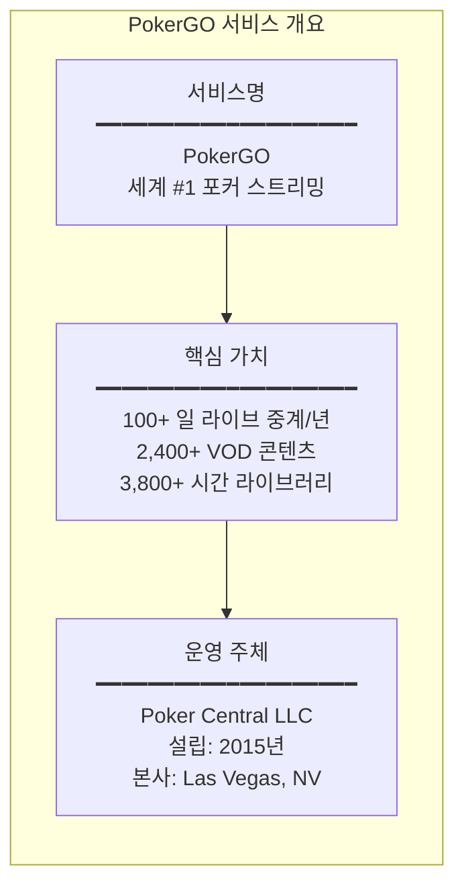

### 1.2 사업 모델

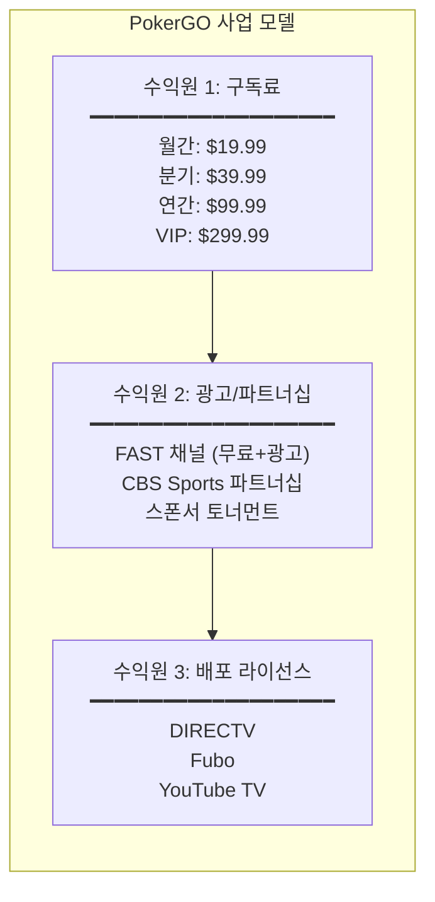

---

## 2. 콘텐츠 구조 분석

### 2.1 콘텐츠 카테고리

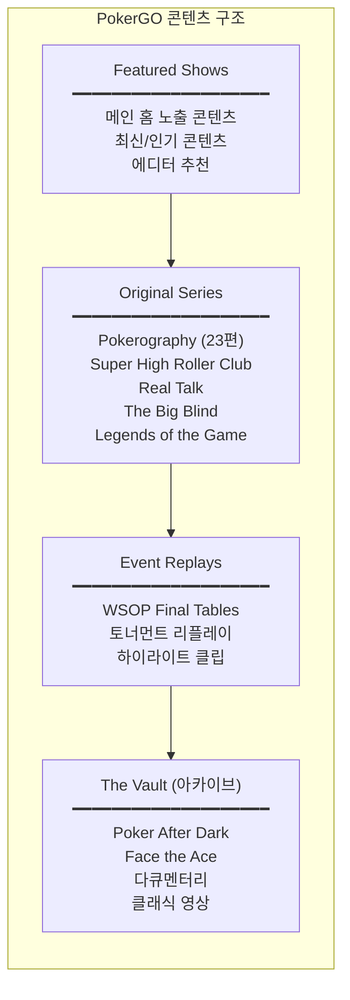

### 2.2 콘텐츠 상세 분류

| 카테고리 | 콘텐츠 유형 | 설명 | 콘텐츠 수 |
|---------|-----------|------|----------|
| **Live Events** | 라이브 스트림 | 실시간 토너먼트 중계 | 100+ 일/년 |
| **Tournaments** | VOD | WSOP, SHRB, Poker Masters | 다수 |
| **Cash Games** | VOD | High Stakes Poker, Poker After Dark | 다수 |
| **Original Series** | VOD | 자체 제작 시리즈 | 6개 시리즈 |
| **Documentaries** | VOD | 선수 다큐, 역사 | 다수 |
| **Educational** | VOD | PokerU (VIP 전용) | 강좌 |

### 2.3 주요 쇼 프로그램

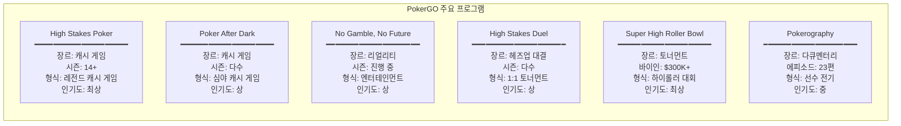

---

## 3. 라이브 중계 구조

### 3.1 연간 라이브 일정

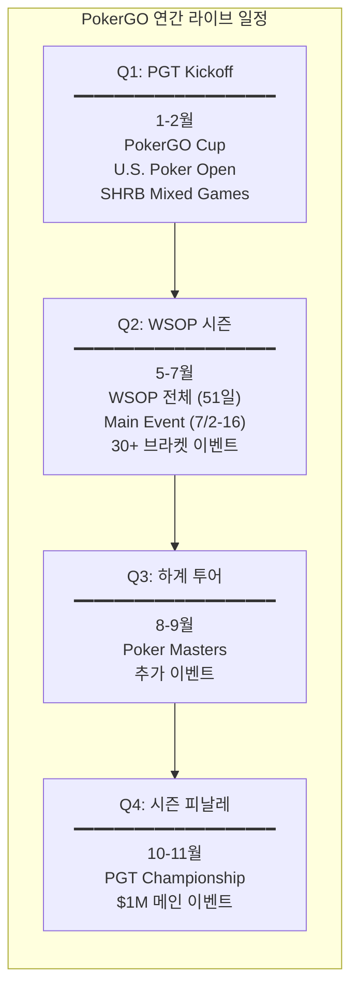

### 3.2 2025 WSOP 중계 일정

| 날짜 | 이벤트 | 형식 | 바이인 |
|------|-------|------|--------|
| 5/31~ | WSOP 시작 | Daily Coverage | Various |
| 7/2-16 | Main Event | Full Coverage | $10,000 |
| TBD | Poker Players Championship | Final Table | $50,000 |
| TBD | High Roller | Final Table | $250,000 |
| TBD | Heads-Up Championship | Full | $25,000 |
| TBD | Ladies Championship | Full | $1,000 |

---

## 4. 배포 채널 구조

### 4.1 멀티 플랫폼 배포

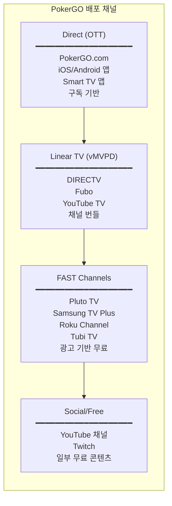

### 4.2 디바이스 지원 현황

| 플랫폼 | 지원 | 앱 유형 | 비고 |
|--------|------|---------|------|
| **iOS (iPhone/iPad)** | O | Native | App Store |
| **Android** | O | Native | Play Store |
| **Apple TV** | O | tvOS | App Store |
| **Amazon Fire TV** | O | Native | Amazon Appstore |
| **Roku** | O | Channel | Roku Channel Store |
| **Android TV** | O | Native | - |
| **Google Chromecast** | O | Cast | - |
| **Samsung Smart TV** | O | Tizen | - |
| **Sony Smart TV** | O | - | - |
| **VIZIO Smart TV** | O | - | - |
| **Mac/Windows** | O | Web | PokerGO.com |
| **PlayStation** | X | - | 미지원 |
| **Xbox** | X | - | 미지원 |

### 4.3 기술 인프라

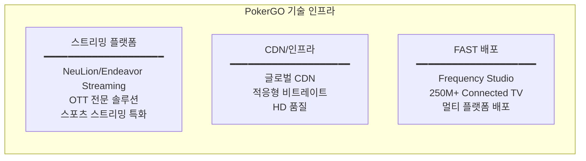

---

## 5. 구독 모델 분석

### 5.1 가격 체계

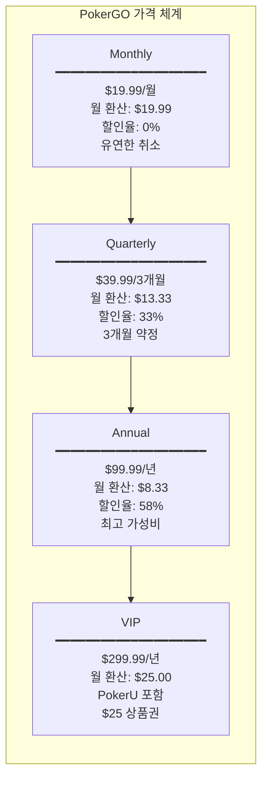

### 5.2 경쟁 OTT 가격 비교

| 서비스 | 월 가격 | 콘텐츠 범위 | 대상 |
|--------|---------|------------|------|
| **PokerGO** | $8.33~$19.99 | 포커 전문 | 니치 |
| Netflix (Basic) | $6.99 | 범용 | 대중 |
| Disney+ | $7.99 | 범용 | 대중 |
| ESPN+ | $10.99 | 스포츠 전문 | 스포츠팬 |
| DAZN | $14.99 | 스포츠 전문 | 스포츠팬 |

### 5.3 구독 혜택

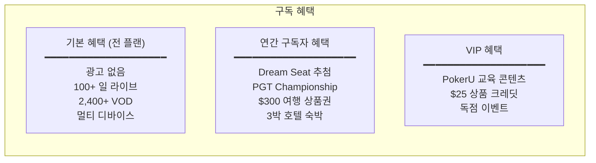

---

## 6. UI/UX 분석

### 6.1 홈 화면 구조

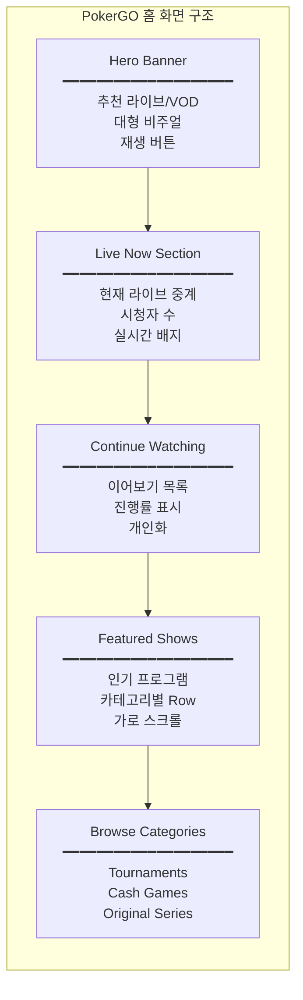

### 6.2 콘텐츠 상세 페이지

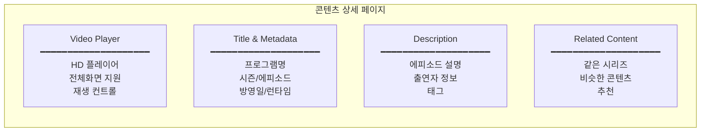

### 6.3 네비게이션 구조

| 메뉴 | 기능 | 하위 메뉴 |
|------|------|----------|
| **Home** | 메인 홈 | - |
| **Live** | 라이브 중계 | 현재 라이브, 일정 |
| **Shows** | VOD 브라우즈 | Tournaments, Cash Games, Originals |
| **Schedule** | 라이브 일정 | 월별 캘린더 |
| **Search** | 검색 | 제목, 선수, 이벤트 |
| **Account** | 계정 관리 | 프로필, 구독, 설정 |

---

## 7. 문제점 분석

### 7.1 사용자 불만 사항

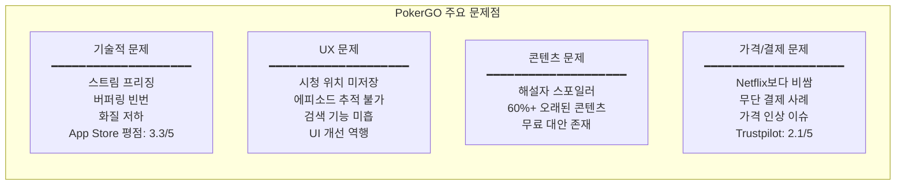

### 7.2 경쟁 위협

| 위협 | 내용 | 심각도 |
|------|------|--------|
| **무료 YouTube** | Hustler Casino Live, PokerStars 채널 | 높음 |
| **무료 Twitch** | 월 142만 시청 시간 | 높음 |
| **FAST 채널** | 자체 Pluto TV 채널이 무료로 제공 | 중간 |
| **가격 저항** | 니치 콘텐츠에 높은 가격 | 중간 |

---

## 8. WSOPTV 벤치마킹 포인트

### 8.1 채택할 요소

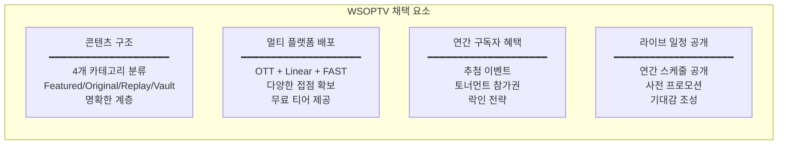

### 8.2 개선할 요소

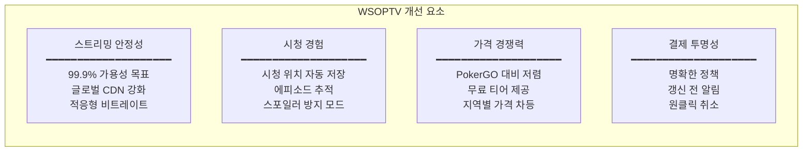

### 8.3 차별화 요소

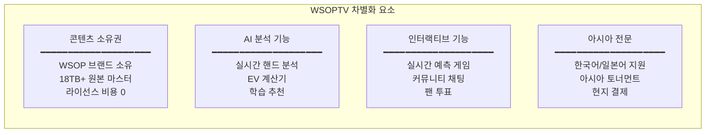

---

## 9. 콘텐츠 운영 전략 비교

### 9.1 PokerGO vs WSOPTV 콘텐츠 전략

| 항목 | PokerGO | WSOPTV (제안) |
|------|---------|---------------|
| **라이브 중계** | 100+ 일/년 | Phase별 확대 |
| **VOD 라이브러리** | 3,800+ 시간 | 18TB+ 아카이브 |
| **오리지널 시리즈** | 6개 시리즈 | 아시아 오리지널 |
| **교육 콘텐츠** | VIP 전용 (PokerU) | 전 플랜 AI 분석 |
| **무료 콘텐츠** | YouTube 일부 | 무료 티어 제공 |
| **FAST 채널** | 4개 플랫폼 | 검토 필요 |

### 9.2 배포 전략 비교

| 채널 | PokerGO | WSOPTV (제안) |
|------|---------|---------------|
| **Direct OTT** | O | O (필수) |
| **iOS/Android** | O | O (필수) |
| **Smart TV** | O (6개+) | O (주요 플랫폼) |
| **vMVPD** | O (3개) | 검토 |
| **FAST** | O (4개) | Phase 2 |
| **YouTube** | O (부분 무료) | O (프로모션) |

---

## 10. 결론

### 10.1 핵심 인사이트

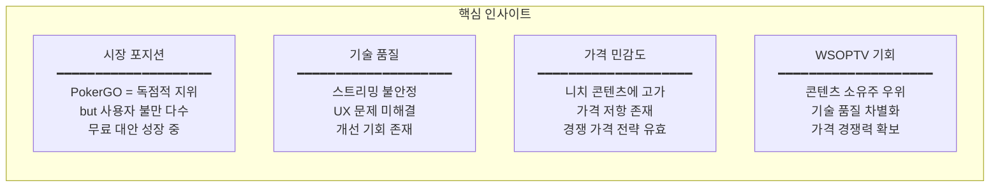

### 10.2 WSOPTV 액션 아이템

| 우선순위 | 액션 | 상세 |
|---------|------|------|
| **P0** | 스트리밍 안정성 확보 | 99.9% 가용성, CDN 최적화 |
| **P0** | 시청 경험 개선 | 진행률 저장, 에피소드 추적 |
| **P1** | 가격 경쟁력 | PokerGO 대비 30-40% 저렴 |
| **P1** | 무료 티어 제공 | 일부 콘텐츠 무료 공개 |
| **P2** | AI 분석 기능 | 핸드 분석, 학습 추천 |
| **P2** | 멀티 플랫폼 확장 | Smart TV, FAST 채널 |

---

## 참고 자료

### 공식 사이트
- [PokerGO 공식](https://www.pokergo.com/)
- [PokerGO Schedule](https://www.pokergo.com/schedule)
- [PGT.com](https://www.pgt.com/)

### 리뷰/분석
- [The Streamable - PokerGO Review](https://thestreamable.com/video-streaming/pokergo)
- [Pokerfuse - PokerGO Subscription Guide](https://pokerfuse.com/live-poker/coverage/pokergo/)
- [Pokerfuse - Best Poker Shows 2025](https://pokerfuse.com/live-poker/coverage/best-poker-shows-streams-2025/)

### 뉴스/보도자료
- [PokerGO 2025 WSOP Streaming Plans](https://www.pgt.com/press-releases/pokergo-announces-2025-wsop-livestreaming-plans-featuring-daily-coverage-of-the-main-event-and-more)
- [PokerGO YouTube TV Expansion](https://www.pgt.com/press-releases/pokergo-expands-distribution-with-new-youtubetv-and-primetime-channel-offering)
- [PokerGO FAST Channel Expansion](https://www.pgt.com/press-releases/pokergo%C2%AE-turns-to-frequency-to-expand-fast-channel-presence)

### 앱 스토어
- [Apple App Store - PokerGO](https://apps.apple.com/us/app/pokergo-stream-poker-tv/id1235783484) - 3.3/5.0
- [Google Play Store - PokerGO](https://play.google.com/store/apps/details?id=com.pokercentral.poker)

---

*문서 끝*
