# PokerGO 홈페이지 - 클릭하면 뭐가 되나요?

**문서 번호**: PRD-0009 | **버전**: 8.0.0 | **작성일**: 2025-12-15

> 이 문서는 PokerGO 홈페이지의 **모든 버튼과 링크**를 눌렀을 때 어떤 일이 일어나는지 설명합니다.

---

## 전체 홈페이지 구조

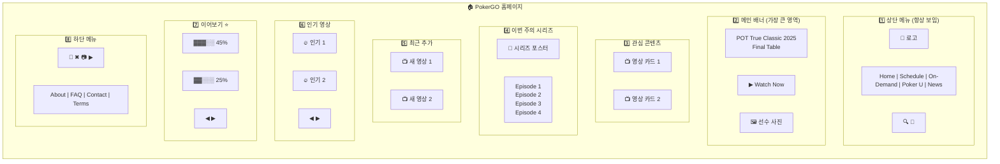

---

## 1️⃣ 상단 메뉴 - 클릭하면?

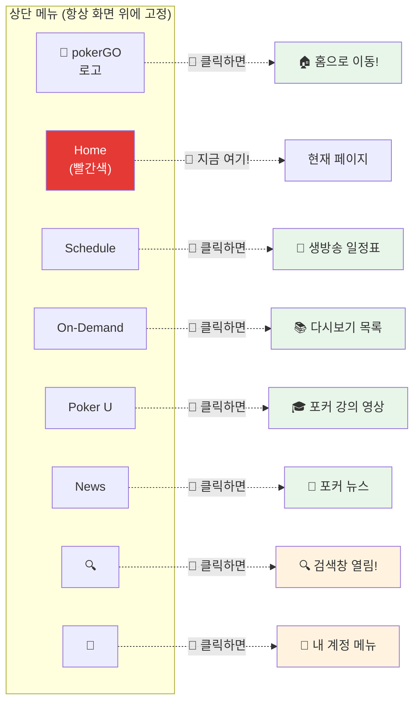

---

## 2️⃣ 메인 배너 - 클릭하면?

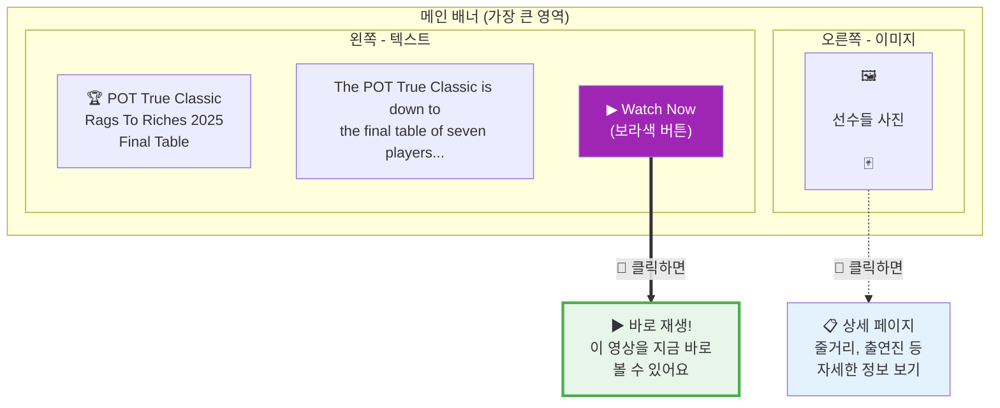

---

## 3️⃣ 관심 콘텐츠 - 클릭하면?

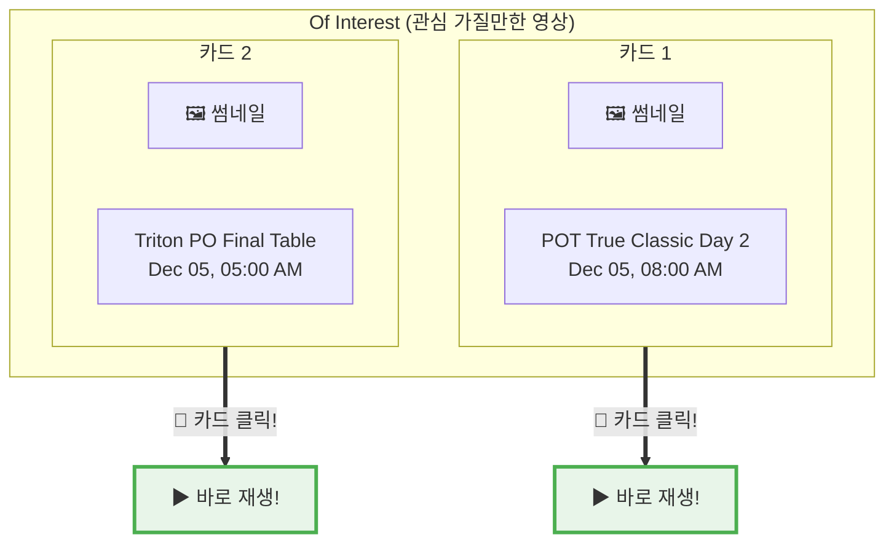

---

## 4️⃣ 이번 주의 시리즈 - 클릭하면?

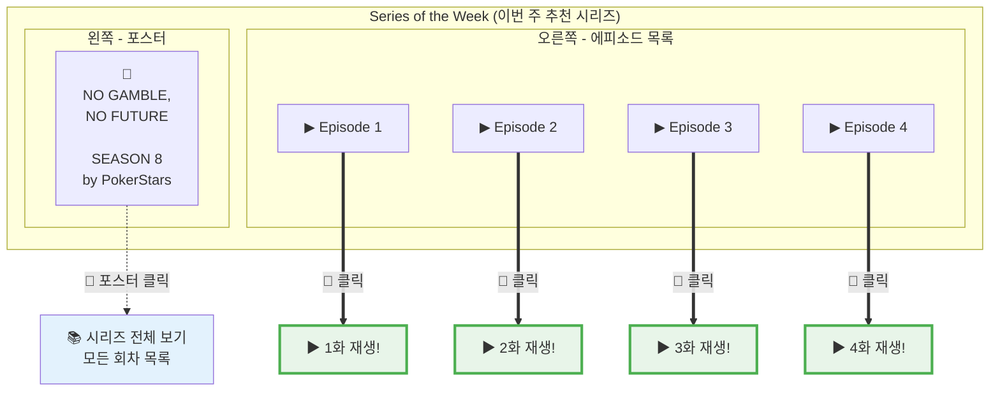

---

## 5️⃣ 최근 추가된 영상 - 클릭하면?

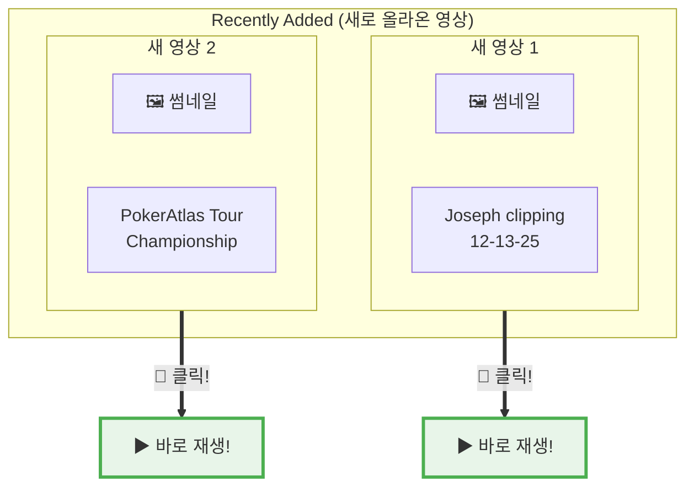

---

## 6️⃣ 인기 영상 - 클릭하면?

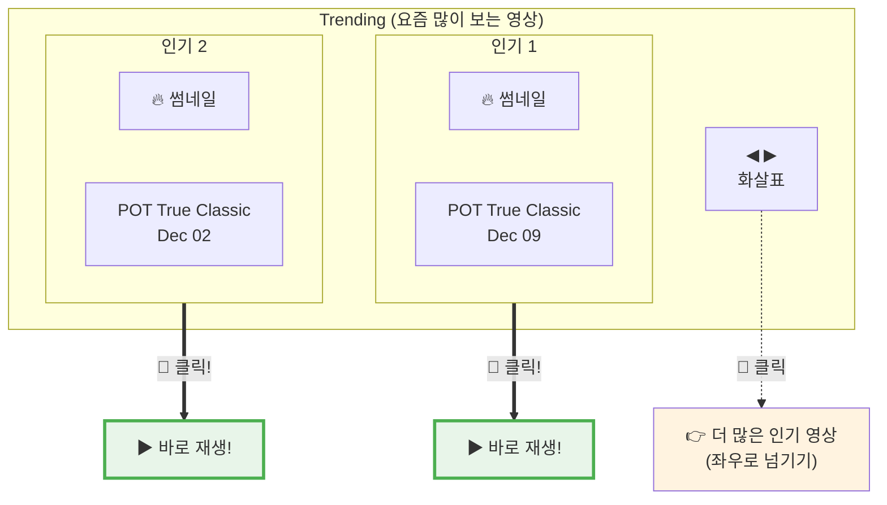

---

## 7️⃣ 이어보기 - 클릭하면? ⭐중요⭐

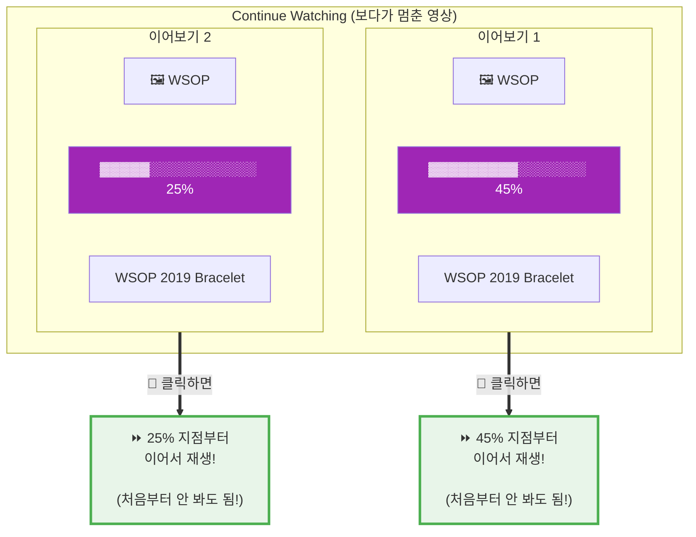

**핵심 포인트:**
- **보라색 진행 바** = 여기까지 봤다는 표시
- **클릭하면** → 멈춘 지점부터 이어서 재생!

---

## 8️⃣ 하단 메뉴 - 클릭하면?

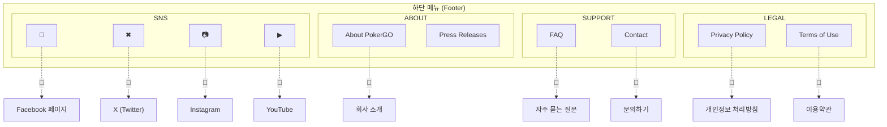

---

## 한눈에 보기 - 클릭 정리

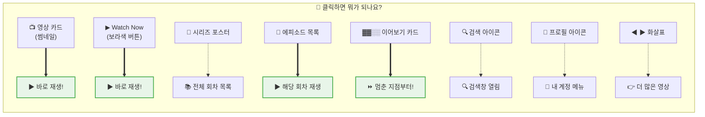

---

## WSOPTV에서 똑같이 만들 것들

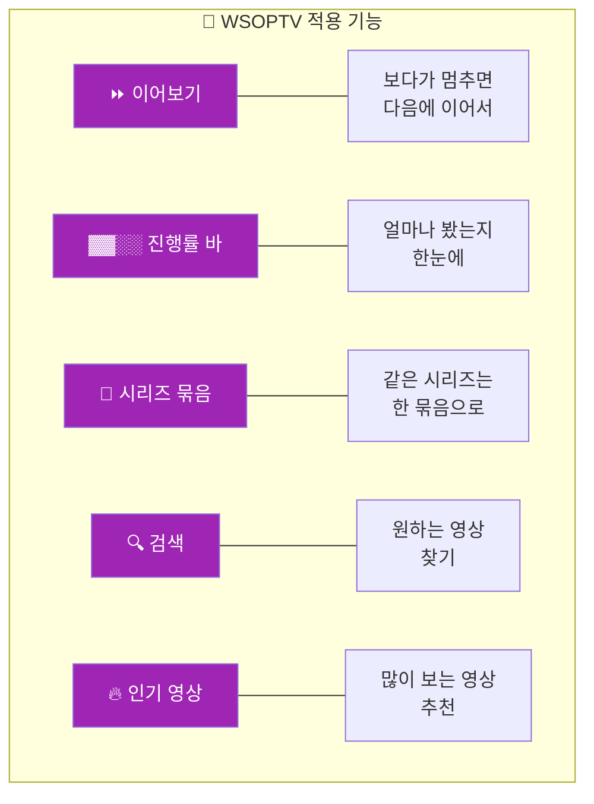

---

*문서 끝*
