# PokerGO UI 설계 및 워크플로우 상세 분석

**문서 번호**: PRD-0009
**버전**: 2.0.0
**작성일**: 2025-12-15
**기준일**: 2025-12-15 pokergo.com 실제 홈페이지 기반
**목적**: PokerGO UI/UX 상세 분석 및 WSOPTV 설계 참조

---

## 1. 홈페이지 목업 및 워크플로우 (핵심)

> **이 섹션이 전체 UI 설계의 핵심입니다. 실제 PokerGO 홈페이지 구조를 기반으로 작성되었습니다.**

### 1.1 홈페이지 전체 구조

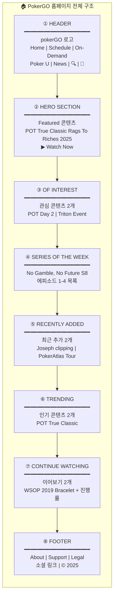

### 1.2 Header 워크플로우 (말풍선)

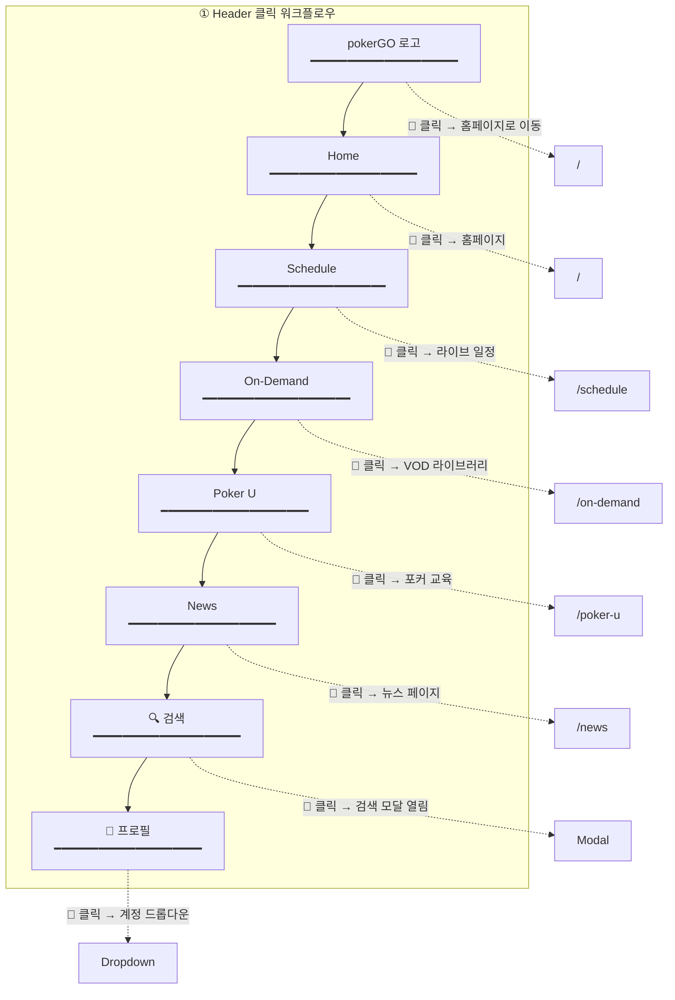

### 1.3 Hero Section 워크플로우 (말풍선)

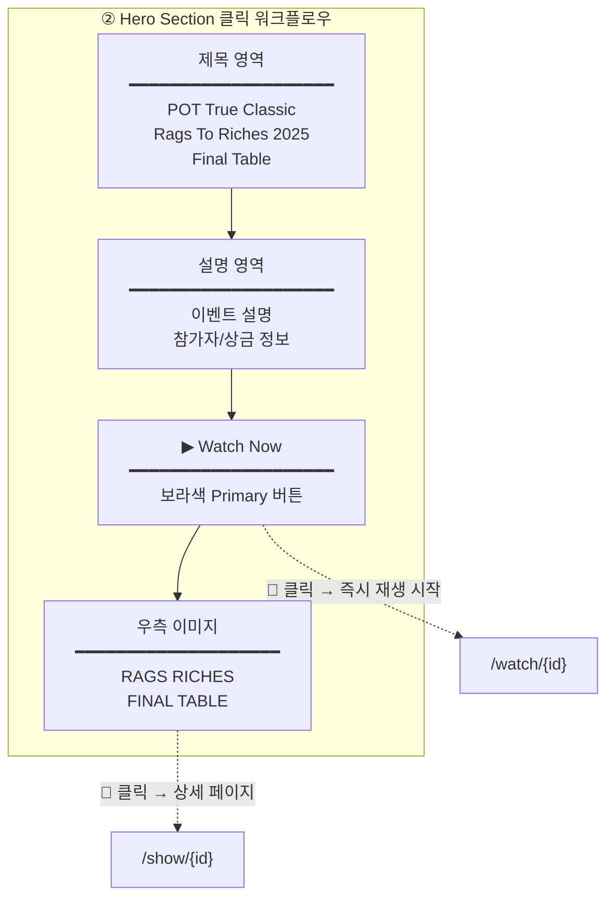

### 1.4 Of Interest 워크플로우 (말풍선)

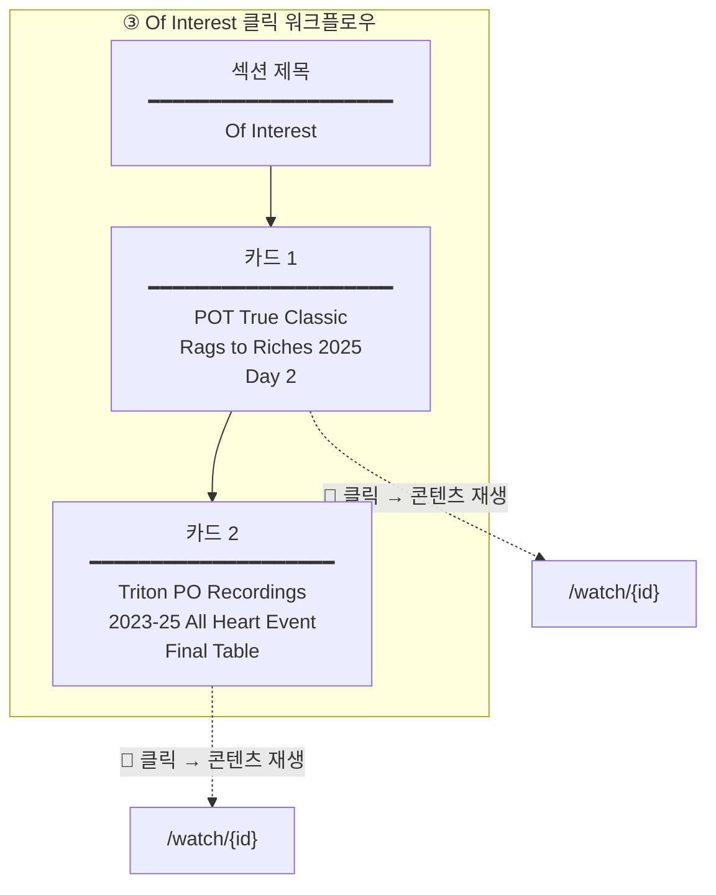

### 1.5 Series of the Week 워크플로우 (말풍선)

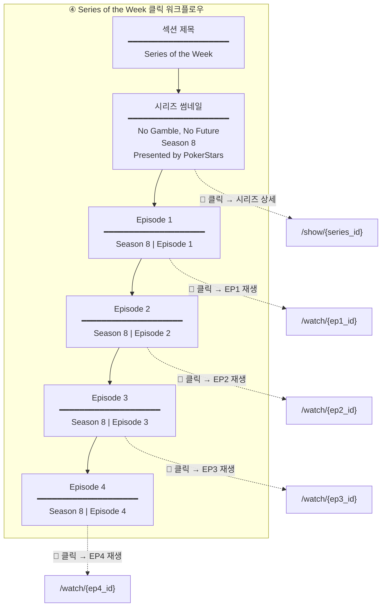

### 1.6 Recently Added & Trending 워크플로우 (말풍선)

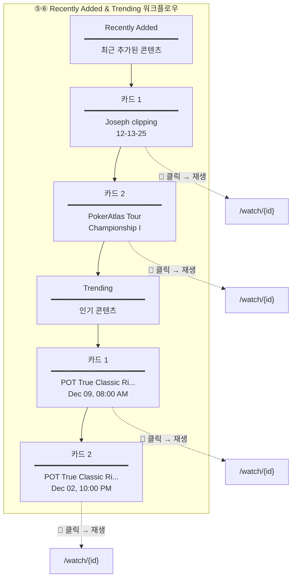

### 1.7 Continue Watching 워크플로우 (말풍선)

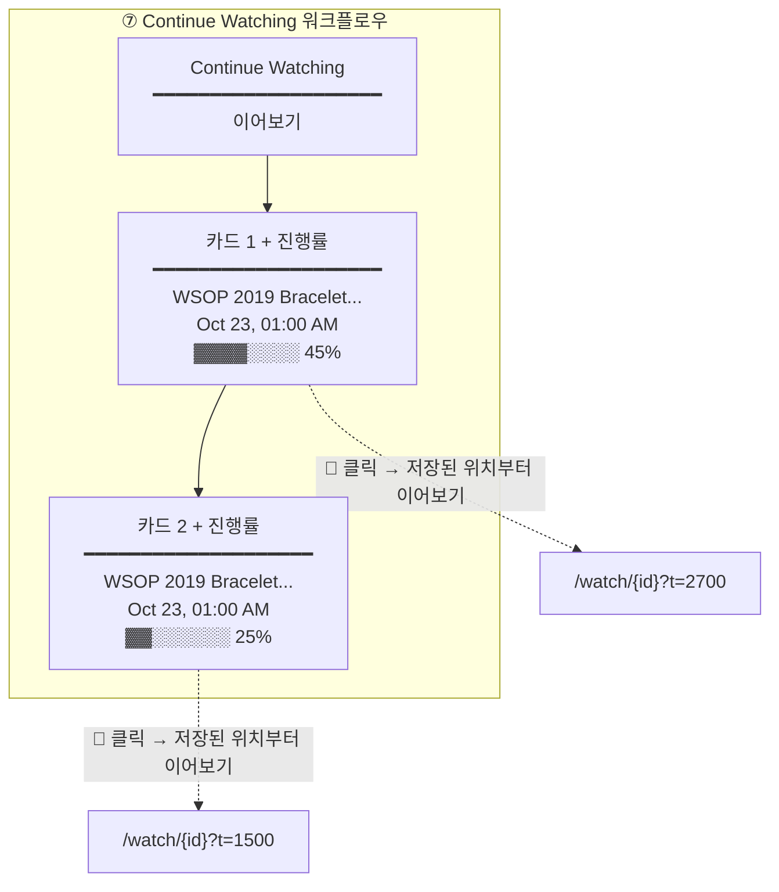

### 1.8 Footer 워크플로우 (말풍선)

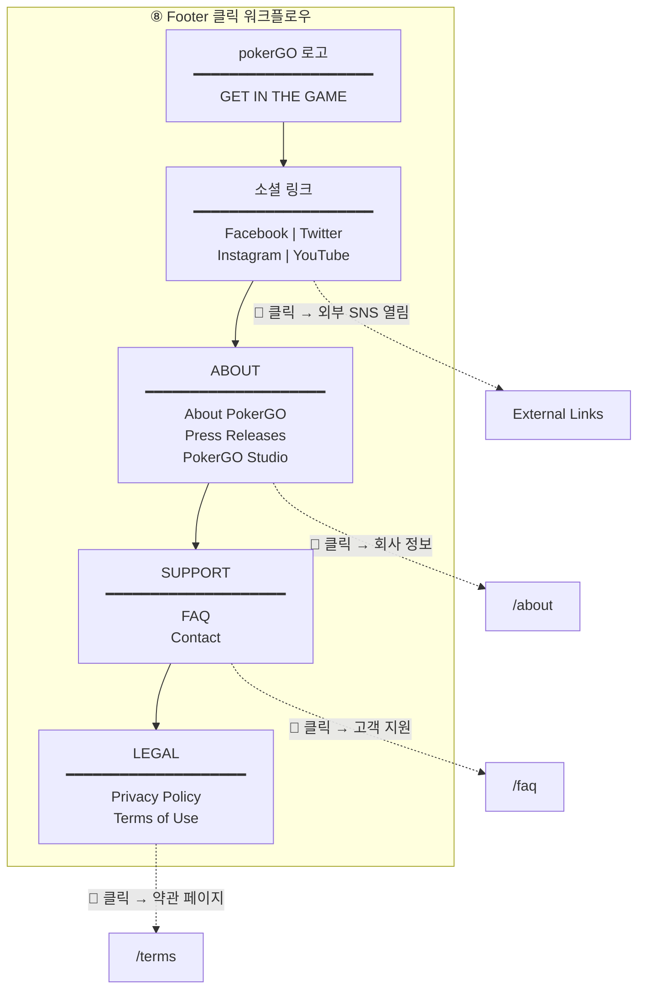

### 1.9 전체 클릭 포인트 요약

| 영역 | 클릭 요소 | 액션 | 이동 경로 |
|------|----------|------|----------|
| **Header** | pokerGO 로고 | 홈으로 이동 | `/` |
| | Home | 홈페이지 | `/` |
| | Schedule | 라이브 일정 | `/schedule` |
| | On-Demand | VOD 라이브러리 | `/on-demand` |
| | Poker U | 포커 교육 | `/poker-u` |
| | News | 뉴스 페이지 | `/news` |
| | 🔍 검색 | 검색 모달 | Modal |
| | 👤 프로필 | 계정 드롭다운 | Dropdown |
| **Hero** | Watch Now | 즉시 재생 | `/watch/{id}` |
| **Of Interest** | 카드 클릭 | 콘텐츠 재생 | `/watch/{id}` |
| **Series of Week** | 시리즈 썸네일 | 시리즈 상세 | `/show/{id}` |
| | 에피소드 카드 | 에피소드 재생 | `/watch/{id}` |
| **Recently Added** | 카드 클릭 | 콘텐츠 재생 | `/watch/{id}` |
| **Trending** | 카드 클릭 | 콘텐츠 재생 | `/watch/{id}` |
| **Continue Watching** | 카드 클릭 | 이어보기 재생 | `/watch/{id}?t={time}` |
| **Footer** | 소셜 링크 | 외부 SNS | External |
| | About/Support/Legal | 정보 페이지 | `/about`, `/faq`, `/terms` |

---

## 2. 디자인 시스템

### 2.1 컬러 팔레트

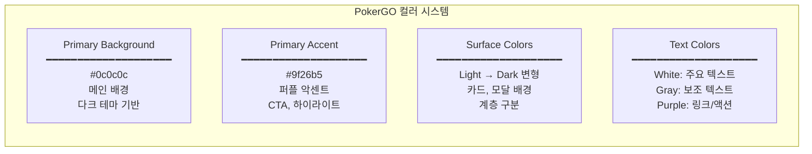

### 2.2 타이포그래피

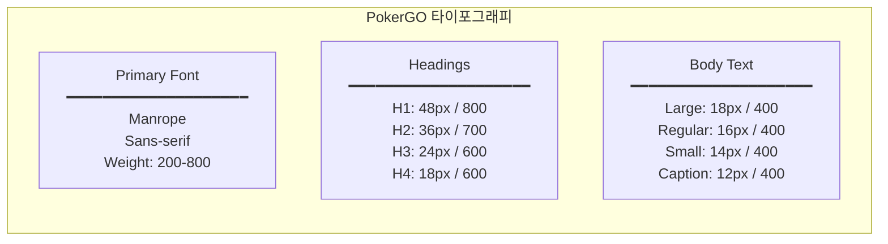

### 2.3 컴포넌트 스타일

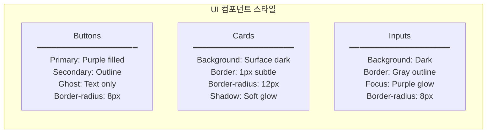

---

## 3. 페이지 구조

> **기준일**: 2025-12-15 pokergo.com 실제 구조 기반

### 2.1 전체 사이트맵

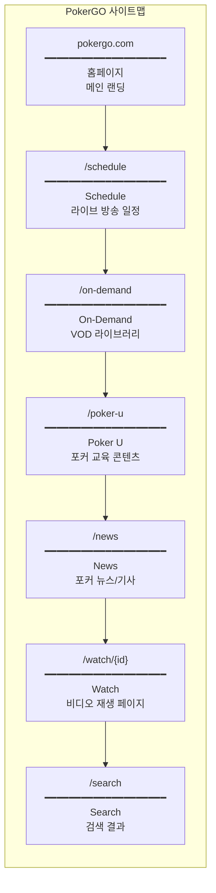

### 2.2 글로벌 네비게이션

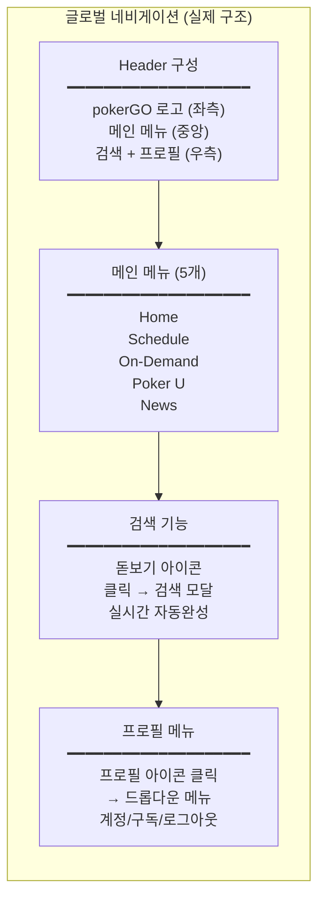

---

## 4. 홈페이지 UI

> **기준일**: 2025-12-15 pokergo.com 실제 구조 기반

### 3.1 홈페이지 레이아웃 (실제 구조)

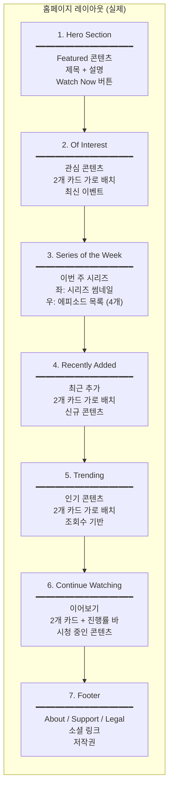

### 3.2 Hero Section 상세 (실제)

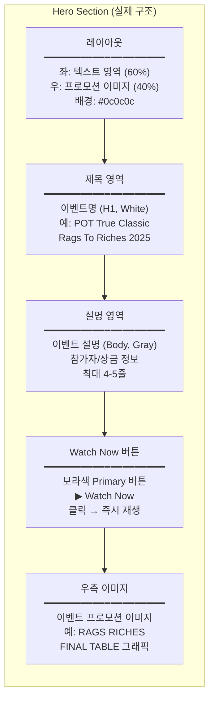

### 3.3 Series of the Week 상세

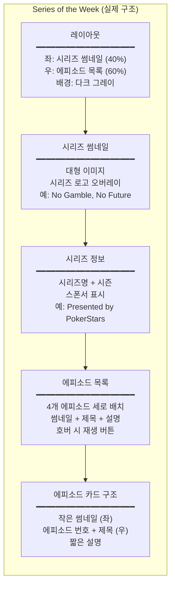

### 3.4 콘텐츠 Row 구조 (실제)

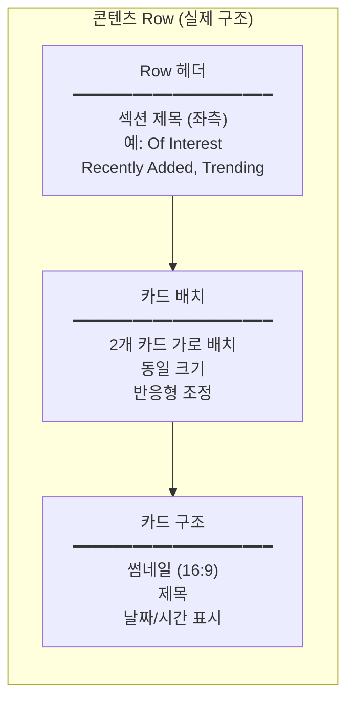

---

## 5. 콘텐츠 카드 UI

> **기준일**: 2025-12-15 pokergo.com 실제 구조 기반

### 4.1 기본 콘텐츠 카드 (실제)

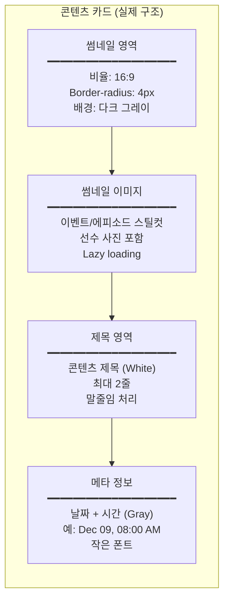

### 4.2 Continue Watching 카드 (실제)

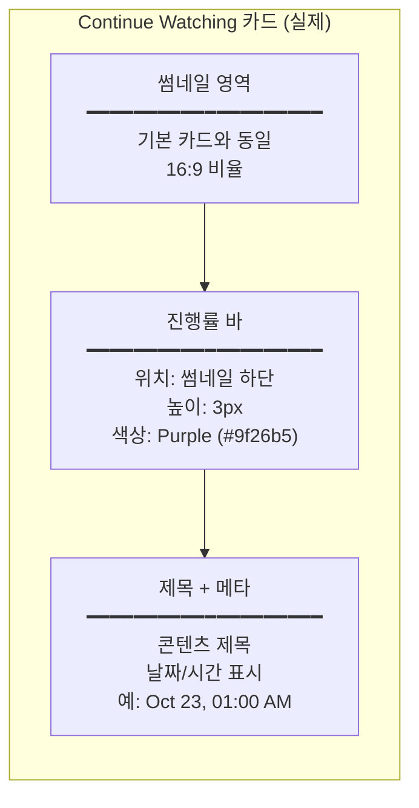

### 4.3 에피소드 카드 (Series of the Week)

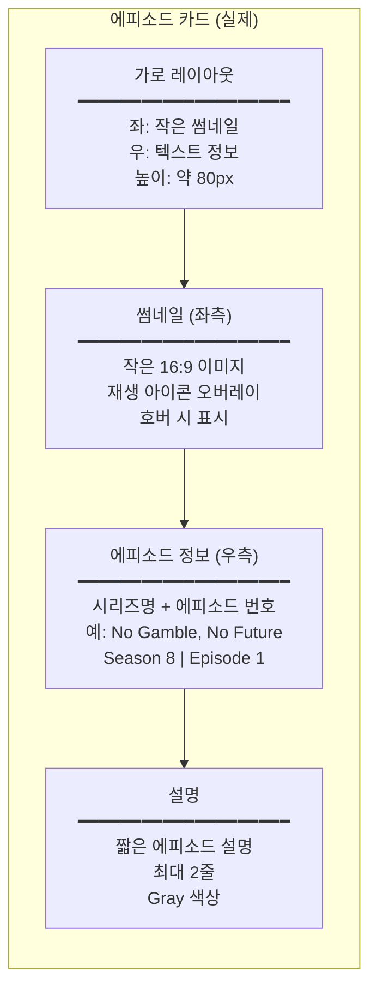

### 4.4 카드 상태별 변화

| 상태 | 변화 | 설명 |
|------|------|------|
| **Default** | - | 기본 상태 |
| **Hover** | 밝기 증가, 커서 포인터 | 마우스 오버 |
| **Focus** | Purple outline | 키보드 포커스 |
| **Active** | 약간 어두워짐 | 클릭 중 |
| **Loading** | Skeleton 회색 박스 | 로딩 중 |

---

## 6. 비디오 플레이어 UI

### 5.1 플레이어 레이아웃

```mermaid
flowchart TB
    subgraph VideoPlayer["비디오 플레이어 구조"]
        direction TB
        VP1["Video Container<br/>━━━━━━━━━━━━━━━━━━━━<br/>전체 너비<br/>비율: 16:9<br/>배경: Black"]
        VP2["Top Controls<br/>━━━━━━━━━━━━━━━━━━━━<br/>← Back 버튼 (좌측)<br/>Title (중앙)<br/>Settings (우측)"]
        VP3["Center Controls<br/>━━━━━━━━━━━━━━━━━━━━<br/>⏮ 10초 뒤로<br/>▶/⏸ 재생/일시정지<br/>⏭ 10초 앞으로"]
        VP4["Bottom Controls<br/>━━━━━━━━━━━━━━━━━━━━<br/>Progress Bar<br/>Time Display<br/>Volume + Settings + Fullscreen"]
        VP5["Sidebar (Optional)<br/>━━━━━━━━━━━━━━━━━━━━<br/>Episodes List<br/>Related Content"]
        VP1 --> VP2 --> VP3 --> VP4 --> VP5
    end
```

### 5.2 플레이어 컨트롤 상세

```mermaid
flowchart TB
    subgraph PlayerControls["플레이어 컨트롤 상세"]
        direction TB
        PC1["Progress Bar<br/>━━━━━━━━━━━━━━━━━━━━<br/>Scrubber: 드래그 가능<br/>Preview: Hover 시 썸네일<br/>Buffer: 연한 색상 표시"]
        PC2["Time Display<br/>━━━━━━━━━━━━━━━━━━━━<br/>현재 시간 / 전체 시간<br/>형식: HH:MM:SS<br/>폰트: Monospace"]
        PC3["Volume Control<br/>━━━━━━━━━━━━━━━━━━━━<br/>음소거 토글<br/>볼륨 슬라이더<br/>Hover 시 슬라이더 표시"]
        PC4["Settings Menu<br/>━━━━━━━━━━━━━━━━━━━━<br/>화질 선택 (Auto, 720p, 1080p)<br/>재생 속도 (0.5x ~ 2x)<br/>자막 (있는 경우)"]
        PC5["Fullscreen<br/>━━━━━━━━━━━━━━━━━━━━<br/>전체화면 토글<br/>ESC로 종료<br/>더블클릭 토글"]
        PC1 --> PC2 --> PC3 --> PC4 --> PC5
    end
```

### 5.3 플레이어 기능

| 기능 | 동작 | 단축키 |
|------|------|--------|
| **재생/일시정지** | 토글 | Space, K |
| **10초 뒤로** | Seek -10s | J, ← |
| **10초 앞으로** | Seek +10s | L, → |
| **볼륨 업** | +10% | ↑ |
| **볼륨 다운** | -10% | ↓ |
| **음소거** | 토글 | M |
| **전체화면** | 토글 | F |
| **자막** | 토글 | C |
| **재생 속도** | 메뉴 | S |

---

## 7. 검색 UI

### 6.1 검색 모달

```mermaid
flowchart TB
    subgraph SearchModal["검색 모달 구조"]
        direction TB
        SM1["Modal Overlay<br/>━━━━━━━━━━━━━━━━━━━━<br/>배경: 반투명 검정<br/>클릭 시 닫기<br/>ESC 닫기"]
        SM2["Search Input<br/>━━━━━━━━━━━━━━━━━━━━<br/>위치: 상단 중앙<br/>너비: 600px<br/>자동 포커스"]
        SM3["Search Suggestions<br/>━━━━━━━━━━━━━━━━━━━━<br/>실시간 자동완성<br/>최근 검색어<br/>인기 검색어"]
        SM4["Quick Results<br/>━━━━━━━━━━━━━━━━━━━━<br/>입력 중 결과 표시<br/>카테고리별 그룹<br/>최대 5개씩"]
        SM1 --> SM2 --> SM3 --> SM4
    end
```

### 6.2 검색 결과 페이지

```mermaid
flowchart TB
    subgraph SearchResults["검색 결과 페이지"]
        direction TB
        SR1["Search Header<br/>━━━━━━━━━━━━━━━━━━━━<br/>검색어 표시<br/>결과 수<br/>검색 입력 필드"]
        SR2["Filter Bar<br/>━━━━━━━━━━━━━━━━━━━━<br/>Type: All, Shows, Events<br/>Year: 드롭다운<br/>Sort: Relevance, Date"]
        SR3["Results Grid<br/>━━━━━━━━━━━━━━━━━━━━<br/>4열 그리드 (데스크톱)<br/>2열 (태블릿)<br/>1열 (모바일)"]
        SR4["Load More<br/>━━━━━━━━━━━━━━━━━━━━<br/>무한 스크롤<br/>또는 Load More 버튼<br/>로딩 스피너"]
        SR1 --> SR2 --> SR3 --> SR4
    end
```

---

## 8. 사용자 워크플로우

### 7.1 회원가입 플로우

```mermaid
flowchart TB
    subgraph Signup["회원가입 워크플로우"]
        direction TB
        SU1["1. 랜딩 페이지<br/>━━━━━━━━━━━━━━━━━━━━<br/>Sign Up CTA 클릭<br/>또는 콘텐츠 클릭 시<br/>로그인 요구"]
        SU2["2. 계정 생성<br/>━━━━━━━━━━━━━━━━━━━━<br/>이메일 입력<br/>비밀번호 설정<br/>이용약관 동의"]
        SU3["3. 플랜 선택<br/>━━━━━━━━━━━━━━━━━━━━<br/>Monthly $19.99<br/>Quarterly $39.99<br/>Annual $99.99"]
        SU4["4. 결제 정보<br/>━━━━━━━━━━━━━━━━━━━━<br/>신용카드 입력<br/>Stripe 연동<br/>프로모션 코드"]
        SU5["5. 가입 완료<br/>━━━━━━━━━━━━━━━━━━━━<br/>환영 메시지<br/>추천 콘텐츠<br/>시청 시작"]
        SU1 --> SU2 --> SU3 --> SU4 --> SU5
    end
```

### 7.2 로그인 플로우

```mermaid
flowchart TB
    subgraph Login["로그인 워크플로우"]
        direction TB
        LI1["1. 로그인 페이지<br/>━━━━━━━━━━━━━━━━━━━━<br/>이메일 입력<br/>비밀번호 입력<br/>Remember Me 체크"]
        LI2["2. 인증 처리<br/>━━━━━━━━━━━━━━━━━━━━<br/>자격 증명 검증<br/>JWT 토큰 발급<br/>세션 생성"]
        LI3["3. 리다이렉트<br/>━━━━━━━━━━━━━━━━━━━━<br/>홈페이지로 이동<br/>또는 원래 페이지<br/>개인화 콘텐츠 로드"]
        LI1 --> LI2 --> LI3
    end

    subgraph LoginError["로그인 오류 처리"]
        direction TB
        LE1["오류: 잘못된 자격증명<br/>━━━━━━━━━━━━━━━━━━━━<br/>에러 메시지 표시<br/>비밀번호 재설정 링크"]
        LE2["오류: 계정 없음<br/>━━━━━━━━━━━━━━━━━━━━<br/>회원가입 안내<br/>Sign Up 링크"]
    end
```

### 7.3 콘텐츠 시청 플로우

```mermaid
flowchart TB
    subgraph Watching["콘텐츠 시청 워크플로우"]
        direction TB
        W1["1. 콘텐츠 발견<br/>━━━━━━━━━━━━━━━━━━━━<br/>홈 브라우징<br/>검색<br/>추천 클릭"]
        W2["2. 상세 페이지<br/>━━━━━━━━━━━━━━━━━━━━<br/>프로그램 정보<br/>에피소드 목록<br/>관련 콘텐츠"]
        W3["3. 재생 시작<br/>━━━━━━━━━━━━━━━━━━━━<br/>Play 버튼 클릭<br/>플레이어 로드<br/>버퍼링"]
        W4["4. 시청 중<br/>━━━━━━━━━━━━━━━━━━━━<br/>비디오 재생<br/>진행률 자동 저장<br/>컨트롤 조작"]
        W5["5. 시청 완료<br/>━━━━━━━━━━━━━━━━━━━━<br/>다음 에피소드 자동 재생<br/>또는 추천 표시<br/>기록 업데이트"]
        W1 --> W2 --> W3 --> W4 --> W5
    end
```

### 7.4 이어보기 플로우

```mermaid
flowchart TB
    subgraph Continue["이어보기 워크플로우"]
        direction TB
        CT1["1. 홈페이지 접속<br/>━━━━━━━━━━━━━━━━━━━━<br/>로그인 상태<br/>Continue Watching Row<br/>자동 로드"]
        CT2["2. 이어보기 선택<br/>━━━━━━━━━━━━━━━━━━━━<br/>진행률 표시 카드<br/>썸네일 + % 표시<br/>클릭"]
        CT3["3. 위치 복원<br/>━━━━━━━━━━━━━━━━━━━━<br/>저장된 위치로 Seek<br/>확인 팝업 (선택적)<br/>처음부터 옵션"]
        CT4["4. 시청 재개<br/>━━━━━━━━━━━━━━━━━━━━<br/>자동 재생<br/>진행률 계속 업데이트"]
        CT1 --> CT2 --> CT3 --> CT4
    end
```

### 7.5 검색 플로우

```mermaid
flowchart TB
    subgraph Search["검색 워크플로우"]
        direction TB
        SE1["1. 검색 시작<br/>━━━━━━━━━━━━━━━━━━━━<br/>검색 아이콘 클릭<br/>Ctrl+K 단축키<br/>검색 모달 열림"]
        SE2["2. 검색어 입력<br/>━━━━━━━━━━━━━━━━━━━━<br/>실시간 타이핑<br/>Debounce: 300ms<br/>자동완성 표시"]
        SE3["3. 결과 확인<br/>━━━━━━━━━━━━━━━━━━━━<br/>Quick Results 표시<br/>카테고리별 그룹<br/>클릭 또는 Enter"]
        SE4["4. 결과 페이지<br/>━━━━━━━━━━━━━━━━━━━━<br/>전체 결과 표시<br/>필터 적용 가능<br/>정렬 옵션"]
        SE5["5. 콘텐츠 선택<br/>━━━━━━━━━━━━━━━━━━━━<br/>결과 카드 클릭<br/>상세 페이지 이동<br/>또는 바로 재생"]
        SE1 --> SE2 --> SE3 --> SE4 --> SE5
    end
```

---

## 9. 콘텐츠 상세 페이지

### 8.1 프로그램 상세 페이지

```mermaid
flowchart TB
    subgraph ShowDetail["프로그램 상세 페이지"]
        direction TB
        SD1["Hero Section<br/>━━━━━━━━━━━━━━━━━━━━<br/>배경: 프로그램 아트<br/>제목 + 연도<br/>장르 태그"]
        SD2["Action Buttons<br/>━━━━━━━━━━━━━━━━━━━━<br/>▶ Play (첫 에피소드)<br/>+ My List<br/>Share"]
        SD3["Description<br/>━━━━━━━━━━━━━━━━━━━━<br/>프로그램 설명<br/>Cast/Crew (해당 시)<br/>메타데이터"]
        SD4["Seasons/Episodes<br/>━━━━━━━━━━━━━━━━━━━━<br/>시즌 드롭다운<br/>에피소드 리스트<br/>썸네일 + 제목 + 설명"]
        SD5["Related Content<br/>━━━━━━━━━━━━━━━━━━━━<br/>비슷한 프로그램<br/>같은 선수/이벤트<br/>추천"]
        SD1 --> SD2 --> SD3 --> SD4 --> SD5
    end
```

### 8.2 에피소드 리스트

```mermaid
flowchart TB
    subgraph EpisodeList["에피소드 리스트 구조"]
        direction TB
        EL1["Season Selector<br/>━━━━━━━━━━━━━━━━━━━━<br/>시즌 드롭다운<br/>시즌별 에피소드 수<br/>선택 시 리스트 업데이트"]
        EL2["Episode Card<br/>━━━━━━━━━━━━━━━━━━━━<br/>썸네일 (좌측)<br/>에피소드 번호 + 제목<br/>설명 (2줄 말줄임)"]
        EL3["Episode Metadata<br/>━━━━━━━━━━━━━━━━━━━━<br/>런타임<br/>방영일<br/>시청 진행률 (있으면)"]
        EL4["Episode Actions<br/>━━━━━━━━━━━━━━━━━━━━<br/>Play 버튼 (Hover)<br/>+ My List<br/>Share"]
        EL1 --> EL2 --> EL3 --> EL4
    end
```

---

## 10. 계정 관리 UI

### 9.1 계정 설정 페이지

```mermaid
flowchart TB
    subgraph Account["계정 설정 페이지"]
        direction TB
        AC1["Profile Section<br/>━━━━━━━━━━━━━━━━━━━━<br/>이메일 표시<br/>비밀번호 변경<br/>프로필 이미지 (선택)"]
        AC2["Subscription Section<br/>━━━━━━━━━━━━━━━━━━━━<br/>현재 플랜 표시<br/>다음 결제일<br/>플랜 변경/취소"]
        AC3["Billing Section<br/>━━━━━━━━━━━━━━━━━━━━<br/>결제 수단 표시<br/>카드 변경<br/>결제 내역"]
        AC4["Preferences Section<br/>━━━━━━━━━━━━━━━━━━━━<br/>이메일 알림 설정<br/>자동 재생 설정<br/>화질 기본값"]
        AC1 --> AC2 --> AC3 --> AC4
    end
```

### 9.2 구독 관리

```mermaid
flowchart TB
    subgraph Subscription["구독 관리 플로우"]
        direction TB
        SUB1["현재 구독 정보<br/>━━━━━━━━━━━━━━━━━━━━<br/>플랜: Annual ($99.99)<br/>상태: Active<br/>다음 결제: 2025-12-15"]
        SUB2["플랜 변경<br/>━━━━━━━━━━━━━━━━━━━━<br/>업그레이드 옵션<br/>다운그레이드 옵션<br/>변경 시 비례 계산"]
        SUB3["구독 취소<br/>━━━━━━━━━━━━━━━━━━━━<br/>취소 사유 선택<br/>확인 단계<br/>남은 기간 이용 안내"]
        SUB1 --> SUB2 --> SUB3
    end
```

---

## 11. 반응형 디자인

### 10.1 브레이크포인트

| 디바이스 | 너비 | 그리드 열 | 카드 크기 |
|---------|------|----------|----------|
| **Mobile** | < 640px | 1-2열 | 100% / 50% |
| **Tablet** | 640-1024px | 3열 | 33% |
| **Desktop** | 1024-1440px | 4열 | 25% |
| **Large** | > 1440px | 5-6열 | 20% / 16% |

### 10.2 모바일 네비게이션

```mermaid
flowchart TB
    subgraph MobileNav["모바일 네비게이션"]
        direction TB
        MN1["Top Bar<br/>━━━━━━━━━━━━━━━━━━━━<br/>햄버거 메뉴 (좌측)<br/>로고 (중앙)<br/>검색 + 프로필 (우측)"]
        MN2["Bottom Tab Bar<br/>━━━━━━━━━━━━━━━━━━━━<br/>Home<br/>Search<br/>Live<br/>My List<br/>More"]
        MN3["Side Drawer<br/>━━━━━━━━━━━━━━━━━━━━<br/>전체 메뉴<br/>계정 정보<br/>설정 링크"]
    end
```

---

## 12. 상태 및 피드백 UI

### 11.1 로딩 상태

```mermaid
flowchart TB
    subgraph Loading["로딩 상태 UI"]
        direction TB
        LD1["Page Loading<br/>━━━━━━━━━━━━━━━━━━━━<br/>전체 화면 스피너<br/>로고 애니메이션<br/>Progress bar (선택)"]
        LD2["Content Loading<br/>━━━━━━━━━━━━━━━━━━━━<br/>Skeleton Cards<br/>Shimmer 효과<br/>Placeholder"]
        LD3["Video Buffering<br/>━━━━━━━━━━━━━━━━━━━━<br/>중앙 스피너<br/>버퍼 진행률<br/>예상 시간"]
    end
```

### 11.2 에러 상태

```mermaid
flowchart TB
    subgraph Error["에러 상태 UI"]
        direction TB
        ER1["Network Error<br/>━━━━━━━━━━━━━━━━━━━━<br/>연결 끊김 아이콘<br/>Retry 버튼<br/>오프라인 안내"]
        ER2["Content Not Found<br/>━━━━━━━━━━━━━━━━━━━━<br/>404 페이지<br/>홈으로 이동 버튼<br/>검색 제안"]
        ER3["Playback Error<br/>━━━━━━━━━━━━━━━━━━━━<br/>재생 실패 메시지<br/>Retry 버튼<br/>고객지원 링크"]
    end
```

### 11.3 성공/알림 상태

| 상태 | UI | 지속 시간 |
|------|-----|----------|
| **Added to List** | Toast (하단) | 3초 |
| **Removed from List** | Toast (하단) | 3초 |
| **Progress Saved** | 무음 저장 | - |
| **Subscription Updated** | 확인 모달 | 사용자 닫기 |

---

## 13. WSOPTV 적용 권장사항

### 12.1 채택 권장 요소

```mermaid
flowchart TB
    subgraph Adopt["WSOPTV 채택 권장"]
        direction TB
        AD1["디자인 시스템<br/>━━━━━━━━━━━━━━━━━━━━<br/>다크 테마 기반<br/>퍼플 악센트<br/>일관된 컴포넌트"]
        AD2["콘텐츠 Row 구조<br/>━━━━━━━━━━━━━━━━━━━━<br/>가로 스크롤 Row<br/>카테고리별 그룹<br/>Netflix 스타일"]
        AD3["Continue Watching<br/>━━━━━━━━━━━━━━━━━━━━<br/>진행률 저장<br/>이어보기 Row<br/>위치 복원"]
        AD4["검색 UX<br/>━━━━━━━━━━━━━━━━━━━━<br/>모달 검색<br/>자동완성<br/>실시간 결과"]
    end
```

### 12.2 개선 권장 요소

```mermaid
flowchart TB
    subgraph Improve["WSOPTV 개선 권장"]
        direction TB
        IM1["진행률 저장 안정성<br/>━━━━━━━━━━━━━━━━━━━━<br/>PokerGO 문제점<br/>긴 영상에서 저장 실패<br/>→ 주기적 저장 강화"]
        IM2["스포일러 방지<br/>━━━━━━━━━━━━━━━━━━━━<br/>PokerGO 문제점<br/>결과 노출<br/>→ 스포일러 프리 모드"]
        IM3["에피소드 추적<br/>━━━━━━━━━━━━━━━━━━━━<br/>PokerGO 문제점<br/>시청 여부 불명확<br/>→ 시청 완료 배지"]
        IM4["다국어 지원<br/>━━━━━━━━━━━━━━━━━━━━<br/>PokerGO 부재<br/>영어만 지원<br/>→ 한국어/일본어 추가"]
    end
```

---

## 14. 검색 목업 및 클릭 워크플로우

### 14.1 검색 모달 목업

```
┌──────────────────────────────────────────────────────────────────────────────┐
│                                                                              │
│  ┌────────────────────────────────────────────────────────────────────────┐  │
│  │  🔍  Search for shows, events, players...                    ✕  ①    │  │
│  └────────────────────────────────────────────────────────────────────────┘  │
│                                                                              │
│  Recent Searches                                              Clear All  ②  │
│  ┌──────────────┐ ┌──────────────┐ ┌──────────────┐                         │
│  │ main event   │ │ phil ivey    │ │ high roller  │                         │
│  └──────────────┘ └──────────────┘ └──────────────┘                         │
│         ③               ③               ③                                   │
│                                                                              │
│  Trending                                                                    │
│  ┌──────────────┐ ┌──────────────┐ ┌──────────────┐                         │
│  │ 🔥 WSOP 2024 │ │ 🔥 Super HU  │ │ 🔥 PLO Final │                         │
│  └──────────────┘ └──────────────┘ └──────────────┘                         │
│         ④               ④               ④                                   │
│                                                                              │
├──────────────────────────────────────────────────────────────────────────────┤
│                      (검색 입력 시 결과 영역)                                 │
│                                                                              │
│  Shows                                                                       │
│  ┌─────────┐  High Stakes Poker                                     ⑤      │
│  │  Thumb  │  Season 1-8 • 156 Episodes                                     │
│  └─────────┘                                                                 │
│  ┌─────────┐  Poker After Dark                                      ⑤      │
│  │  Thumb  │  Season 1-14 • 312 Episodes                                    │
│  └─────────┘                                                                 │
│                                                                              │
│  Events                                                                      │
│  ┌─────────┐  2024 WSOP Main Event                                  ⑥      │
│  │  Thumb  │  Day 1-7 • Final Table                                         │
│  └─────────┘                                                                 │
│                                                                              │
│  Players                                                                     │
│  ┌───┐  Phil Ivey           ┌───┐  Daniel Negreanu                  ⑦      │
│  │ 👤 │  142 Videos          │ 👤 │  89 Videos                               │
│  └───┘                       └───┘                                           │
│                                                                              │
│                         ┌─────────────────────┐                              │
│                         │  See All Results    │                      ⑧      │
│                         └─────────────────────┘                              │
└──────────────────────────────────────────────────────────────────────────────┘
```

### 14.2 검색 클릭 포인트

| 번호 | 위치 | 액션 | 결과 |
|------|------|------|------|
| ① | X 버튼 | 모달 닫기 | → 모달 종료 |
| ② | Clear All | 최근 검색 삭제 | → 목록 초기화 |
| ③ | 최근 검색 태그 | 해당 키워드 검색 | → 검색 실행 |
| ④ | 트렌딩 태그 | 해당 키워드 검색 | → 검색 실행 |
| ⑤ | Show 결과 | 프로그램 상세 | → `/show/{id}` |
| ⑥ | Event 결과 | 이벤트 상세 | → `/event/{id}` |
| ⑦ | Player 결과 | 선수 검색 결과 | → `/search?player={name}` |
| ⑧ | See All Results | 전체 결과 페이지 | → `/search?q={keyword}` |

### 14.3 검색 워크플로우

```mermaid
flowchart TB
    subgraph SearchFlow["검색 워크플로우"]
        direction TB

        S1["⑥ 검색 아이콘 클릭<br/>━━━━━━━━━━━━━━━━━━━━<br/>Header에서 클릭<br/>검색 모달 열림"]

        S2["검색어 입력<br/>━━━━━━━━━━━━━━━━━━━━<br/>실시간 타이핑<br/>300ms 디바운스"]

        S3["자동완성 표시<br/>━━━━━━━━━━━━━━━━━━━━<br/>Shows / Events / Players<br/>카테고리별 그룹"]

        subgraph Actions["결과 클릭"]
            direction LR
            A1["⑤ Show<br/>━━━━━━━━━━<br/>상세 페이지"]
            A2["⑥ Event<br/>━━━━━━━━━━<br/>이벤트 상세"]
            A3["⑧ See All<br/>━━━━━━━━━━<br/>전체 결과"]
        end

        S1 --> S2 --> S3 --> Actions
    end
```

---

## 15. 비디오 플레이어 목업 및 클릭 워크플로우

### 15.1 비디오 플레이어 목업

```
┌──────────────────────────────────────────────────────────────────────────────┐
│  ← Back  ①                    2024 WSOP Main Event - Day 7                  │
├──────────────────────────────────────────────────────────────────────────────┤
│                                                                              │
│                                                                              │
│                                                                              │
│                           ┌─────────────────┐                                │
│                           │                 │                                │
│                           │   VIDEO AREA    │                                │
│                           │                 │                                │
│                           │   ▶  ②         │                                │
│                           │                 │                                │
│                           └─────────────────┘                                │
│                                                                              │
│                      ⏮  ③     ▶/⏸  ④     ⏭  ⑤                            │
│                     -10s        Play       +10s                              │
│                                                                              │
├──────────────────────────────────────────────────────────────────────────────┤
│                                                                              │
│  ●━━━━━━━━━━━━━━━━━━━━━━━━━━━━━━━━━━━━━━━━━━━━━━━━━━━━━━━━━━━━━━━━━━━━━○    │
│  ⑥                                                                          │
│  01:23:45 / 04:56:12                                                        │
│                                                                              │
│  🔊━━━━━━━━━○  ⑦         ⚙  ⑧                              ⛶  ⑨          │
│     Volume                Settings                         Fullscreen       │
│                                                                              │
└──────────────────────────────────────────────────────────────────────────────┘

⚙ Settings 메뉴 (⑧ 클릭 시):
┌─────────────────────┐
│  Quality            │
│  ├─ Auto ✓          │  ⑧-1
│  ├─ 1080p           │
│  ├─ 720p            │
│  └─ 480p            │
│                     │
│  Playback Speed     │
│  ├─ 0.5x            │  ⑧-2
│  ├─ 1.0x ✓          │
│  ├─ 1.5x            │
│  └─ 2.0x            │
│                     │
│  Subtitles          │
│  ├─ Off ✓           │  ⑧-3
│  └─ English         │
└─────────────────────┘
```

### 15.2 플레이어 클릭 포인트

| 번호 | 위치 | 액션 | 결과 |
|------|------|------|------|
| ① | Back 버튼 | 이전 페이지 | → 브라우저 히스토리 back |
| ② | 비디오 영역 | 재생/일시정지 토글 | → Play/Pause |
| ③ | ⏮ 버튼 | 10초 뒤로 | → currentTime - 10s |
| ④ | ▶/⏸ 버튼 | 재생/일시정지 | → Play/Pause |
| ⑤ | ⏭ 버튼 | 10초 앞으로 | → currentTime + 10s |
| ⑥ | Progress Bar | 특정 위치로 이동 | → Seek to position |
| ⑦ | Volume | 볼륨 조절 | → 0-100% |
| ⑧ | Settings | 설정 메뉴 열기 | → 드롭다운 표시 |
| ⑧-1 | Quality | 화질 변경 | → 스트림 품질 변경 |
| ⑧-2 | Speed | 재생 속도 | → 0.5x ~ 2.0x |
| ⑧-3 | Subtitles | 자막 토글 | → On/Off |
| ⑨ | Fullscreen | 전체화면 토글 | → Enter/Exit fullscreen |

### 15.3 플레이어 키보드 단축키

```
┌──────────────────────────────────────────────────────────────────────────────┐
│                         키보드 단축키 매핑                                    │
├──────────────────────────────────────────────────────────────────────────────┤
│                                                                              │
│     ┌─────┐                                              ┌─────┐            │
│     │ ESC │  전체화면 종료                                │  F  │  전체화면  │
│     └─────┘                                              └─────┘            │
│                                                                              │
│     ┌─────┐  ┌─────┐  ┌─────┐                                              │
│     │  J  │  │  K  │  │  L  │     J: -10초 / K: 재생토글 / L: +10초         │
│     └─────┘  └─────┘  └─────┘                                              │
│                                                                              │
│     ┌─────┐                      ┌─────┐                                    │
│     │  M  │  음소거 토글          │  C  │  자막 토글                         │
│     └─────┘                      └─────┘                                    │
│                                                                              │
│             ┌─────┐                                                          │
│             │  ↑  │  볼륨 +10%                                               │
│     ┌─────┐ ├─────┤ ┌─────┐                                                 │
│     │  ←  │ │  ↓  │ │  →  │     ←: -5초 / →: +5초 / ↓: 볼륨 -10%           │
│     └─────┘ └─────┘ └─────┘                                                 │
│                                                                              │
│             ┌───────────────┐                                                │
│             │    SPACE      │  재생/일시정지                                 │
│             └───────────────┘                                                │
│                                                                              │
└──────────────────────────────────────────────────────────────────────────────┘
```

### 15.4 플레이어 워크플로우

```mermaid
flowchart TB
    subgraph PlayerFlow["플레이어 워크플로우"]
        direction TB

        P1["콘텐츠 카드 클릭<br/>━━━━━━━━━━━━━━━━━━━━<br/>⑫⑮⑱ 카드 클릭<br/>플레이어 페이지 이동"]

        P2["비디오 로딩<br/>━━━━━━━━━━━━━━━━━━━━<br/>스트림 URL 획득<br/>버퍼링 시작"]

        P3["자동 재생<br/>━━━━━━━━━━━━━━━━━━━━<br/>이어보기: 저장 위치<br/>신규: 처음부터"]

        subgraph Controls["컨트롤 조작"]
            direction LR
            C1["②④ 재생<br/>━━━━━━━━━━<br/>Play/Pause"]
            C2["③⑤ 탐색<br/>━━━━━━━━━━<br/>±10초"]
            C3["⑥ 시크<br/>━━━━━━━━━━<br/>위치 이동"]
        end

        P4["진행률 저장<br/>━━━━━━━━━━━━━━━━━━━━<br/>10초마다 자동 저장<br/>서버 동기화"]

        P1 --> P2 --> P3 --> Controls --> P4
    end
```

---

## 16. 계정 메뉴 목업 및 클릭 워크플로우

### 16.1 프로필 드롭다운 목업

```
                                              ┌───────────────────────┐
                                              │  👤 user@email.com    │
                                              ├───────────────────────┤
                                              │  📋 My Account    ①   │
                                              │  💳 Subscription  ②   │
                                              │  📜 Watch History ③   │
                                              │  ❤️  My List       ④   │
                                              │  ⚙️  Settings      ⑤   │
                                              ├───────────────────────┤
                                              │  🚪 Sign Out      ⑥   │
                                              └───────────────────────┘
```

### 16.2 계정 메뉴 클릭 포인트

| 번호 | 메뉴 | 이동 경로 | 설명 |
|------|------|----------|------|
| ① | My Account | → `/account` | 프로필 정보 수정 |
| ② | Subscription | → `/account/subscription` | 구독 관리/변경 |
| ③ | Watch History | → `/history` | 시청 기록 |
| ④ | My List | → `/my-list` | 저장한 콘텐츠 |
| ⑤ | Settings | → `/account/settings` | 앱 설정 |
| ⑥ | Sign Out | → `/login` | 로그아웃 |

### 16.3 계정 워크플로우

```mermaid
flowchart TB
    subgraph AccountFlow["계정 메뉴 워크플로우"]
        direction TB

        A1["⑦ Profile 클릭<br/>━━━━━━━━━━━━━━━━━━━━<br/>Header 우측<br/>드롭다운 표시"]

        subgraph Menu["메뉴 선택"]
            direction LR
            M1["① Account<br/>━━━━━━━━━━<br/>프로필 수정"]
            M2["② Subscription<br/>━━━━━━━━━━<br/>구독 관리"]
            M3["③④ 콘텐츠<br/>━━━━━━━━━━<br/>기록/목록"]
        end

        A2["페이지 이동<br/>━━━━━━━━━━━━━━━━━━━━<br/>해당 설정 페이지<br/>드롭다운 닫힘"]

        A1 --> Menu --> A2
    end
```

---

## 참고 자료

### 공식 소스
- [PokerGO 홈페이지](https://www.pokergo.com/)
- [PokerGO FAQ](https://www.pokergo.com/faq)
- [App Store - PokerGO](https://apps.apple.com/us/app/pokergo-stream-poker-tv/id1235783484)
- [Google Play - PokerGO](https://play.google.com/store/apps/details?id=com.pokercentral.poker)

### 분석 소스
- [The Streamable - PokerGO Review](https://thestreamable.com/video-streaming/pokergo)
- [PokerGO Wikipedia](https://en.wikipedia.org/wiki/PokerGO)

---

*문서 끝*
