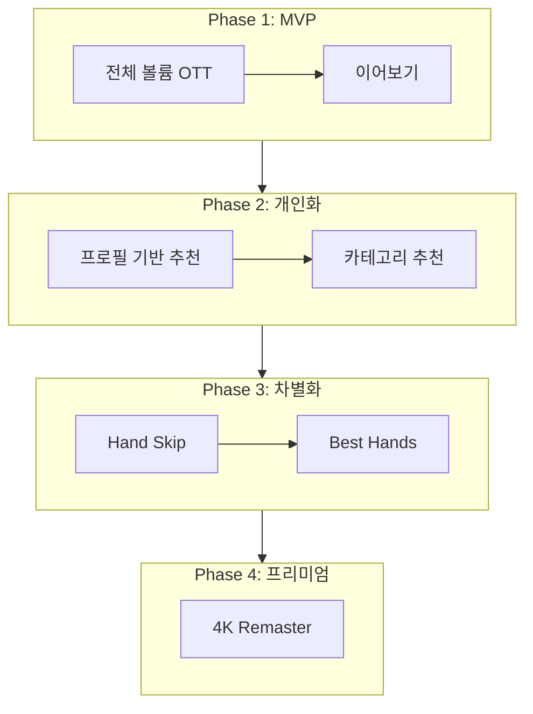
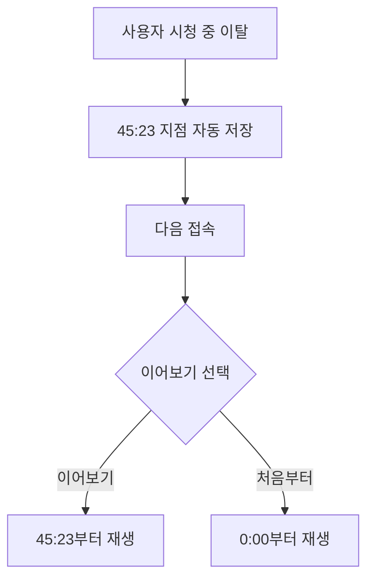
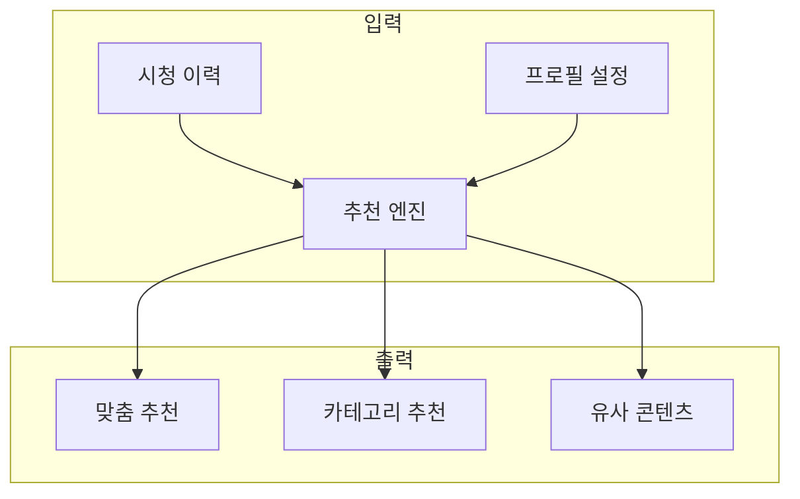
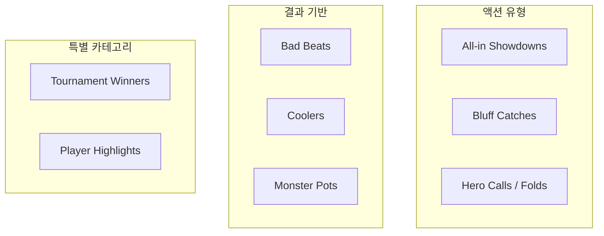
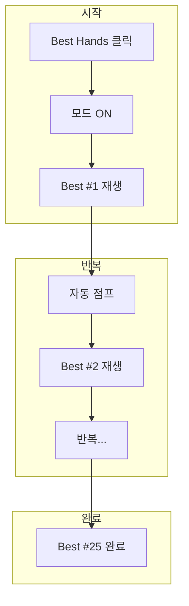
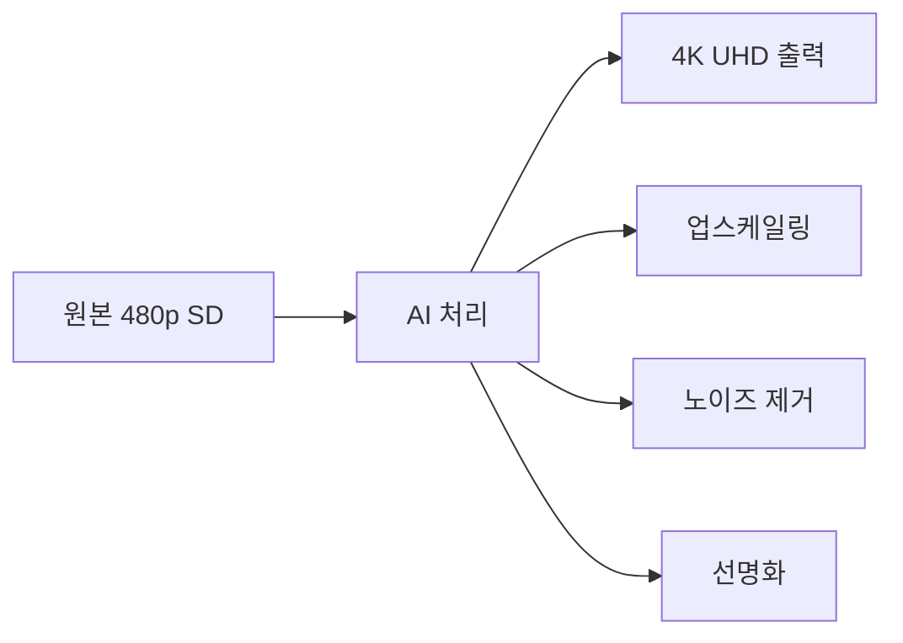

# WSOPTV - 핵심 기능 명세

**Version**: 2.0.0 | **문서 유형**: 기능 명세서 (Phase 기반)

---

## 개발 로드맵 개요

| Phase | 핵심 기능 | 목표 |
|:-----:|----------|------|
| **1** | 전체 볼륨 OTT + 이어보기 | MVP 런칭 |
| **2** | 프로필 기반 추천 | 사용자 리텐션 |
| **3** | Hand Skip + Best Hands | 핵심 차별화 |
| **4** | 4K Remaster | 프리미엄 콘텐츠 |

---

## Phase 1: 기본 OTT (MVP)

> **목표**: WSOP 전체 아카이브를 스트리밍할 수 있는 기본 OTT 플랫폼 구축

### 1.1 전체 볼륨 OTT 제공

**콘텐츠 범위:**

| 구분 | 내용 |
|------|------|
| 연도 | 1973년 ~ 현재 |
| 브랜드 | WSOP |
| 이벤트 | Main Event, High Roller, PLO 등 |
| 에피소드 | Day 1 ~ Final Table 전체 |
| 총 콘텐츠 수 | 약 1,000개 |

**핵심 기능:**

| 기능 | 설명 |
|------|------|
| 콘텐츠 브라우징 | 연도/이벤트/Day별 탐색 |
| 비디오 재생 | HTTP Range 스트리밍 |
| 화질 선택 | Auto, 1080p, 720p, 480p |
| 구독 인증 | 유료 구독자 전용 접근 |

**카탈로그 구조:**

### 1.2 이어보기 (Continue Watching)

시청을 중단한 지점을 **자동 저장**하고, 다음 접속 시 **이어보기**를 제공합니다.

**동작 흐름:**

**저장 조건:**

| 조건 | 동작 |
|------|------|
| 시청 시작 | 저장 |

**Phase 1 완료 시 제공 가치:**

| 항목 | 내용 |
|------|------|
| 콘텐츠 접근성 | WSOP 전체 아카이브 언제든 시청 |
| 사용자 편의 | 중단 지점 자동 기억 |
| 비즈니스 | 구독 기반 수익 모델 시작 |

---

## Phase 2: 개인화 추천

> **목표**: 시청자 프로필과 시청 이력 기반으로 맞춤형 콘텐츠 추천

### 2.1 시청자 프로필

**프로필 데이터:**

| 데이터 | 수집 방법 | 활용 |
|--------|----------|------|
| 선호 플레이어 | 직접 선택 / 시청 분석 | 해당 플레이어 출연 영상 추천 |
| 선호 이벤트 | 시청 이력 분석 | Main Event vs High Roller 등 |
| 시청 패턴 | 자동 수집 | 선호 길이, 시청 시간대 |
| 관심 연도 | 시청 이력 분석 | 특정 연도 콘텐츠 추천 |

**프로필 설정 UI:**

| 항목 | 옵션 예시 |
|------|----------|
| 좋아하는 플레이어 | Grinder, Daniel Negreanu, Alan Keating... |
| 관심 이벤트 | Main Event, PLO Championship, High Roller |
| 선호 시대 | Classic (2003-2010), Modern (2011+), All |

### 2.2 카테고리 기반 추천

**추천 알고리즘:**

**추천 카테고리:**

| 카테고리 | 로직 | 예시 |
|----------|------|------|
| 이어서 보기 | 최근 시청 중단 콘텐츠 | WSOP 2024 ME Day 3 (45:23) |
| 맞춤 추천 | 프로필 + 시청 이력 기반 | Daniel Negreanu 출연작 |
| 인기 콘텐츠 | 전체 사용자 시청 통계 | 이번 주 TOP 10 |
| 새로 추가된 콘텐츠 | 최신 업로드 | WSOP 2024 신규 |
| 연도별 하이라이트 | 연도별 대표 에피소드 | 2023 Best Moments |

**Phase 2 완료 시 제공 가치:**

| 항목 | 내용 |
|------|------|
| 사용자 경험 | 개인화된 홈 화면 |
| 리텐션 | 관심 콘텐츠 빠른 발견 |
| 참여도 | 시청 시간 증가 |

---

## Phase 3: 핵심 차별화 기능

> **목표**: 포커 콘텐츠 특화 기능으로 경쟁사와 차별화

### 3.1 Hand Skip (핸드 건너뛰기)

포커 방송의 특성상 **핸드와 핸드 사이에 대기 시간**이 존재합니다. Hand Skip은 Netflix의 "오프닝 건너뛰기"처럼 이 대기 시간을 **원클릭으로 건너뛰는** 기능입니다.

> **검증된 기능**: 프로덕션 생방송에서 이미 도입되어 포커 팬들에게 높은 평가를 받고 있습니다.

**문제 정의 - 일반 포커 방송 2시간 구성:**

| 구분 | 시간 | 비율 |
|------|------|------|
| 실제 액션 시간 | 45분 | 37% |
| 대기 시간 | 75분 | 63% |

**사용자 Pain Point:**

- 액션 없는 시간이 너무 길어요
- 앞으로 감기하다가 중요한 장면을 놓쳐요
- 2시간 방송 다 보기엔 시간이 없어요

**솔루션: Hand Skip**

| 모드 | 시청 흐름 |
|------|----------|
| 기존 | 핸드 #1 → 대기 → 핸드 #2 |
| Hand Skip | 핸드 #1 → 핸드 #2 → 핸드 #3 |

**대기 시간 특성:**

| 구간 | 시간 | 설명 |
|------|------|------|
| 핸드 플레이 | 1~5분 | 프리플랍 ~ 쇼다운 (액션) |
| 대기 시간 | 30~90초 | 칩 정리, 딜링, 블라인드 (무의미) |

> **핵심 가치**: 시간 절약이 아닌, **무의미한 대기 시간 제거**가 목표입니다. 시청 흐름을 끊는 지루한 구간을 없애 **몰입감 있는 시청 경험**을 제공합니다.

**원클릭 토글 방식:**

| 버튼 | 상태 | 동작 |
|------|------|------|
| Hand Skip [OFF] | 비활성 | 일반 시청 |
| Hand Skip [ON] | 활성 | 대기 시간 자동 스킵 |

**Hand Skip 효과 분석 - WSOP 하루 방송 기준 (120~150핸드):**

| 구분 | 계산 | 시간 |
|------|------|------|
| 핸드 플레이 | 150핸드 x 평균 3분 | 약 7.5시간 |
| 대기 시간 | 150핸드 x 평균 1분 | 약 2.5시간 |
| 총 방송 시간 | - | 약 10시간 |

**Hand Skip 적용 시:**

| 항목 | 내용 |
|------|------|
| 제거되는 구간 | 2.5시간의 무의미한 대기 시간 |
| 남는 구간 | 7.5시간의 순수 액션 |

> **핵심**: 시간이 줄어드는 것이 중요한 게 아닙니다. **150번의 흐름 끊김을 제거**하는 것이 핵심입니다.

**Hand Skip의 진짜 가치:**

| 관점 | Without Hand Skip | With Hand Skip |
|------|-------------------|----------------|
| 시청 흐름 | 매 핸드마다 30~90초 끊김 | 핸드 -> 핸드 연속 재생 |
| 몰입도 | 150번 집중력 분산 | 액션에만 집중 |
| 시청 경험 | 지루함 -> 이탈 | 몰입감 유지 |

### 3.2 Best Hands (베스트 핸드 모아보기)

**10시간+ 긴 풀 에피소드에서 재미있는 핸드만** 타임스탬프 기반으로 점프하며 보여주는 기능입니다.

> **핵심**: 별도 클립 영상이 아닌, **전체 영상 내에서 해당 시간대로 이동**하여 재생 (YouTube 하이라이트 클립과 다름)

**콘텐츠 특성 비교:**

| 구분 | 일반 OTT (Netflix) | WSOPTV (포커) |
|------|-------------------|---------------|
| 콘텐츠 | 영화/드라마 | WSOP Day 방송 |
| 길이 | 1~2시간 | 10시간+ |
| 구성 | 챕터 10개 | 수백 개 핸드 |

**문제점:**

- 수백 핸드 중 재미있는 핸드는 20~30개
- 나머지는 폴드, 작은 팟 등 지루한 핸드
- 10시간 중 베스트 핸드 시청 시간은 30~45분

**Best Hands 카테고리:**

**카테고리 상세:**

| 카테고리 | 설명 | 예시 |
|----------|------|------|
| All-in Showdowns | 올인 후 카드 오픈 대결 | AA vs KK 올인 |
| Bluff Catches | 블러프를 잡아낸 명콜 | 에어로 콜다운 성공 |
| Hero Calls | 용감한 콜로 승리 | 바텀페어로 블러프 캐치 |
| Hero Folds | 큰 핸드를 폴드한 명판단 | 풀하우스 폴드 |
| Big Bluffs | 대담한 블러프 성공 | 에어로 리버 올인 |
| Bad Beats | 역전당한 불운의 핸드 | 셋 오버 셋 아웃 |
| Coolers | 피할 수 없는 대결 | AA vs KK 프리플랍 |
| Monster Pots | 초대형 팟 | $1M+ 팟 |

**원클릭 토글 방식:**

| 버튼 상태 | 표시 정보 | 동작 |
|----------|----------|------|
| Best Hands [OFF] | 일반 진행률 | 전체 영상 재생 |
| Best Hands [ON] | Best 1/12 표시 | 베스트 핸드만 순차 점프 |

**동작 방식:**

**효과:**

| 항목 | 수치 |
|------|------|
| 원본 시청 시간 | 10시간 |
| Best Hands 모드 | 45분 |
| 시청 핸드 수 | 25개 베스트 핸드 |

### 3.3 GGP Archive 연동

Hand Skip과 Best Hands 기능은 **GGP 아카이브 팀**의 메타데이터 태깅 작업과 연동됩니다.

**GGP Archive 팀 작업 내용:**

| 작업 | 설명 |
|------|------|
| 타임스탬프 태깅 | 각 핸드의 시작/종료 시간 |
| 베스트 핸드 선정 | 재미있는 핸드 선별 |
| 카테고리 분류 | All-in, Bluff, Hero Call 등 |
| 플레이어 태깅 | 참여 플레이어 정보 |

**작업 방식 로드맵:**

| 단계 | 수작업 | AI | 설명 |
|------|:------:|:--:|------|
| 현재 | 90% | 10% | 수동 태깅, AI 보조 |
| 이후 | 10% | 90% | AI 자동 태깅, 검토/수정만 |

**기능별 의존성:**

| 기능 | 필요 데이터 |
|------|------------|
| Hand Skip | 모든 핸드의 시작/종료 타임스탬프 |
| Best Hands | 베스트 핸드 선정 + 타임스탬프 + 카테고리 |

**Best Hand 메타데이터:**

| 필드 | 설명 | 예시 |
|------|------|------|
| Title | 핸드 제목 | AA vs KK - $2.3M Pot |
| Category | 핸드 유형 | All-in Showdown |
| Players | 참여 플레이어 | Grinder, Daniel Negreanu |
| Pot Size | 팟 규모 | $2,340,000 |
| Duration | 클립 길이 | 2:34 |
| Source | 원본 에피소드 | WSOP 2024 ME Day 7 |
| Timestamp | 원본 내 위치 | 1:23:45 |

---

## Phase 4: 프리미엄 콘텐츠

> **목표**: AI 기술로 레거시 콘텐츠를 4K 품질로 업그레이드

### 4.1 4K Remaster (AI 화질 업스케일링)

2000년대 초반 WSOP 레거시 영상(SD/480p)을 **AI 업스케일링 기술**로 **4K 화질로 리마스터**하여 제공합니다.

**문제 정의 - 레거시 영상 화질 비교:**

| 구분 | 2003년 영상 | 2024년 영상 |
|------|------------|------------|
| 해상도 | 480p SD | 4K UHD |
| 화면 | 흐릿함 | 선명함 |
| 카드 | 숫자 안 보임 | 숫자 명확 |
| 표정 | 불분명 | 디테일 선명 |

**사용자 Pain Point:**

- 옛날 영상은 화질이 너무 안 좋아서 안 보게 돼요
- Chris Moneymaker 우승 보고 싶은데 화질이...
- 카드가 뭔지 안 보여요

**솔루션: AI Remaster**

**효과:**

- 카드 숫자 선명
- 플레이어 표정 디테일
- 테이블 칩 개수 확인 가능

**Remaster 대상 콘텐츠:**

| 연도 | 원본 화질 | Remaster | 대표 콘텐츠 |
|------|----------|:--------:|-------------|
| 2003 | 480p SD | 4K | Chris Moneymaker 우승 |
| 2004 | 480p SD | 4K | Greg Raymer 우승 |
| 2005 | 480p SD | 4K | Joe Hachem 우승 |
| 2006 | 720p HD | 4K | Jamie Gold $12M |
| 2007-2010 | 720p HD | 4K | 레전드 시대 |
| 2011-2015 | 1080p FHD | 4K | 현대 포커 시작 |
| 2016+ | 1080p-4K | 원본 유지 | 최신 영상 |

**화질 선택 옵션:**

| 옵션 | 해상도 | 설명 |
|------|--------|------|
| Auto | 자동 | 네트워크에 따라 자동 조절 (권장) |
| 4K UHD | 2160p | Remastered |
| Full HD | 1080p | 고화질 |
| HD | 720p | 표준 화질 |
| SD | 480p | 원본 (데이터 절약) |

**마케팅 가치:**

| 포인트 | 설명 |
|--------|------|
| 희소성 | 타 플랫폼에서 볼 수 없는 4K 클래식 |
| 향수 | 레전드 경기를 현대 화질로 |
| 학습 | 선명한 화면으로 카드/칩 분석 가능 |
| 프리미엄 | Premium 구독 유도 킬러 콘텐츠 |

**Phase 4 완료 시 제공 가치:**

| 항목 | 내용 |
|------|------|
| 프리미엄 | 독점 고품질 레거시 콘텐츠 |
| 마케팅 | "4K로 다시 보는 Moneymaker 우승" |
| 수익 | Premium 티어 차별화 근거 |

---

## Feature Matrix

### Phase별 기능 정리

| 기능 | Phase 1 | Phase 2 | Phase 3 | Phase 4 |
|------|:-------:|:-------:|:-------:|:-------:|
| 전체 볼륨 OTT | O | O | O | O |
| 이어보기 | O | O | O | O |
| 프로필 기반 추천 | - | O | O | O |
| 카테고리 추천 | - | O | O | O |
| Hand Skip | - | - | O | O |
| Best Hands | - | - | O | O |
| 4K Remaster | - | - | - | O |

### 검색 기능 (Phase 1~2 점진 확장)

| 검색 유형 | 예시 | 결과 |
|----------|------|------|
| 플레이어 | Alan Keating | Alan Keating 출연 영상 |
| 이벤트 | Main Event 2024 | 2024 메인 이벤트 |
| 핸드 유형 | AA vs KK | 해당 핸드 클립 (Phase 3+) |
| 팟 규모 | million dollar pot | $1M+ 팟 핸드 (Phase 3+) |

### 필터 옵션

| 필터 | 옵션 예시 |
|------|----------|
| Year | 2024, 2023, 2022... |
| Event | Main Event, PLO, High Roller |
| Type | Full Episode, Best Hands (Phase 3+) |
| Player | Grinder, Daniel Negreanu, Alan Keating... |
| Hand Type | All-in, Bluff, Hero Call (Phase 3+) |

---

## 경쟁사 비교

### 기능 비교

| 기능 | WSOPTV | PokerGO | NBA League Pass | YouTube |
|------|:------:|:-------:|:---------------:|:-------:|
| 전문 콘텐츠 | WSOP | 포커 | NBA | - |
| Hand Skip / Condensed | Phase 3 | - | O | - |
| Best Hands / Highlights | Phase 3 | - | O | - |
| 4K Remaster | Phase 4 | - | - | - |
| 개인화 추천 | Phase 2 | - | O | O |
| 이어보기 | Phase 1 | O | O | O |

### 가격 비교

| 서비스 | 월간 | 연간 | 비고 |
|--------|------|------|------|
| WSOPTV | $9.99 | $99 | 단일 티어 |
| NBA League Pass | $16.99 | $109.99 | Standard |
| NBA Premium | $24.99 | $159.99 | 광고 제거 |
| PokerGO | $14.99 | $99.99 | 단일 티어 |

**WSOPTV 핵심 차별점:**

- Phase 3: Hand Skip + Best Hands (생방송 검증 기능)
- Phase 4: 4K Remaster (레거시 콘텐츠 독점)
- NBA 대비 저렴한 가격 + 포커 특화

---

*문서 끝*
