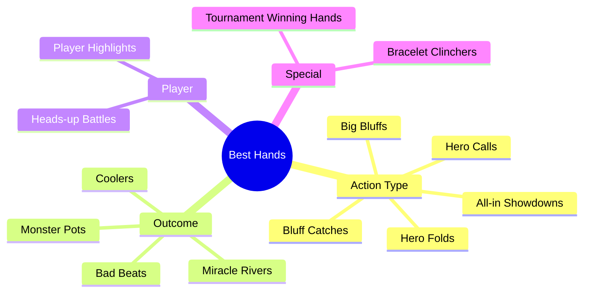

# WSOPTV - 핵심 기능 명세

**Version**: 1.1.0 | **Parent**: [00-master.md](./00-master.md)

---

## 1. Hand Skip (핸드 건너뛰기)

### 1.1 개요

포커 방송의 특성상 **핸드와 핸드 사이에 긴 대기 시간**이 존재합니다. Hand Skip은 Netflix의 "오프닝 건너뛰기"처럼 이 대기 시간을 **원클릭으로 건너뛰는** 기능입니다.

> **검증된 기능**: 프로덕션 생방송에서 이미 도입되어 포커 팬들에게 높은 평가를 받고 있는 기능입니다. WSOPTV는 이 검증된 기능을 OTT VOD 서비스에 확장 적용합니다.

### 1.2 문제 정의

**현재 포커 VOD 시청의 문제점:**

```
┌─────────────────────────────────────────────────────────────┐
│  일반 포커 방송 2시간 구성                                   │
├─────────────────────────────────────────────────────────────┤
│                                                             │
│  [핸드 #1]  [대기]  [핸드 #2]  [대기]  [핸드 #3]  [대기]    │
│   5분       8분     4분       10분    6분       12분  ...   │
│                                                             │
│  ▶ 실제 액션: 45분 (37%)                                    │
│  ▶ 대기 시간: 75분 (63%)  ← 사용자 이탈 구간                │
│                                                             │
└─────────────────────────────────────────────────────────────┘
```

**사용자 Pain Point:**
- "액션 없는 시간이 너무 길어요"
- "앞으로 감기하다가 중요한 장면을 놓쳐요"
- "2시간 방송 다 보기엔 시간이 없어요"

### 1.3 솔루션

```
┌─────────────────────────────────────────────────────────────┐
│  Hand Skip 적용 후                                          │
├─────────────────────────────────────────────────────────────┤
│                                                             │
│  [핸드 #1] ⏭️ [핸드 #2] ⏭️ [핸드 #3] ⏭️ [핸드 #4] ...     │
│   5분         4min        6min        5min                  │
│                                                             │
│  ▶ 2시간 방송 → 45분으로 압축 시청 가능                      │
│  ▶ 원할 때만 Skip (강제 아님)                               │
│                                                             │
└─────────────────────────────────────────────────────────────┘
```

### 1.4 원클릭 토글 방식 (Netflix 스타일)

> **핵심 UX**: 매 핸드마다 버튼을 클릭하는 불편함 없이, **한 번 클릭으로 전체 에피소드에 적용**

**플레이어 UI:**

```
┌─────────────────────────────────────────────────────────────┐
│                                                             │
│                    [Video Playing]                          │
│                                                             │
│                                                             │
│                                                             │
│   ════════════════════════════════════════════════════════  │
│   █████████░░░░░░░░░░░░░░░░░░░░░░░░  23:45 / 2:15:00       │
│                                                             │
│   ┌─────────────────┐  ┌─────────────────┐                 │
│   │ ⏭️ Hand Skip    │  │ 🔥 Best Hands   │                 │
│   │    [OFF]        │  │    [OFF]        │                 │
│   └─────────────────┘  └─────────────────┘                 │
│                                                             │
└─────────────────────────────────────────────────────────────┘
```

**클릭 후 (Hand Skip ON):**

```
┌─────────────────────────────────────────────────────────────┐
│                                                             │
│                    [Video Playing]                          │
│                                                             │
│            ✅ Hand Skip 활성화                               │
│            핸드 사이 대기 시간을 자동으로 건너뜁니다          │
│                                                             │
│   ════════════════════════════════════════════════════════  │
│   █████████░░░░░░░░░░░░░░░░░░░░░░░░  23:45 / 2:15:00       │
│                                                             │
│   ┌─────────────────┐  ┌─────────────────┐                 │
│   │ ⏭️ Hand Skip    │  │ 🔥 Best Hands   │                 │
│   │    [ON] ✓       │  │    [OFF]        │                 │
│   └─────────────────┘  └─────────────────┘                 │
│                                                             │
└─────────────────────────────────────────────────────────────┘
```

### 1.5 동작 방식

```
┌─────────────────────────────────────────────────────────────┐
│  Hand Skip 버튼 클릭 (한 번)                                 │
├─────────────────────────────────────────────────────────────┤
│                                                             │
│  [핸드 #1] → [자동 스킵] → [핸드 #2] → [자동 스킵] → ...    │
│             (대기 시간)              (대기 시간)             │
│                                                             │
│  ✅ 한 번 클릭 = 전체 에피소드에 적용                        │
│  ✅ 다시 클릭 = OFF (일반 시청으로 복귀)                     │
│  ✅ 설정 기억 = 다음 영상에도 유지                           │
│                                                             │
└─────────────────────────────────────────────────────────────┘
```

### 1.6 예상 시청 시간 표시

```
┌─────────────────────────────────────────────────────────────┐
│  WSOP 2024 Main Event - Day 5                               │
├─────────────────────────────────────────────────────────────┤
│                                                             │
│  총 길이: 2시간 15분                                        │
│                                                             │
│  ⏭️ Hand Skip 적용 시: 52분 (약 61% 단축)                   │
│  🔥 Best Hands만 보기: 18분 (12개 핸드)                     │
│                                                             │
└─────────────────────────────────────────────────────────────┘
```

---

## 2. Best Hands (베스트 핸드 모아보기)

### 2.1 개요

**10시간+ 긴 풀 에피소드에서 재미있는 핸드만** 타임스탬프 기반으로 점프하며 보여주는 기능입니다.

> **핵심**: 별도 클립 영상이 아닌, **전체 영상 내에서 해당 시간대로 이동**하여 재생 (YouTube 하이라이트 클립과 다름)

> **검증된 기능**: Hand Skip과 마찬가지로 프로덕션 생방송에서 포커 팬들에게 큰 호응을 얻고 있는 기능입니다. 생방송의 성공 경험을 바탕으로 OTT VOD에 최적화하여 제공합니다.

### 2.2 WSOPTV 콘텐츠 특성

```
┌─────────────────────────────────────────────────────────────┐
│  일반 OTT vs WSOPTV 콘텐츠                                   │
├─────────────────────────────────────────────────────────────┤
│                                                             │
│  일반 OTT (Netflix)          WSOPTV (포커)                  │
│  ┌─────────────┐            ┌─────────────────────────────┐│
│  │  영화/드라마 │            │     WSOP Day 1 방송         ││
│  │  1~2시간    │            │     10시간+                 ││
│  │  챕터 10개  │            │     수백 개 핸드            ││
│  └─────────────┘            └─────────────────────────────┘│
│                                                             │
│  문제점:                                                    │
│  • 수백 핸드 중 재미있는 핸드는 20~30개                      │
│  • 나머지는 폴드, 작은 팟 등 지루한 핸드                     │
│  • 10시간 중 베스트 핸드 시청 시간은 30~45분                 │
│                                                             │
└─────────────────────────────────────────────────────────────┘
```

### 2.3 Best Hands 카테고리



### 2.4 카테고리 상세

| 카테고리 | 설명 | 예시 |
|----------|------|------|
| **All-in Showdowns** | 올인 후 카드 오픈 대결 | AA vs KK 올인 |
| **Bluff Catches** | 블러프를 잡아낸 명콜 | 에어로 콜다운 성공 |
| **Hero Calls** | 용감한 콜로 승리 | 바텀페어로 블러프 캐치 |
| **Hero Folds** | 큰 핸드를 폴드한 명판단 | 풀하우스 폴드 |
| **Big Bluffs** | 대담한 블러프 성공 | 에어로 리버 올인 블러프 |
| **Bad Beats** | 역전당한 불운의 핸드 | 셋 오버 셋 아웃 |
| **Coolers** | 피할 수 없는 대결 | AA vs KK 프리플랍 |
| **Monster Pots** | 초대형 팟 | $1M+ 팟 |
| **Miracle Rivers** | 극적인 리버 역전 | 원아웃 리버 |

### 2.5 원클릭 토글 방식 (Best Hands 모드)

> **핵심 UX**: 영상 재생 중 **Best Hands 버튼 한 번 클릭** → 해당 영상의 베스트 핸드 구간만 순차 스킵 재생

**플레이어 UI (Best Hands 클릭 전):**

```
┌─────────────────────────────────────────────────────────────┐
│                                                             │
│                    [Video Playing]                          │
│        WSOP 2024 Main Event - Day 5 (2h 15m)               │
│                                                             │
│   ════════════════════════════════════════════════════════  │
│   █████████░░░░░░░░░░░░░░░░░░░░░░░░  23:45 / 2:15:00       │
│                                                             │
│   ┌─────────────────┐  ┌─────────────────┐                 │
│   │ ⏭️ Hand Skip    │  │ 🔥 Best Hands   │                 │
│   │    [OFF]        │  │    [OFF]        │                 │
│   └─────────────────┘  └─────────────────┘                 │
│                                                             │
└─────────────────────────────────────────────────────────────┘
```

**클릭 후 (Best Hands ON - 베스트 핸드 모드):**

```
┌─────────────────────────────────────────────────────────────┐
│                                                             │
│                    [Video Playing]                          │
│                                                             │
│            🔥 Best Hands 모드                               │
│            이 영상의 베스트 핸드 12개만 순차 점프 (총 18분)   │
│                                                             │
│   ════════════════════════════════════════════════════════  │
│   ████░░░░░░░░░░░░░░░░░░░░░░░░░░░░  Best 1/12 | 12:34      │
│                                                             │
│   ┌─────────────────┐  ┌─────────────────┐                 │
│   │ ⏭️ Hand Skip    │  │ 🔥 Best Hands   │                 │
│   │    [OFF]        │  │    [ON] ✓       │                 │
│   └─────────────────┘  └─────────────────┘                 │
│                                                             │
│   베스트 핸드 타임라인:                                      │
│   ┌────┐ ┌────┐ ┌────┐ ┌────┐ ┌────┐ ┌────┐ ...          │
│   │#1 ▶│ │#2  │ │#3  │ │#4  │ │#5  │ │#6  │              │
│   │12:34│ │28:45│ │45:12│ │58:30│ │1:12:│ │1:28:│          │
│   └────┘ └────┘ └────┘ └────┘ └────┘ └────┘              │
│                                                             │
└─────────────────────────────────────────────────────────────┘
```

### 2.6 동작 방식 (타임스탬프 기반 점프)

```
┌─────────────────────────────────────────────────────────────┐
│  Best Hands 버튼 클릭 (한 번) - Best Hands 모드 ON           │
├─────────────────────────────────────────────────────────────┤
│                                                             │
│  WSOP 2024 Day 1 (10시간, 수백 핸드):                       │
│                                                             │
│  전체 영상 타임라인:                                         │
│  ┌────────────────────────────────────────────────────────┐│
│  │0:00                                             10:00:00││
│  │ ░░[#1]░░░░░░░░░[#2]░░░░░░░░[#3]░░░░░░░░░░░░░░░[#25]░░ ││
│  │   1:23:45       3:45:20      5:12:30           9:45:00 ││
│  └────────────────────────────────────────────────────────┘│
│                                                             │
│  재생 흐름 (타임스탬프 점프):                                │
│  [0:00] → 점프 → [1:23:45] → 점프 → [3:45:20] → ... → 끝  │
│             Best #1              Best #2                   │
│                                                             │
│  ✅ 별도 클립이 아닌 전체 영상 내 시간대 이동                │
│  ✅ 한 번 클릭 = 베스트 핸드 25개만 순차 재생               │
│  ✅ 10시간 → 45분 압축 (베스트 핸드만 시청)                  │
│  ✅ 다시 클릭 = OFF (일반 시청으로 복귀)                     │
│  ✅ 특정 핸드 클릭 = 해당 타임스탬프로 즉시 이동             │
│                                                             │
└─────────────────────────────────────────────────────────────┘
```

### 2.7 메타데이터 기반 베스트 핸드 (GGP Archive 연동)

Hand Skip과 Best Hands 기능은 **GGP 아카이브 팀**에서 진행하는 메타데이터 태깅 작업과 연동됩니다.

```
┌─────────────────────────────────────────────────────────────┐
│  GGP Archive Team 메타데이터 파이프라인                      │
├─────────────────────────────────────────────────────────────┤
│                                                             │
│  [영상 업로드] → [GGP Archive 팀] → [메타데이터 태깅] → [API]│
│                                                             │
│  GGP 팀 작업 내용:                                          │
│  • 각 핸드의 시작/종료 타임스탬프 태깅                       │
│  • 베스트 핸드 선정 및 카테고리 분류                         │
│  • 핸드 유형 (All-in, Bluff, Hero Call 등) 라벨링           │
│  • 참여 플레이어 정보 태깅                                   │
│                                                             │
│  WSOPTV 연동:                                               │
│  • Hand Skip: 핸드 사이 대기 구간 자동 스킵                  │
│  • Best Hands: 선정된 베스트 핸드 구간 재생                  │
│                                                             │
└─────────────────────────────────────────────────────────────┘
```

**메타데이터 구조 (GGP Archive 제공):**

```json
{
  "video_id": "wsop-2024-me-day5",
  "duration": "2:15:00",
  "source": "ggp_archive",
  "tagged_by": "GGP Archive Team",
  "tagged_at": "2024-07-15T10:30:00Z",
  "hands": [
    { "index": 1, "start": "00:45", "end": "03:20", "is_best": false },
    { "index": 2, "start": "05:30", "end": "08:15", "is_best": false },
    ...
  ],
  "best_hands": [
    { "index": 12, "start": "12:34", "end": "15:20", "type": "all_in", "title": "AA vs KK", "players": ["Phil Ivey", "Tom Dwan"] },
    { "index": 23, "start": "28:45", "end": "32:10", "type": "bluff", "title": "River Bluff", "players": ["Daniel Negreanu"] },
    { "index": 31, "start": "45:12", "end": "48:30", "type": "hero_call", "title": "Hero Call", "players": ["Phil Hellmuth"] },
    ...
  ],
  "total_hands": 47,
  "total_best_hands": 12,
  "action_duration": "52:00",
  "highlight_duration": "18:00"
}
```

**의존성 관계:**

| 기능 | GGP Archive 의존성 |
|------|-------------------|
| Hand Skip | 모든 핸드의 시작/종료 타임스탬프 |
| Best Hands | 베스트 핸드 선정 + 타임스탬프 + 카테고리 |
| 예상 시청 시간 | action_duration, highlight_duration |

### 2.8 Best Hands 메타데이터

각 Best Hand 클립에 포함되는 정보:

| 필드 | 설명 | 예시 |
|------|------|------|
| **Title** | 핸드 제목 | "AA vs KK - $2.3M Pot" |
| **Category** | 핸드 유형 | All-in Showdown |
| **Players** | 참여 플레이어 | Phil Ivey, Tom Dwan |
| **Pot Size** | 팟 규모 | $2,340,000 |
| **Duration** | 클립 길이 | 2:34 |
| **Source** | 원본 에피소드 | WSOP 2024 ME Day 7 |
| **Timestamp** | 원본 내 위치 | 1:23:45 |

### 2.6 플레이어 화면 통합

**Best Hands 패널:**

```
┌─────────────────────────────────────────────────────────────┐
│  [Video Player - Full Episode]                              │
│                                                             │
│  ═══════════════════════════════════════════════            │
│                                                             │
│  📋 Best Hands in This Episode          [접기 ▲]           │
│  ┌────┐ ┌────┐ ┌────┐ ┌────┐ ┌────┐ ┌────┐              │
│  │#12 │ │#23 │ │#31 │ │#45 │ │#52 │ │#67 │              │
│  │▶   │ │▶   │ │▶   │ │▶   │ │▶   │ │▶   │              │
│  │AA  │ │Bluf│ │Hero│ │Bad │ │All │ │Big │              │
│  └────┘ └────┘ └────┘ └────┘ └────┘ └────┘              │
│   현재 ↑                                                    │
│                                                             │
│  클릭 시 해당 핸드 시작 지점으로 이동                         │
│                                                             │
└─────────────────────────────────────────────────────────────┘
```

---

## 3. 4K Remaster (AI 화질 업스케일링)

### 3.1 개요

2000년대 초반 WSOP 레거시 영상(SD/480p)을 **AI 업스케일링 기술**로 **4K 화질로 리마스터**하여 제공합니다. 과거의 명장면을 현대적인 화질로 재탄생시킵니다.

### 3.2 문제 정의

**클래식 WSOP 영상의 문제:**

```
┌─────────────────────────────────────────────────────────────┐
│  레거시 영상 화질 문제                                       │
├─────────────────────────────────────────────────────────────┤
│                                                             │
│  2003년 영상          vs        2024년 영상                 │
│  ┌─────────────┐              ┌─────────────┐              │
│  │ ░░░░░░░░░░░ │              │ ████████████ │              │
│  │ ░░ 480p ░░░ │              │ ██ 4K UHD ██ │              │
│  │ ░░░░░░░░░░░ │              │ ████████████ │              │
│  └─────────────┘              └─────────────┘              │
│                                                             │
│  • 흐릿한 화면                 • 선명한 디테일               │
│  • 카드 숫자 안 보임           • 카드 숫자 명확              │
│  • 플레이어 표정 불분명        • 표정까지 선명               │
│                                                             │
└─────────────────────────────────────────────────────────────┘
```

**사용자 Pain Point:**
- "옛날 영상은 화질이 너무 안 좋아서 안 보게 돼요"
- "Chris Moneymaker 우승 보고 싶은데 화질이..."
- "카드가 뭔지 안 보여요"

### 3.3 솔루션

```
┌─────────────────────────────────────────────────────────────┐
│  AI 4K Remaster 적용                                        │
├─────────────────────────────────────────────────────────────┤
│                                                             │
│       원본 (480p)           AI 처리           4K 출력       │
│  ┌─────────────┐      ┌─────────────┐    ┌─────────────┐   │
│  │ ░░░░░░░░░░░ │  →   │   AI 모델   │  → │ ████████████ │   │
│  │ ░░ SD ░░░░░ │      │  업스케일링  │    │ ██ 4K ████ │   │
│  │ ░░░░░░░░░░░ │      │  노이즈제거  │    │ ████████████ │   │
│  └─────────────┘      │  선명화     │    └─────────────┘   │
│                       └─────────────┘                       │
│                                                             │
│  ✅ 카드 숫자 선명                                          │
│  ✅ 플레이어 표정 디테일                                     │
│  ✅ 테이블 칩 개수 확인 가능                                 │
│                                                             │
└─────────────────────────────────────────────────────────────┘
```

### 3.4 Remaster 대상 콘텐츠

| 연도 | 원본 화질 | Remaster | 대표 콘텐츠 |
|------|----------|:--------:|-------------|
| 2003 | 480p SD | ✅ 4K | Chris Moneymaker 우승 |
| 2004 | 480p SD | ✅ 4K | Greg Raymer 우승 |
| 2005 | 480p SD | ✅ 4K | Joe Hachem 우승 |
| 2006 | 720p HD | ✅ 4K | Jamie Gold $12M |
| 2007-2010 | 720p HD | ✅ 4K | 레전드 시대 |
| 2011-2015 | 1080p FHD | ✅ 4K | 현대 포커 시작 |
| 2016+ | 1080p-4K | 원본 유지 | 최신 영상 |

### 3.5 Before & After 프로모션

**홈 화면 프로모션:**

```
┌─────────────────────────────────────────────────────────────┐
│                                                             │
│  ✨ REMASTERED IN 4K                                        │
│                                                             │
│  ┌────────────────────────────────────────────────────┐    │
│  │                                                    │    │
│  │   [ Before ]              [ After ]               │    │
│  │   ┌─────────┐            ┌─────────┐             │    │
│  │   │ ░░░░░░░ │    →      │ ████████ │             │    │
│  │   │ 480p SD │            │ 4K UHD  │             │    │
│  │   └─────────┘            └─────────┘             │    │
│  │                                                    │    │
│  │   2003 WSOP Main Event - Chris Moneymaker        │    │
│  │   "포커 붐의 시작을 4K로 다시 경험하세요"          │    │
│  │                                                    │    │
│  │              [▶ Watch in 4K]                      │    │
│  │                                                    │    │
│  └────────────────────────────────────────────────────┘    │
│                                                             │
└─────────────────────────────────────────────────────────────┘
```

### 3.6 화질 선택 UI

**플레이어 설정:**

```
┌─────────────────────────────────────────────────────────────┐
│                                                             │
│  화질 선택                                          [⚙️]    │
│                                                             │
│  ┌───────────────────────────────────────────────────────┐ │
│  │  ○  Auto (권장)                                       │ │
│  │  ○  4K UHD (2160p) - Remastered ✨                   │ │
│  │  ○  1080p Full HD                                     │ │
│  │  ○  720p HD                                           │ │
│  │  ○  480p (원본)                                       │ │
│  └───────────────────────────────────────────────────────┘ │
│                                                             │
│  💡 이 영상은 AI 기술로 4K 화질로 리마스터되었습니다         │
│                                                             │
└─────────────────────────────────────────────────────────────┘
```

### 3.7 Remaster 뱃지

**콘텐츠 카드:**

```
┌──────────────────────┐
│ ✨ 4K REMASTERED     │  ← Remaster 뱃지
│                      │
│    [Thumbnail]       │
│                      │
│      ▶ 2:15:00       │
├──────────────────────┤
│ WSOP 2003            │
│ Main Event Final     │
│ Chris Moneymaker     │
└──────────────────────┘
```

### 3.8 마케팅 가치

| 포인트 | 설명 |
|--------|------|
| **희소성** | 타 플랫폼에서 볼 수 없는 4K 클래식 |
| **향수** | 레전드 경기를 현대 화질로 |
| **학습** | 선명한 화면으로 카드/칩 분석 가능 |
| **프리미엄** | Premium 구독 유도 킬러 콘텐츠 |

---

## 4. Continue Watching (이어보기)

### 4.1 개요

시청을 중단한 지점을 **자동 저장**하고, 다음 접속 시 **이어보기**를 제공합니다.

### 4.2 동작 방식

```
사용자 시청 중 이탈
        │
        ▼
[45:23 지점 자동 저장]
        │
        ▼
다음 접속 시
        │
        ▼
┌─────────────────────────┐
│  이어서 보시겠습니까?    │
│                         │
│  WSOP 2024 ME Day 5     │
│  45:23 / 2:15:00        │
│                         │
│  [이어보기] [처음부터]   │
└─────────────────────────┘
```

### 4.3 이어보기 표시

**홈 화면:**

```
⏩ Continue Watching

┌──────────────┐ ┌──────────────┐ ┌──────────────┐
│ [Thumbnail]  │ │ [Thumbnail]  │ │ [Thumbnail]  │
│ ▓▓▓▓▓▓░░░░░ │ │ ▓▓▓░░░░░░░░ │ │ ▓▓▓▓▓▓▓▓░░░ │
│ ME Day 5     │ │ $10K PLO     │ │ High Roller  │
│ 45% watched  │ │ 25% watched  │ │ 72% watched  │
└──────────────┘ └──────────────┘ └──────────────┘
```

### 4.4 저장 조건

| 조건 | 저장 여부 |
|------|----------|
| 10% 미만 시청 | X (저장 안함) |
| 10% ~ 90% 시청 | O (저장) |
| 90% 이상 시청 | 완료로 표시 |
| Best Hands 클립 | X (짧은 클립 제외) |

---

## 5. Smart Search (검색)

### 5.1 검색 유형

| 검색 유형 | 예시 | 결과 |
|----------|------|------|
| **플레이어** | "Phil Ivey" | Phil Ivey 출연 영상 |
| **이벤트** | "Main Event 2024" | 2024 메인 이벤트 |
| **핸드 유형** | "AA vs KK" | 해당 핸드 클립 |
| **팟 규모** | "million dollar pot" | $1M+ 팟 핸드 |

### 5.2 필터 옵션

```
┌─────────────────────────────────────────────────────────────┐
│  🔍 [검색어 입력...]                          [검색]        │
├─────────────────────────────────────────────────────────────┤
│                                                             │
│  Filters:                                                   │
│  ┌──────────────┐ ┌──────────────┐ ┌──────────────┐        │
│  │ Year ▼       │ │ Event ▼      │ │ Type ▼       │        │
│  │ 2024         │ │ Main Event   │ │ Full Episode │        │
│  └──────────────┘ └──────────────┘ └──────────────┘        │
│                                                             │
│  ┌──────────────┐ ┌──────────────┐                         │
│  │ Player ▼     │ │ Hand Type ▼  │                         │
│  │ All          │ │ All          │                         │
│  └──────────────┘ └──────────────┘                         │
│                                                             │
└─────────────────────────────────────────────────────────────┘
```

---

## 6. Feature Matrix

### 6.1 WSOPTV 구독 기능

> **투트랙 전략**: WSOPTV는 구독 전용 서비스입니다. 무료 콘텐츠(쇼츠, 하이라이트)는 **YouTube**에서 제공합니다.

| 기능 | WSOPTV 구독 ($9.99/월) |
|------|:----------------------:|
| **풀 에피소드** (전체 시즌) | ✅ |
| **Hand Skip** | ✅ |
| **Best Hands** (전체 영상 내 타임스탬프 점프) | ✅ |
| **4K Remaster** | ✅ |
| **이어보기** 동기화 | ✅ |
| **고급 검색** (플레이어, 핸드 유형) | ✅ |
| 광고 | 없음 |

**YouTube (무료)에서 제공:**
- 쇼츠 (Shorts)
- 하이라이트 클립
- 베스트 핸드 샘플 영상

### 6.2 구현 우선순위

| 우선순위 | 기능 | 설명 |
|:--------:|------|------|
| **P0** | 콘텐츠 브라우징 | 기본 탐색 |
| **P0** | 비디오 재생 | 핵심 기능 |
| **P0** | 구독 인증 시스템 | 비즈니스 모델 |
| **P1** | **Hand Skip** | 핵심 차별화 기능 |
| **P1** | **Best Hands** | 핵심 차별화 기능 |
| **P1** | **4K Remaster** | 핵심 프로모션 기능 |
| **P1** | 이어보기 | 사용자 편의 |
| **P2** | Smart Search | 탐색 강화 |
| **P2** | 시청 기록 | 개인화 |

---

## 7. 경쟁사 비교

### 7.1 기능 비교

| 기능 | WSOPTV | PokerGO | NBA League Pass | YouTube |
|------|:------:|:-------:|:---------------:|:-------:|
| **전문 콘텐츠** | ✅ (WSOP) | ✅ (포커) | ✅ (NBA) | ❌ |
| **Hand Skip / Condensed** | ✅ | ❌ | ✅ (Condensed) | ❌ |
| **Best Hands / Highlights** | ✅ | ❌ | ✅ (Key Highlights) | ❌ |
| **4K Remaster** | ✅ | ❌ | ❌ | ❌ |
| **무료 콘텐츠** | YouTube 분리 | ❌ | ✅ (CrunchTime) | ✅ |
| **이어보기** | ✅ | ✅ | ✅ | ✅ |
| **오프라인 다운로드** | 향후 | ❌ | ✅ (Premium) | ✅ (Premium) |

> **투트랙 전략**: WSOPTV는 무료 티어를 직접 제공하지 않고, **YouTube**로 무료 채널을 분리합니다. NBA는 무료 티어(CrunchTime, Vault)를 직접 제공하는 반면, WSOPTV는 YouTube와 역할을 명확히 분리합니다.

### 7.2 콘텐츠 압축 비교 (NBA 참고)

| 구분 | NBA League Pass | WSOPTV |
|------|-----------------|--------|
| **원본 길이** | ~2.5시간 (경기) | 5-10시간+ (하루 방송) |
| **압축 버전 1** | Condensed (10-15분) | Best Hands (30-45분) |
| **압축 버전 2** | Key Highlights (5분) | 향후 추가 가능 |
| **압축 기준** | 득점 장면 | 베스트 핸드 |
| **스킵 기능** | - | Hand Skip (대기 시간) |

> **NBA 참고**: NBA League Pass의 "Condensed Game"은 ~90분 경기를 10-15분으로 압축하여 제공. WSOPTV의 Best Hands와 유사한 개념이나, 포커는 "득점"이 아닌 "핸드" 기준으로 압축.

### 7.3 가격 비교

| 서비스 | 월간 | 연간 | 비고 |
|--------|------|------|------|
| **WSOPTV** | $9.99 | $99 | 단일 티어 |
| **NBA League Pass** | $16.99 | $109.99 | Standard |
| **NBA Premium** | $24.99 | $159.99 | 광고 제거 + 다운로드 |
| **PokerGO** | $14.99 | $99.99 | 단일 티어 |

**핵심 차별점:**
- Hand Skip + Best Hands: 생방송에서 검증된 기능을 OTT VOD에 확장 적용
- 4K Remaster: 레거시 콘텐츠의 가치를 극대화하는 독점 기능
- NBA 대비 저렴한 가격 + 포커 특화 기능

---

*다음: [02-user-experience.md](./02-user-experience.md)*
