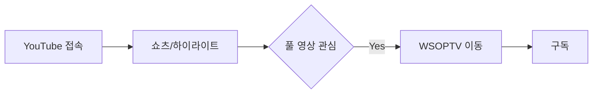
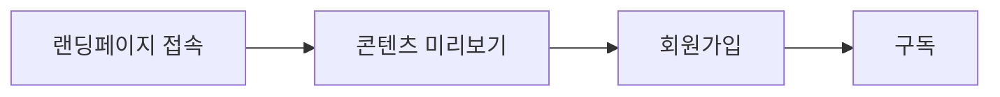
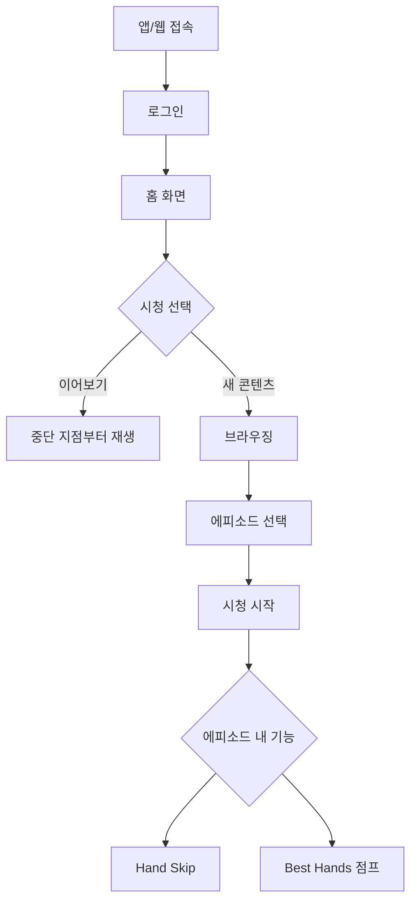
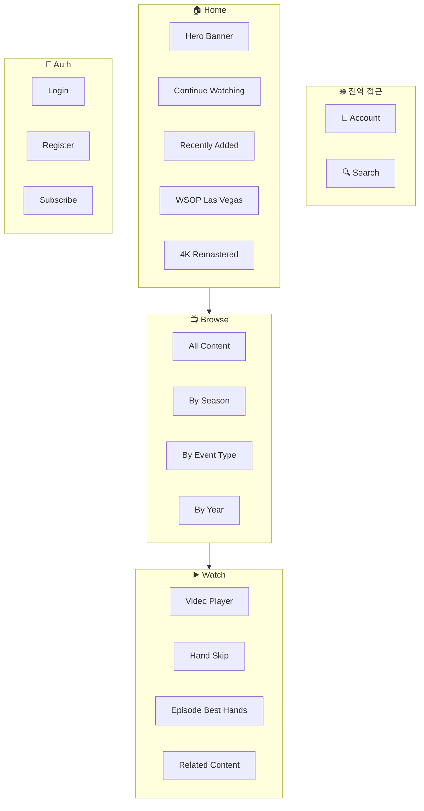
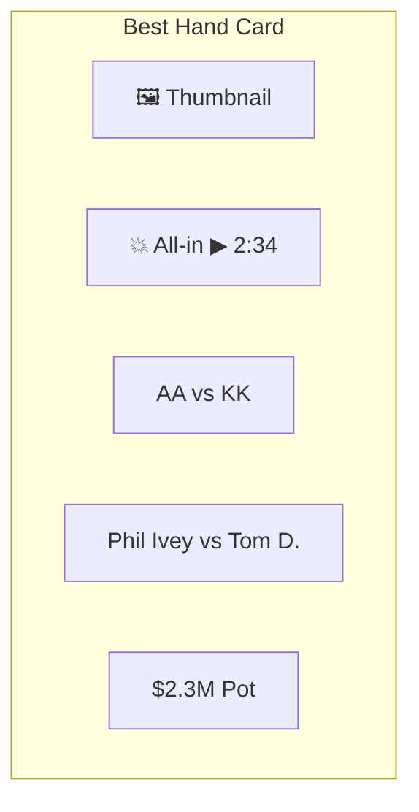
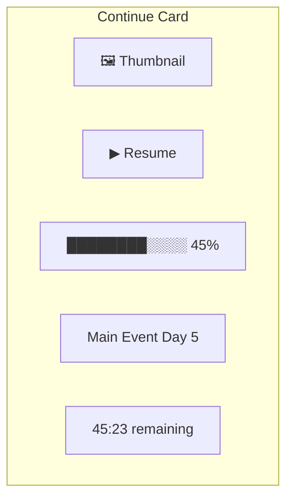
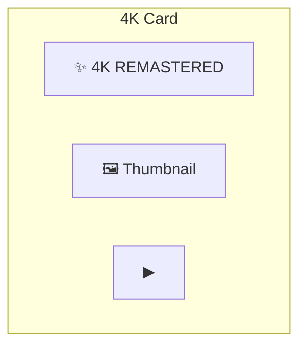
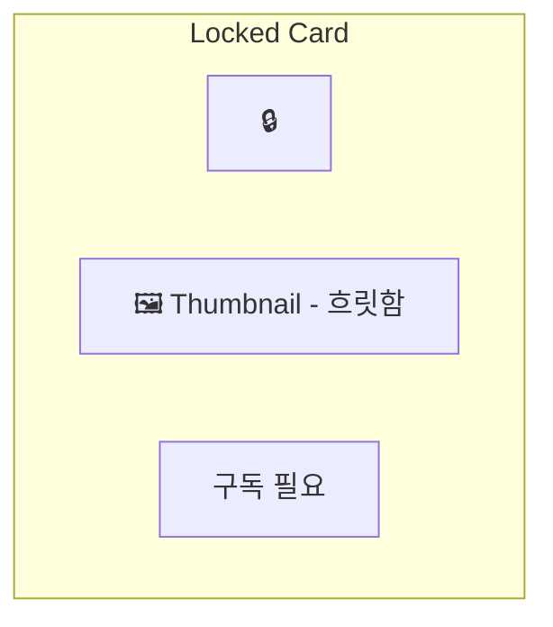
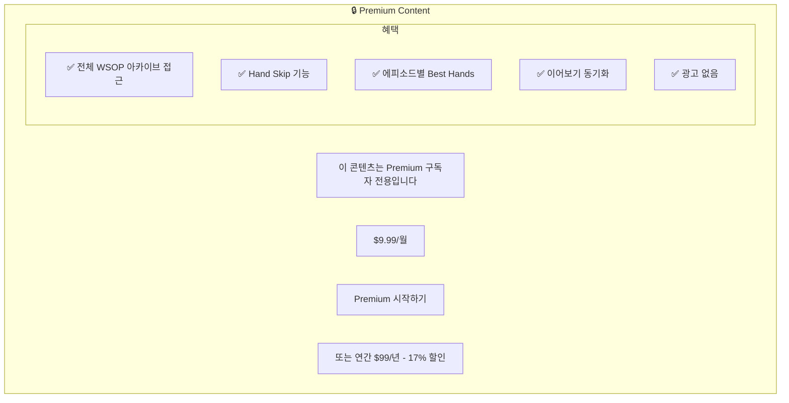

# WSOPTV - 사용자 경험 설계

**Version**: 1.3.0 | **Parent**: [README.md](./README.md)

---

## 1. 사용자 여정 (User Journey)

### 1.1 신규 사용자 여정

**진입 경로 1: YouTube (신규 유저층 확보)**



**진입 경로 2: WSOPTV 직접 접속**



> **투트랙 전략**: YouTube는 신규 유저층이 많아 무료 콘텐츠(쇼츠, 하이라이트)로 유입을 유도합니다. WSOPTV는 구독자 전용 풀 에피소드 서비스입니다.

### 1.2 기존 사용자 여정



> **Best Hands**: 별도 페이지가 아닌, 에피소드 시청 중 해당 에피소드의 Best Hands로 점프하는 기능입니다.

---

## 2. 페이지 구조

### 2.1 Information Architecture



> **Account/Search**: 모든 페이지에서 헤더를 통해 접근 가능합니다.

### 2.2 네비게이션 (전역 접근)

모든 페이지에서 Header를 통해 모든 메뉴로 이동 가능합니다.

**Desktop Header:**

| 위치 | 요소 | 설명 |
|------|------|------|
| 좌측 | Logo | 홈으로 이동 |
| 중앙 | Home, Browse | 주요 탐색 |
| 우측 | Search, Account | 유틸리티 |

**Mobile Bottom Nav:**

| 위치 | 요소 |
|------|------|
| 1 | Home |
| 2 | Browse |
| 3 | Search |
| 4 | Account |

**접근성 매트릭스:**

| From / To | Home | Browse | Search | Account |
|-----------|------|--------|--------|---------|
| **Home** | - | O | O | O |
| **Browse** | O | - | O | O |
| **Watch** | O | O | O | O |
| **Account** | O | O | O | - |

---

## 3. 주요 화면 설계

> 상세 화면 설계는 별도 문서를 참조하세요: **[03-screen-design.md](./03-screen-design.md)**

| 화면 | 설명 |
|------|------|
| 홈 화면 | Hero, Continue Watching, Recently Added 등 |
| Browse 화면 | 필터, 정렬, 카탈로그 그리드 |
| 플레이어 화면 | Video Player, Hand Skip, Best Hands |
| 검색 화면 | 검색 UI, 결과, 자동완성 |
| Account 화면 | 프로필, 구독, 시청 기록 |
| 인증 화면 | 로그인, 회원가입, 구독 |

---

## 4. 콘텐츠 카드 디자인

### 4.1 에피소드 카드

```mermaid
flowchart TB
    subgraph EpisodeCard["Episode Card"]
        Thumb[🖼️ Thumbnail]
        Duration[▶ 2:15:00]
        Series[WSOP 2024]
        Title[Main Event Day 5]
        Meta[47 Hands | 52m Action]
    end
```

### 4.2 Best Hand 카드



### 4.3 이어보기 카드



### 4.4 콘텐츠 상태 표시

> **참고**: WSOPTV는 구독자 전용 서비스입니다. 무료 콘텐츠(쇼츠, 하이라이트)는 YouTube에서 제공합니다.

**4K Remaster 콘텐츠:**



**비구독자 화면 (로그인 전):**



---

## 5. 구독 전환 UX

### 5.1 Paywall 화면

**유료 콘텐츠 클릭 시:**



### 5.2 구독 페이지

```mermaid
flowchart TB
    subgraph Title["🏆 WSOPTV Premium"]
        Header[구독 플랜 선택]
    end

    subgraph Plans["플랜 선택"]
        subgraph Monthly["MONTHLY"]
            M1[$9.99/월]
            M2[선택]
        end

        subgraph Yearly["⭐ BEST VALUE - YEARLY"]
            Y1[$99/년]
            Y2[$8.25/월]
            Y3[선택]
        end
    end

    subgraph Benefits["Premium 혜택"]
        B1[✅ 전체 WSOP 아카이브 무제한]
        B2[✅ Hand Skip - 액션만 빠르게]
        B3[✅ 에피소드별 Best Hands 점프]
        B4[✅ 이어보기 - 모든 기기 동기화]
        B5[✅ 광고 없는 시청 경험]
    end

    subgraph Payment["결제"]
        CTA[결제 진행]
        Methods[💳 Credit Card | 🍎 Apple Pay | G Google Pay]
    end

    Title --> Plans --> Benefits --> Payment
```

---

## 6. 반응형 디자인

### 6.1 Breakpoints

| 디바이스 | Width | 레이아웃 |
|----------|-------|----------|
| Mobile | < 768px | 1열 그리드, 바텀 네비게이션 |
| Tablet | 768px - 1024px | 2열 그리드 |
| Desktop | > 1024px | 4열 그리드, 사이드 네비게이션 |

### 6.2 Mobile 홈 화면

```mermaid
flowchart TB
    subgraph MobileHeader["Header"]
        Logo[WSOPTV]
        Icons[🔍 👤]
    end

    subgraph MobileHero["Hero Banner"]
        HeroTitle[🏆 Featured Content]
        HeroCTA[▶ Watch Now]
    end

    subgraph MobileContinue["⏩ Continue"]
        MC1[▓▓░░ >>>]
        MC2[▓░░░]
    end

    subgraph MobileRecent["🆕 Recently Added"]
        MR1[NEW >>>]
        MR2[NEW]
    end

    subgraph Mobile4K["✨ 4K Remastered"]
        MK1[4K ✨ >>>]
        MK2[4K ✨]
    end

    subgraph MobileNav["Bottom Nav"]
        Nav[🏠 Home | 📺 Browse | 🔍 Search | 👤 Account]
    end

    MobileHeader --> MobileHero --> MobileContinue --> MobileRecent --> Mobile4K --> MobileNav
```

---

## 7. 접근성 (Accessibility)

### 7.1 요구사항

| 항목 | 구현 |
|------|------|
| **키보드 네비게이션** | 모든 기능 키보드로 접근 가능 |
| **스크린 리더** | ARIA 레이블 적용 |
| **색상 대비** | WCAG AA 준수 (4.5:1) |
| **자막** | 모든 비디오 CC 자막 지원 |
| **재생 속도** | 0.5x ~ 2x 조절 가능 |

### 7.2 플레이어 키보드 단축키

| 키 | 동작 |
|---|------|
| Space | 재생/일시정지 |
| ← / → | 10초 뒤로/앞으로 |
| ↑ / ↓ | 볼륨 조절 |
| F | 전체화면 |
| M | 음소거 |
| N | 다음 핸드로 스킵 |
| B | Best Hands 패널 토글 |

---

*다음: [03-content-strategy.md](./03-content-strategy.md)*
