# WSOPTV 콘텐츠 전략

**Version**: 3.1.0 | **Parent**: [README.md](./README.md)

---

<div align="center">

## 포커의 50년 역사, 하나의 플랫폼

**18TB+ 아카이브** | **1973년부터 현재까지** | **세계 유일의 WSOP 공식 OTT**

</div>

---

## Executive Summary

WSOPTV는 세계 최고 권위의 포커 대회 WSOP(World Series of Poker)의 **50년 역사를 담은 유일한 공식 스트리밍 플랫폼**입니다.

1970년 Benny Binion이 7명의 전설적 플레이어를 모아 시작한 WSOP는, 오늘날 **매년 10,000명 이상이 참가**하는 포커의 올림픽으로 성장했습니다. WSOPTV는 이 모든 역사적 순간—초창기 카우보이 포커부터 2003년 Moneymaker Effect, 그리고 현대 GTO 시대까지—을 한곳에서 경험할 수 있는 유일한 플랫폼입니다.

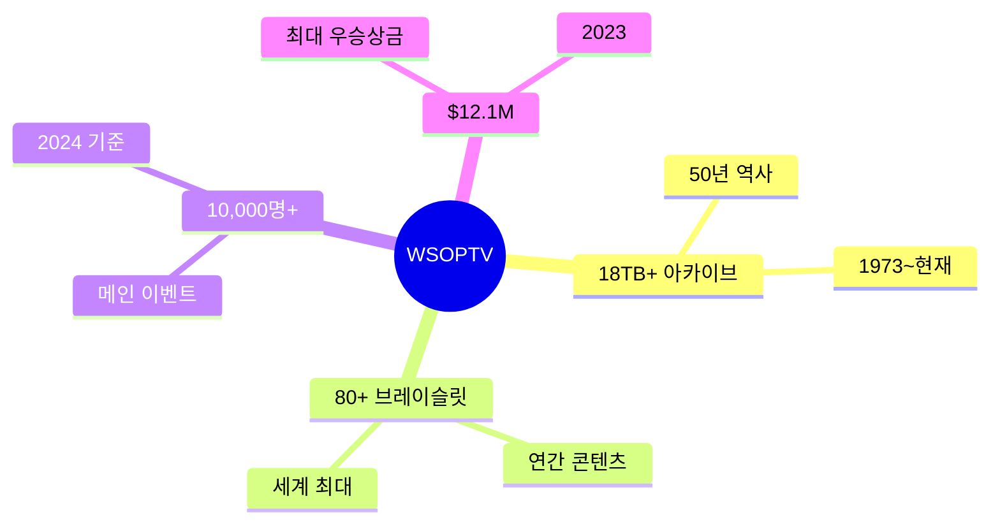

---

## 1. 왜 WSOP인가: 포커의 최고봉

### 브레이슬릿의 무게

> *"WSOP 브레이슬릿은 포커의 올림픽 금메달이다."*

1976년 Benny Binion이 도입한 **WSOP 금 브레이슬릿**은 단순한 상이 아닙니다. 이것은 포커 플레이어가 평생을 바쳐 추구하는 **궁극의 증명**입니다.

포커 커뮤니티에서 플레이어의 위상은 명확하게 구분됩니다—**브레이슬릿 보유자와 미보유자**. Phil Hellmuth가 17개의 브레이슬릿을 향한 여정을 시작한 이후, 이 황금 팔찌는 포커 위대함을 측정하는 객관적 기준이 되었습니다.

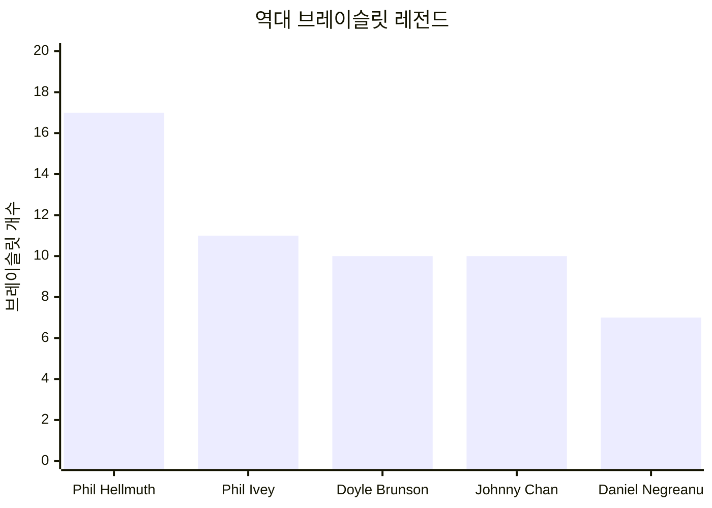

| 플레이어 | 브레이슬릿 | 특징 |
|----------|:---------:|------|
| **Phil Hellmuth** | 17 | "Poker Brat" - 5개 decade 우승, 최다 브레이슬릿 |
| **Phil Ivey** | 11 | "포커의 Tiger Woods" - 14년간 10개 달성 역대 최빠름 |
| **Daniel Negreanu** | 7 | "Kid Poker" - WSOP 올타임 머니 리더 ($23.6M) |
| **Doyle Brunson** | 10 | 포커의 대부, 메인 이벤트 2회 연속 우승 |
| **Johnny Chan** | 10 | 영화 *Rounders*의 실제 주인공 |

### Moneymaker Effect: 포커 산업의 혁명

2003년, 테네시주의 평범한 회계사 **Chris Moneymaker**가 포커 역사를 바꿨습니다.

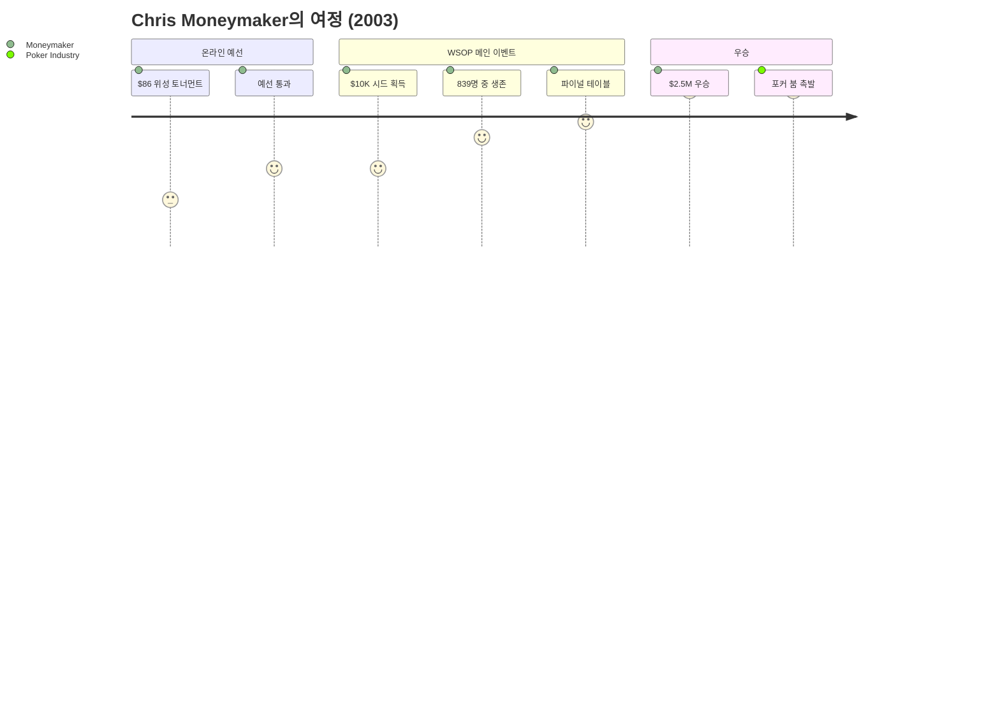

이 하나의 이야기가 **포커 붐(Poker Boom)**을 촉발했습니다:

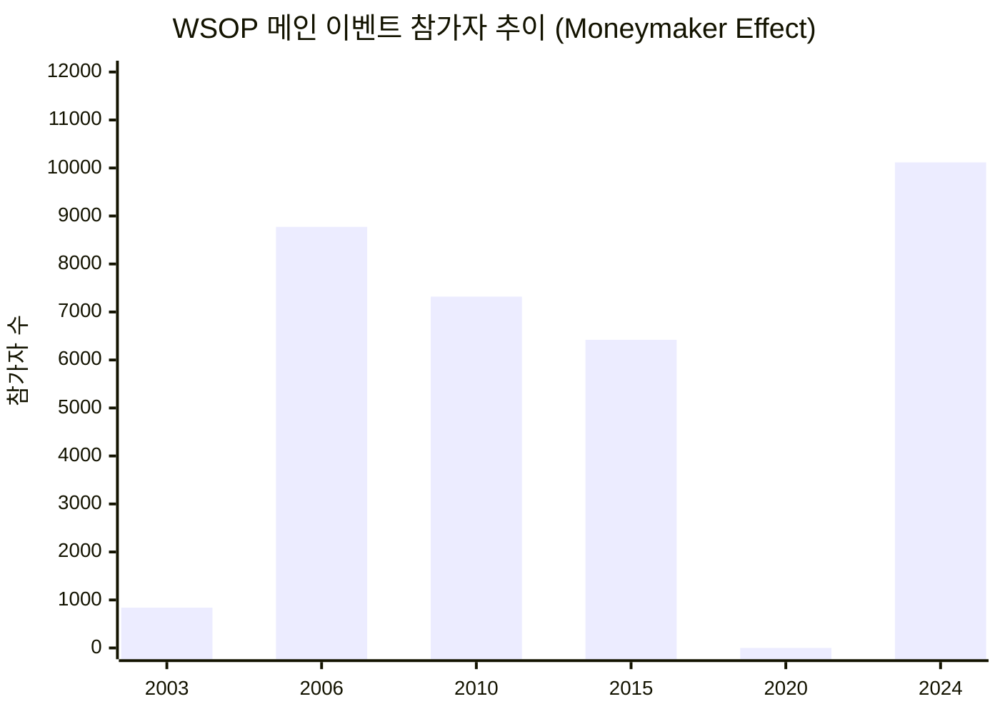

- WSOP 참가자: 839명(2003) → 10,117명(2024) — **12배 성장**
- 온라인 포커 플랫폼 폭발적 성장
- ESPN 홀카드 카메라 도입으로 시청 경험 혁신
- 일반인의 "나도 할 수 있다" 인식 확산

> *"평범한 이름이 전설이 된 유일무이한 사례. 브레이슬릿 개수는 적지만, Moneymaker는 역대 가장 영향력 있는 포커 플레이어다."*

WSOPTV에서는 이 역사적 순간의 모든 핸드를 다시 볼 수 있습니다.

---

## 2. 콘텐츠 왕국: 무엇이 있는가

### 콘텐츠 구성

WSOPTV 콘텐츠의 **80%는 WSOP Las Vegas**에서 생산됩니다. 매년 5월부터 7월까지, 50일간 벌어지는 포커의 축제가 우리의 핵심 자산입니다.

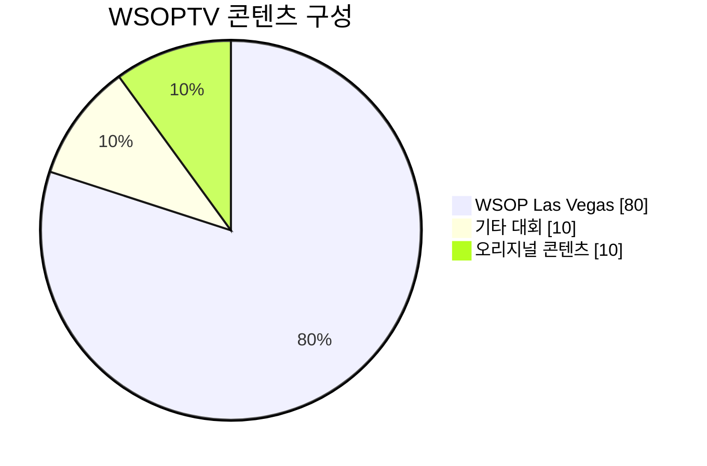

### WSOP Las Vegas 상세

매년 5-7월, 라스베이거스에서 **80개 이상의 브레이슬릿 이벤트**가 펼쳐집니다.

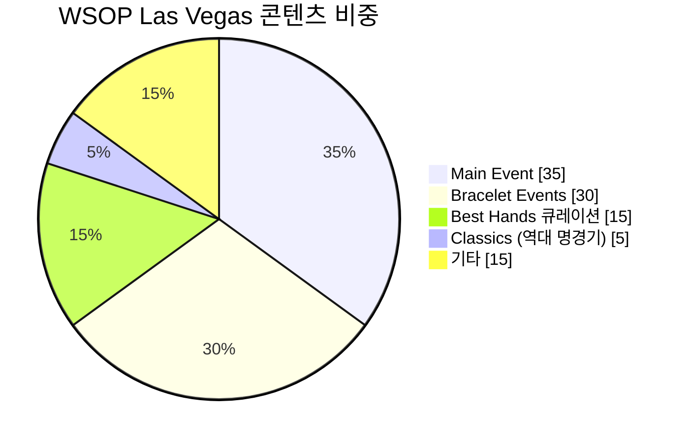

**Main Event (35%)**

$10,000 No-Limit Hold'em Championship—포커의 꿈이 현실이 되는 무대.

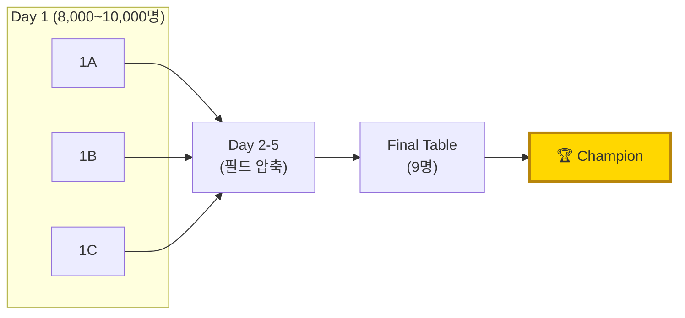

메인 이벤트는 단순한 토너먼트가 아닙니다. 10,000명의 플레이어가 각자의 꿈을 걸고, 10일간의 심리전과 기술 전쟁을 벌이는 **인간 드라마**입니다.

**Bracelet Events (30%)**

80개 이상의 독립 챔피언십. 각 이벤트는 해당 분야의 세계 최강자를 가립니다.

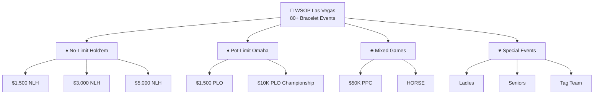

**Best Hands 큐레이션 (15%)**

포커의 가장 순수한 순간들만 정제한 하이라이트 컬렉션.

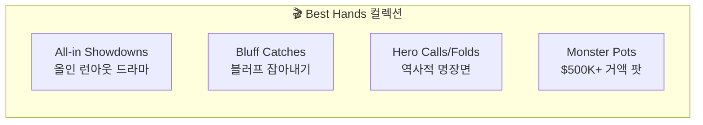

### 기타 대회 (10%)

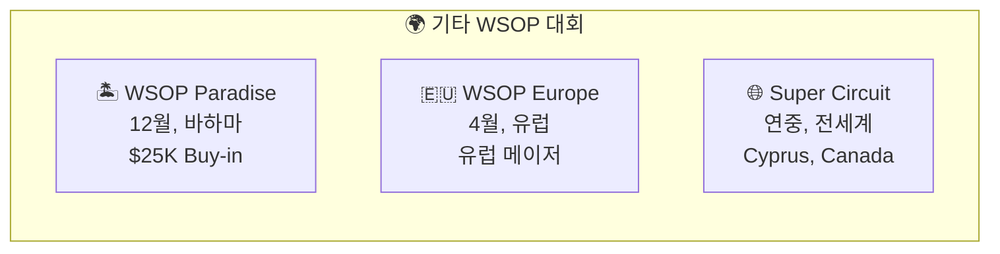

### 오리지널 콘텐츠 (10%)

| 프로그램 | 설명 |
|----------|------|
| **Game of Gold** | 포커 리얼리티 쇼 |
| **Player Story** | 레전드 플레이어 다큐멘터리 |

---

## 3. 차별화 전략: YouTube vs WSOPTV

### 투트랙 전략

**YouTube는 미끼, WSOPTV는 풀코스.**

```mermaid
flowchart LR
    subgraph YT["📺 YouTube (무료)"]
        direction TB
        Y1["🔴 생방송"]
        Y2["📱 쇼츠/클립"]
        Y3["🎯 관심 유도"]
    end

    subgraph WS["🎬 WSOPTV (구독)"]
        direction TB
        W1["📺 풀 에피소드"]
        W2["⏭️ Hand Skip"]
        W3["🏆 Best Hands"]
        W4["📀 4K Remaster"]
    end

    YT -->|"전환"| WS

    style WS fill:#1a1a2e,stroke:#ffd700,stroke-width:2px
    style YT fill:#ff0000,stroke:#cc0000,stroke-width:2px
```

| 기능 | YouTube (무료) | WSOPTV (구독) |
|------|:--------------:|:--------------:|
| **생방송** | O | O |
| **쇼츠/클립** | O | - |
| **풀 에피소드** | - | O |
| **Hand Skip** | - | O |
| **Best Hands** | - | O |
| **4K Remaster** | - | O |

YouTube는 포커의 매력을 경험하는 입구입니다. 생방송과 쇼츠로 관심을 끌고, 깊이 있는 경험을 원하는 시청자를 WSOPTV로 전환합니다.

### WSOPTV 독점 기능

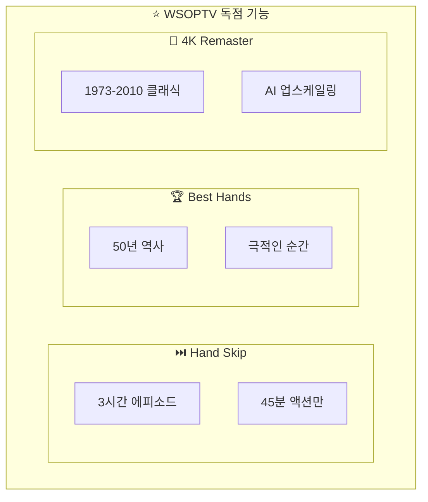

**Hand Skip**

포커 시청의 혁명. 지루한 폴드와 스몰팟을 건너뛰고, **핵심 핸드만** 연속으로 시청할 수 있습니다. 3시간짜리 에피소드를 45분 만에 액션만 몰아보세요.

**Best Hands 컬렉션**

50년 역사에서 엄선한 가장 극적인 순간들. 선정 기준:

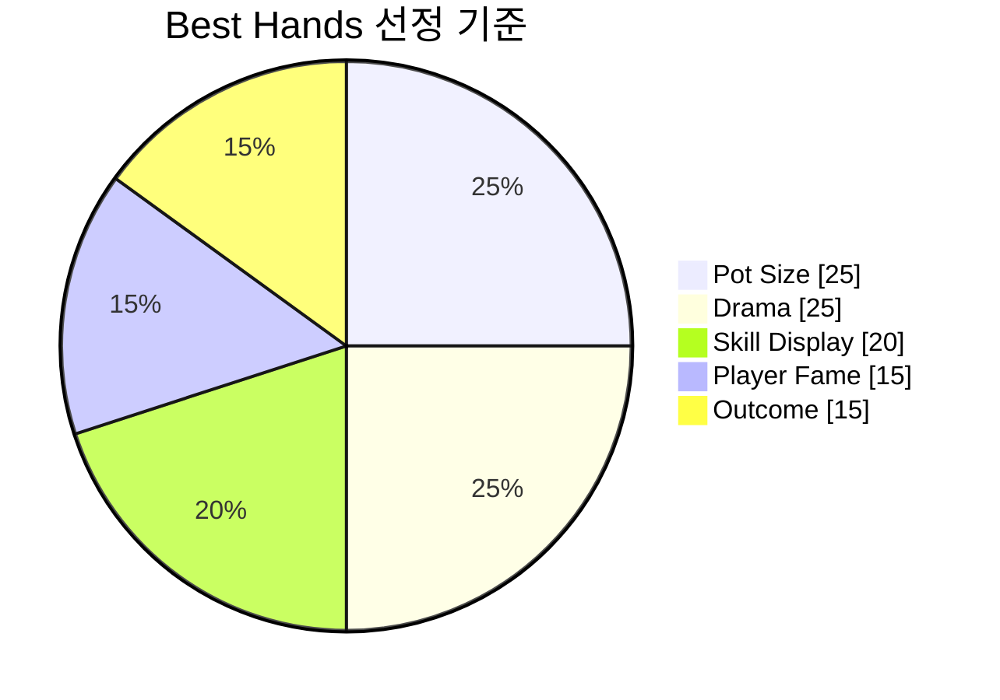

**4K Remaster**

1973년부터 2010년까지의 클래식 영상을 AI 업스케일링으로 복원. "4K로 다시 보는 Moneymaker 우승"—포커 역사를 현대 화질로 재경험하세요.

---

## 4. 콘텐츠 캘린더

### 연간 흐름

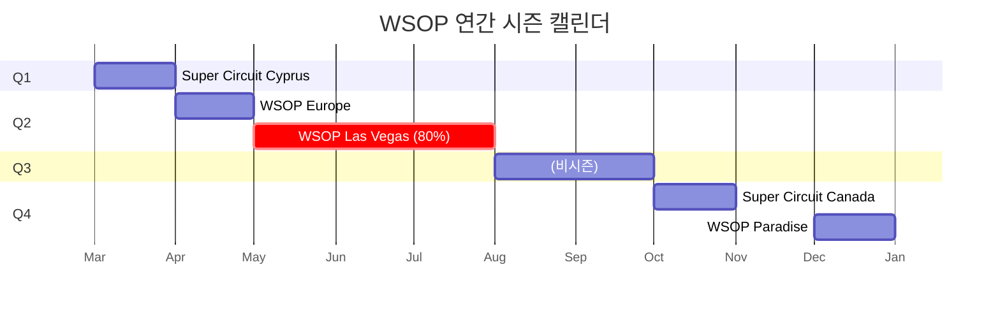

| 시기 | 이벤트 | 콘텐츠 비중 |
|------|--------|:-----------:|
| **5~7월** | **WSOP Las Vegas** | **80%** |
| 3월 | Super Circuit Cyprus | 5% |
| 4월 | WSOP Europe | 5% |
| 10월 | Super Circuit Canada | 5% |
| 12월 | WSOP Paradise | 5% |

### 확장 계획 (2026~)

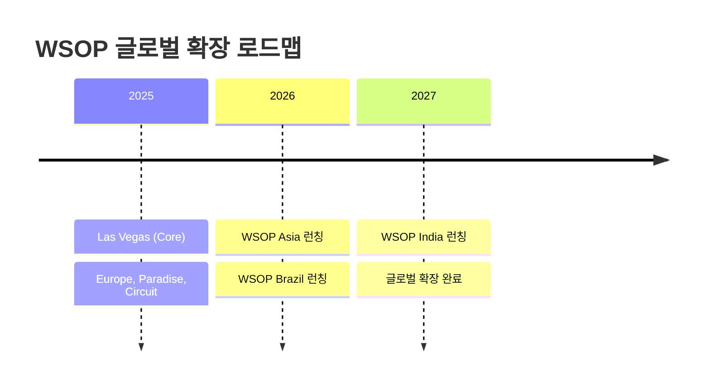

---

## 5. 진화 로드맵

### 4단계 진화

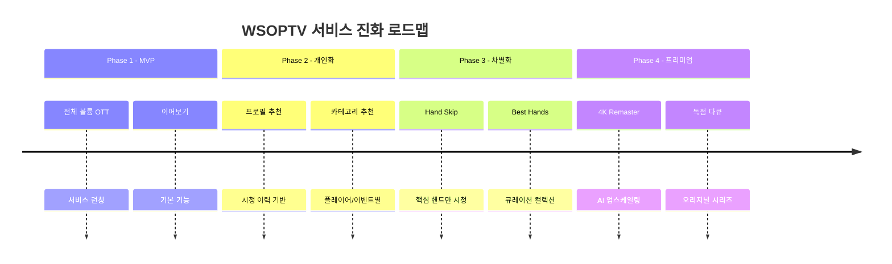

### Feature Matrix

```mermaid
quadrantChart
    title 기능별 Phase 도입 시점
    x-axis 초기 도입 --> 후기 도입
    y-axis 기본 기능 --> 프리미엄 기능
    quadrant-1 Phase 4 (프리미엄)
    quadrant-2 Phase 3 (차별화)
    quadrant-3 Phase 1 (MVP)
    quadrant-4 Phase 2 (개인화)
    "전체 볼륨 OTT": [0.1, 0.2]
    "이어보기": [0.2, 0.3]
    "프로필 추천": [0.4, 0.4]
    "카테고리 추천": [0.5, 0.5]
    "Hand Skip": [0.6, 0.7]
    "Best Hands": [0.7, 0.75]
    "4K Remaster": [0.9, 0.9]
```

| 기능 | P1 | P2 | P3 | P4 |
|------|:--:|:--:|:--:|:--:|
| 전체 볼륨 OTT | O | O | O | O |
| 이어보기 | O | O | O | O |
| 프로필 추천 | - | O | O | O |
| Hand Skip | - | - | O | O |
| Best Hands | - | - | O | O |
| 4K Remaster | - | - | - | O |

---

## 6. 아카이브 시대 구분

50년의 포커 역사는 네 개의 시대로 나뉩니다.

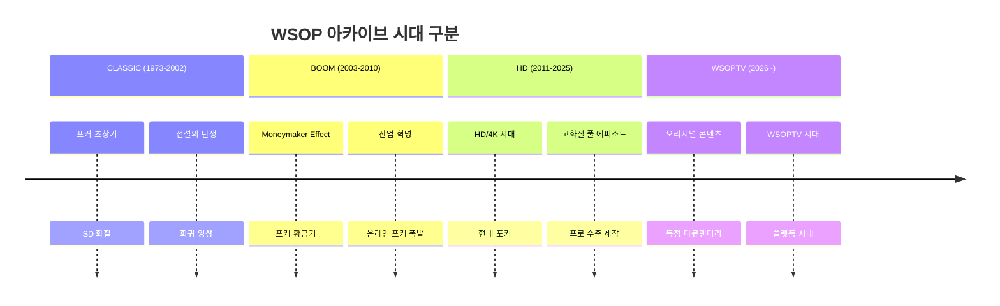

| Era | 연도 | 특징 | 콘텐츠 가치 |
|-----|------|------|-------------|
| **CLASSIC** | 1973-2002 | 포커 초창기, SD 화질 | 희귀 영상, 전설의 탄생 |
| **BOOM** | 2003-2010 | Moneymaker 이후 급성장 | 포커 황금기, 산업 혁명기 |
| **HD** | 2011-2025 | HD/4K 시대, 현대 포커 | 고화질 풀 에피소드 |
| **WSOPTV** | 2026~ | WSOPTV 오리지널 | 독점 콘텐츠, 다큐멘터리 |

WSOPTV는 이 모든 시대를 아우르는 **유일한 통합 아카이브**입니다.

---

## 부록: 기술 참조

### A. 에피소드 메타데이터

> **Data Source**: [Google Sheets - NAS Asset Management](https://docs.google.com/spreadsheets/d/1h27Ha7pR-iYK_Gik8F4FfSvsk4s89sxk49CsU3XP_m4)

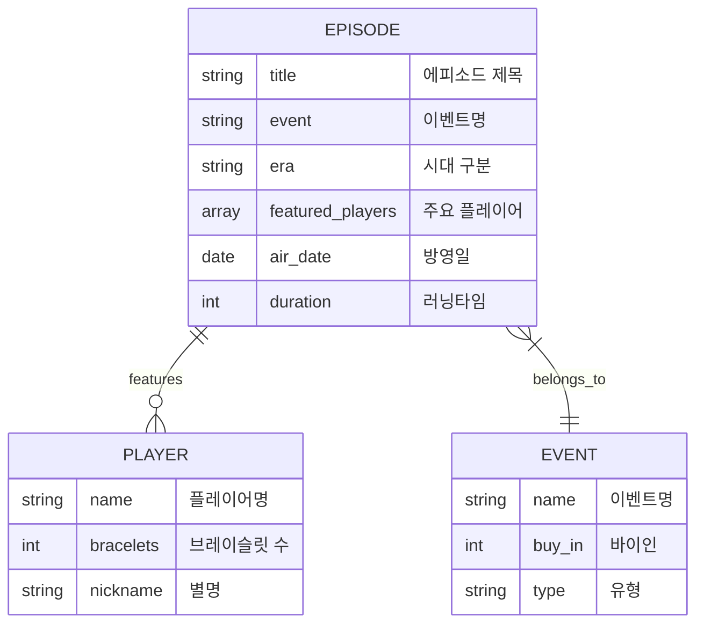

### B. 검색 최적화

| 입력 | 제안 |
|------|------|
| `dan` | Daniel Negreanu, Daniel Negreanu Best Hands |
| `phil` | Phil Hellmuth, Phil Ivey, Phil Ivey Highlights |
| `main 2024` | WSOP 2024 Main Event, Main Event Final Table |
| `bracelet` | Bracelet Events, $50K PPC, HORSE |

### C. 플레이어 프로파일

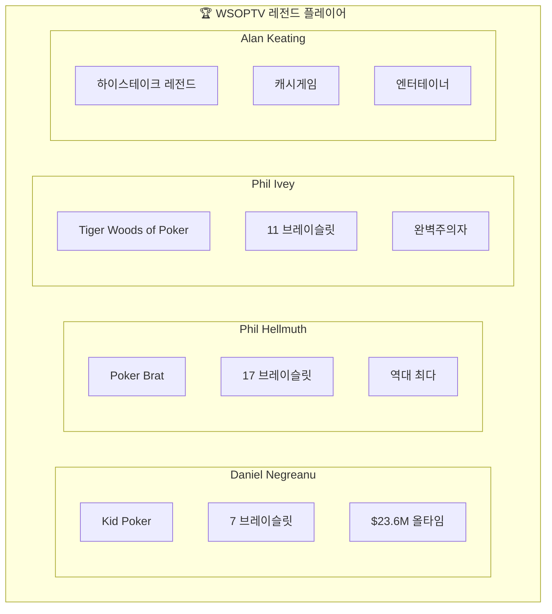

---

*이전: [02-user-experience.md](./02-user-experience.md) | 메인: [README.md](./README.md)*
