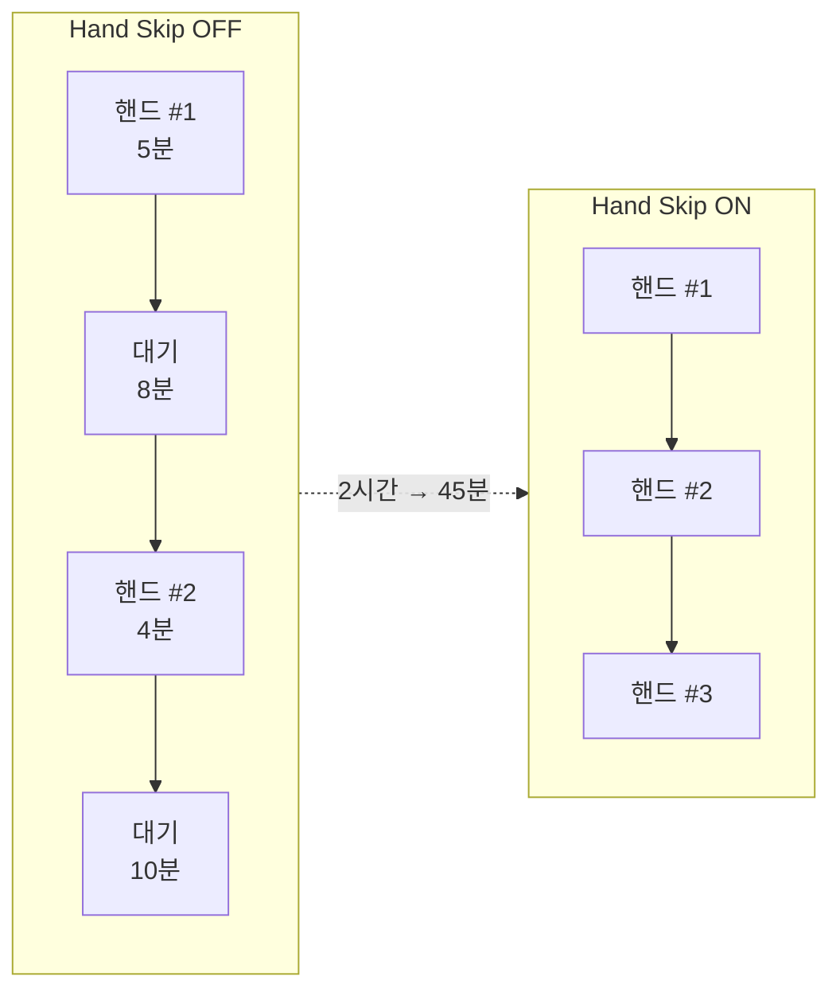
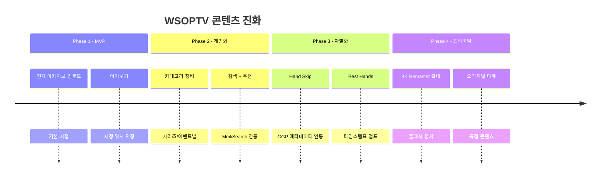
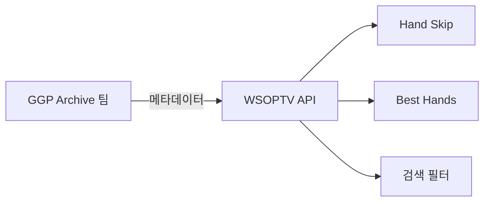

# WSOPTV 콘텐츠 전략

**Version**: 5.0.0 | **Parent**: [00-master.md](./00-master.md)

---

## Executive Summary

WSOPTV는 **1973년부터 현재까지의 WSOP 아카이브**를 기반으로 포커 팬 대상 OTT 서비스를 제공합니다.

**투트랙 전략**으로 수익을 극대화합니다:
- **YouTube**: 무료 콘텐츠로 신규 팬 유입
- **WSOPTV**: 유료 구독으로 열성 팬 전환


---

## 1. 투트랙 수익화 전략

### 1.1 채널별 역할

| 채널 | 역할 | 목표 |
|------|------|------|
| **YouTube** | 유입 게이트웨이 | 포커 관심층 확보, WSOPTV 인지도 |
| **WSOPTV** | 수익 엔진 | 구독 전환, 리텐션 |

### 1.2 콘텐츠 배분 원칙

| 콘텐츠 유형 | YouTube | WSOPTV | 배분 의도 |
|-------------|:-------:|:------:|-----------|
| **풀 에피소드** | X | O | 유료 전환 핵심 콘텐츠 |
| **쇼츠 (60초)** | O | X | 바이럴, 신규 유입 |
| **하이라이트 (5-10분)** | O | X | 관심 유발 |
| **Best Hands 클립** | 일부 (티저) | 전체 | 맛보기 → 전환 유도 |
| **생방송** | O | O | 동시 송출 |
| **4K Remaster** | 프로모션만 | 전체 | 프리미엄 독점 |

### 1.3 전환 퍼널


| 단계 | 트리거 | 액션 | KPI |
|------|--------|------|-----|
| 인지 | YouTube 알고리즘 | 쇼츠/클립 시청 | 조회수 |
| 관심 | "풀 영상 보기" CTA | WSOPTV 랜딩 클릭 | CTR |
| 결정 | 30초 미리보기 | Paywall 노출 | 미리보기 완료율 |
| 전환 | 구독 버튼 클릭 | 결제 완료 | 전환율 |

---

## 2. Era별 콘텐츠 구성

> WSOP 아카이브는 **3개의 Era**로 구분되며, 각 시대별 특징과 대표 콘텐츠가 다릅니다.

### 2.1 CLASSIC Era (1973-2002)

| 구분 | 내용 |
|------|------|
| **특징** | WSOP 초창기, SD 화질, 희귀 영상 |
| **화질** | 480p SD → 4K Remaster 우선 대상 |

**시대별 대표 콘텐츠**

| 기간 | 주요 우승자 | 특징 |
|------|------------|------|
| **1973-1982** | Doyle Brunson (76-77 연속 우승), Stu Ungar (80-81) | 전설의 시작, 텍사스 로드갬블러 시대 |
| **1983-1995** | Johnny Chan (87-88 연속 우승), Phil Hellmuth (89) | 아시아계 선수 부상, 최연소 챔피언 |
| **1996-2002** | Scotty Nguyen (98), Chris Ferguson (00), Carlos Mortensen (01) | TV 중계 시작, 인터넷 포커 태동 |

### 2.2 BOOM Era (2003-2010)

| 구분 | 내용 |
|------|------|
| **특징** | Moneymaker 효과, 포커 황금기, 참가자 폭증 |
| **화질** | 720p HD |

**시대별 대표 콘텐츠**

| 연도 | 우승자 | 의의 |
|------|--------|------|
| **2003** | Chris Moneymaker | **역사적 전환점** - 온라인 새틀라이트로 $2.5M 우승, 포커 붐 촉발 |
| **2004** | Greg Raymer | Moneymaker 효과로 참가자 3배 증가 |
| **2005** | Joe Hachem | 호주 출신, 글로벌 확장 |
| **2006** | Jamie Gold | 역대 최다 참가자 (8,773명), $12M 상금 |
| **2007** | Jerry Yang | 아메리칸 드림 스토리 |
| **2008** | Peter Eastgate | 최연소 챔피언 (22세) |
| **2009** | Joe Cada | Eastgate 기록 경신 (21세) |
| **2010** | Jonathan Duhamel | 캐나다 첫 챔피언 |

### 2.3 HD Era (2011-2025)

| 구분 | 내용 |
|------|------|
| **특징** | HD/4K 화질, 현대 포커, 글로벌 이벤트 확장 |
| **화질** | 1080p FHD → 4K UHD |

**시대별 대표 콘텐츠**

| 기간 | 주요 우승자 | 특징 |
|------|------------|------|
| **2011-2015** | Pius Heinz, Greg Merson, Ryan Riess, Martin Jacobson, Joe McKeehen | 유럽/미국 경쟁, 전략적 플레이 고도화 |
| **2016-2020** | Qui Nguyen, Scott Blumstein, John Cynn, Hossein Ensan, Damian Salas | 아마추어 챔피언 부활, 코로나 온라인 전환 |
| **2021-2025** | Koray Aldemir, Espen Jorstad, Daniel Weinman, Jonathan Tamayo | 포스트 코로나, 라이브 이벤트 복귀 |

---

## 3. 콘텐츠 분류 체계

> **Data Source**: [NAS Asset Management (Google Sheets)](https://docs.google.com/spreadsheets/d/1h27Ha7pR-iYK_Gik8F4FfSvsk4s89sxk49CsU3XP_m4)

### 3.1 Event Type

| 코드 | 설명 |
|------|------|
| **ME** | Main Event - WSOP 메인 토너먼트 ($10,000 바이인) |
| **BR** | Bracelet Events - 브레이슬릿 이벤트 (다양한 바이인) |
| **GOG** | Game of Gold - GGPoker 협업 리얼리티 시리즈 |
| **TOC** | Tournament of Champions - 챔피언스 토너먼트 |
| **MXF** | Masters - 마스터즈 시리즈 |
| **COVERAGE** | 방송 커버리지 - 라이브 중계 편집본 |
| **BEST** | Best Hands - 베스트 핸드 모음 |

### 3.2 Region

| 코드 | 설명 |
|------|------|
| **LV** | Las Vegas - 본고장 라스베가스 (연중 5-7월) |
| **EU** | Europe - 유럽 투어 (로젠탈, 프라하 등) |
| **APAC** | Asia Pacific - 아시아 투어 |
| **CYPRUS** | Cyprus - 사이프러스 파라다이스 (연말) |
| **CIRCUIT** | Super Circuit - 글로벌 순회 투어 |

### 3.3 메타데이터 스키마

**Master_Catalog 컬럼**

| 필드 | 설명 | 예시 |
|------|------|------|
| `Entry Key` | 고유 식별자 | `WSOP_2024_ME_D5` |
| `Category` | 카테고리 | `WSOP 2024 Main Event` |
| `Title` | 에피소드 제목 | `Main Event Day 5` |
| `Event Type` | 이벤트 유형 | `ME`, `BR`, `GOG` |
| `Region` | 지역 | `LV`, `EU`, `APAC` |
| `Day` | 방송일차 | `D1`, `D2`, `FT` |
| `Part` | 파트 | `P1`, `P2` |

**Category 명명 규칙**

```
WSOP {YEAR} Main Event
WSOP {YEAR} Bracelet Events
WSOP Europe {YEAR} - Main Event
WSOP Europe {YEAR} - Bracelet Events
Game of Gold {YEAR}
```

**핸드 메타데이터 (GGP Archive 제공)**

> **외부 의존성**: 핸드 타임스탬프와 Best Hands 선정은 **GGP Archive 팀**에서 제공합니다.

| 필드 | 설명 |
|------|------|
| `start_time` | 핸드 시작 타임스탬프 |
| `end_time` | 핸드 종료 타임스탬프 |
| `is_best` | Best Hand 여부 |
| `hand_type` | all_in, bluff, hero_call 등 |
| `players` | 참여 플레이어 목록 |
| `pot_size` | 팟 규모 |

---

## 4. 콘텐츠 캘린더

### 4.1 연간 흐름


| 시기 | 이벤트 | 운영 전략 |
|------|--------|-----------|
| **5-7월** | WSOP Las Vegas | 신규 에피소드 집중 업로드 |
| 3월 | Super Circuit | 글로벌 확장 콘텐츠 |
| 4월 | WSOP Europe | 유럽 시장 타겟 |
| 10월 | Super Circuit | 글로벌 순회 |
| 12월 | WSOP Paradise | 연말 프리미엄 |

### 4.2 비시즌 운영

| 비시즌 | 콘텐츠 전략 |
|--------|-------------|
| **8-9월** | 4K Remaster 신규 릴리스, 시즌 하이라이트 |
| **1-2월** | 클래식 시리즈 재조명, Best Hands 연간 베스트 |
| **10-11월** | 다음 시즌 프리뷰, 플레이어 프로파일 |

---

## 5. 차별화 기능 연동

### 5.1 Hand Skip

> 핸드와 핸드 사이 대기 시간을 자동 건너뛰어 **액션만 시청**



| 항목 | 내용 |
|------|------|
| 대상 | 모든 풀 에피소드 |
| 의존성 | GGP Archive 핸드 타임스탬프 |
| 효과 | 평균 63% 시청 시간 단축 |

### 5.2 Best Hands

> 풀 에피소드 내에서 **베스트 핸드 구간만 점프 재생**

| 카테고리 | 설명 |
|----------|------|
| **All-in Showdowns** | 올인 후 런아웃 대결 |
| **Bluff Catches** | 블러프 잡아낸 명콜 |
| **Hero Calls** | 용감한 콜로 승리 |
| **Hero Folds** | 큰 핸드 폴드한 명판단 |
| **Bad Beats** | 역전당한 불운의 핸드 |
| **Monster Pots** | $500K+ 거액 팟 |

| 항목 | 내용 |
|------|------|
| 대상 | 모든 풀 에피소드 |
| 의존성 | GGP Archive 베스트 핸드 선정 |
| 효과 | 10시간 → 45분 (Best만 시청) |

### 5.3 4K Remaster

> 2003-2015 클래식 영상을 **AI 업스케일링으로 4K 화질 복원**

| 대상 Era | 원본 화질 | 리마스터 |
|----------|----------|----------|
| CLASSIC (1973-2002) | 480p SD | 4K UHD |
| BOOM (2003-2010) | 720p HD | 4K UHD |
| HD 초기 (2011-2015) | 1080p FHD | 4K UHD |

**마케팅 활용**
- Before/After 프로모션: YouTube 티저 → WSOPTV 전환
- "4K로 다시 보는 Moneymaker 우승" 캠페인

---

## 6. 진화 로드맵



| Phase | 콘텐츠 | 기능 | KPI |
|:-----:|--------|------|-----|
| **P1** | 전체 아카이브 | 이어보기 | MAU, 시청 시간 |
| **P2** | 카테고리 정비 | 검색, 추천 | 검색 사용률, CTR |
| **P3** | GGP 메타데이터 연동 | Hand Skip, Best Hands | 기능 사용률, 리텐션 |
| **P4** | 4K Remaster 확대 | 프리미엄 티어 | ARPU, LTV |

---

## 부록: GGP Archive 의존성

> Hand Skip과 Best Hands는 GGP Archive 팀의 메타데이터에 의존합니다.



| 의존 항목 | 제공 팀 | WSOPTV 활용 |
|----------|---------|-------------|
| 핸드 타임스탬프 | GGP Archive | Hand Skip 자동 건너뛰기 |
| 베스트 핸드 선정 | GGP Archive | Best Hands 타임스탬프 점프 |
| 핸드 카테고리 | GGP Archive | 검색 필터링 |
| 플레이어 정보 | GGP Archive | 플레이어별 검색 |

---

*이전: [02-user-experience.md](./02-user-experience.md) | 메인: [README.md](./README.md)*
