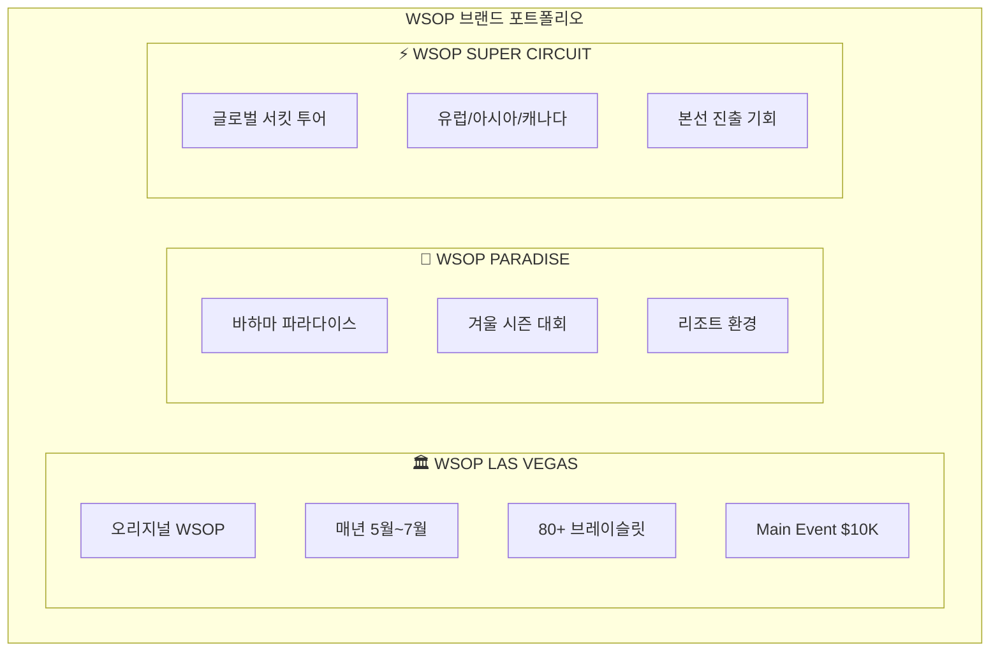
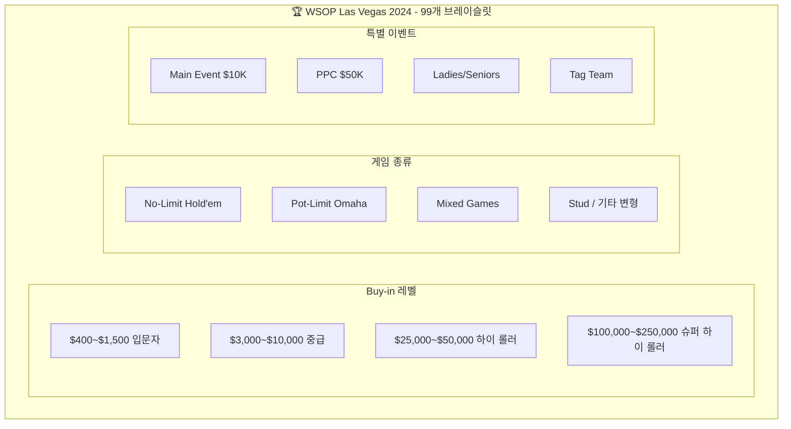
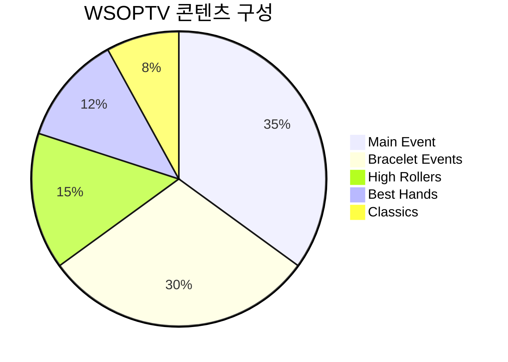
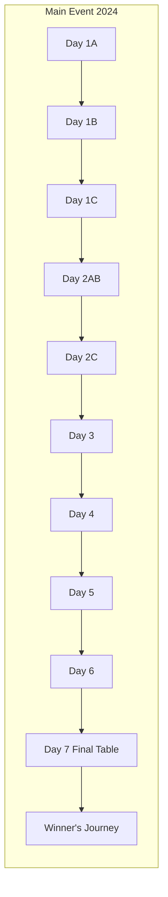
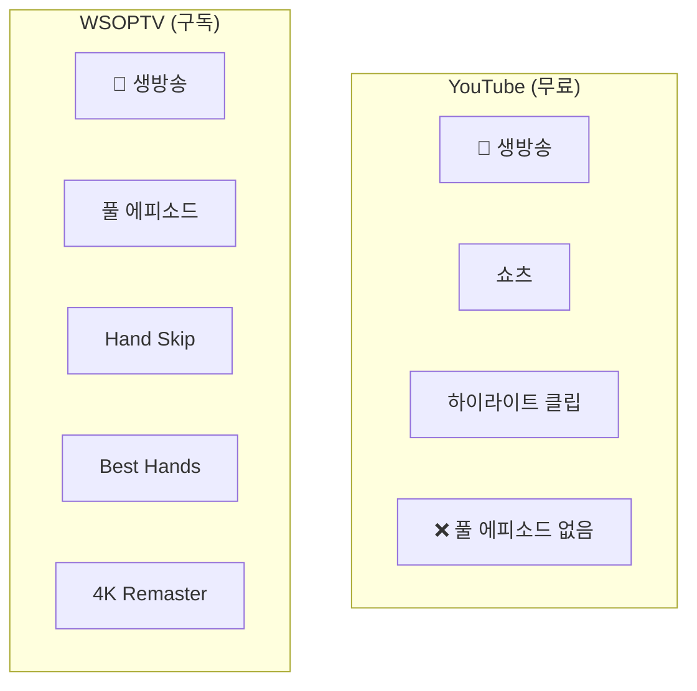
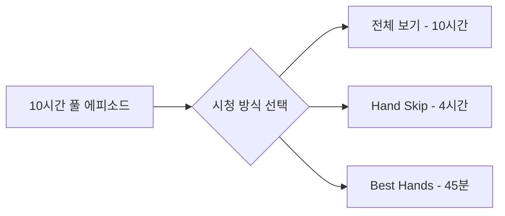
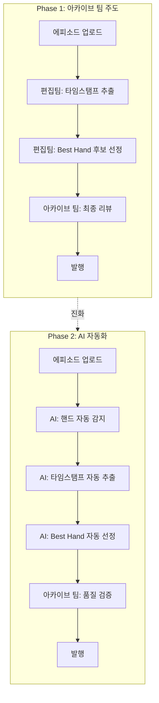
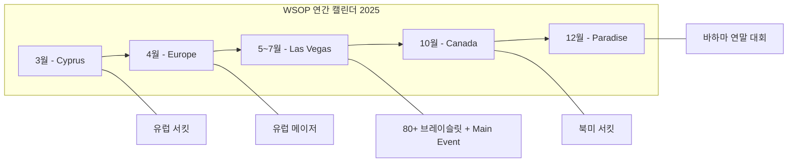
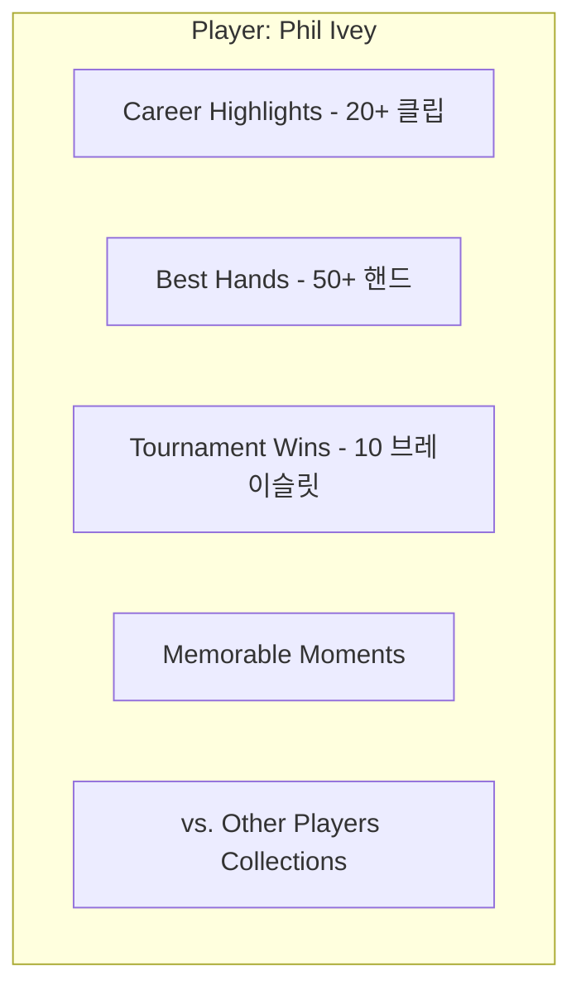
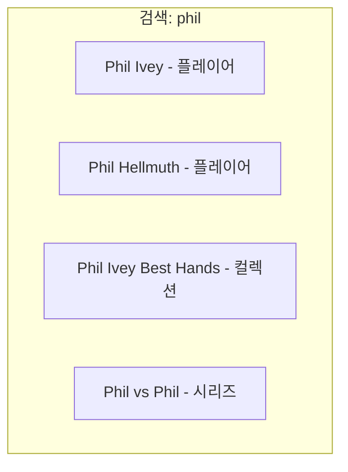

# WSOPTV - 콘텐츠 전략

**Version**: 1.0.0 | **Parent**: [README.md](./README.md)

---

## 1. 콘텐츠 개요

### 1.1 WSOP (World Series of Poker)

**세계 최대 포커 토너먼트 시리즈 - 1973년부터 50년+ 헤리티지**

| 항목 | 내용 |
|------|------|
| **설립** | 1973년 (50년+ 역사) |
| **메인 이벤트** | $10,000 No-Limit Hold'em Championship |
| **우승 상금** | $10M+ (2024 기준) |
| **글로벌 확장** | 라스베가스 → 글로벌 브랜드 |

### 1.2 WSOP 브랜드 라인업

WSOPTV는 다양한 WSOP 브랜드의 콘텐츠를 제공합니다:



| 브랜드 | 개최지 | 시기 | 특징 |
|--------|--------|------|------|
| **WSOP Las Vegas** | 라스베가스 | 5월~7월 | 오리지널, 최대 규모 |
| **WSOP Paradise** | 바하마 | 12월 | 리조트 환경 |
| **WSOP Europe** | 유럽 | 4월 | 유럽 메이저 |
| **WSOP Super Circuit** | 전세계 | 연중 | 글로벌 순회 (Cyprus, Canada 등) |

### 1.3 브레이슬릿 이벤트의 다양성

> **하나의 대회 = 수십 개의 브레이슬릿 이벤트**

WSOP 대회는 단일 토너먼트가 아닌, **수십 개의 다양한 브레이슬릿 이벤트**로 구성되어 풍성한 볼거리를 제공합니다.



### 1.4 콘텐츠 유형



---

## 2. 콘텐츠 카테고리

### 2.1 Main Event (메인 이벤트)

**WSOP의 꽃 - $10K No-Limit Hold'em Championship**

| 특징 | 내용 |
|------|------|
| **참가비** | $10,000 |
| **참가자** | 8,000~10,000명 |
| **기간** | 10일+ |
| **방송** | Day별 풀 에피소드 |
| **콘텐츠** | Day 1A부터 Final Table까지 |

**에피소드 구성:**



### 2.2 Bracelet Events (브레이슬릿 이벤트)

**다양한 포커 변형 게임 토너먼트**

| 이벤트 유형 | 예시 |
|-------------|------|
| **No-Limit Hold'em** | $1,500 NLH, $3,000 NLH |
| **Pot-Limit Omaha** | $10,000 PLO Championship |
| **Mixed Games** | $50,000 Poker Players Championship |
| **High Rollers** | $100,000 High Roller |
| **Ladies/Seniors** | $1,000 Ladies Championship |

### 2.3 High Rollers (하이 롤러)

**고액 토너먼트 - 최고의 프로들의 대결**

| 이벤트 | 참가비 | 특징 |
|--------|--------|------|
| $100,000 High Roller | $100K | 최정상급 프로 |
| $250,000 Super High Roller | $250K | 엘리트 필드 |
| $1,000,000 Big One | $1M | 역대 최고 상금 |

### 2.4 Best Hands (베스트 핸드)

**큐레이션 콘텐츠 - 핵심만 모아보기**

| 카테고리 | 설명 | 콘텐츠 수 |
|----------|------|----------|
| **Weekly Top 10** | 이번 주 베스트 핸드 | 매주 1개 |
| **Category Best** | 카테고리별 베스트 | 카테고리당 50+ |
| **Player Highlights** | 플레이어별 명장면 | 플레이어당 20+ |
| **All-Time Classics** | 역대 명승부 | 100+ |

### 2.5 Classics (클래식)

**역대 명경기 아카이브 (5년+ 이전)**

| 시즌 | 대표 경기 |
|------|-----------|
| **2003** | Chris Moneymaker - 포커 붐의 시작 |
| **2006** | Jamie Gold - $12M 우승 |
| **2008** | Peter Eastgate - 최연소 우승 |
| **2011** | Pius Heinz - 첫 독일인 우승 |
| **2019** | Hossein Ensan - $10M 우승 |

---

## 3. 투트랙 전략: YouTube vs WSOPTV

### 3.1 공통: 생방송 스트리밍

| 채널 | 생방송 | 비고 |
|------|:------:|------|
| **YouTube** | ✅ | 무료 시청 (광고 포함) |
| **WSOPTV** | ✅ | 구독자 전용 |

> 생방송 스트리밍은 **YouTube와 WSOPTV 모두**에서 제공합니다.

### 3.2 YouTube vs WSOPTV 역할 분담



| 구분 | YouTube | WSOPTV |
|------|---------|--------|
| **🔴 생방송** | ✅ (무료) | ✅ (구독) |
| **쇼츠/클립** | ✅ | ❌ |
| **풀 에피소드** | ❌ | ✅ |
| **Hand Skip** | ❌ | ✅ |
| **Best Hands** | ❌ | ✅ |
| **4K Remaster** | ❌ | ✅ |

**WSOPTV는 쇼츠/하이라이트 클립을 제공하지 않습니다.**
- 쇼츠/하이라이트는 YouTube에서 이미 무료 제공
- WSOPTV는 **풀 에피소드**만 제공
- 단, 풀 에피소드의 **액기스(핵심)만 볼 수 있는 특별 기능** 제공

### 3.3 WSOPTV 핵심 차별점

> **WSOPTV는 풀 에피소드를 어떻게 볼 것인지 선택권을 제공합니다.**



- **전체 보기**: 원본 그대로 시청
- **Hand Skip**: 핸드 사이 대기 시간 자동 스킵 → 실 액션만 시청
- **Best Hands**: 베스트 핸드 타임스탬프만 순차 점프 시청

> YouTube에서는 제공할 수 없는 차별화된 가치

### 3.4 WSOPTV 콘텐츠 범위

> **WSOPTV는 구독 전용 서비스입니다.** 모든 콘텐츠는 구독자에게 제공됩니다.

| 콘텐츠 연도 | 포함 여부 | 비고 |
|-------------|:--------:|------|
| 2024~2025 (최신) | ✅ | 메인 콘텐츠 |
| 2020~2023 | ✅ | 최근 아카이브 |
| 2010~2019 | ✅ | 클래식 아카이브 |
| 2003~2009 | ✅ | 레거시 (4K Remaster) |

### 3.5 WSOPTV 구독 기능

> **WSOPTV 구독 ($9.99/월)** 시 모든 기능 이용 가능

| 기능 | 설명 |
|------|------|
| **풀 에피소드** | 모든 시즌 풀 영상 |
| **Hand Skip** | 대기 시간 자동 건너뛰기 |
| **Best Hands** | 베스트 핸드 타임스탬프 점프 |
| **4K Remaster** | 레거시 영상 AI 업스케일링 |
| **이어보기** | 중단 지점 동기화 |
| **광고 없음** | 끊김 없는 시청 |

---

## 4. Best Hands 큐레이션

### 4.1 선정 기준

**Best Hand 선정 요소:**

| 요소 | 가중치 | 설명 |
|------|:------:|------|
| **Pot Size** | 25% | 팟 규모 |
| **Drama** | 25% | 드라마틱한 전개 |
| **Skill Display** | 20% | 기술적 플레이 |
| **Player Fame** | 15% | 유명 플레이어 참여 |
| **Outcome** | 15% | 결과의 의외성 |

### 4.2 카테고리별 기준

| 카테고리 | 선정 기준 |
|----------|----------|
| **All-in Showdowns** | 올인 후 런아웃 드라마 |
| **Bluff Catches** | 정확한 리드 + 용기 있는 콜 |
| **Hero Calls** | 약한 핸드로 블러프 캐치 |
| **Hero Folds** | 강한 핸드를 정확히 폴드 |
| **Big Bluffs** | 대담한 블러프 성공 |
| **Bad Beats** | 극적인 역전 아웃 |
| **Coolers** | 피할 수 없는 대결 |
| **Monster Pots** | $500K+ 팟 |

### 4.3 큐레이션 로드맵

Hand Skip / Best Hands 기능은 **Phase 1 → Phase 2**로 발전합니다.



#### Phase 1: 아카이브 팀 주도

| 단계 | 담당 | 작업 내용 |
|------|------|----------|
| 1. 타임스탬프 | 편집팀 | 핸드 시작/종료 시간 수동 추출 |
| 2. 후보 선정 | 편집팀 | Best Hand 후보 수동 선별 |
| 3. 리뷰 | 아카이브 팀 | 최종 검토 및 승인 |
| 4. 발행 | 시스템 | API 연동 및 서비스 반영 |

**특징**: 높은 품질, 인력 의존, 처리량 제한

#### Phase 2: AI 자동화

| 단계 | 담당 | 작업 내용 |
|------|------|----------|
| 1. 핸드 감지 | AI | 영상에서 핸드 시작/종료 자동 감지 |
| 2. 타임스탬프 | AI | 핸드 타임스탬프 자동 추출 |
| 3. Best Hand 선정 | AI | 드라마, 팟 사이즈 등 기준으로 자동 선정 |
| 4. 품질 검증 | 아카이브 팀 | 샘플 검증 및 모델 피드백 |
| 5. 발행 | 시스템 | 자동 발행 |

**특징**: 확장성, 실시간 처리, 일관된 품질

---

## 5. Hand Skip 데이터

### 5.1 핸드 메타데이터

각 에피소드에 포함되는 핸드 정보:

```json
{
  "episode_id": "wsop-2024-me-day5",
  "hands": [
    {
      "hand_number": 1,
      "start_time": "00:02:15",
      "end_time": "00:07:23",
      "players": ["Phil Ivey", "Tom Dwan"],
      "pot_size": 234000,
      "is_best_hand": true,
      "category": "all_in_showdown",
      "next_hand_start": "00:11:45"
    },
    {
      "hand_number": 2,
      "start_time": "00:11:45",
      "end_time": "00:14:32",
      ...
    }
  ],
  "total_hands": 47,
  "total_action_time": "52:00",
  "total_duration": "2:15:00"
}
```

### 5.2 Skip 구간 정의

| 구간 | 정의 | Hand Skip 대상 |
|------|------|:-------------:|
| Pre-Hand | 핸드 시작 전 대기 | ✅ |
| Hand Action | 프리플랍~리버 | ❌ |
| Showdown | 카드 오픈 | ❌ |
| Post-Hand | 칩 정리, 다음 핸드 대기 | ✅ |
| Commentary | 해설 구간 | 설정에 따라 |

---

## 6. WSOP 시즌 캘린더



| 월 | 이벤트 | 개최지 |
|----|--------|--------|
| **3월** | WSOP Super Circuit Cyprus | 키프로스 |
| **4월** | WSOP Europe | 유럽 |
| **5~7월** | WSOP Las Vegas | 라스베가스 |
| **10월** | WSOP Super Circuit Canada | 캐나다 |
| **12월** | WSOP Paradise | 바하마 |

---

## 7. 플레이어 프로파일

### 7.1 주요 플레이어

**WSOPTV 대표 플레이어:**

| 플레이어 | 특징 |
|----------|------|
| **Daniel Negreanu** | Kid Poker, 7 브레이슬릿, 가장 인지도 높은 포커 플레이어 |
| **Alan Keating** | 하이스테이크 캐시게임 레전드, 엔터테이너 |

**기타 주요 플레이어:**

| 플레이어 | 브레이슬릿 | 특징 |
|----------|:---------:|------|
| Phil Ivey | 10 | 포커의 호랑이 |
| Phil Hellmuth | 17 | 최다 브레이슬릿 |
| Erik Seidel | 9 | 올드스쿨 레전드 |
| Tom Dwan | 1 | Durrrr |

### 7.2 플레이어별 콘텐츠

각 플레이어에 대해:



---

## 8. 콘텐츠 메타데이터

### 8.1 에피소드 메타데이터

| 필드 | 설명 | 예시 |
|------|------|------|
| **title** | 에피소드 제목 | WSOP 2024 Main Event Day 5 |
| **season** | 시즌 | 2024 |
| **event** | 이벤트명 | Main Event |
| **day** | Day 번호 | 5 |
| **duration** | 총 길이 | 2:15:00 |
| **hand_count** | 핸드 수 | 47 |
| **action_time** | 액션 시간 | 52:00 |
| **featured_players** | 주요 플레이어 | [Phil Ivey, ...] |
| **best_hands** | 베스트 핸드 ID | [hand_12, hand_23, ...] |
| **thumbnail** | 썸네일 URL | https://... |
| **is_free** | 무료 여부 | false |

### 8.2 Best Hand 메타데이터

| 필드 | 설명 | 예시 |
|------|------|------|
| **title** | 핸드 제목 | AA vs KK - $2.3M Pot |
| **category** | 카테고리 | all_in_showdown |
| **players** | 참여 플레이어 | [Phil Ivey, Tom Dwan] |
| **pot_size** | 팟 규모 | 2340000 |
| **duration** | 클립 길이 | 2:34 |
| **source_episode** | 원본 에피소드 | wsop-2024-me-day5 |
| **start_time** | 원본 내 시작 시간 | 1:23:45 |
| **tags** | 태그 | [all_in, showdown, high_stakes] |

---

## 9. 검색 최적화

### 9.1 검색 가능 필드

| 필드 | 검색 가중치 |
|------|:-----------:|
| 에피소드 제목 | 높음 |
| 플레이어 이름 | 높음 |
| 이벤트명 | 중간 |
| 핸드 유형 | 중간 |
| 연도 | 낮음 |

### 9.2 자동 완성 제안



---

## 10. 콘텐츠 로드맵

### Phase 1: OTT 안정화 (~WSOP 2025)

**목표**: WSOP 2025까지 모든 이벤트 풀 에피소드 제공 및 OTT 플랫폼 안정화

| 항목 | 내용 |
|------|------|
| **콘텐츠** | ~WSOP 2025 모든 이벤트 제공 |
| **플랫폼** | OTT 서비스 안정화 |
| **인프라** | AWS 글로벌 CDN 구축 |
| **인증** | 회원가입/구독 시스템 |

### Phase 2: 핵심 기능 업데이트

**목표**: 차별화 기능 완성도 향상

| 항목 | 내용 |
|------|------|
| **Hand Skip** | 핸드 포 핸드 스킵 기능 고도화 |
| **Best Hands** | 베스트 핸드만 보기 기능 고도화 |
| **4K Remaster** | 레거시 영상 AI 업스케일링 |
| **UX 개선** | 사용자 피드백 반영 |

### Phase 3: 확장
- [ ] 플레이어별 컬렉션
- [ ] 핸드 유형별 학습 콘텐츠
- [ ] 전설의 대결 시리즈
- [ ] 커뮤니티 선정 Best Hands

---

*이전: [02-user-experience.md](./02-user-experience.md) | 메인: [README.md](./README.md)*
