# WSOPTV - 화면 설계

**Version**: 1.1.0 | **Parent**: [02-user-experience.md](./02-user-experience.md)

---

## 목차

1. [홈 화면](#1-홈-화면)
2. [Browse 화면](#2-browse-화면)
3. [플레이어 화면](#3-플레이어-화면)
4. [검색 화면](#4-검색-화면)
5. [Account 화면](#5-account-화면)
6. [인증 화면](#6-인증-화면)

---

## 1. 홈 화면

### 1.1 Desktop 레이아웃

```mermaid
flowchart TB
    subgraph Header["Header (64px)"]
        Logo[WSOPTV]
        Nav[Home | Browse]
        Utils[🔍 | 👤]
    end

    subgraph Hero["Hero Banner (480px)"]
        HeroBG[Background Image]
        HeroBadge[NEW / 4K]
        HeroTitle[WSOP 2024 Main Event]
        HeroCTA[▶ Watch Now]
    end

    subgraph Continue["Continue Watching"]
        CW1[Card 1]
        CW2[Card 2]
        CW3[Card 3]
        CW4[Card 4]
    end

    subgraph Recent["Recently Added"]
        RA1[Card 1]
        RA2[Card 2]
        RA3[Card 3]
        RA4[Card 4]
    end

    subgraph Series["WSOP Las Vegas"]
        S1[Card 1]
        S2[Card 2]
        S3[Card 3]
        S4[Card 4]
    end

    subgraph Remaster["4K Remastered"]
        R1[Card 1]
        R2[Card 2]
        R3[Card 3]
        R4[Card 4]
    end

    subgraph Footer["Footer"]
        Links[About | Terms | Privacy]
        Copyright[© 2024 WSOPTV]
    end

    Header --> Hero --> Continue --> Recent --> Series --> Remaster --> Footer
```

### 1.2 Mobile 레이아웃

```mermaid
flowchart TB
    subgraph MHeader["Header (56px)"]
        MLogo[WSOPTV]
        MIcons[🔍 👤]
    end

    subgraph MHero["Hero (240px)"]
        MHeroContent[Featured Content]
    end

    subgraph MContinue["Continue"]
        MC1[Card]
        MC2[Card]
    end

    subgraph MRecent["Recent"]
        MR1[Card]
        MR2[Card]
    end

    subgraph MNav["Bottom Nav (56px)"]
        BN[🏠 Home | 📺 Browse | 🔍 Search | 👤 Account]
    end

    MHeader --> MHero --> MContinue --> MRecent --> MNav
```

### 1.3 Header 컴포넌트

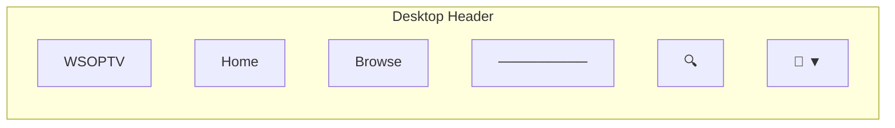

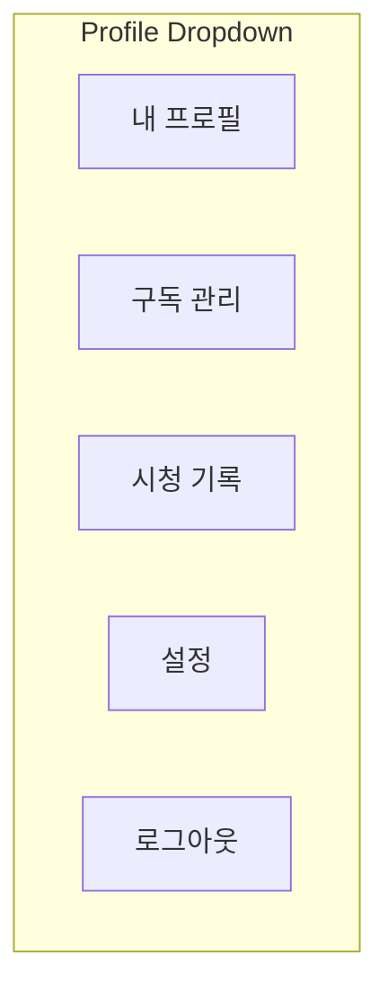

### 1.4 Hero 섹션 상태

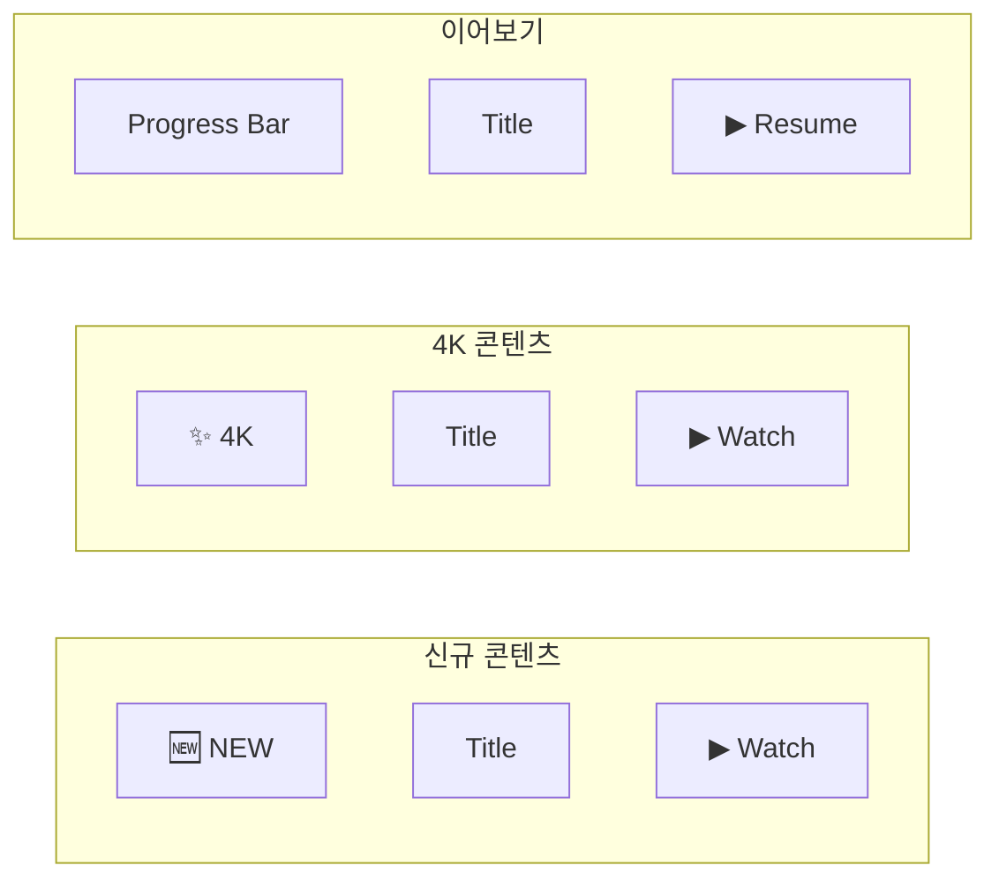

### 1.5 콘텐츠 카드

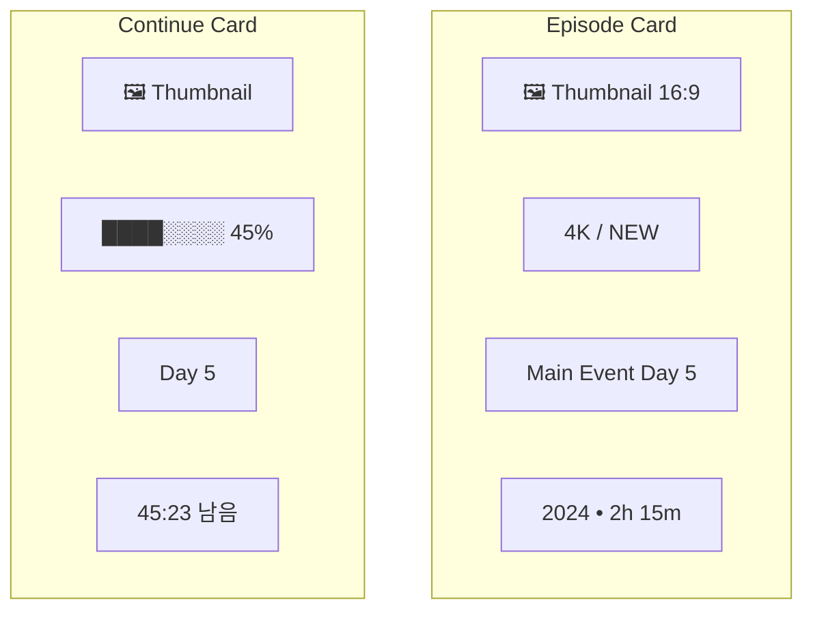

---

## 2. Browse 화면

### 2.1 Desktop 레이아웃

```mermaid
flowchart TB
    subgraph Header["Header"]
        H[WSOPTV | Home | Browse | 🔍 | 👤]
    end

    subgraph PageTitle["Page Title"]
        Title[Browse]
        Sort[정렬: 최신순 ▼]
    end

    subgraph Main["Main Content"]
        subgraph Sidebar["Filters"]
            F1[Year ▼]
            F2[Event ▼]
            F3[Series ▼]
            F4[Quality ▼]
        end

        subgraph Grid["Content Grid 4열"]
            G1[Card]
            G2[Card]
            G3[Card]
            G4[Card]
            G5[Card]
            G6[Card]
            G7[Card]
            G8[Card]
        end
    end

    Header --> PageTitle --> Main
```

### 2.2 Mobile 레이아웃

```mermaid
flowchart TB
    subgraph MHeader["Header"]
        MH[WSOPTV | 🔍 👤]
    end

    subgraph MTitle["Title Bar"]
        MT[Browse]
        MFilter[Filter 🔽]
    end

    subgraph MGrid["Grid 2열"]
        MG1[Card]
        MG2[Card]
        MG3[Card]
        MG4[Card]
    end

    subgraph MNav["Bottom Nav"]
        MBN[🏠 | 📺 | 🔍 | 👤]
    end

    MHeader --> MTitle --> MGrid --> MNav
```

### 2.3 필터 패널

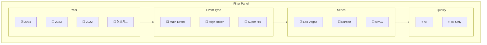

### 2.4 정렬 옵션

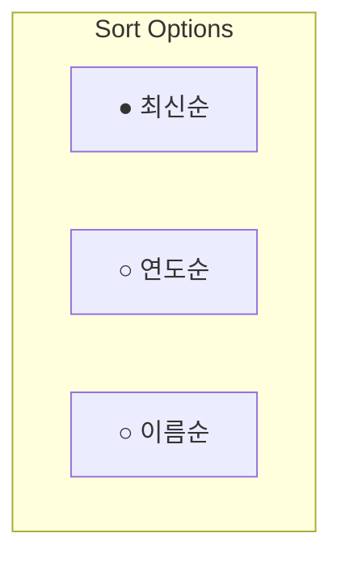

### 2.5 빈 상태

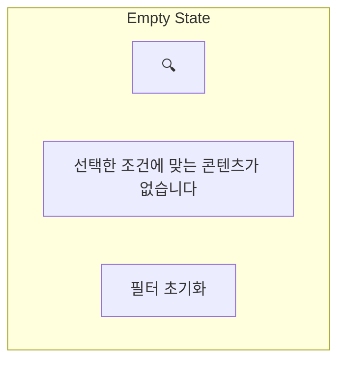

---

## 3. 플레이어 화면

### 3.1 Fullscreen 모드

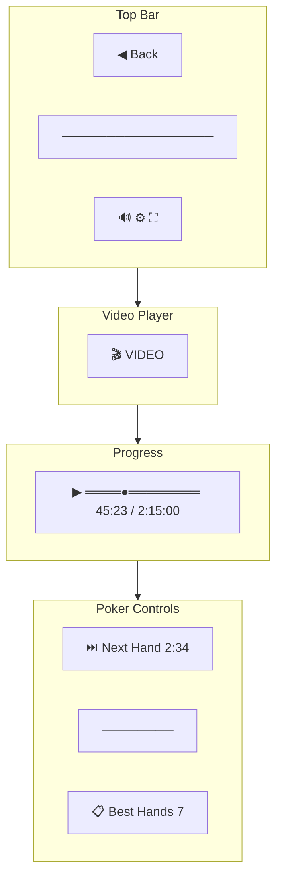

### 3.2 Theater 모드

```mermaid
flowchart TB
    subgraph Header["Header"]
        H[WSOPTV | Home | Browse | 🔍 | 👤]
    end

    subgraph Player["Video Player"]
        V[🎬 VIDEO]
        P[▶ ════●════════ 45:23 / 2:15:00]
    end

    subgraph Below["Below Player"]
        subgraph Info["Episode Info"]
            I1[WSOP 2024 ME Day 5]
            I2[2h 15m • 47 Hands]
        end

        subgraph Related["Related"]
            R1[Day 4]
            R2[Day 6]
            R3[Day 7]
        end
    end

    Header --> Player --> Below
```

### 3.3 비디오 컨트롤

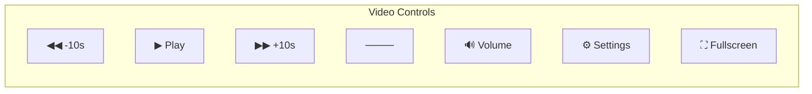

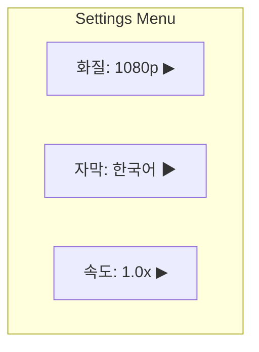

### 3.4 Hand Skip UI

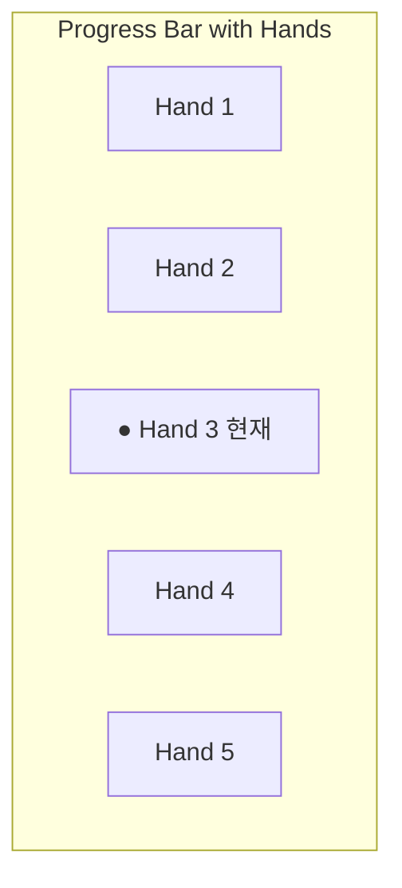

```mermaid
flowchart TB
    subgraph SkipModal["Skip Modal"]
        SM_Icon[⏭️]
        SM_Title[다음 핸드로 건너뛰기]
        SM_Info[Hand #13 시작까지 2:34]
        SM_Buttons[건너뛰기 | 계속 보기]
    end
```

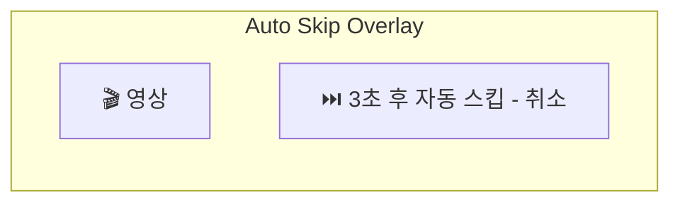

### 3.5 Best Hands 패널

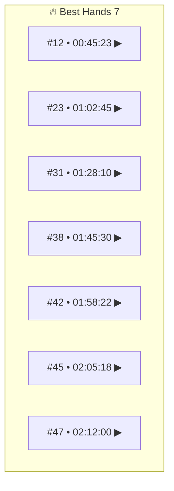

### 3.6 키보드 단축키

| 키 | 동작 |
|---|------|
| Space | 재생/일시정지 |
| ← / → | 10초 이동 |
| ↑ / ↓ | 볼륨 |
| F | 전체화면 |
| M | 음소거 |
| N | 다음 핸드 |
| B | Best Hands |

---

## 4. 검색 화면

### 4.1 검색 모달 (초기)

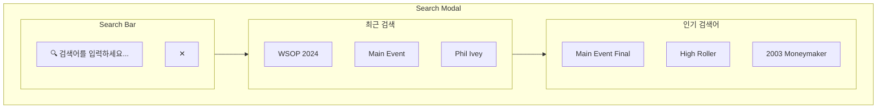

### 4.2 자동완성

```mermaid
flowchart TB
    subgraph Autocomplete["Autocomplete"]
        subgraph Input["Input"]
            I[🔍 wsop 2024 ma]
        end

        subgraph Suggestions["Suggestions"]
            SG1[wsop 2024 main event]
            SG2[wsop 2024 main event day 1]
            SG3[wsop 2024 main event final]
        end
    end

    Input --> Suggestions
```

### 4.3 검색 결과

```mermaid
flowchart TB
    subgraph SearchResults["Search Results"]
        subgraph ResultHeader["Header"]
            RH[12 results for 'wsop 2024 main event']
        end

        subgraph ResultList["Results"]
            subgraph Result1["Result 1"]
                R1_Thumb[🖼️]
                R1_Title[WSOP 2024 ME Day 1]
                R1_Meta[2h 45m • 52 Hands]
            end

            subgraph Result2["Result 2"]
                R2_Thumb[🖼️]
                R2_Title[WSOP 2024 ME Day 2]
                R2_Meta[2h 30m • 48 Hands]
            end

            subgraph Result3["Result 3"]
                R3_Thumb[🖼️]
                R3_Title[WSOP 2024 ME Day 3]
                R3_Meta[2h 15m • 45 Hands]
            end
        end
    end

    ResultHeader --> ResultList
```

### 4.4 결과 없음

```mermaid
flowchart TB
    subgraph NoResults["No Results"]
        NR_Icon[🔍]
        NR_Title[검색 결과가 없습니다]
        NR_Suggest[다른 검색어를 시도해보세요]
    end
```

---

## 5. Account 화면

### 5.1 Desktop 레이아웃

```mermaid
flowchart TB
    subgraph Header["Header"]
        H[WSOPTV | Home | Browse | 🔍 | 👤]
    end

    subgraph AccountPage["Account Page"]
        subgraph Sidebar["Sidebar"]
            SB1[● 프로필]
            SB2[○ 구독 관리]
            SB3[○ 시청 기록]
            SB4[○ 설정]
        end

        subgraph Content["Content Area"]
            CA[Selected Section Content]
        end
    end

    Header --> AccountPage
```

### 5.2 프로필 섹션

```mermaid
flowchart TB
    subgraph ProfileSection["프로필"]
        subgraph Avatar["Avatar"]
            AV[👤 프로필 이미지]
            AV_Edit[변경]
        end

        subgraph Info["정보"]
            I1[이름: John Doe]
            I2[이메일: john@email.com]
            I3[가입일: 2024-01-15]
        end

        subgraph Actions["Actions"]
            A1[이름 변경]
            A2[비밀번호 변경]
        end
    end

    Avatar --> Info --> Actions
```

### 5.3 구독 관리 섹션

```mermaid
flowchart TB
    subgraph SubscriptionSection["구독 관리"]
        subgraph CurrentPlan["현재 플랜"]
            CP1[Premium Monthly]
            CP2[$9.99/월]
            CP3[다음 결제: 2024-02-15]
        end

        subgraph PlanActions["Actions"]
            PA1[플랜 변경]
            PA2[구독 취소]
        end

        subgraph PaymentMethod["결제 수단"]
            PM1[💳 •••• 1234]
            PM2[변경]
        end
    end

    CurrentPlan --> PlanActions --> PaymentMethod
```

### 5.4 시청 기록 섹션

```mermaid
flowchart TB
    subgraph HistorySection["시청 기록"]
        subgraph HistoryHeader["Header"]
            HH1[최근 시청]
            HH2[전체 삭제]
        end

        subgraph HistoryList["History List"]
            subgraph Item1["Item 1"]
                HI1_Thumb[🖼️]
                HI1_Title[WSOP 2024 Day 5]
                HI1_Progress[████░░ 60%]
                HI1_Date[어제]
            end

            subgraph Item2["Item 2"]
                HI2_Thumb[🖼️]
                HI2_Title[WSOP 2024 Day 4]
                HI2_Progress[██████ 100%]
                HI2_Date[2일 전]
            end
        end
    end

    HistoryHeader --> HistoryList
```

### 5.5 설정 섹션

```mermaid
flowchart TB
    subgraph SettingsSection["설정"]
        subgraph Language["언어"]
            L1[○ 한국어]
            L2[○ English]
        end

        subgraph Playback["재생"]
            PB1[자막: 자동 ▼]
            PB2[화질: 자동 ▼]
            PB3[자동재생: ✓]
        end

        subgraph Poker["포커 기능"]
            PK1[Hand Skip 자동: ✓]
        end
    end

    Language --> Playback --> Poker
```

---

## 6. 인증 화면

### 6.1 로그인

```mermaid
flowchart TB
    subgraph LoginPage["로그인"]
        subgraph Logo[""]
            L[WSOPTV]
        end

        subgraph Form["Login Form"]
            F1[📧 이메일]
            F2[🔒 비밀번호]
            F3[☐ 로그인 상태 유지]
            F4[로그인 버튼]
        end

        subgraph Links["Links"]
            LK1[비밀번호 찾기]
            LK2[회원가입]
        end
    end

    Logo --> Form --> Links
```

### 6.2 로그인 에러 상태

```mermaid
flowchart TB
    subgraph LoginError["Login Error States"]
        subgraph EmailError["이메일 에러"]
            EE[⚠️ 올바른 이메일 형식이 아닙니다]
        end

        subgraph PasswordError["비밀번호 에러"]
            PE[⚠️ 이메일 또는 비밀번호가 올바르지 않습니다]
        end

        subgraph AccountError["계정 에러"]
            AE[⚠️ 계정이 잠겼습니다]
        end
    end
```

### 6.3 회원가입

```mermaid
flowchart TB
    subgraph RegisterPage["회원가입"]
        subgraph Logo[""]
            L[WSOPTV]
        end

        subgraph Form["Register Form"]
            F1[📧 이메일]
            F2[🔒 비밀번호]
            F3[• 8자 이상 • 영문+숫자]
            F4[🔒 비밀번호 확인]
            F5[👤 이름]
        end

        subgraph Terms["약관"]
            T1[☐ 이용약관 동의 필수]
            T2[☐ 개인정보처리방침 동의 필수]
        end

        subgraph Action[""]
            A[회원가입 버튼]
        end
    end

    Logo --> Form --> Terms --> Action
```

### 6.4 비밀번호 찾기 플로우

```mermaid
flowchart LR
    Step1[1. 이메일 입력] --> Step2[2. 메일 발송 완료]
    Step2 --> Step3[3. 새 비밀번호 설정]
    Step3 --> Step4[4. 완료 → 로그인]
```

```mermaid
flowchart TB
    subgraph PasswordReset["비밀번호 찾기"]
        subgraph Step1["Step 1: 이메일 입력"]
            S1_Title[비밀번호 찾기]
            S1_Input[📧 가입한 이메일]
            S1_Button[인증 메일 발송]
        end
    end
```

```mermaid
flowchart TB
    subgraph EmailSent["Step 2: 메일 발송"]
        ES_Icon[📧]
        ES_Title[인증 메일을 발송했습니다]
        ES_Info[이메일을 확인해주세요]
    end
```

```mermaid
flowchart TB
    subgraph NewPassword["Step 3: 새 비밀번호"]
        NP_Title[새 비밀번호 설정]
        NP_Input1[🔒 새 비밀번호]
        NP_Input2[🔒 비밀번호 확인]
        NP_Button[변경하기]
    end
```

---

*다음: [04-technical-spec.md](./04-technical-spec.md)*
