# WSOPTV - 포커 전문 글로벌 OTT 플랫폼

**Version**: 1.0.0 | **Status**: Active | **Created**: 2025-12-17

---

## Executive Summary

WSOPTV는 **World Series of Poker(WSOP)** 콘텐츠를 전문으로 제공하는 글로벌 OTT 스트리밍 서비스입니다. **1973년부터 50년+ 헤리티지**를 가진 세계 최고의 포커 토너먼트 영상을 제공하며, 포커 팬들에게 최적화된 시청 경험과 포커 특화 기능으로 차별화된 가치를 전달합니다.

### 콘텐츠 특성 (일반 OTT와의 차이)

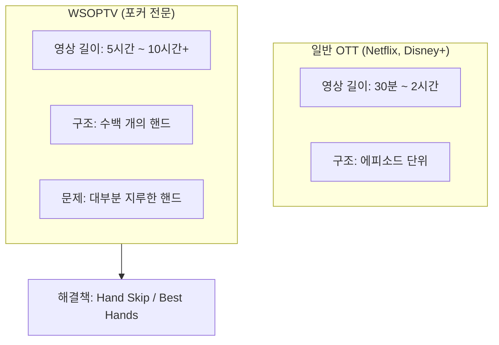

**→ 해결책: 긴 영상에서 재미있는 핸드만 골라 보는 기능 제공**

### Vision

> "포커 팬을 위한, 포커 팬에 의한 최고의 시청 경험"

### Key Differentiators

| 차별점 | 설명 |
|--------|------|
| **50년+ 헤리티지** | 1973년부터의 WSOP 레거시 콘텐츠 |
| **다양한 브랜드** | Las Vegas, Paradise, Super Circuit 등 |
| **Hand Skip** | 핸드 사이 대기 시간 자동 건너뛰기 (생방송 검증) |
| **Best Hands** | 명장면 핸드만 골라보기 (생방송 검증) |
| **4K Remaster** | 레거시 영상 AI 업스케일링 4K 변환 |
| **풍성한 볼거리** | 대회당 수십 개 브레이슬릿 이벤트 |
| **글로벌 서비스** | 전 세계 어디서나 시청 |

> **검증된 기능**: Hand Skip과 Best Hands는 프로덕션 생방송에서 이미 도입되어 포커 팬들에게 높은 평가를 받은 기능입니다. WSOPTV는 이 검증된 기능을 OTT VOD 서비스에 확장 적용합니다.

---

## Business Strategy: 포커 생태계 확장

### 전략 개요

> **핵심 목표**: 수익화보다 **포커 유저 파이 확대**에 집중

**모회사 GGPoker**는 전세계 온라인 포커 점유율 1위입니다. WSOPTV는 단순한 수익 모델이 아닌, **포커 대중화 → 온라인 포커 플레이어 증가 → GGPoker 성장**으로 이어지는 생태계 확장 전략의 핵심 채널입니다.

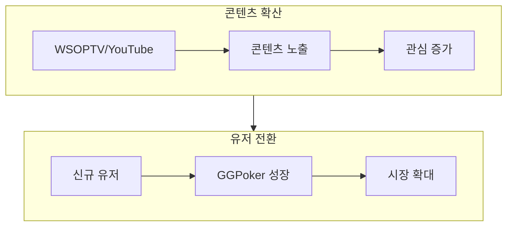

WSOP 콘텐츠는 **YouTube**와 **WSOPTV** 두 채널로 분리하여 배포합니다.

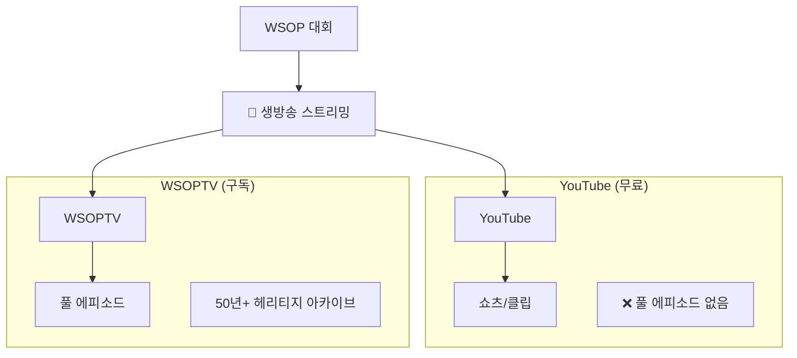

### 공통: 생방송 스트리밍

| 채널 | 생방송 | 비고 |
|------|:------:|------|
| **YouTube** | ✅ | 무료 시청 |
| **WSOPTV** | ✅ | 구독자 전용 |

> 생방송 스트리밍은 **YouTube와 WSOPTV 모두**에서 제공합니다.

### YouTube (무료) - 신규 유입 게이트웨이

**역할**: 포커에 관심 없던 사람들을 포커 팬으로 유입시키는 **게이트웨이**

| 콘텐츠 유형 | 설명 | 길이 |
|-------------|------|------|
| **🔴 생방송** | 대회 실시간 스트리밍 | 실시간 |
| **쇼츠 (Shorts)** | 세로형 짧은 영상 | ~60초 |
| **하이라이트 클립** | 베스트 핸드 편집 영상 | 3~10분 |

> **YouTube에는 풀 에피소드가 없습니다.** 생방송 이후 VOD는 WSOPTV에서만 제공합니다.

**전략적 역할:**
- 포커를 모르는 대중에게 **첫 노출**
- 짧은 영상으로 **진입 장벽 최소화**
- 흥미 유발 → WSOPTV/GGPoker로 전환

### WSOPTV (구독) - 열성 팬 서비스

**역할**: 포커 팬에게 **최고의 시청 경험** 제공, 포커 학습/분석 플랫폼

| 콘텐츠 유형 | 설명 | 길이 |
|-------------|------|------|
| **🔴 생방송** | 대회 실시간 스트리밍 | 실시간 |
| **풀 에피소드** | 50년+ 헤리티지 아카이브 | 2~10시간+ |

> **핵심**: WSOPTV는 **풀 에피소드만** 제공합니다.
> 쇼츠, 하이라이트 클립, 편집 영상은 **제공하지 않습니다**.

**WSOPTV만의 특별 기능:**

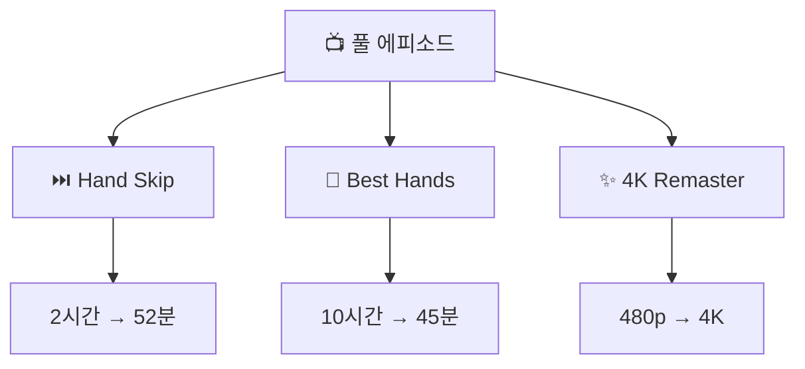

### 채널별 역할 비교

| 구분 | YouTube | WSOPTV |
|------|---------|--------|
| **🔴 생방송** | ✅ (무료) | ✅ (구독) |
| **쇼츠/클립** | ✅ | ❌ |
| **풀 에피소드** | ❌ | ✅ |
| **Hand Skip** | ❌ | ✅ |
| **Best Hands 점프** | ❌ | ✅ |
| **4K Remaster** | ❌ | ✅ |
| **가격** | 무료 (광고) | $9.99/월, $99/년 |

### 사용자 전환 흐름

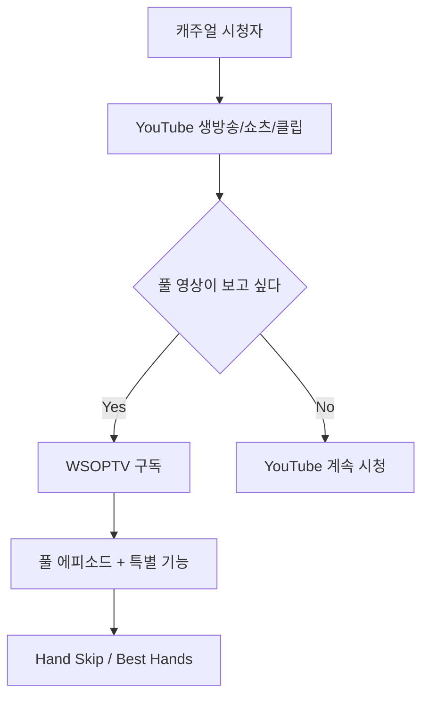

### Target Users

| 사용자 그룹 | 채널 | 니즈 | 전환 목표 |
|-------------|------|------|----------|
| **일반 대중** | **YouTube** | 짧은 영상, 쇼츠, 클립 | 포커 관심 유발 |
| **캐주얼 팬** | **YouTube → WSOPTV** | 흥미로운 콘텐츠 | 열성 팬 전환 |
| **열성 팬** | **WSOPTV** | 풀 에피소드, Hand Skip | GGPoker 플레이어 |
| **학습 목적** | **WSOPTV** | Hand Skip, Best Hands | GGPoker 플레이어 |

### 전략적 목표: GGPoker 시너지

> **WSOPTV의 목표는 구독 수익이 아닌, 포커 생태계 확장입니다.**

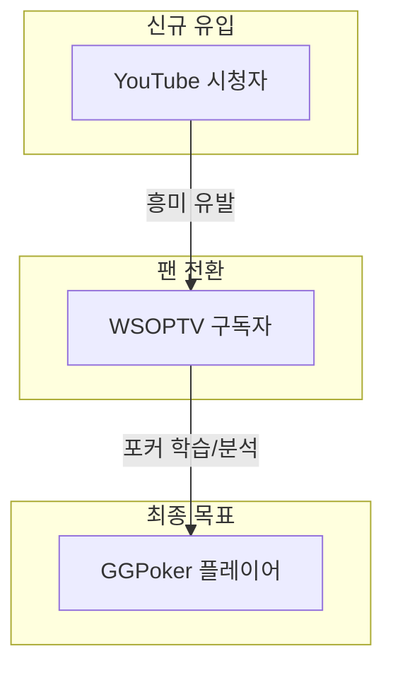

| 채널 | 역할 | KPI |
|------|------|-----|
| **YouTube** | 신규 유입 게이트웨이 | 조회수, 구독자 증가율 |
| **WSOPTV** | 열성 팬 서비스 | 시청 시간, Hand Skip 사용률 |
| **GGPoker** | 최종 전환 목표 | 신규 플레이어 가입 |

### WSOPTV 구독 플랜

> **$9.99/월 | $99/년** - 저가 전략으로 진입 장벽 최소화

| 기능 | 설명 |
|------|------|
| 모든 풀 에피소드 | 최신 + 50년 헤리티지 아카이브 |
| Hand Skip | 대기 시간 자동 건너뛰기 |
| Best Hands | 베스트 핸드 타임스탬프 점프 |
| 4K Remaster | 레거시 영상 고화질 |
| 이어보기 동기화 | 끊김 없는 시청 |

---

## Core Features

### 1. Hand Skip (핸드 건너뛰기)

Netflix의 "오프닝 건너뛰기"와 같은 개념으로, **핸드와 핸드 사이의 대기 시간**을 자동으로 건너뛰는 기능입니다.

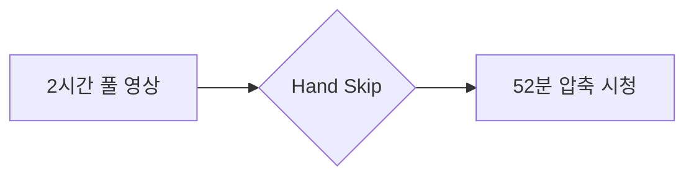

**원클릭 토글 방식**: 한 번 클릭 → 전체 에피소드에서 대기 시간 자동 스킵

### 2. Best Hands (베스트 핸드 모아보기)

**10시간+ 긴 영상에서 재미있는 핸드만** 타임스탬프 기반으로 점프하며 보여주는 기능입니다.

> **핵심**: 별도 클립 영상이 아닌, **전체 영상 내에서 해당 시간대로 이동**

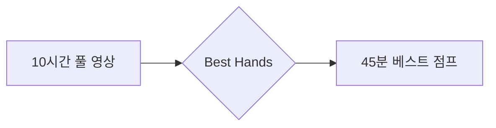

**원클릭 토글 방식**: 한 번 클릭 → 베스트 핸드 25개만 순차 점프 시청

### Hand Skip / Best Hands 로드맵

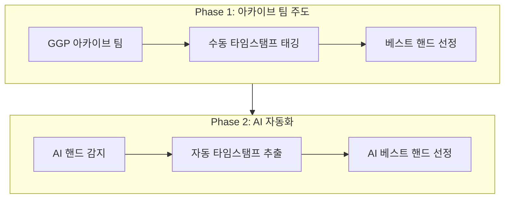

| Phase | 주도 | 작업 내용 | 특징 |
|-------|------|----------|------|
| **Phase 1** | 아카이브 팀 | 수동 타임스탬프 태깅, 베스트 핸드 선정 | 높은 품질, 인력 의존 |
| **Phase 2** | AI 자동화 | 핸드 자동 감지, 타임스탬프 추출, AI 선정 | 확장성, 실시간 처리 |

### 3. 4K Remaster (AI 화질 업스케일링)

2000년대 초반 WSOP 레거시 영상을 **AI 업스케일링으로 4K 화질로 리마스터**하여 제공합니다.

**사용자 가치:**
- 클래식 명장면을 현대적 화질로 감상
- 카드/칩/표정 선명하게 확인
- 타 플랫폼에서 볼 수 없는 독점 콘텐츠

**Remaster 대상:**

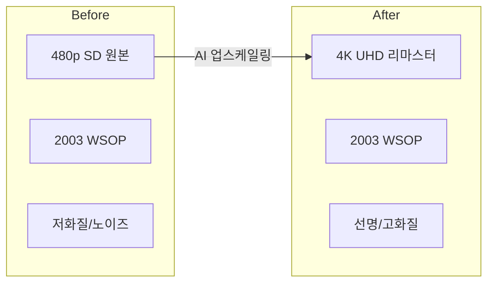

### 4. Continue Watching (이어보기)

시청 중단 지점을 저장하고 **다음 접속 시 자동 이어보기**를 제공합니다.

### 5. Smart Search (검색)

- 플레이어 이름 검색
- 시즌/이벤트 검색
- 핸드 유형 검색 (예: "AA vs KK")

---

## Content Strategy

### WSOP 브랜드 라인업

**1973년부터 50년+ 헤리티지를 가진 세계 최고의 포커 토너먼트**

| 브랜드 | 개최지 | 시기 | 특징 |
|--------|--------|------|------|
| **WSOP Las Vegas** | 라스베가스 | 5~7월 | 오리지널, 80+ 브레이슬릿 |
| **WSOP Paradise** | 바하마 | 12월 | 리조트 환경 |
| **WSOP Europe** | 유럽 | 4월 | 유럽 메이저 |
| **WSOP Super Circuit** | 전세계 | 연중 | 글로벌 순회 (Cyprus, Canada 등) |

> **풍성한 볼거리**: 하나의 대회 = 수십 개의 다양한 브레이슬릿 이벤트

### 콘텐츠 카테고리

| 카테고리 | 설명 | 예시 |
|----------|------|------|
| **Main Event** | 메인 이벤트 전 에피소드 | 2024 Main Event Day 1-7 |
| **Bracelet Events** | 다양한 브레이슬릿 이벤트 | $10K PLO, $50K PPC |
| **High Rollers** | 고액 토너먼트 | $250K Super High Roller |
| **Classics** | 역대 명경기 (1973~) | 2003 Chris Moneymaker |
| **Best Hands** | 시즌별 베스트 핸드 | 2024 Top 50 Hands |

### 콘텐츠 제공 방식

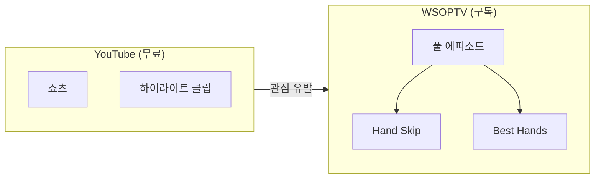

---

## User Experience

### 홈 화면 구성

```mermaid
flowchart TB
    subgraph Header["Header"]
        Logo[WSOPTV]
        Nav[Browse | Search | Profile]
    end

    subgraph Hero["Hero Banner"]
        HeroTitle[🎰 WSOP 2024 Main Event]
        HeroCTA[▶ Watch Now]
    end

    subgraph Continue["⏩ Continue Watching"]
        C1[Day 5] --- C2[Day 3] --- C3[PLO]
    end

    subgraph Recent["🆕 Recently Added"]
        R1[Day 7] --- R2[Day 6] --- R3[$25K HR]
    end

    subgraph Vegas["🏆 WSOP Las Vegas 2024"]
        V1[ME Day1] --- V2[PLO Chp] --- V3[HR 100K]
    end

    subgraph Classics["✨ 4K Remastered"]
        K1[2003] --- K2[2006] --- K3[2008]
    end

    Header --> Hero --> Continue --> Recent --> Vegas --> Classics
```

> **참고**: 모든 콘텐츠는 **풀 에피소드**입니다. 쇼츠/하이라이트는 YouTube에서 제공합니다.

### 플레이어 화면

```mermaid
flowchart TB
    subgraph Player["Video Player"]
        Video[🎬 Video Area]
        Progress[▶ ████░░░░ 45:23 / 2:15:00]
        Controls[⏭️ Skip | 📋 Best Hands | ⚙️]
    end

    subgraph Info["Episode Info"]
        Title[WSOP 2024 ME Day 5]
        Meta[2h 15m | 47 Hands | 52m Action]
    end

    subgraph Hands["Featured Hands"]
        H1[#12 AA] --- H2[#23 Bluff] --- H3[#31 All-in]
    end

    Player --> Info --> Hands
```

---

## External Dependencies

### GGP Archive Team 연동

WSOPTV의 핵심 기능인 **Hand Skip**과 **Best Hands**는 **GGP 아카이브 팀**의 메타데이터 태깅 작업에 의존합니다.

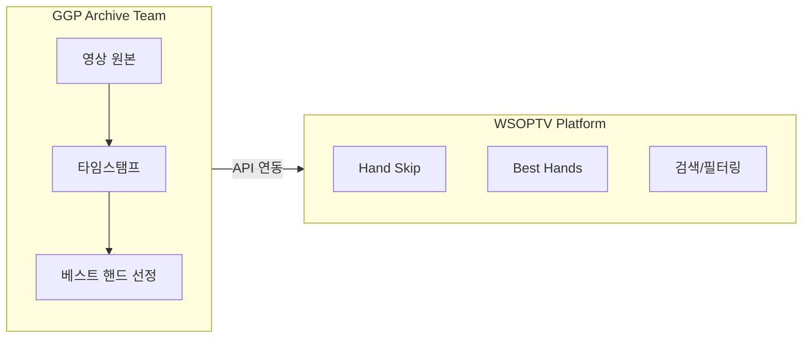

| 의존성 | 제공 팀 | WSOPTV 활용 |
|--------|---------|------------|
| 핸드 타임스탬프 | GGP Archive | Hand Skip 자동 건너뛰기 |
| 베스트 핸드 선정 | GGP Archive | Best Hands 타임스탬프 점프 |
| 핸드 카테고리 | GGP Archive | 검색 필터링 |
| 플레이어 정보 | GGP Archive | 플레이어별 검색 |

> **참고**: 상세 메타데이터 구조는 [01-features.md](./01-features.md#27-메타데이터-기반-베스트-핸드-ggp-archive-연동) 참조

---

## Document Index

| 문서 | 설명 |
|------|------|
| [01-features.md](./01-features.md) | 핵심 기능 상세 명세 |
| [02-user-experience.md](./02-user-experience.md) | 사용자 경험 설계 |
| [03-content-strategy.md](./03-content-strategy.md) | 콘텐츠 전략 |

---

## Reference

| 문서 | 용도 | 핵심 인사이트 |
|------|------|--------------|
| [0008 - PokerGO 분석](../0008-prd-pokergo-channel-analysis.md) | 경쟁사 분석 | 포커 OTT 벤치마크 |
| [0009 - PokerGO UI](../0009-prd-pokergo-ui-workflow-design.md) | UI 참고 | 콘텐츠 카드, 플레이어 UI |
| [0012 - NBA League Pass 분석](../0012-reference-nbatv-analysis.md) | Freemium 모델 | Condensed Game, CrunchTime, Smart Rewind |

### NBA League Pass 주요 참고 포인트

| NBA 기능 | WSOPTV 적용 | 비고 |
|----------|------------|------|
| **Condensed Game** (10-15분) | Best Hands (30-45분) | 압축 시청 |
| **Smart Rewind** (키 플레이 표시) | 타임스탬프 점프 | 핵심 장면 이동 |
| **CrunchTime** (무료) | YouTube 하이라이트 | 무료는 YouTube로 |
| **NBA Vault** (무료) | YouTube 클래식 클립 | 무료는 YouTube로 |

> **차이점**: NBA는 무료 티어(CrunchTime, Vault)를 직접 제공하지만, WSOPTV는 **YouTube로 무료 채널 분리** (투트랙 전략)

---

*Last updated: 2025-12-17*
