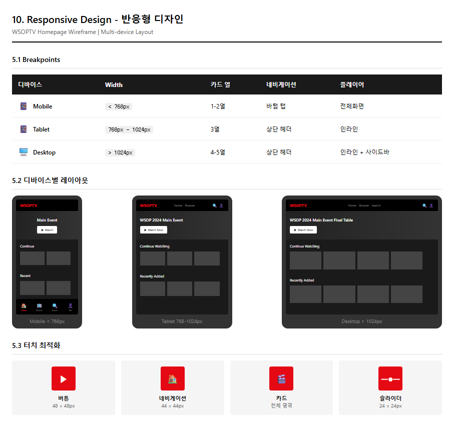
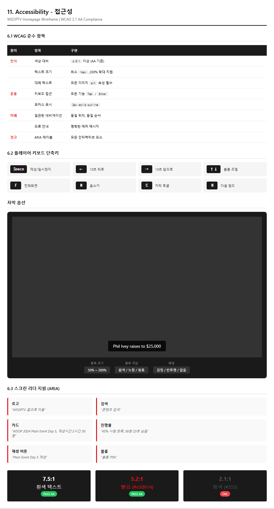

# WSOPTV - 반응형 디자인 & 접근성 (Archived)

**Version**: 1.4.0 | **Archived from**: [02-user-experience.md](../02-user-experience.md)

> 이 문서는 02-user-experience.md의 섹션 5, 6을 아카이브한 것입니다.

---

## 1. 반응형 디자인

### 1.0 디자인 의도 및 목적

**핵심 목표:** 모든 디바이스에서 일관된 시청 경험 제공

| 디자인 결정 | 의도 |
|-------------|------|
| **Mobile First** | 주 사용 환경이 모바일임을 고려 |
| **가로 스크롤** | 모바일에서 자연스러운 탐색 제스처 |
| **바텀 네비게이션** | 엄지 접근성 최적화 (Thumb Zone) |
| **터치 타겟 48px** | 오탭 방지, 접근성 준수 |
| **플레이어 전체화면** | 모바일에서 몰입형 시청 |

---

### 1.1 Breakpoints

| 디바이스 | Width | 카드 열 | 네비게이션 | 플레이어 |
|----------|-------|---------|------------|----------|
| Mobile | < 768px | 1-2열 | 바텀 탭 | 전체화면 |
| Tablet | 768px - 1024px | 3열 | 상단 헤더 | 인라인 |
| Desktop | > 1024px | 4-5열 | 상단 헤더 | 인라인 + 사이드바 |

---

### 1.2 디바이스별 레이아웃

#### Mobile (< 768px)

| 영역 | 변경 사항 |
|------|-----------|
| Header | 로고 축소, 햄버거 메뉴 |
| Hero | 세로 레이아웃, 텍스트 하단 |
| 카드 그리드 | 가로 스크롤, 2열 표시 |
| 네비게이션 | 바텀 탭 바 (4개 아이콘) |
| 플레이어 | 자동 전체화면 전환 |

**바텀 네비게이션:**

| 위치 | 아이콘 | 라벨 |
|------|--------|------|
| 1 | 🏠 | Home |
| 2 | 📺 | Browse |
| 3 | 🔍 | Search |
| 4 | 👤 | Account |

#### Tablet (768px - 1024px)

| 영역 | 변경 사항 |
|------|-----------|
| Header | 전체 표시, 축소된 로고 |
| Hero | 가로 레이아웃 유지 |
| 카드 그리드 | 3열 그리드 |
| 네비게이션 | 상단 헤더 |
| 플레이어 | 인라인, 터치 컨트롤 |

#### Desktop (> 1024px)

| 영역 | 변경 사항 |
|------|-----------|
| Header | 전체 네비게이션 표시 |
| Hero | 대형 배너, 자동 슬라이드 |
| 카드 그리드 | 4-5열 그리드 |
| 플레이어 | 인라인 + 관련 콘텐츠 사이드바 |
| 호버 효과 | 카드 확대, 정보 오버레이 |

---

### 1.3 터치 최적화

| 요소 | 최소 크기 | 간격 |
|------|-----------|------|
| 버튼 | 48 × 48px | 8px |
| 카드 | 터치 전체 영역 | 12px |
| 네비게이션 아이콘 | 44 × 44px | 16px |
| 슬라이더 핸들 | 24 × 24px | - |

**제스처 지원:**

| 제스처 | 동작 |
|--------|------|
| 가로 스와이프 | 카드 섹션 스크롤 |
| 세로 스와이프 | 페이지 스크롤 |
| 더블 탭 (플레이어) | 10초 앞/뒤로 |
| 핀치 줌 (플레이어) | 화면 비율 조절 |

---

## 2. 접근성 (Accessibility)

### 2.0 디자인 의도 및 목적

**핵심 목표:** 모든 사용자가 동등하게 서비스 이용 가능

| 디자인 결정 | 의도 |
|-------------|------|
| **WCAG 2.1 AA 준수** | 법적 요구사항 충족, 사용자층 확대 |
| **키보드 완전 지원** | 마우스 없이도 모든 기능 접근 |
| **자막 기본 제공** | 청각 장애인, 비영어권 사용자 지원 |
| **고대비 모드** | 저시력 사용자 가독성 향상 |
| **재생 속도 조절** | 인지 속도에 맞춘 시청 |

---

### 2.1 WCAG 준수 항목

| 원칙 | 항목 | 구현 |
|------|------|------|
| **인식** | 색상 대비 | 4.5:1 이상 (AA) |
| | 텍스트 크기 | 최소 14px, 200% 확대 지원 |
| | 대체 텍스트 | 모든 이미지 alt 속성 |
| **운용** | 키보드 접근 | 모든 기능 Tab/Enter |
| | 포커스 표시 | 2px solid outline |
| | 시간 제한 | 자동 로그아웃 경고 |
| **이해** | 일관된 네비게이션 | 동일 위치, 동일 순서 |
| | 오류 안내 | 명확한 에러 메시지 |
| **견고** | ARIA 레이블 | 모든 인터랙티브 요소 |
| | 시맨틱 HTML | 올바른 heading 구조 |

---

### 2.2 플레이어 접근성

#### 키보드 단축키

| 키 | 동작 | 설명 |
|---|------|------|
| Space | 재생/일시정지 | 토글 |
| ← | 10초 뒤로 | Shift+← 로 30초 |
| → | 10초 앞으로 | Shift+→ 로 30초 |
| ↑ | 볼륨 +10% | 최대 100% |
| ↓ | 볼륨 -10% | 최소 0% |
| F | 전체화면 | ESC로 해제 |
| M | 음소거 토글 | |
| C | 자막 토글 | |
| N | 다음 핸드 스킵 | WSOPTV 전용 |
| B | Best Hands 패널 | WSOPTV 전용 |
| 0-9 | 구간 이동 | 1=10%, 5=50% 등 |

#### 자막 옵션

| 설정 | 옵션 |
|------|------|
| 폰트 크기 | 50% ~ 200% |
| 폰트 색상 | 흰색, 노랑, 청록 |
| 배경 색상 | 검정, 반투명, 없음 |
| 위치 | 상단, 하단 |

---

### 2.3 스크린 리더 지원

| 요소 | ARIA 레이블 예시 |
|------|------------------|
| 로고 | "WSOPTV 홈으로 이동" |
| 검색 | "콘텐츠 검색" |
| 카드 | "WSOP 2024 Main Event Day 5, 재생시간 2시간 30분" |
| 진행률 | "45% 시청 완료, 58분 23초 남음" |
| 재생 버튼 | "Main Event Day 5 재생" |
| 볼륨 슬라이더 | "볼륨 70%" |

**Live Region:**
- 재생 상태 변경 시 알림
- 핸드 스킵 시 현재 핸드 번호 알림
- 에러 발생 시 즉시 알림
