# WSOPTV 사업 기획서

**포커 전문 OTT 스트리밍 서비스**

| 항목 | 내용 |
|------|------|
| 버전 | 1.0 |
| 작성일 | 2024년 12월 15일 |
| 대상 | 경영진, 투자자 |

---

## 1. Executive Summary

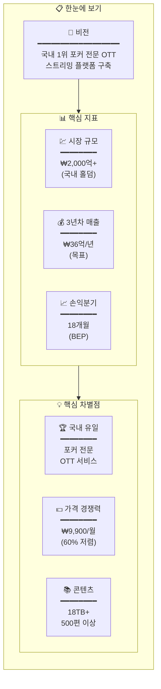

---

## 2. 시장 기회

### 2.1 시장 성장 추이

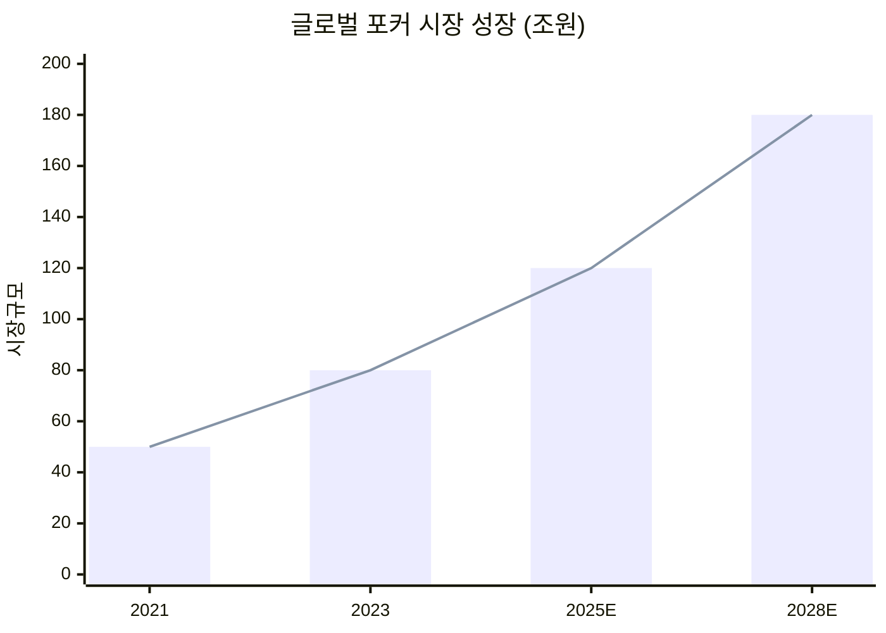

### 2.2 문제점 → 해결책

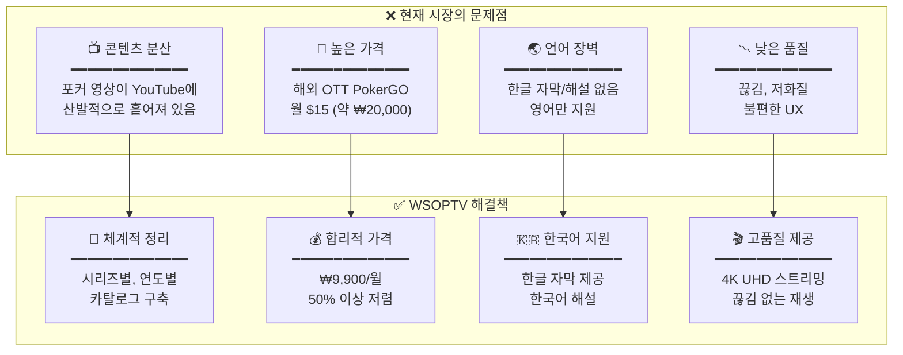

---

## 3. 비즈니스 모델

### 3.1 수익 구조 (3년차)

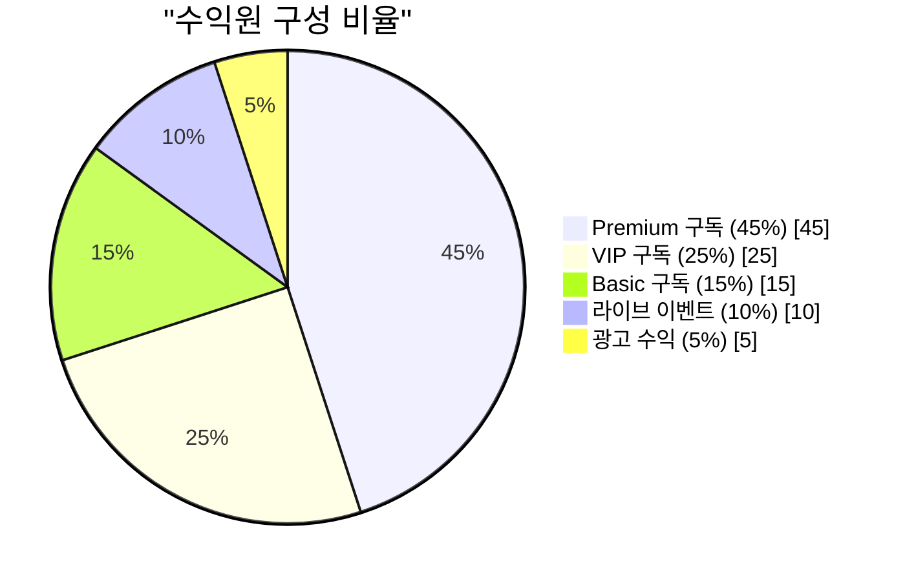

### 3.2 구독 플랜 체계

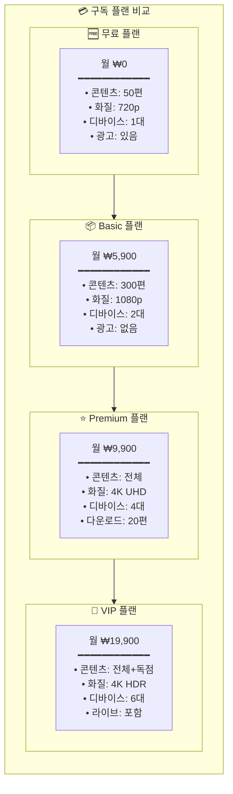

---

## 4. 고객 여정

### 4.1 가입부터 구독까지 플로우

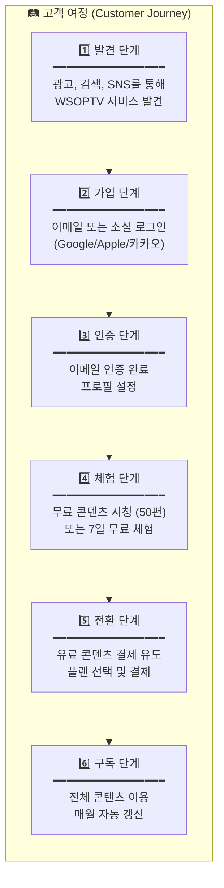

### 4.2 전환율 퍼널

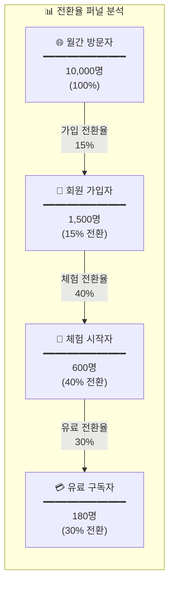

### 4.3 결제 수단

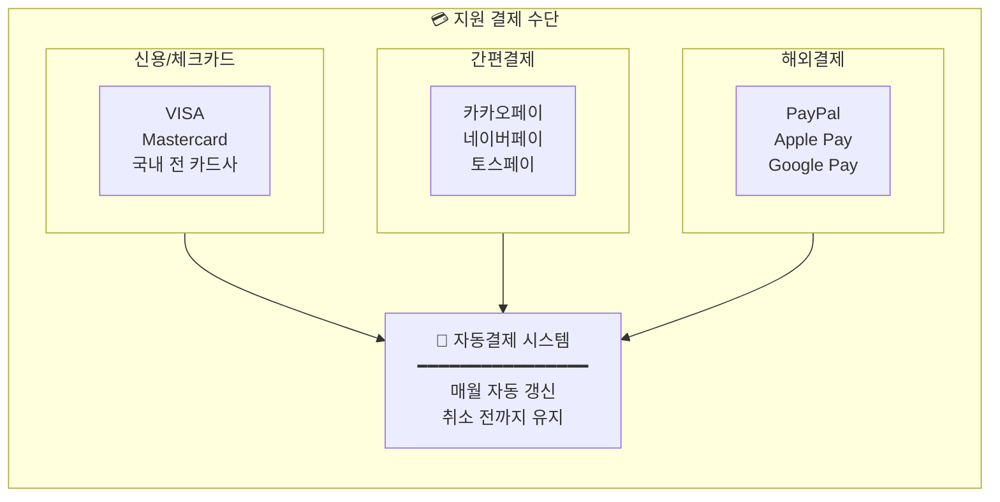

---

## 5. 콘텐츠 전략

### 5.1 보유 콘텐츠 현황

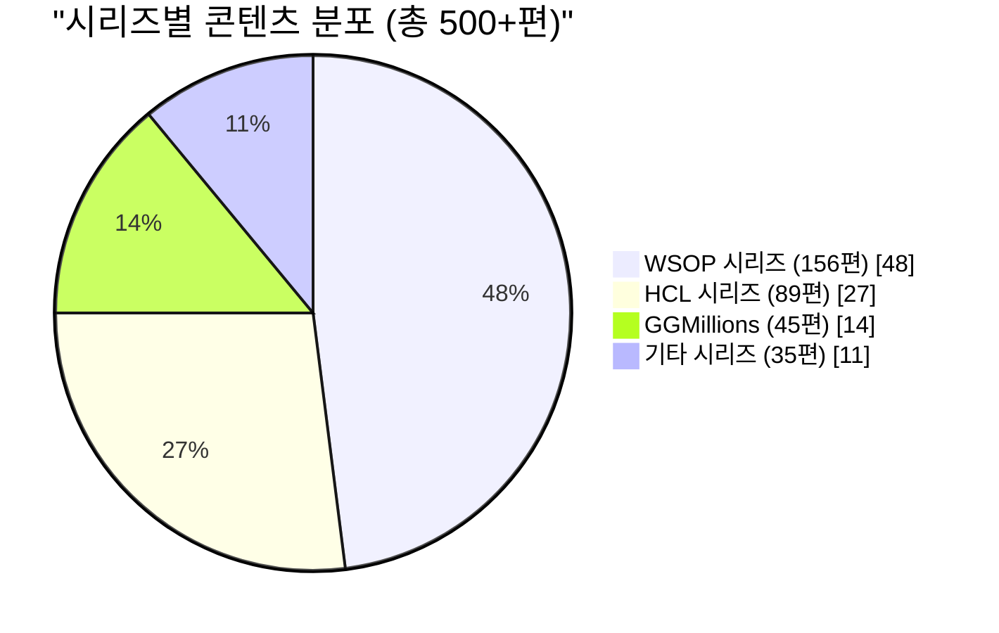

### 5.2 콘텐츠 윈도우 전략

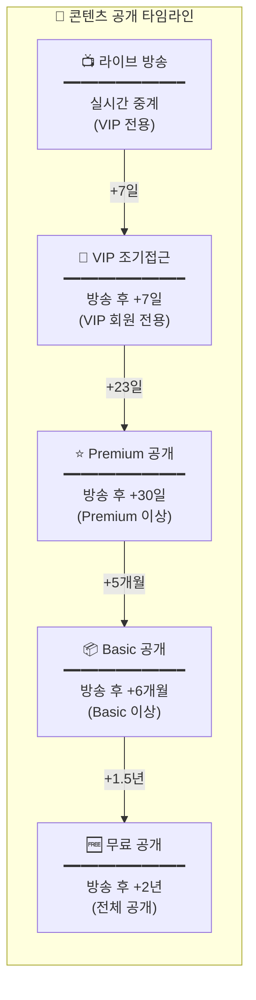

### 5.3 콘텐츠 티어 구분

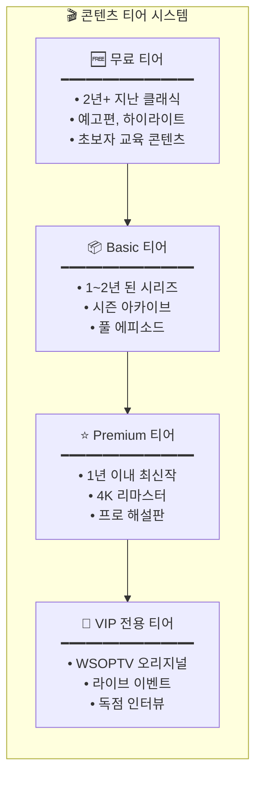

---

## 6. 경쟁 분석

### 6.1 시장 포지셔닝 맵

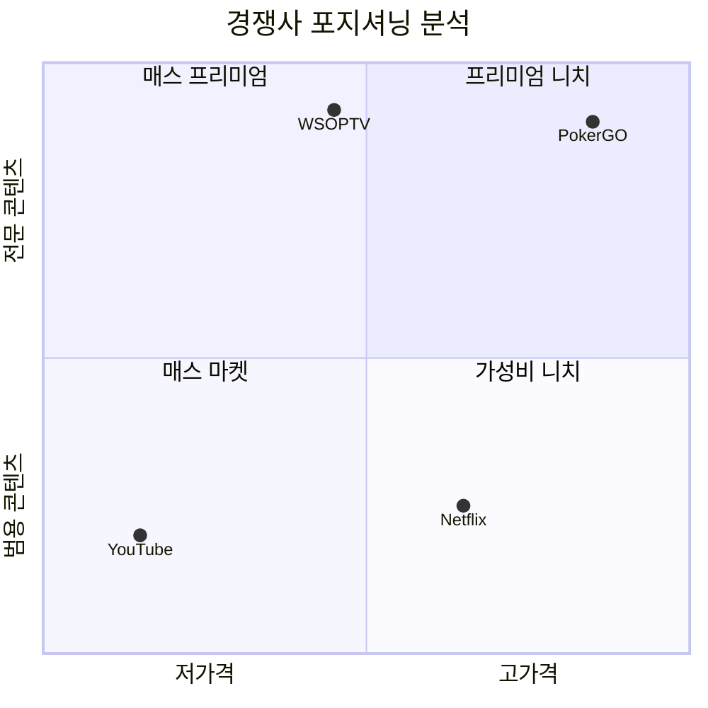

### 6.2 경쟁사 상세 비교

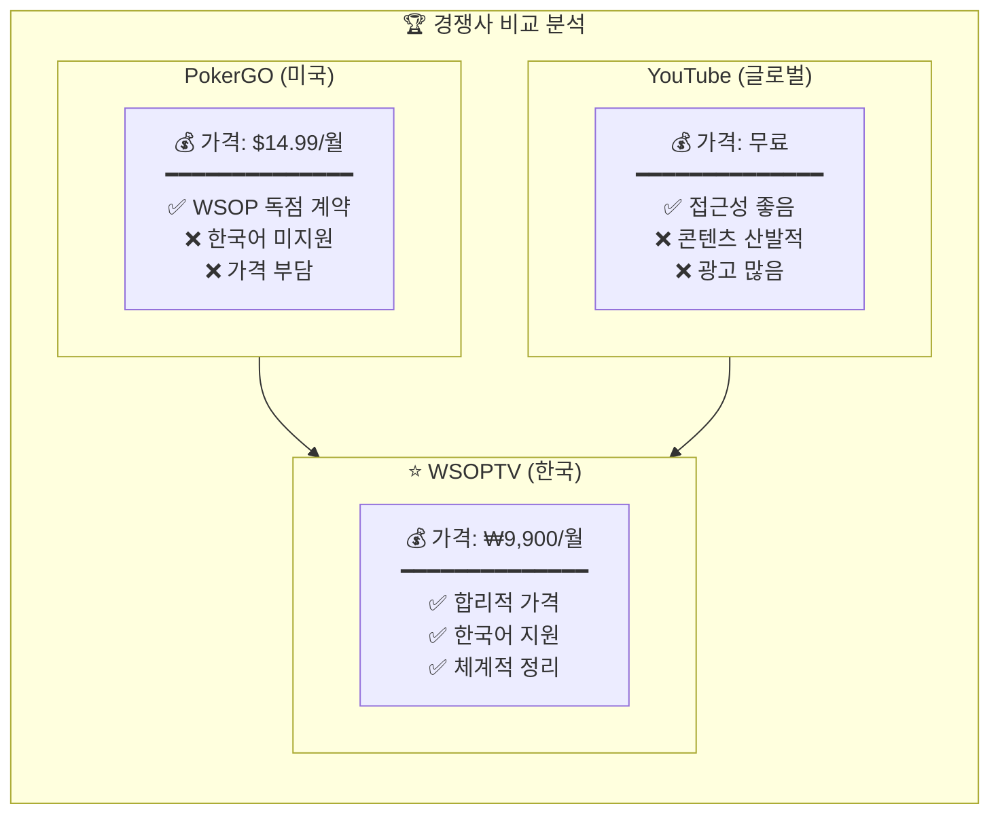

### 6.3 WSOPTV 핵심 차별점

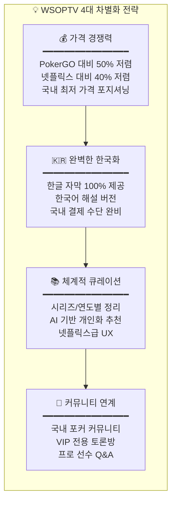

---

## 7. 재무 계획

### 7.1 매출 전망

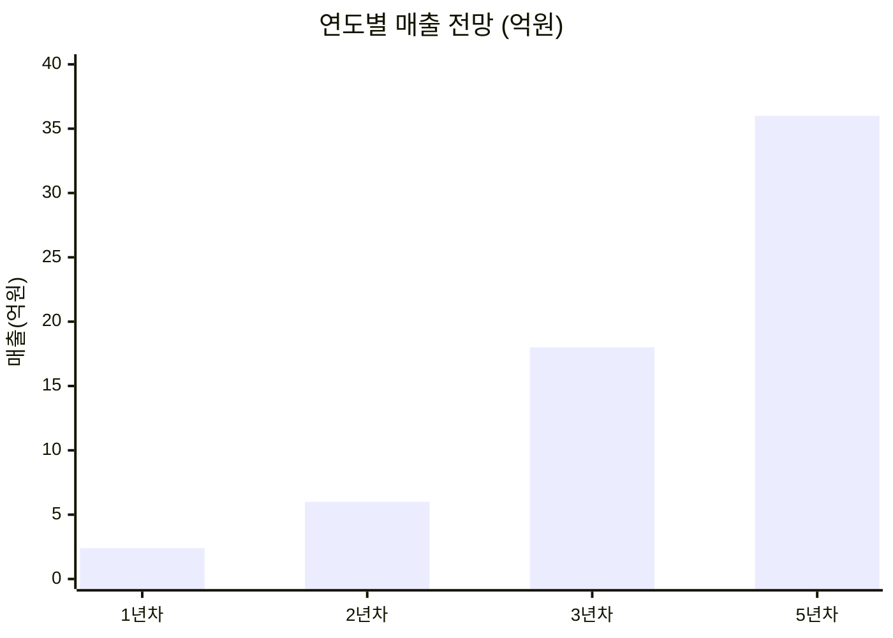

### 7.2 구독자 성장 전망

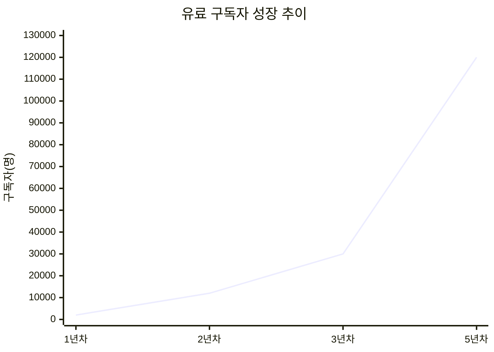

### 7.3 비용 구조 (3년차)

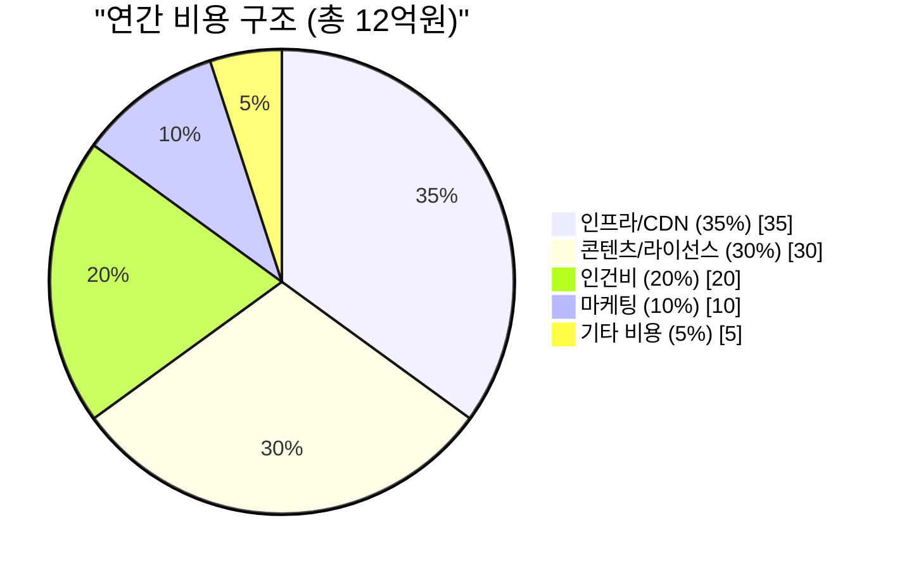

### 7.4 손익분기점 분석

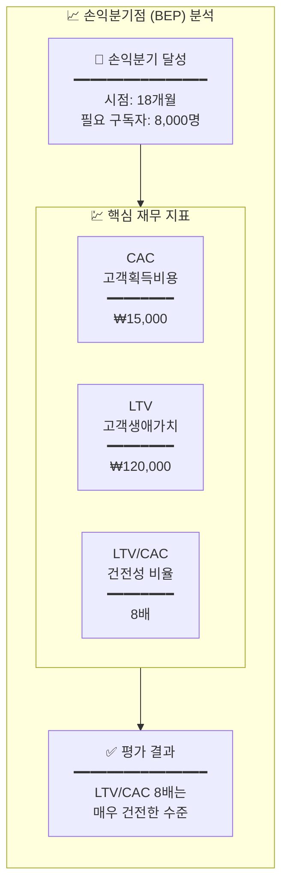

---

## 8. 실행 계획

### 8.1 2025년 로드맵

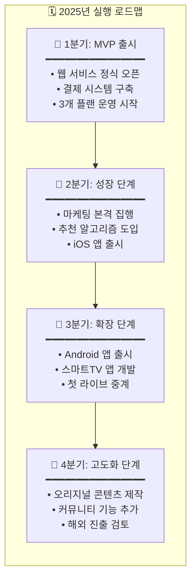

### 8.2 조직 구성 (3년차)

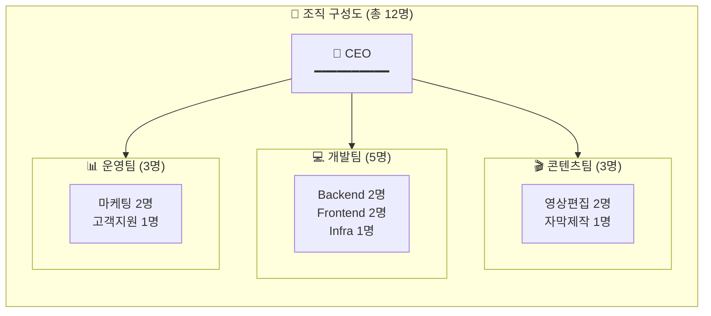

---

## 9. 리스크 관리

### 9.1 리스크 매트릭스

```mermaid
quadrantChart
    title 리스크 평가 매트릭스
    x-axis 낮은 영향도 --> 높은 영향도
    y-axis 낮은 발생확률 --> 높은 발생확률

    quadrant-1 적극 관리
    quadrant-2 모니터링
    quadrant-3 수용 가능
    quadrant-4 대비 계획

    "경쟁사 진입": [0.55, 0.70]
    "이탈률 증가": [0.65, 0.55]
    "서버 장애": [0.75, 0.35]
    "저작권 분쟁": [0.90, 0.20]
```

### 9.2 리스크별 대응 전략

```mermaid
flowchart TB
    subgraph Risk["⚠️ 리스크 대응 전략"]
        direction TB

        R1["🏢 경쟁사 진입 리스크<br/>━━━━━━━━━━━━━━━━<br/>• 독점 콘텐츠 선점<br/>• 커뮤니티 락인 효과<br/>• 가격 경쟁력 유지"]

        R2["📉 이탈률 증가 리스크<br/>━━━━━━━━━━━━━━━━<br/>• 신규 콘텐츠 지속<br/>• 개인화 추천 강화<br/>• 연간 구독 할인"]

        R3["🔧 서버 장애 리스크<br/>━━━━━━━━━━━━━━━━<br/>• 이중화 인프라<br/>• 24시간 모니터링<br/>• 자동 복구 시스템"]

        R4["⚖️ 저작권 분쟁 리스크<br/>━━━━━━━━━━━━━━━━<br/>• 법무 사전 검토<br/>• 라이선스 명확화<br/>• 분쟁 대비 보험"]

        R1 --> R2 --> R3 --> R4
    end
```

---

## 10. KPI 대시보드

```mermaid
flowchart TB
    subgraph KPI["📊 핵심 성과 지표 (3년차 목표)"]
        direction TB

        subgraph Growth["📈 성장 지표"]
            G1["MAU (월간활성)<br/>━━━━━━━━━━<br/>목표: 100,000명"]
            G2["신규 가입<br/>━━━━━━━━━━<br/>목표: 5,000/월"]
            G3["유료 전환율<br/>━━━━━━━━━━<br/>목표: 30%"]
        end

        subgraph Revenue["💰 수익 지표"]
            R1["MRR (월매출)<br/>━━━━━━━━━━<br/>목표: 3억원"]
            R2["ARPU (객단가)<br/>━━━━━━━━━━<br/>목표: ₩10,000"]
            R3["LTV (생애가치)<br/>━━━━━━━━━━<br/>목표: ₩120,000"]
        end

        subgraph Retention["🎯 유지 지표"]
            RT1["월간 이탈률<br/>━━━━━━━━━━<br/>목표: < 5%"]
            RT2["DAU/MAU<br/>━━━━━━━━━━<br/>목표: > 40%"]
            RT3["시청시간<br/>━━━━━━━━━━<br/>목표: 60분/일"]
        end

        Growth --> Revenue --> Retention
    end
```

---

## 11. 결론

### 11.1 사업 요약

```mermaid
flowchart TB
    subgraph Summary["📋 WSOPTV 사업 요약"]
        direction TB

        S1["🎯 비전<br/>━━━━━━━━━━━━━━━━━━<br/>국내 1위 포커 전문<br/>OTT 플랫폼 구축"]

        S2["💡 핵심 가치 제안<br/>━━━━━━━━━━━━━━━━━━<br/>• 합리적 가격: ₩9,900/월<br/>• 체계적 콘텐츠: 500+편<br/>• 완벽한 한국어 지원"]

        S3["📊 3년 목표<br/>━━━━━━━━━━━━━━━━━━<br/>• 유료 구독자: 30,000명<br/>• 연간 매출: 36억원<br/>• 영업이익률: 30%+"]

        S4["⏱️ 주요 마일스톤<br/>━━━━━━━━━━━━━━━━━━<br/>• 2025 Q1: MVP 출시<br/>• 2025 Q3: 모바일 앱<br/>• 2026 Q2: 손익분기점"]

        S1 --> S2 --> S3 --> S4
    end
```

### 11.2 승인 요청 사항

```mermaid
flowchart TB
    subgraph Approval["✅ 의사결정 요청 사항"]
        direction TB

        A1["☐ 사업 추진 승인<br/>━━━━━━━━━━━━━━━━━━<br/>WSOPTV OTT 서비스<br/>사업 추진 승인 요청"]

        A2["☐ 1차 투자 승인<br/>━━━━━━━━━━━━━━━━━━<br/>MVP 개발: 2억원<br/>• 개발 인력 확보<br/>• 인프라 구축<br/>• 초기 마케팅"]

        A3["☐ 인력 채용 승인<br/>━━━━━━━━━━━━━━━━━━<br/>초기 인원: 5명<br/>• 개발 3명<br/>• 콘텐츠 1명<br/>• 운영 1명"]

        A4["☐ 일정 승인<br/>━━━━━━━━━━━━━━━━━━<br/>MVP 출시 목표<br/>2025년 1분기"]

        Next["📌 다음 단계<br/>━━━━━━━━━━━━━━━━━━<br/>승인 시: 2주 내 상세 계획<br/>검토 시: 추가 자료 준비"]

        A1 --> A2 --> A3 --> A4 --> Next
    end
```

---

## 부록

### A. 용어 정의

| 용어 | 설명 |
|------|------|
| OTT | Over-The-Top, 인터넷 기반 영상 서비스 |
| MAU | Monthly Active Users, 월간 활성 사용자 |
| MRR | Monthly Recurring Revenue, 월간 반복 매출 |
| ARPU | Average Revenue Per User, 사용자당 평균 매출 |
| LTV | Lifetime Value, 고객 생애 가치 |
| CAC | Customer Acquisition Cost, 고객 획득 비용 |
| BEP | Break-Even Point, 손익분기점 |

### B. 관련 문서

| 문서 | 설명 |
|------|------|
| PRD-0003 | 기술 아키텍처 상세 |
| PRD-0004 | 상용 OTT 기술 사양서 |
| PRD-0005 | ASCII 버전 기획서 |

---

**문서 끝**
