# WSOPTV 통합 PRD

**문서 번호**: PRD-0007
**버전**: 1.0.0
**작성일**: 2025-12-15
**상태**: Draft

---

## 1. 프로젝트 개요

### 1.1 서비스 정의

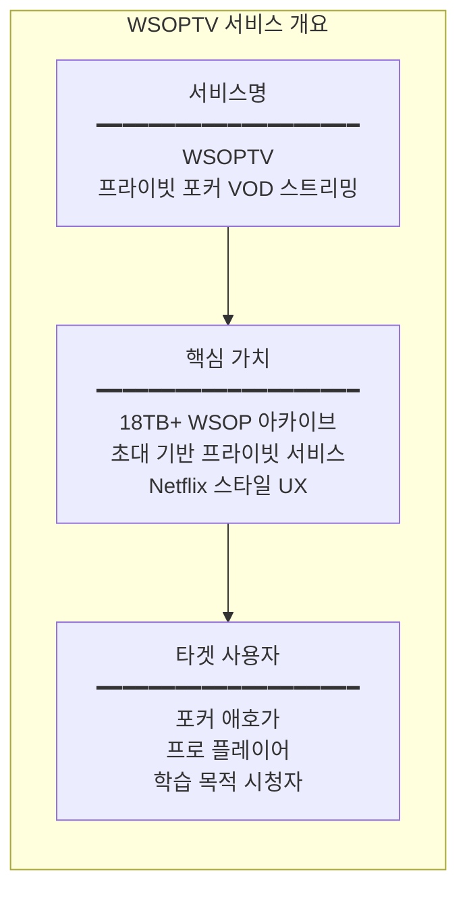

### 1.2 기술 스택

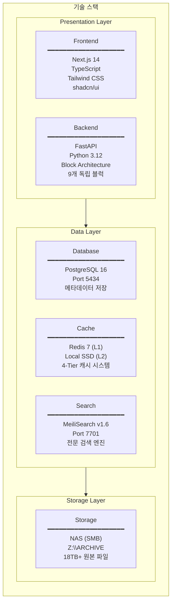

---

## 2. 시스템 아키텍처

### 2.1 Block Architecture (9개 블럭)

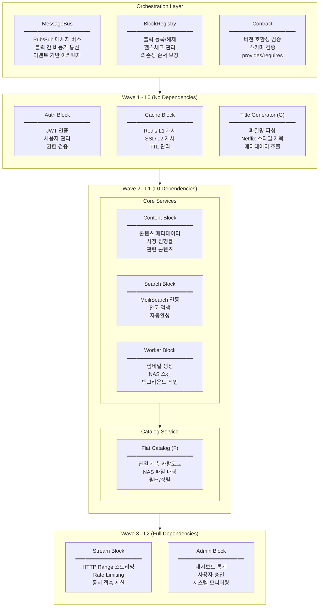

### 2.2 블럭 의존성 매트릭스

| Block | Provides | Requires | Wave |
|-------|----------|----------|------|
| **auth** | `auth.login`, `auth.verify`, `auth.user` | - | L0 |
| **cache** | `cache.get`, `cache.set`, `cache.invalidate` | - | L0 |
| **title_generator** | `title.generate`, `title.parse` | - | L0 |
| **content** | `content.list`, `content.get`, `content.progress` | `cache` | L1 |
| **search** | `search.query`, `search.suggest` | `cache` | L1 |
| **worker** | `worker.thumbnail`, `worker.scan` | `cache` | L1 |
| **flat_catalog** | `catalog.items`, `catalog.sync` | `title_generator`, `cache` | L1 |
| **stream** | `stream.url`, `stream.start`, `stream.end` | `auth`, `cache`, `content` | L2 |
| **admin** | `admin.stats`, `admin.users`, `admin.approve` | `auth`, `content`, `stream` | L2 |

### 2.3 4-Tier Cache System

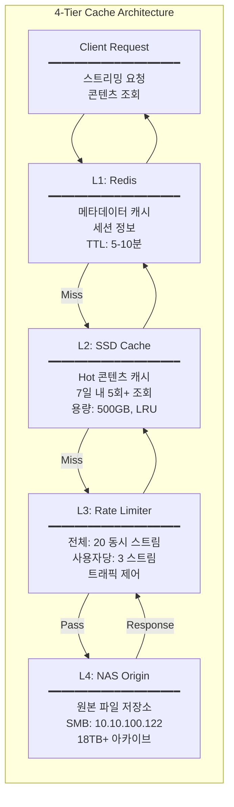

---

## 3. 사용자 흐름

### 3.1 회원가입 및 승인 흐름

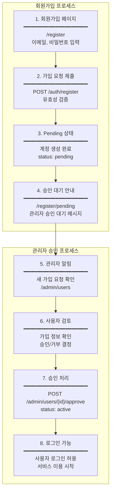

### 3.2 콘텐츠 시청 흐름

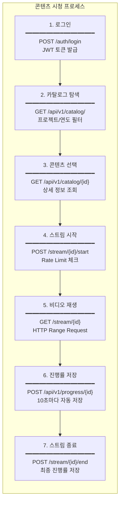

### 3.3 검색 흐름

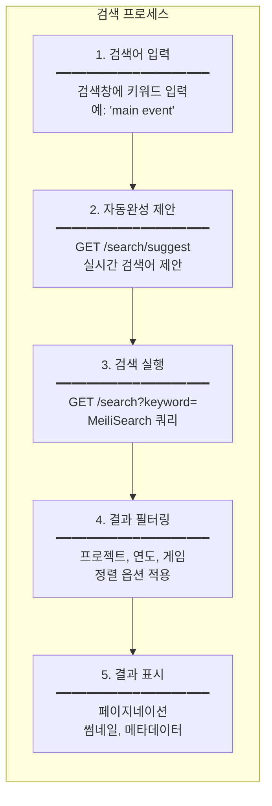

---

## 4. API 엔드포인트

### 4.1 인증 API (Auth Block)

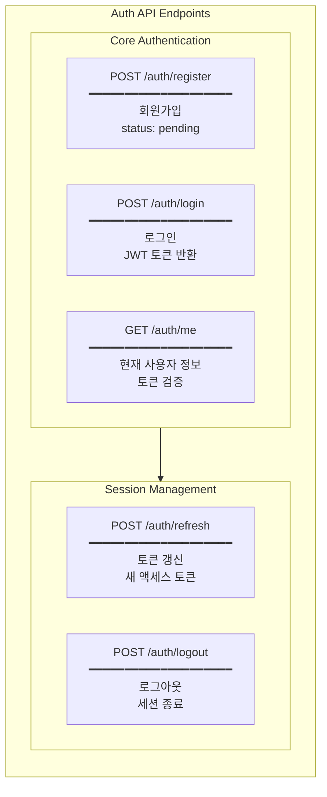

| Endpoint | Method | Request | Response | 설명 |
|----------|--------|---------|----------|------|
| `/auth/register` | POST | `{email, password}` | `{user, message}` | 회원가입 (pending) |
| `/auth/login` | POST | `{email, password}` | `{access_token, token_type}` | 로그인 |
| `/auth/me` | GET | Bearer Token | `{id, email, status, role}` | 현재 사용자 |
| `/auth/refresh` | POST | `{refresh_token}` | `{access_token}` | 토큰 갱신 |
| `/auth/logout` | POST | Bearer Token | `{message}` | 로그아웃 |

### 4.2 카탈로그 API (Flat Catalog Block)

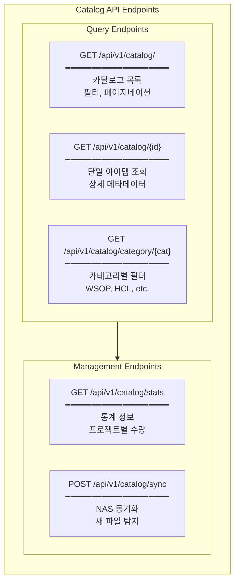

| Endpoint | Method | Parameters | Response | 설명 |
|----------|--------|------------|----------|------|
| `/api/v1/catalog/` | GET | `project_code`, `year`, `skip`, `limit` | `{items[], total}` | 목록 |
| `/api/v1/catalog/{id}` | GET | - | `CatalogItem` | 상세 |
| `/api/v1/catalog/category/{cat}` | GET | `skip`, `limit` | `{items[], total}` | 카테고리 |
| `/api/v1/catalog/stats` | GET | - | `{total, projects[]}` | 통계 |
| `/api/v1/catalog/search` | GET | `q`, `limit` | `{items[]}` | 검색 |
| `/api/v1/catalog/sync` | POST | - | `{created, updated, deleted}` | 동기화 |

### 4.3 스트리밍 API (Stream Block)

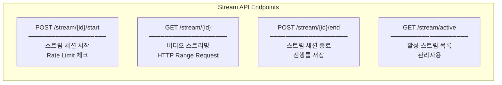

| Endpoint | Method | Headers | Response | 설명 |
|----------|--------|---------|----------|------|
| `/stream/{id}/start` | POST | Bearer Token | `{session_id, url}` | 세션 시작 |
| `/stream/{id}` | GET | `Range: bytes=0-` | Video Stream | 스트리밍 |
| `/stream/{id}/end` | POST | Bearer Token | `{duration, progress}` | 세션 종료 |
| `/stream/active` | GET | Admin Token | `{streams[]}` | 활성 목록 |

### 4.4 관리자 API (Admin Block)

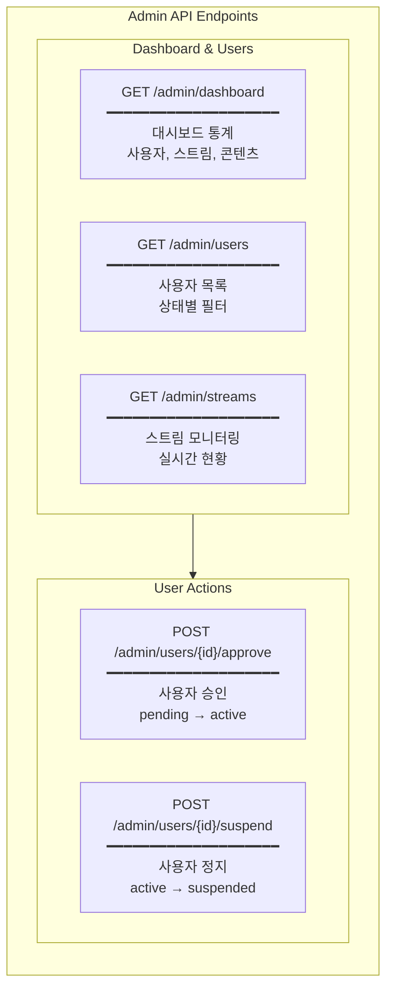

---

## 5. 데이터 모델

### 5.1 User Model

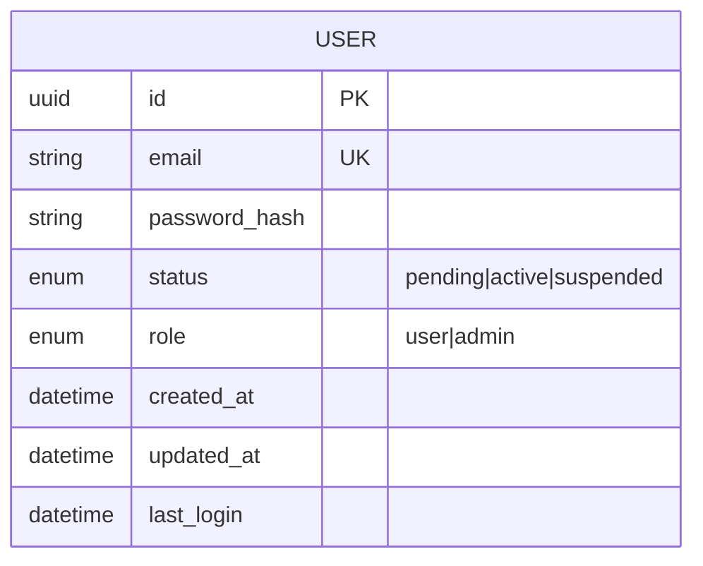

### 5.2 CatalogItem Model

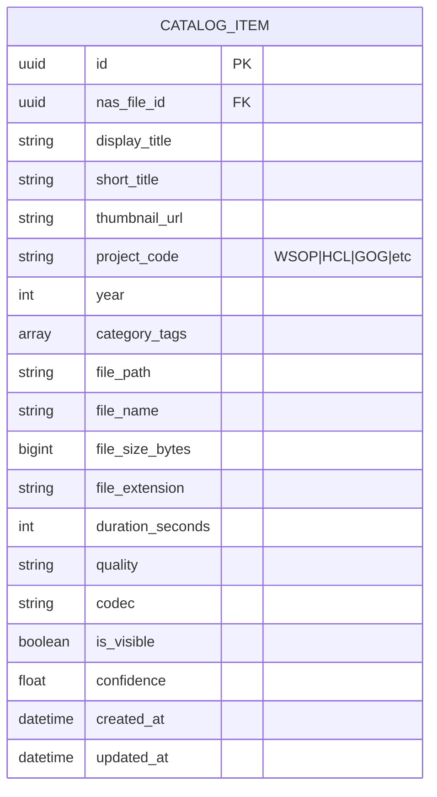

### 5.3 WatchProgress Model

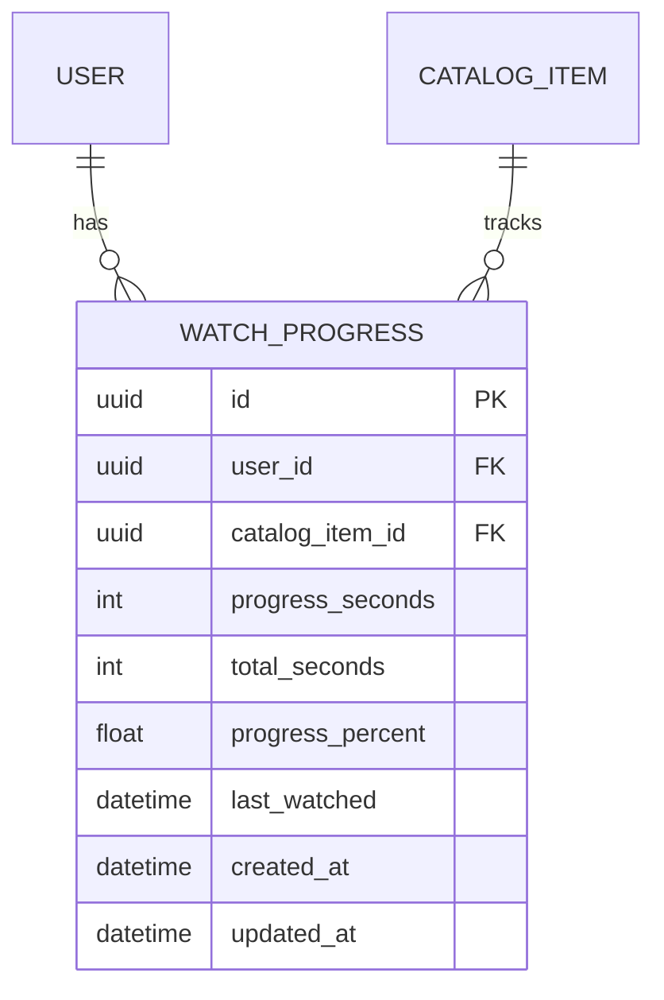

### 5.4 StreamSession Model

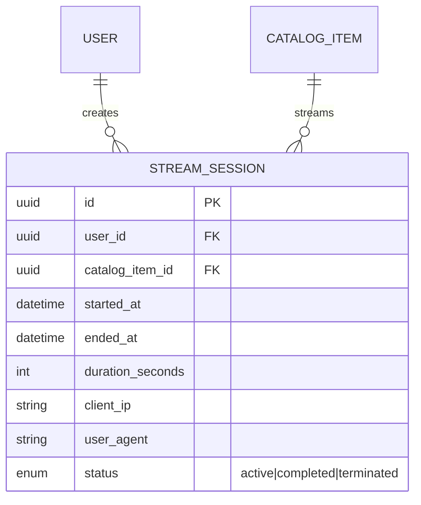

---

## 6. UI 설계

### 6.1 페이지 구조

```mermaid
flowchart TB
    subgraph Pages["페이지 구조"]
        direction TB
        ROOT["/ (Root)<br/>━━━━━━━━━━━━━━━━━━━━<br/>리다이렉트<br/>→ /browse"]

        subgraph AuthPages["인증 페이지"]
            direction TB
            LOGIN["/login<br/>━━━━━━━━━━━━━━━━━━━━<br/>로그인 폼<br/>이메일/비밀번호"]
            REGISTER["/register<br/>━━━━━━━━━━━━━━━━━━━━<br/>회원가입 폼<br/>이메일/비밀번호"]
            PENDING["/register/pending<br/>━━━━━━━━━━━━━━━━━━━━<br/>승인 대기 안내<br/>관리자 승인 필요"]
        end

        subgraph MainPages["메인 페이지"]
            direction TB
            BROWSE["/browse<br/>━━━━━━━━━━━━━━━━━━━━<br/>카탈로그 메인<br/>Netflix 스타일"]
            SEARCH_PAGE["/search<br/>━━━━━━━━━━━━━━━━━━━━<br/>검색 결과<br/>필터/정렬"]
            WATCH["/watch/{id}<br/>━━━━━━━━━━━━━━━━━━━━<br/>비디오 플레이어<br/>진행률 저장"]
            HISTORY["/history<br/>━━━━━━━━━━━━━━━━━━━━<br/>시청 기록<br/>이어보기 목록"]
        end

        subgraph AdminPages["관리자 페이지"]
            direction TB
            DASHBOARD["/admin/dashboard<br/>━━━━━━━━━━━━━━━━━━━━<br/>통계 대시보드<br/>KPI 차트"]
            USERS["/admin/users<br/>━━━━━━━━━━━━━━━━━━━━<br/>사용자 관리<br/>승인/정지"]
            STREAMS["/admin/streams<br/>━━━━━━━━━━━━━━━━━━━━<br/>스트림 모니터링<br/>실시간 현황"]
        end
    end
```

### 6.2 메인 레이아웃

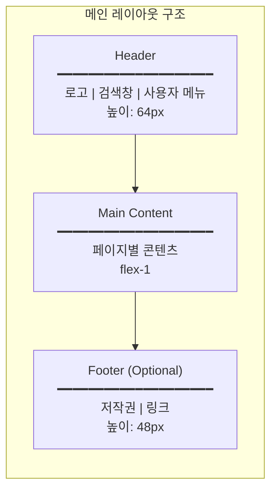

### 6.3 관리자 레이아웃

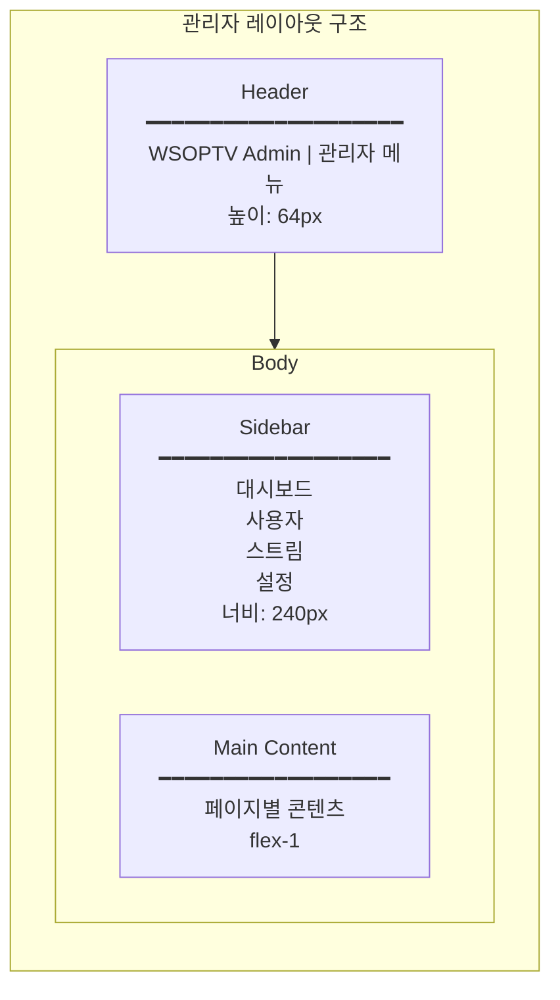

### 6.4 Browse 페이지 UI

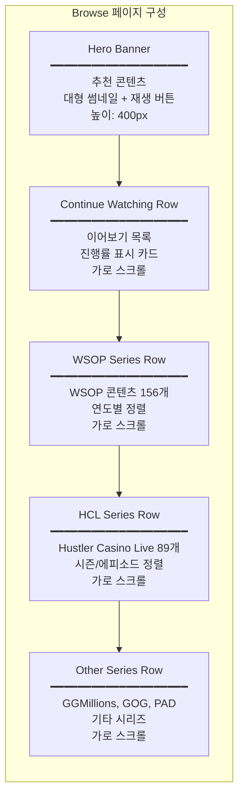

### 6.5 콘텐츠 카드 컴포넌트

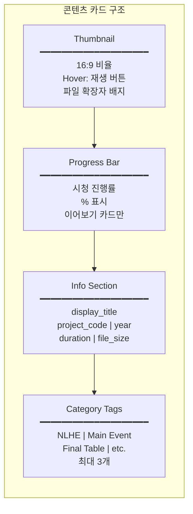

### 6.6 비디오 플레이어 UI

```mermaid
flowchart TB
    subgraph VideoPlayer["비디오 플레이어 구성"]
        direction TB
        BACK["Back Button<br/>━━━━━━━━━━━━━━━━━━━━<br/>← 이전 페이지<br/>상단 좌측"]

        VIDEO["Video Container<br/>━━━━━━━━━━━━━━━━━━━━<br/>비디오 영역<br/>16:9 비율<br/>반응형"]

        CONTROLS["Player Controls<br/>━━━━━━━━━━━━━━━━━━━━<br/>재생/일시정지 | 이전/다음<br/>타임라인 | 볼륨<br/>전체화면 | 설정"]

        META["Metadata Section<br/>━━━━━━━━━━━━━━━━━━━━<br/>제목 | 시리즈 정보<br/>진행률 바<br/>관련 콘텐츠"]

        RELATED["Related Content<br/>━━━━━━━━━━━━━━━━━━━━<br/>같은 시리즈<br/>다음 에피소드<br/>추천 콘텐츠"]

        BACK --> VIDEO --> CONTROLS --> META --> RELATED
    end
```

### 6.7 관리자 대시보드 UI

```mermaid
flowchart TB
    subgraph AdminDashboard["관리자 대시보드 구성"]
        direction TB
        STATS["Statistics Cards<br/>━━━━━━━━━━━━━━━━━━━━<br/>총 사용자 | 활성 스트림<br/>총 콘텐츠 | 오늘 시청<br/>4개 카드 그리드"]

        PENDING["Pending Users<br/>━━━━━━━━━━━━━━━━━━━━<br/>승인 대기 사용자 목록<br/>이메일 | 가입일 | 액션<br/>승인/거부 버튼"]

        ACTIVE["Active Streams<br/>━━━━━━━━━━━━━━━━━━━━<br/>실시간 스트림 현황<br/>사용자 | 콘텐츠 | 시간<br/>강제 종료 버튼"]

        CHART["Usage Chart<br/>━━━━━━━━━━━━━━━━━━━━<br/>일별 시청 통계<br/>Line Chart<br/>최근 7일"]

        STATS --> PENDING --> ACTIVE --> CHART
    end
```

---

## 7. 컴포넌트 구조

### 7.1 컴포넌트 계층

```mermaid
flowchart TB
    subgraph Components["컴포넌트 계층 구조"]
        direction TB

        subgraph Layout["Layout Components"]
            direction TB
            HEADER_COMP["Header<br/>━━━━━━━━━━━━━━━━━━━━<br/>Logo, SearchBar<br/>UserMenu"]
            SIDEBAR_COMP["Sidebar<br/>━━━━━━━━━━━━━━━━━━━━<br/>NavItems<br/>AdminOnly"]
            FOOTER_COMP["Footer<br/>━━━━━━━━━━━━━━━━━━━━<br/>Copyright<br/>Links"]
        end

        subgraph Content["Content Components"]
            direction TB
            CARD["ContentCard<br/>━━━━━━━━━━━━━━━━━━━━<br/>Thumbnail<br/>Metadata<br/>ProgressBar"]
            GRID["ContentGrid<br/>━━━━━━━━━━━━━━━━━━━━<br/>Grid Layout<br/>Responsive"]
            ROW["ContentRow<br/>━━━━━━━━━━━━━━━━━━━━<br/>Horizontal Scroll<br/>Title + Cards"]
        end

        subgraph Player["Player Components"]
            direction TB
            VIDEO_COMP["VideoPlayer<br/>━━━━━━━━━━━━━━━━━━━━<br/>ReactPlayer Wrapper<br/>HTTP Range"]
            PLAYER_CTRL["PlayerControls<br/>━━━━━━━━━━━━━━━━━━━━<br/>Play/Pause<br/>Timeline, Volume"]
            PROGRESS_SAVE["ProgressSaver<br/>━━━━━━━━━━━━━━━━━━━━<br/>Auto Save<br/>10s Interval"]
        end

        subgraph UI["UI Components (shadcn)"]
            direction TB
            subgraph UI_Row1["Form Components"]
                direction LR
                BUTTON["Button<br/>━━━━━━━━━━━━━━━━━━━━<br/>Primary, Secondary<br/>Ghost, Outline"]
                INPUT["Input<br/>━━━━━━━━━━━━━━━━━━━━<br/>Text, Password<br/>Search"]
            end
            subgraph UI_Row2["Display Components"]
                direction LR
                DIALOG["Dialog<br/>━━━━━━━━━━━━━━━━━━━━<br/>Modal<br/>Content Detail"]
                TABLE["Table<br/>━━━━━━━━━━━━━━━━━━━━<br/>DataTable<br/>Admin Lists"]
            end
            UI_Row1 --> UI_Row2
        end
    end
```

### 7.2 파일 구조

```
frontend/src/
├── app/                          # Next.js App Router
│   ├── (auth)/
│   │   ├── login/page.tsx
│   │   ├── register/page.tsx
│   │   └── register/pending/page.tsx
│   ├── (main)/
│   │   ├── browse/page.tsx
│   │   ├── search/page.tsx
│   │   ├── watch/[id]/page.tsx
│   │   └── history/page.tsx
│   ├── admin/
│   │   ├── dashboard/page.tsx
│   │   ├── users/page.tsx
│   │   └── streams/page.tsx
│   ├── layout.tsx
│   └── globals.css
├── components/
│   ├── layout/
│   │   ├── Header.tsx
│   │   ├── Sidebar.tsx
│   │   ├── Footer.tsx
│   │   └── MainLayout.tsx
│   ├── content/
│   │   ├── ContentCard.tsx
│   │   ├── ContentGrid.tsx
│   │   ├── ContentRow.tsx
│   │   └── ContentDetail.tsx
│   ├── player/
│   │   ├── VideoPlayer.tsx
│   │   ├── PlayerControls.tsx
│   │   └── ProgressSaver.tsx
│   └── ui/                       # shadcn/ui
│       ├── button.tsx
│       ├── input.tsx
│       ├── dialog.tsx
│       └── table.tsx
├── lib/
│   ├── api/
│   │   ├── auth.ts
│   │   ├── catalog.ts
│   │   ├── stream.ts
│   │   └── admin.ts
│   ├── hooks/
│   │   ├── useAuth.ts
│   │   ├── useCatalog.ts
│   │   ├── usePlayer.ts
│   │   └── useProgress.ts
│   └── stores/
│       ├── authStore.ts
│       └── playerStore.ts
└── types/
    ├── api.ts
    ├── catalog.ts
    └── user.ts
```

---

## 8. 상태 관리

### 8.1 상태 구조

```mermaid
flowchart TB
    subgraph State["상태 관리 구조"]
        direction TB

        subgraph Zustand["Zustand Stores (Client State)"]
            direction TB
            AUTH_STORE["authStore<br/>━━━━━━━━━━━━━━━━━━━━<br/>user: User | null<br/>token: string | null<br/>isAuthenticated: boolean"]
            PLAYER_STORE["playerStore<br/>━━━━━━━━━━━━━━━━━━━━<br/>currentItem: CatalogItem<br/>isPlaying: boolean<br/>volume: number"]
        end

        subgraph TanStack["TanStack Query (Server State)"]
            direction TB
            CATALOG_QUERY["useCatalog<br/>━━━━━━━━━━━━━━━━━━━━<br/>카탈로그 목록<br/>캐싱, 자동 갱신"]
            SEARCH_QUERY["useSearch<br/>━━━━━━━━━━━━━━━━━━━━<br/>검색 결과<br/>디바운싱"]
            PROGRESS_QUERY["useProgress<br/>━━━━━━━━━━━━━━━━━━━━<br/>시청 진행률<br/>낙관적 업데이트"]
        end
    end
```

### 8.2 데이터 흐름

```mermaid
flowchart TB
    subgraph DataFlow["데이터 흐름"]
        direction TB
        UI["UI Component<br/>━━━━━━━━━━━━━━━━━━━━<br/>사용자 인터랙션<br/>이벤트 발생"]
        HOOK["Custom Hook<br/>━━━━━━━━━━━━━━━━━━━━<br/>useQuery / useMutation<br/>상태 접근"]
        API_CLIENT["API Client<br/>━━━━━━━━━━━━━━━━━━━━<br/>fetch / axios<br/>Bearer Token"]
        BACKEND["Backend API<br/>━━━━━━━━━━━━━━━━━━━━<br/>FastAPI<br/>JSON Response"]
        CACHE_STATE["Query Cache<br/>━━━━━━━━━━━━━━━━━━━━<br/>캐싱된 데이터<br/>stale-while-revalidate"]

        UI --> HOOK
        HOOK --> API_CLIENT
        API_CLIENT --> BACKEND
        BACKEND --> API_CLIENT
        API_CLIENT --> CACHE_STATE
        CACHE_STATE --> HOOK
        HOOK --> UI
    end
```

---

## 9. 인증 흐름

### 9.1 JWT 토큰 흐름

```mermaid
sequenceDiagram
    participant U as User
    participant F as Frontend
    participant B as Backend
    participant DB as Database

    U->>F: 로그인 요청 (email, password)
    F->>B: POST /auth/login
    B->>DB: 사용자 조회
    DB-->>B: User (status: active)
    B->>B: 비밀번호 검증
    B->>B: JWT 토큰 생성
    B-->>F: {access_token, refresh_token}
    F->>F: localStorage 저장
    F-->>U: 로그인 성공

    Note over F,B: 이후 API 요청

    U->>F: 콘텐츠 요청
    F->>B: GET /api/v1/catalog/ (Bearer Token)
    B->>B: 토큰 검증
    B->>DB: 데이터 조회
    DB-->>B: Catalog Items
    B-->>F: JSON Response
    F-->>U: 콘텐츠 표시
```

### 9.2 토큰 갱신 흐름

```mermaid
sequenceDiagram
    participant F as Frontend
    participant B as Backend

    F->>B: API Request (Expired Token)
    B-->>F: 401 Unauthorized
    F->>B: POST /auth/refresh (refresh_token)
    B->>B: Refresh Token 검증
    B->>B: 새 Access Token 생성
    B-->>F: {access_token}
    F->>F: localStorage 업데이트
    F->>B: API Request (New Token)
    B-->>F: 200 OK
```

---

## 10. 스트리밍 흐름

### 10.1 HTTP Range Request 흐름

```mermaid
sequenceDiagram
    participant P as Player
    participant F as Frontend
    participant B as Backend
    participant C as Cache
    participant N as NAS

    P->>F: 재생 시작
    F->>B: POST /stream/{id}/start
    B->>B: Rate Limit 체크
    B->>B: 세션 생성
    B-->>F: {session_id, url}

    P->>B: GET /stream/{id} (Range: bytes=0-1048575)
    B->>C: L1 Cache 확인
    C-->>B: Cache Miss
    B->>C: L2 SSD Cache 확인
    C-->>B: Cache Miss
    B->>N: 파일 읽기
    N-->>B: File Bytes
    B->>C: L2 캐시 저장
    B-->>P: 206 Partial Content

    Note over P,B: 주기적 진행률 저장

    P->>F: 현재 위치 (10초마다)
    F->>B: POST /api/v1/progress/{id}
    B->>B: 진행률 저장
    B-->>F: 200 OK

    P->>F: 재생 종료
    F->>B: POST /stream/{id}/end
    B->>B: 세션 종료, 최종 진행률
    B-->>F: 200 OK
```

---

## 11. 성능 요구사항

### 11.1 응답 시간 목표

| 항목 | 목표 | 측정 방법 |
|------|------|----------|
| 초기 로딩 (LCP) | < 3초 | Lighthouse |
| 페이지 전환 | < 500ms | Navigation Timing |
| 검색 응답 | < 200ms | API Response Time |
| 스트리밍 시작 | < 2초 | Time to First Byte |
| 카탈로그 조회 | < 100ms | API Response Time |

### 11.2 동시성 목표

| 항목 | 목표 | 설명 |
|------|------|------|
| 동시 사용자 | 100+ | Active Sessions |
| 동시 스트림 | 20 | 전체 제한 |
| 사용자당 스트림 | 3 | 개별 제한 |
| API RPS | 1000+ | Requests/Second |

---

## 12. 보안 요구사항

### 12.1 인증/인가

```mermaid
flowchart TB
    subgraph Security["보안 체계"]
        direction TB
        S1["JWT 인증<br/>━━━━━━━━━━━━━━━━━━━━<br/>Access Token: 15분<br/>Refresh Token: 7일<br/>HS256 알고리즘"]
        S2["역할 기반 접근 제어<br/>━━━━━━━━━━━━━━━━━━━━<br/>user: 일반 기능<br/>admin: 관리 기능<br/>미승인: 접근 차단"]
        S3["Rate Limiting<br/>━━━━━━━━━━━━━━━━━━━━<br/>API: 100 req/min<br/>스트림: 3 동시/user<br/>로그인: 5회/5분"]
        S4["입력 검증<br/>━━━━━━━━━━━━━━━━━━━━<br/>Pydantic 스키마<br/>SQL Injection 방지<br/>XSS 방지"]
        S1 --> S2 --> S3 --> S4
    end
```

---

## 13. 배포 구성

### 13.1 Docker 구성

```mermaid
flowchart TB
    subgraph Docker["Docker Compose 구성"]
        direction TB
        D1["redis<br/>━━━━━━━━━━━━━━━━━━━━<br/>Port: 6380:6379<br/>L1 Cache<br/>세션, 메타데이터"]
        D2["postgres<br/>━━━━━━━━━━━━━━━━━━━━<br/>Port: 5434:5432<br/>PostgreSQL 16<br/>메타데이터 저장"]
        D3["meilisearch<br/>━━━━━━━━━━━━━━━━━━━━<br/>Port: 7701:7700<br/>MeiliSearch v1.6<br/>전문 검색"]
        D4["backend (Local)<br/>━━━━━━━━━━━━━━━━━━━━<br/>Port: 8002<br/>FastAPI<br/>NAS 접근 필요"]
        D5["frontend (Local)<br/>━━━━━━━━━━━━━━━━━━━━<br/>Port: 3000<br/>Next.js 14<br/>Dev Server"]
    end
```

---

## 14. 테스트 전략

### 14.1 테스트 레벨

```mermaid
flowchart TB
    subgraph Testing["테스트 전략"]
        direction TB
        T1["Unit Tests<br/>━━━━━━━━━━━━━━━━━━━━<br/>pytest<br/>블럭별 서비스 테스트<br/>커버리지 80%+"]
        T2["Integration Tests<br/>━━━━━━━━━━━━━━━━━━━━<br/>pytest<br/>블럭 간 통합 테스트<br/>API 엔드포인트"]
        T3["E2E Tests<br/>━━━━━━━━━━━━━━━━━━━━<br/>Playwright<br/>사용자 시나리오<br/>전체 흐름"]
        T1 --> T2 --> T3
    end
```

### 14.2 테스트 시나리오

| 시나리오 | 테스트 내용 | 도구 |
|---------|------------|------|
| 회원가입 → 승인 | 가입, 대기, 승인, 로그인 | Playwright |
| 콘텐츠 검색 → 시청 | 검색, 선택, 재생, 진행률 | Playwright |
| 관리자 승인 | 대시보드, 목록, 승인 | Playwright |
| 스트리밍 | Range Request, 진행률 저장 | pytest |
| 캐시 | L1/L2 히트율, TTL | pytest |

---

## 15. 변경 이력

| 버전 | 날짜 | 작성자 | 변경 내용 |
|------|------|--------|----------|
| 1.0.0 | 2025-12-15 | Claude | 초안 작성 |

---

*문서 끝*
