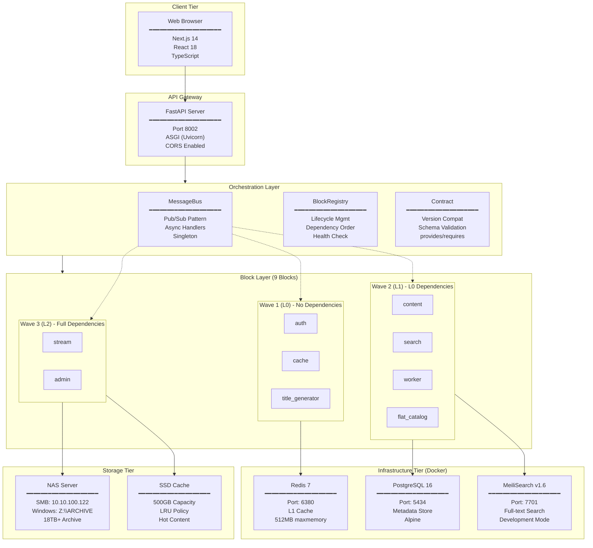
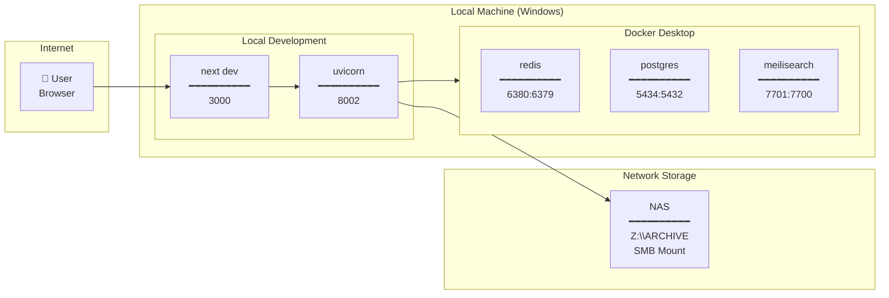
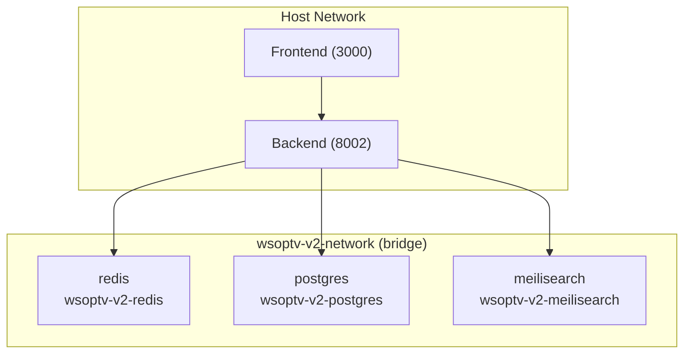
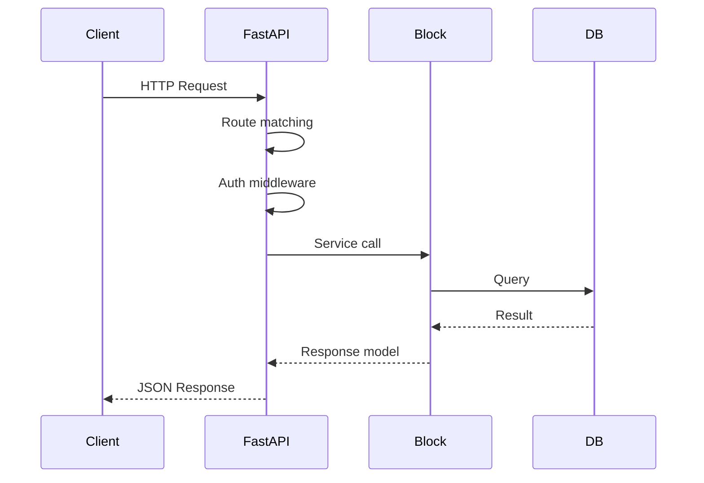
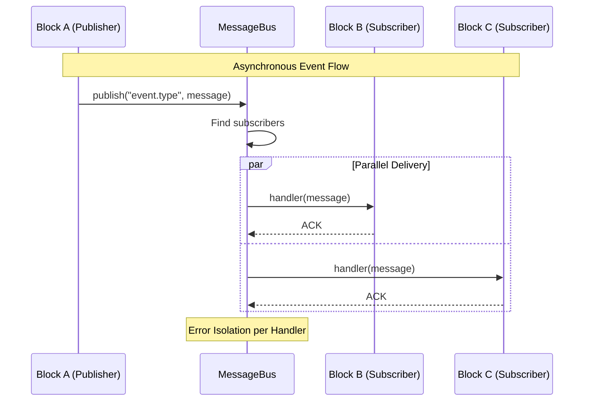
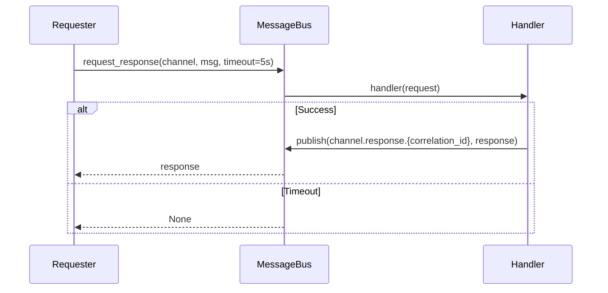
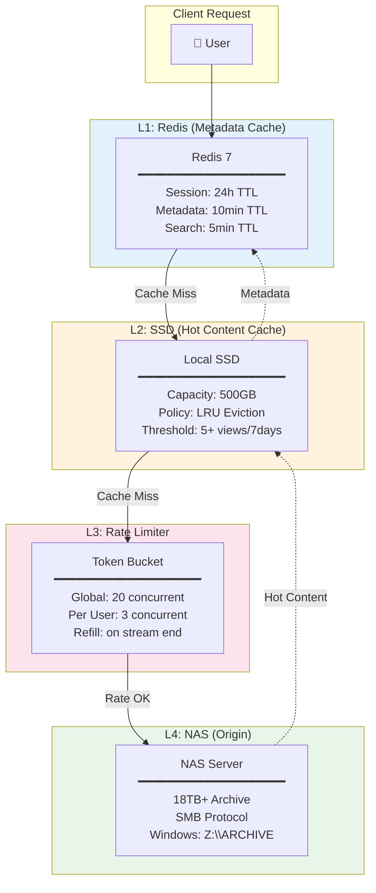
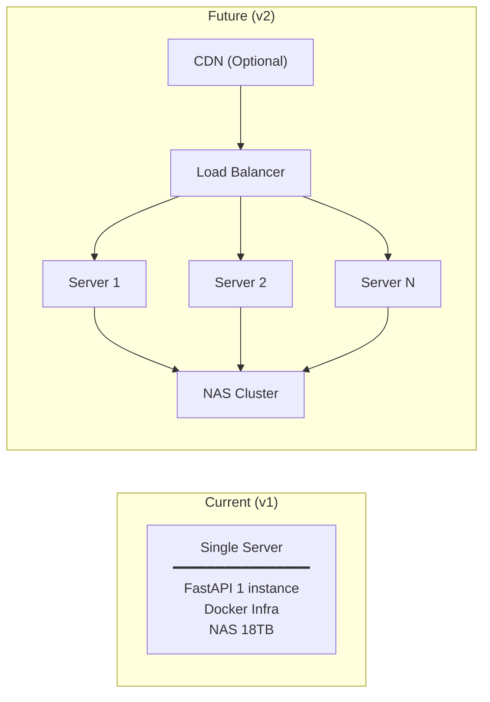

# 01. System Architecture

*← [README](./README.md) | [02-blocks.md](./02-blocks.md) →*

---

## 1. High-Level Architecture

### 1.1 System Overview

### 1.2 Layer Responsibilities

| Layer | Responsibility | Components |
|-------|---------------|------------|
| **Client** | UI 렌더링, 사용자 인터랙션 | Next.js, React, Tailwind |
| **API Gateway** | 라우팅, CORS, 인증 | FastAPI, Uvicorn |
| **Orchestration** | 블럭 조율, 메시징, 의존성 | MessageBus, Registry, Contract |
| **Block** | 비즈니스 로직, 도메인 처리 | 9개 독립 블럭 |
| **Infrastructure** | 데이터 저장, 캐싱, 검색 | Redis, PostgreSQL, MeiliSearch |
| **Storage** | 원본 파일 저장, 핫 캐싱 | NAS, SSD |

---

## 2. Network Topology

### 2.1 Development Environment

### 2.2 Port Mapping

| Service | Container Port | Host Port | Protocol |
|---------|---------------|-----------|----------|
| FastAPI Backend | 8000 | 8002 | HTTP |
| Redis | 6379 | 6380 | TCP |
| PostgreSQL | 5432 | 5434 | TCP |
| MeiliSearch | 7700 | 7701 | HTTP |
| Next.js Frontend | 3000 | 3000 | HTTP |

### 2.3 Docker Network

---

## 3. Data Flow Patterns

### 3.1 Request-Response Flow

### 3.2 Event-Driven Flow (MessageBus)

### 3.3 Request-Response via MessageBus

---

## 4. Caching Architecture

### 4.1 4-Tier Cache System

### 4.2 Cache Key Patterns

| Cache Type | Key Pattern | TTL | Example |
|------------|-------------|-----|---------|
| **Session** | `session:{user_id}` | 24h | `session:550e8400-e29b-41d4-a716-446655440000` |
| **Catalog Item** | `catalog:{item_id}` | 10min | `catalog:item-123` |
| **Search Results** | `search:{hash(query)}` | 5min | `search:a1b2c3d4` |
| **Progress** | `progress:{user_id}:{item_id}` | 1h | `progress:u1:i1` |
| **Dashboard Stats** | `stats:dashboard` | 1min | `stats:dashboard` |
| **SSD Chunk** | `hot:{item_id}:chunk:{n}` | 7d | `hot:i1:chunk:0` |

---

## 5. Technology Decisions

### 5.1 Frontend Stack

| Technology | Version | Rationale |
|------------|---------|-----------|
| **Next.js** | 14.2.0 | App Router, SSR/SSG, 최적화된 빌드 |
| **React** | 18.3.0 | Concurrent features, Suspense |
| **TypeScript** | 5.5.0 | 타입 안정성, IDE 지원 |
| **Tailwind CSS** | 3.4.4 | Utility-first, 빠른 스타일링 |
| **shadcn/ui** | - | Accessible, 커스터마이징 용이 |
| **Zustand** | 4.5.0 | 경량 상태 관리 |
| **TanStack Query** | 5.50.0 | 서버 상태 캐싱/동기화 |
| **React Player** | 2.16.0 | HTTP Range 지원 |

### 5.2 Backend Stack

| Technology | Version | Rationale |
|------------|---------|-----------|
| **FastAPI** | 0.115.0 | 비동기, 타입 힌트, OpenAPI 자동 생성 |
| **Python** | 3.12 | 최신 기능, 성능 개선 |
| **Uvicorn** | 0.32.0 | ASGI 서버, 고성능 |
| **SQLAlchemy** | 2.0.0 | ORM, 비동기 지원 |
| **asyncpg** | 0.30.0 | PostgreSQL async driver |
| **Pydantic** | 2.10.0 | 데이터 검증, 직렬화 |
| **bcrypt** | 4.2.0 | 패스워드 해싱 |
| **redis-py** | 5.2.0 | Redis 클라이언트 |

### 5.3 Infrastructure

| Technology | Version | Rationale |
|------------|---------|-----------|
| **PostgreSQL** | 16-alpine | 메타데이터, 사용자, 진행률 저장 |
| **Redis** | 7-alpine | 세션, 캐시, Rate limiting |
| **MeiliSearch** | 1.6 | 전문 검색, 자동완성 |
| **Docker Compose** | - | 개발 환경 일관성 |

---

## 6. Scalability Considerations

### 6.1 Current vs Future

### 6.2 Scaling Strategy

| Component | Horizontal | Vertical | Notes |
|-----------|------------|----------|-------|
| **FastAPI** | ✅ Stateless | ✅ | Load balancer required |
| **Redis** | ⚠️ Cluster | ✅ | Session affinity needed |
| **PostgreSQL** | ⚠️ Replica | ✅ | Read replicas for queries |
| **MeiliSearch** | ⚠️ Sharding | ✅ | Single instance sufficient |
| **NAS** | ✅ | ✅ | Multiple mount points |

---

## Related Files

| File | Purpose |
|------|---------|
| `src/main.py` | FastAPI 앱, 블럭 등록, 라우터 |
| `src/orchestration/message_bus.py` | Pub/Sub 메시지 버스 |
| `src/orchestration/registry.py` | 블럭 등록/의존성 관리 |
| `docker-compose.yml` | 인프라 서비스 정의 |

---

*← [README](./README.md) | [02-blocks.md](./02-blocks.md) →*
