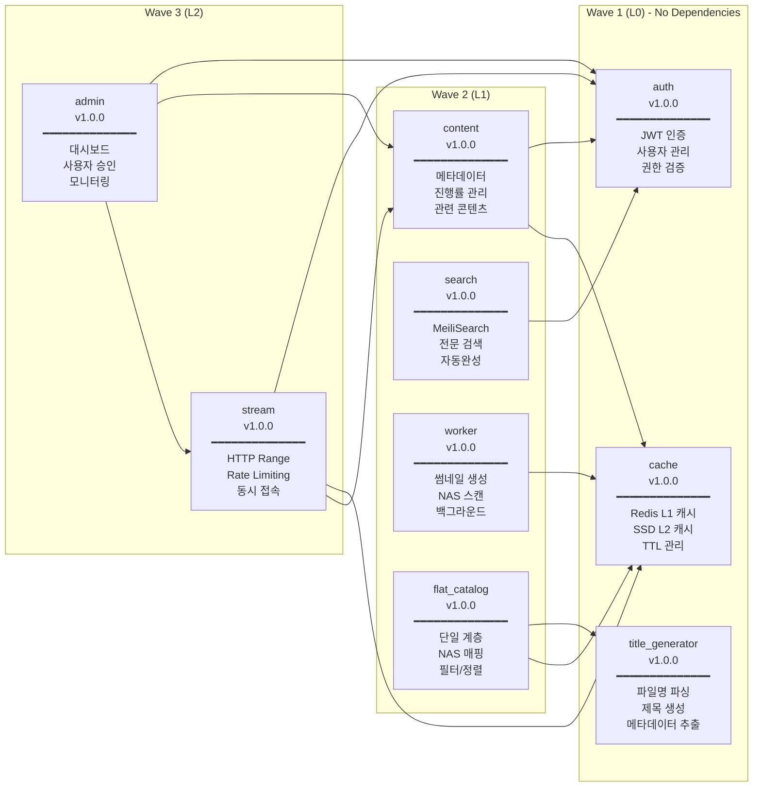
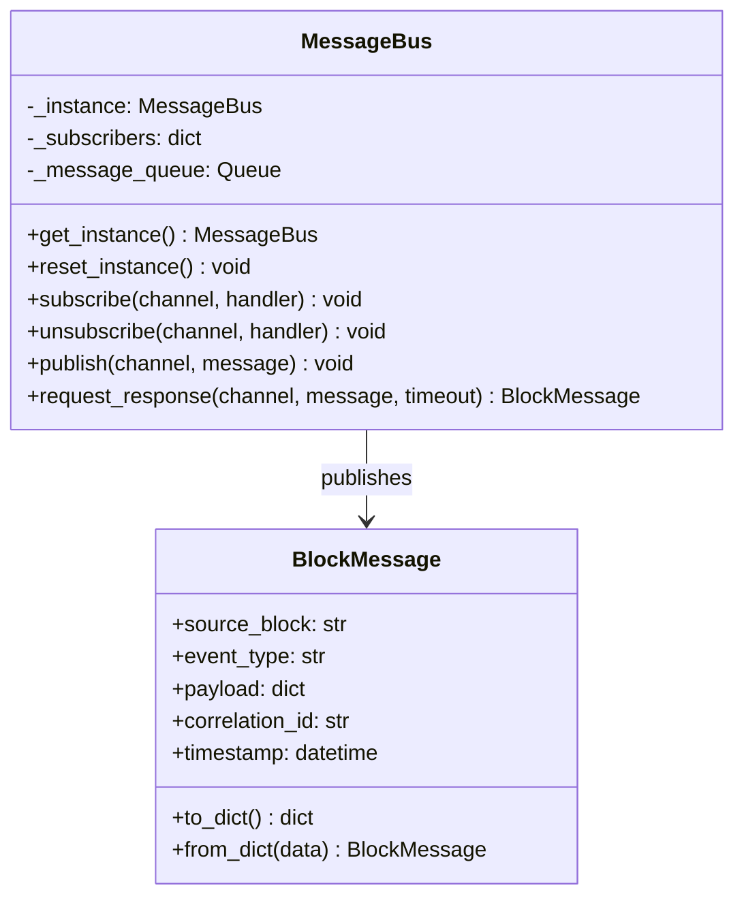
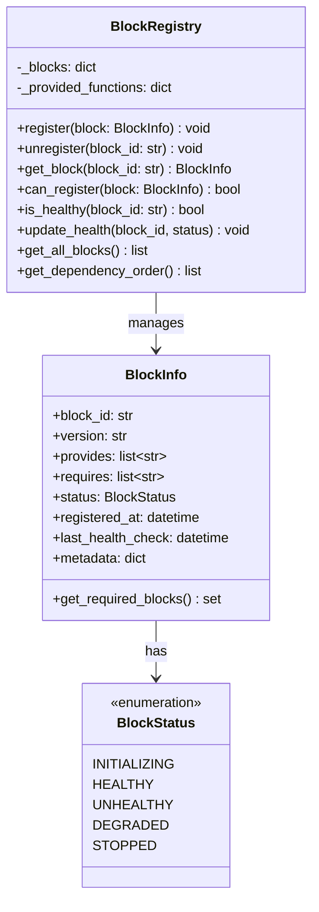
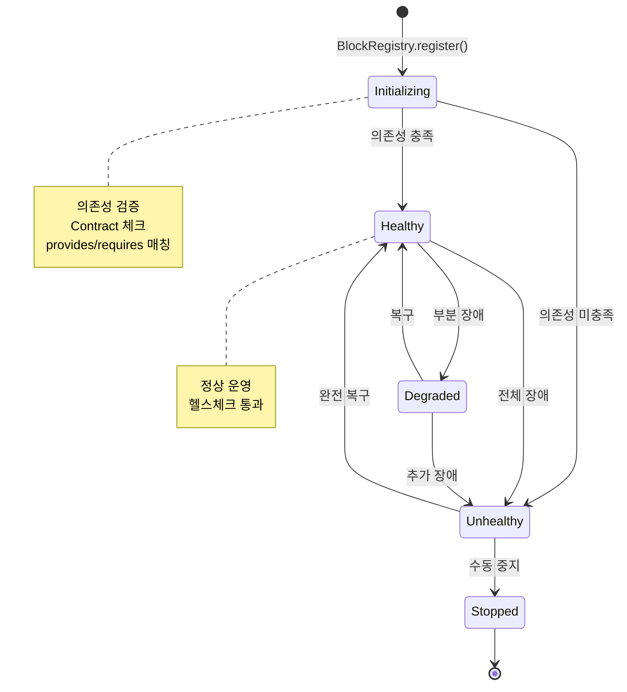
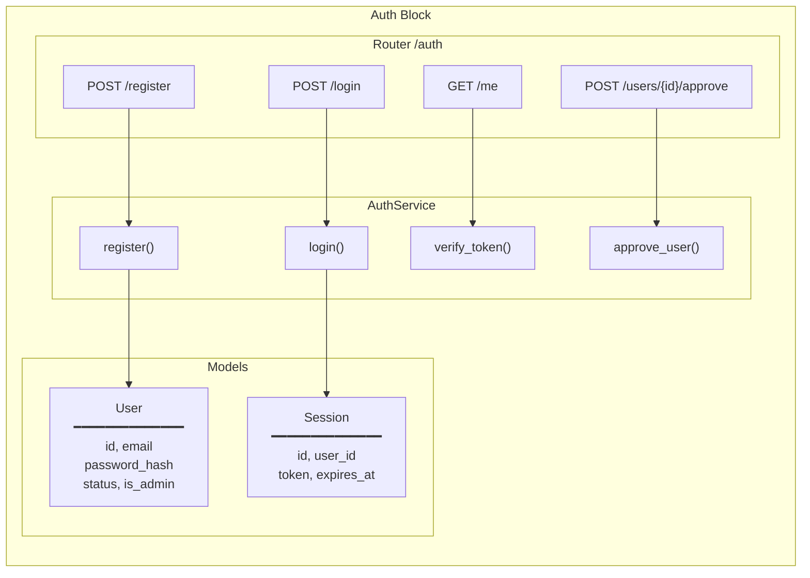
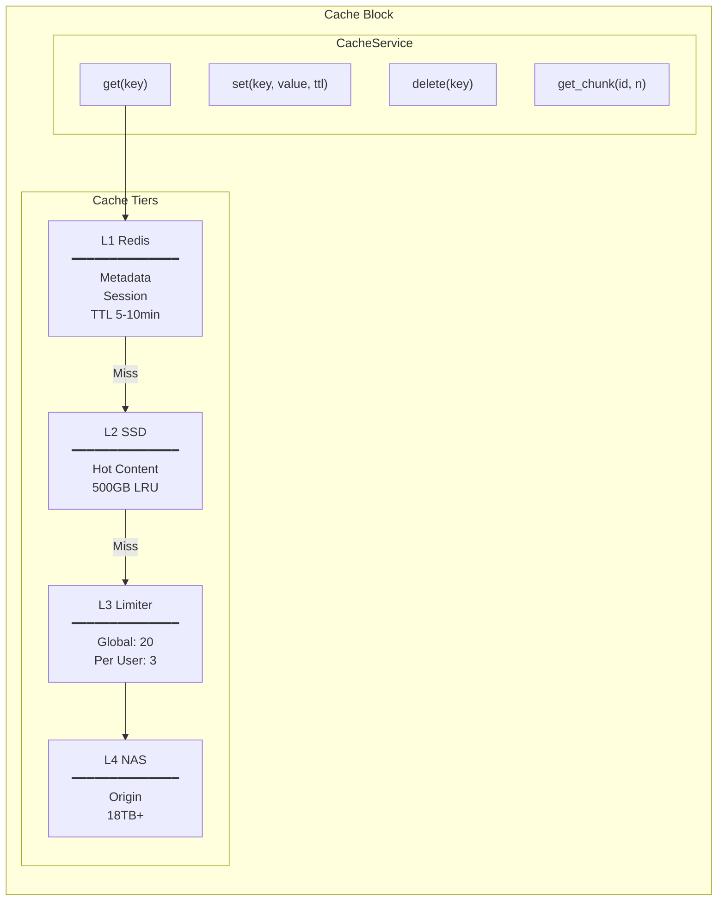
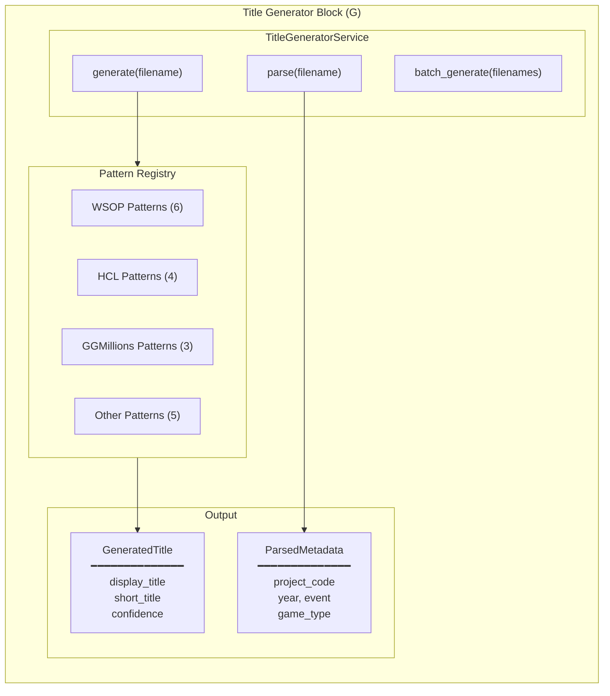
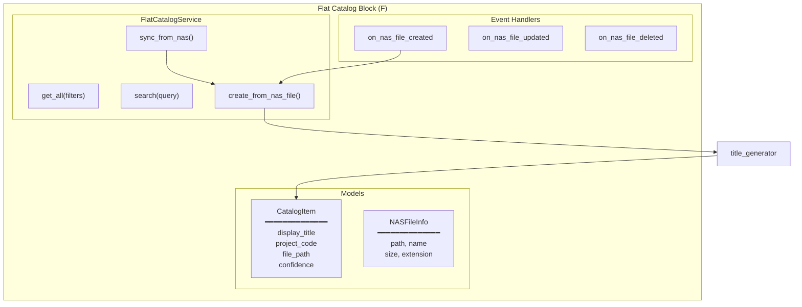
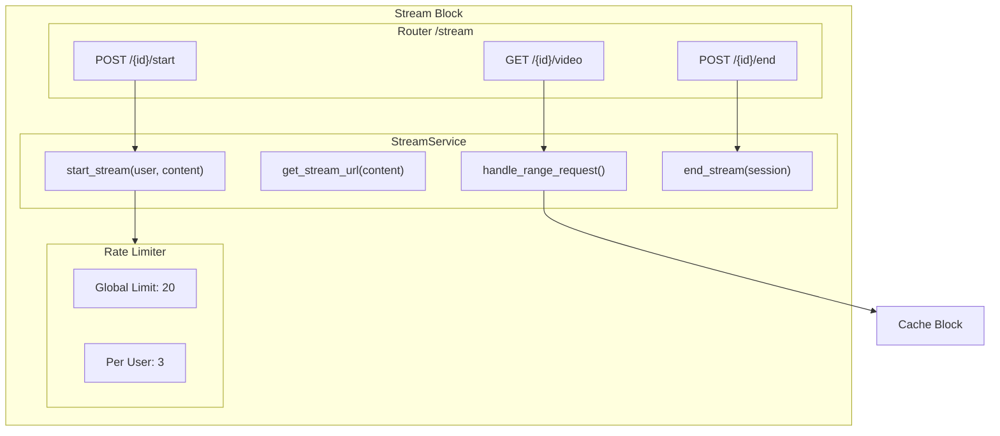
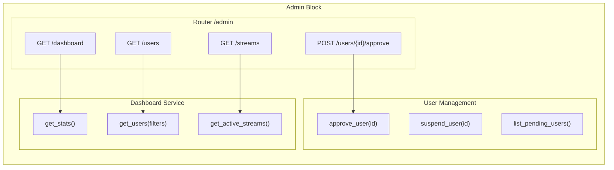

# 02. Block Architecture

*← [01-architecture.md](./01-architecture.md) | [03-api-spec.md](./03-api-spec.md) →*

---

## 1. Block Overview

### 1.1 Block Dependency Graph



### 1.2 Block Contract Matrix

| Block | provides | requires | Wave |
|-------|----------|----------|------|
| **auth** | `auth.validate_token`, `auth.get_user`, `auth.check_permission` | - | L0 |
| **cache** | `cache.get`, `cache.set`, `cache.delete` | - | L0 |
| **title_generator** | `title.generate`, `title.parse`, `title.batch` | - | L0 |
| **content** | `content.get_content`, `content.get_metadata` | `auth.validate_token`, `cache.get` | L1 |
| **search** | `search.search`, `search.index` | `auth.validate_token` | L1 |
| **worker** | `worker.enqueue`, `worker.process` | `cache.get` | L1 |
| **flat_catalog** | `catalog.list`, `catalog.get`, `catalog.search`, `catalog.sync` | `title.generate` | L1 |
| **stream** | `stream.get_url`, `stream.range` | `auth.validate_token`, `cache.get`, `content.get_metadata` | L2 |
| **admin** | `admin.dashboard`, `admin.users` | `auth.validate_token`, `auth.check_permission` | L2 |

---

## 2. Orchestration Components

### 2.1 MessageBus



**사용 예시:**

```python
from src.orchestration.message_bus import MessageBus, BlockMessage

# 메시지 발행
bus = MessageBus.get_instance()
await bus.publish("catalog.updated", BlockMessage(
    source_block="flat_catalog",
    event_type="item_created",
    payload={"item_id": "123", "display_title": "WSOP 2024 Event #5"}
))

# 메시지 구독
async def on_catalog_update(msg: BlockMessage):
    print(f"New item: {msg.payload['display_title']}")

await bus.subscribe("catalog.updated", on_catalog_update)
```

### 2.2 BlockRegistry



### 2.3 Block Lifecycle



---

## 3. Block Details

### 3.1 Auth Block (L0)



**provides:**
- `auth.validate_token` - JWT 토큰 검증
- `auth.get_user` - 사용자 정보 조회
- `auth.check_permission` - 권한 확인 (admin 등)

**File Structure:**
```
src/blocks/auth/
├── __init__.py
├── models.py      # User, Session, UserStatus
├── service.py     # AuthService
└── router.py      # FastAPI router
```

### 3.2 Cache Block (L0)



**provides:**
- `cache.get` - 캐시 조회
- `cache.set` - 캐시 저장
- `cache.delete` - 캐시 삭제

**File Structure:**
```
src/blocks/cache/
├── __init__.py
├── models.py
├── service.py
└── tiers/
    ├── __init__.py
    ├── l1_redis.py
    ├── l2_ssd.py
    ├── l3_limiter.py
    └── l4_nas.py
```

### 3.3 Title Generator Block (L0)



**provides:**
- `title.generate` - 단일 제목 생성
- `title.parse` - 메타데이터 파싱
- `title.batch` - 배치 제목 생성

**Pattern Examples:**
```python
# WSOP 패턴
r"WSOP[_\s]*(?P<year>\d{4})[_\s]*Event[_\s#]*(?P<event>\d+)[_\s]*Day[_\s]*(?P<day>\d+)"
# → "WSOP 2024 Event #5 - Day 1"

# HCL 패턴
r"HCL[_\s]*S(?P<season>\d+)E(?P<episode>\d+)"
# → "Hustler Casino Live Season 12 Episode 5"
```

### 3.4 Flat Catalog Block (L1)



**provides:**
- `catalog.list` - 카탈로그 목록
- `catalog.get` - 단일 아이템 조회
- `catalog.search` - 검색
- `catalog.sync` - NAS 동기화

**requires:**
- `title.generate` - Title Generator Block

### 3.5 Stream Block (L2)



**provides:**
- `stream.get_url` - 스트림 URL 생성
- `stream.range` - HTTP Range 처리

**requires:**
- `auth.validate_token`
- `cache.get`
- `content.get_metadata`

### 3.6 Admin Block (L2)



**provides:**
- `admin.dashboard` - 대시보드 통계
- `admin.users` - 사용자 관리

**requires:**
- `auth.validate_token`
- `auth.check_permission`

---

## 4. Inter-Block Communication

### 4.1 Event Types

| Channel | Publisher | Subscribers | Description |
|---------|-----------|-------------|-------------|
| `nas.file.created` | Worker | Flat Catalog | 새 파일 발견 |
| `nas.file.updated` | Worker | Flat Catalog | 파일 변경 |
| `nas.file.deleted` | Worker | Flat Catalog | 파일 삭제 |
| `catalog.item.created` | Flat Catalog | Search | 카탈로그 아이템 생성 |
| `catalog.item.updated` | Flat Catalog | Search | 카탈로그 아이템 수정 |
| `user.registered` | Auth | Admin | 새 사용자 가입 |
| `user.approved` | Auth | - | 사용자 승인됨 |
| `stream.started` | Stream | Admin | 스트림 시작 |
| `stream.ended` | Stream | Admin, Content | 스트림 종료 |

### 4.2 Sync Flow Example

```mermaid
sequenceDiagram
    participant Admin as Admin/Cron
    participant API as FastAPI
    participant Catalog as Flat Catalog
    participant Title as Title Generator
    participant Bus as MessageBus
    participant Search as Search Block

    Admin->>API: POST /api/v1/catalog/sync
    API->>Catalog: sync_from_nas_files(files)

    loop Each file
        Catalog->>Title: generate(filename)
        Title-->>Catalog: GeneratedTitle
        Catalog->>Catalog: Create/Update CatalogItem
        Catalog->>Bus: publish("catalog.item.created")
    end

    Bus->>Search: handler(message)
    Search->>Search: Index new item

    Catalog-->>API: SyncResult
    API-->>Admin: 200 OK
```

---

## 5. Testing

### 5.1 Test Coverage

| Block | Test File | Test Count |
|-------|-----------|------------|
| orchestration | `test_orchestration.py` | - |
| auth | `test_auth_block.py` | - |
| cache | `test_cache_block.py` | - |
| title_generator | `test_title_generator.py` | 35 |
| content | `test_content_block.py` | - |
| search | `test_search_block.py` | - |
| worker | `test_worker_block.py` | - |
| flat_catalog | `test_flat_catalog.py` | 36 |
| flat_catalog events | `test_flat_catalog_events.py` | 14 |
| flat_catalog migration | `test_flat_catalog_migration.py` | 15 |
| stream | `test_stream_block.py` | - |
| admin | `test_admin_block.py` | - |
| **Integration** | `test_catalog_title_integration.py` | 12 |

### 5.2 Test Commands

```bash
# 전체 테스트
pytest tests/ -v

# 특정 블럭 테스트
pytest tests/test_blocks/test_flat_catalog.py -v

# 통합 테스트
pytest tests/test_integration/ -v

# 커버리지
pytest tests/ --cov=src/blocks --cov-report=html
```

---

*← [01-architecture.md](./01-architecture.md) | [03-api-spec.md](./03-api-spec.md) →*
