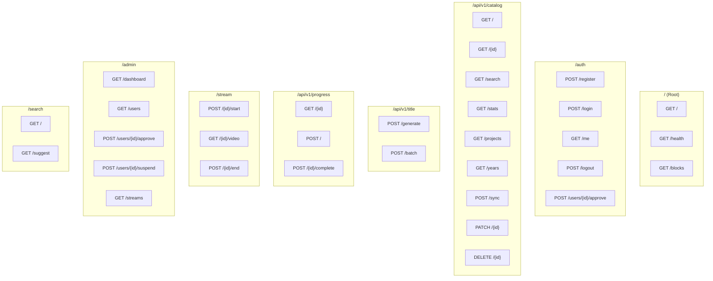

# 03. API Specification

*← [02-blocks.md](./02-blocks.md) | [04-data-models.md](./04-data-models.md) →*

---

## 1. API Overview

### 1.1 Base URL

| Environment | Base URL |
|-------------|----------|
| Development | `http://localhost:8002` |
| Production | `https://api.wsoptv.local` |

### 1.2 API Documentation

| Endpoint | Description |
|----------|-------------|
| `/docs` | Swagger UI (OpenAPI) |
| `/redoc` | ReDoc Documentation |
| `/openapi.json` | OpenAPI Schema |

### 1.3 Authentication

모든 Protected 엔드포인트는 Bearer Token 필요:

```http
Authorization: Bearer <jwt_token>
```

---

## 2. Endpoint Map



---

## 3. Auth Endpoints

### 3.1 POST /auth/register

회원가입 (Pending 상태로 생성)

**Request:**
```json
{
  "email": "user@example.com",
  "password": "securePassword123"
}
```

**Response (201 Created):**
```json
{
  "id": "550e8400-e29b-41d4-a716-446655440000",
  "email": "user@example.com",
  "status": "pending",
  "is_admin": false,
  "created_at": "2025-12-17T10:30:00Z"
}
```

**Errors:**
| Status | Description |
|--------|-------------|
| 400 | Invalid email format |
| 409 | Email already exists |

### 3.2 POST /auth/login

로그인 (Active 사용자만)

**Request:**
```json
{
  "email": "user@example.com",
  "password": "securePassword123"
}
```

**Response (200 OK):**
```json
{
  "access_token": "eyJhbGciOiJIUzI1NiIsInR5cCI6IkpXVCJ9...",
  "token_type": "bearer",
  "expires_in": 86400
}
```

**Errors:**
| Status | Description |
|--------|-------------|
| 401 | Invalid credentials |
| 403 | User not active (pending/suspended) |

### 3.3 GET /auth/me

현재 사용자 정보 (Protected)

**Response (200 OK):**
```json
{
  "id": "550e8400-e29b-41d4-a716-446655440000",
  "email": "user@example.com",
  "status": "active",
  "is_admin": false,
  "last_login": "2025-12-17T10:30:00Z"
}
```

### 3.4 POST /auth/users/{id}/approve

사용자 승인 (Admin Only)

**Response (200 OK):**
```json
{
  "id": "550e8400-e29b-41d4-a716-446655440000",
  "email": "user@example.com",
  "status": "active",
  "approved_at": "2025-12-17T11:00:00Z"
}
```

---

## 4. Catalog Endpoints

### 4.1 GET /api/v1/catalog/

카탈로그 목록 조회

**Query Parameters:**
| Parameter | Type | Default | Description |
|-----------|------|---------|-------------|
| `project_code` | string | - | 프로젝트 필터 (WSOP, HCL, etc.) |
| `year` | int | - | 연도 필터 |
| `visible_only` | bool | true | 가시성 필터 |
| `skip` | int | 0 | 페이지네이션 오프셋 |
| `limit` | int | 50 | 페이지 크기 (max: 100) |

**Response (200 OK):**
```json
{
  "items": [
    {
      "id": "cat-001",
      "display_title": "WSOP 2024 Event #5 - Day 1",
      "short_title": "WSOP 2024 #5 Day 1",
      "thumbnail_url": "/thumbnails/cat-001.jpg",
      "project_code": "WSOP",
      "year": 2024,
      "category_tags": ["NLHE", "Main Event"],
      "file_name": "WSOP_2024_Event5_Day1.mp4",
      "file_size_bytes": 2147483648,
      "file_size_formatted": "2.0 GB",
      "file_extension": "mp4",
      "duration_seconds": 9900,
      "quality": "1080p",
      "confidence": 0.95,
      "is_visible": true,
      "created_at": "2025-12-17T10:00:00Z"
    }
  ],
  "total": 156,
  "skip": 0,
  "limit": 50
}
```

### 4.2 GET /api/v1/catalog/{id}

단일 카탈로그 아이템 조회

**Response (200 OK):**
```json
{
  "id": "cat-001",
  "nas_file_id": "nas-001",
  "display_title": "WSOP 2024 Event #5 - Day 1",
  "short_title": "WSOP 2024 #5 Day 1",
  "thumbnail_url": "/thumbnails/cat-001.jpg",
  "project_code": "WSOP",
  "year": 2024,
  "category_tags": ["NLHE", "Main Event"],
  "file_path": "/mnt/nas/ARCHIVE/WSOP/2024/Event5_Day1.mp4",
  "file_name": "Event5_Day1.mp4",
  "file_size_bytes": 2147483648,
  "file_extension": "mp4",
  "duration_seconds": 9900,
  "quality": "1080p",
  "codec": "h264",
  "is_visible": true,
  "confidence": 0.95,
  "created_at": "2025-12-17T10:00:00Z",
  "updated_at": "2025-12-17T10:00:00Z"
}
```

### 4.3 GET /api/v1/catalog/search

카탈로그 검색

**Query Parameters:**
| Parameter | Type | Default | Description |
|-----------|------|---------|-------------|
| `q` | string | required | 검색어 |
| `limit` | int | 20 | 결과 개수 |

**Response (200 OK):**
```json
{
  "items": [
    {
      "id": "cat-001",
      "display_title": "WSOP 2024 Main Event - Final Table",
      "project_code": "WSOP",
      "year": 2024,
      "confidence": 0.98
    }
  ],
  "query": "main event",
  "total": 23
}
```

### 4.4 GET /api/v1/catalog/stats

카탈로그 통계

**Response (200 OK):**
```json
{
  "total_items": 325,
  "visible_items": 315,
  "hidden_items": 10,
  "projects": [
    {"code": "WSOP", "count": 156, "percentage": 48.0},
    {"code": "HCL", "count": 89, "percentage": 27.4},
    {"code": "GGMILLIONS", "count": 45, "percentage": 13.8},
    {"code": "GOG", "count": 23, "percentage": 7.1},
    {"code": "OTHER", "count": 12, "percentage": 3.7}
  ],
  "years": [2024, 2023, 2022, 2021, 2020],
  "confidence_distribution": {
    "high": 245,
    "medium": 52,
    "low": 18,
    "very_low": 10
  }
}
```

### 4.5 POST /api/v1/catalog/sync

NAS 동기화 (Admin Only)

**Request:**
```json
{
  "force": false,
  "dry_run": false
}
```

**Response (200 OK):**
```json
{
  "status": "completed",
  "created": 12,
  "updated": 5,
  "deleted": 2,
  "errors": 0,
  "duration_seconds": 2.3,
  "timestamp": "2025-12-17T11:30:25Z"
}
```

---

## 5. Title Generator Endpoints

### 5.1 POST /api/v1/title/generate

단일 제목 생성

**Request:**
```json
{
  "filename": "WSOP_2024_Event5_Day1_Part2.mp4"
}
```

**Response (200 OK):**
```json
{
  "display_title": "WSOP 2024 Event #5 - Day 1 Part 2",
  "short_title": "WSOP 2024 #5 Day 1 P2",
  "confidence": 0.95,
  "metadata": {
    "project_code": "WSOP",
    "year": 2024,
    "event_number": 5,
    "day_number": 1,
    "part_number": 2,
    "game_type": "NLHE",
    "extra_tags": []
  }
}
```

### 5.2 POST /api/v1/title/batch

배치 제목 생성 (max: 100)

**Request:**
```json
{
  "filenames": [
    "WSOP_2024_Event5_Day1.mp4",
    "HCL_S12E05_HighStakes.mkv",
    "random_poker_video.mp4"
  ]
}
```

**Response (200 OK):**
```json
{
  "results": [
    {
      "filename": "WSOP_2024_Event5_Day1.mp4",
      "display_title": "WSOP 2024 Event #5 - Day 1",
      "confidence": 0.95
    },
    {
      "filename": "HCL_S12E05_HighStakes.mkv",
      "display_title": "Hustler Casino Live Season 12 Episode 5",
      "confidence": 0.92
    },
    {
      "filename": "random_poker_video.mp4",
      "display_title": "random poker video",
      "confidence": 0.15
    }
  ],
  "total": 3,
  "high_confidence": 2,
  "low_confidence": 1
}
```

---

## 6. Stream Endpoints

### 6.1 POST /stream/{id}/start

스트림 세션 시작 (Protected)

**Response (200 OK):**
```json
{
  "session_id": "sess-001",
  "allowed": true,
  "content_id": "cat-001",
  "user_id": "user-001",
  "active_streams": 1,
  "max_streams": 3
}
```

**Response (429 Too Many Requests):**
```json
{
  "allowed": false,
  "error": "rate_limit_exceeded",
  "message": "Maximum concurrent streams (3) reached",
  "active_streams": 3
}
```

### 6.2 GET /stream/{id}/video

비디오 스트리밍 (HTTP Range)

**Request Headers:**
```http
Range: bytes=0-1048575
Authorization: Bearer <token>
```

**Response (206 Partial Content):**
```http
HTTP/1.1 206 Partial Content
Content-Type: video/mp4
Content-Range: bytes 0-1048575/2147483648
Content-Length: 1048576
Accept-Ranges: bytes

[binary video data]
```

### 6.3 POST /stream/{id}/end

스트림 세션 종료 (Protected)

**Request:**
```json
{
  "final_position": 5400,
  "completed": false
}
```

**Response (200 OK):**
```json
{
  "session_id": "sess-001",
  "status": "ended",
  "duration_seconds": 1800,
  "progress_saved": true
}
```

---

## 7. Progress Endpoints

### 7.1 GET /api/v1/progress/{id}

시청 진행률 조회 (Token or Bearer)

**Query Parameters:**
| Parameter | Type | Description |
|-----------|------|-------------|
| `token` | string | Anonymous token (optional) |

**Response (200 OK):**
```json
{
  "content_id": "cat-001",
  "position_seconds": 5400,
  "total_seconds": 9900,
  "percentage": 54.5,
  "last_watched": "2025-12-17T10:30:00Z"
}
```

### 7.2 POST /api/v1/progress

진행률 저장

**Request:**
```json
{
  "content_id": "cat-001",
  "position": 5400,
  "duration": 9900
}
```

**Response (200 OK):**
```json
{
  "status": "saved",
  "percentage": 54.5
}
```

---

## 8. Admin Endpoints

### 8.1 GET /admin/dashboard

대시보드 통계 (Admin Only)

**Response (200 OK):**
```json
{
  "users": {
    "total": 125,
    "active": 98,
    "pending": 15,
    "suspended": 12
  },
  "streams": {
    "active": 8,
    "limit": 20,
    "today_total": 47
  },
  "content": {
    "total": 325,
    "visible": 315
  },
  "usage": {
    "last_7_days": [
      {"date": "2025-12-17", "views": 47, "streams": 32},
      {"date": "2025-12-16", "views": 52, "streams": 38}
    ]
  }
}
```

### 8.2 GET /admin/users

사용자 목록 (Admin Only)

**Query Parameters:**
| Parameter | Type | Default | Description |
|-----------|------|---------|-------------|
| `status` | string | - | 상태 필터 (pending, active, suspended) |
| `page` | int | 1 | 페이지 번호 |
| `size` | int | 20 | 페이지 크기 |

**Response (200 OK):**
```json
{
  "users": [
    {
      "id": "user-001",
      "email": "user1@example.com",
      "status": "pending",
      "is_admin": false,
      "created_at": "2025-12-17T10:00:00Z",
      "last_login": null
    }
  ],
  "total": 15,
  "page": 1,
  "size": 20
}
```

### 8.3 GET /admin/streams

활성 스트림 목록 (Admin Only)

**Response (200 OK):**
```json
{
  "streams": [
    {
      "session_id": "sess-001",
      "user_id": "user-001",
      "user_email": "user1@example.com",
      "content_id": "cat-001",
      "content_title": "WSOP 2024 Event #5",
      "started_at": "2025-12-17T10:30:00Z",
      "duration_minutes": 15,
      "client_ip": "192.168.1.100"
    }
  ],
  "total": 8,
  "global_limit": 20,
  "available": 12
}
```

---

## 9. Error Responses

### 9.1 Standard Error Format

```json
{
  "detail": {
    "code": "ERROR_CODE",
    "message": "Human readable message",
    "field": "field_name"
  }
}
```

### 9.2 Common Error Codes

| Status | Code | Description |
|--------|------|-------------|
| 400 | `VALIDATION_ERROR` | 입력값 검증 실패 |
| 401 | `UNAUTHORIZED` | 인증 필요 |
| 401 | `INVALID_TOKEN` | 유효하지 않은 토큰 |
| 401 | `TOKEN_EXPIRED` | 만료된 토큰 |
| 403 | `FORBIDDEN` | 권한 부족 |
| 403 | `USER_INACTIVE` | 비활성 사용자 |
| 404 | `NOT_FOUND` | 리소스 없음 |
| 409 | `CONFLICT` | 중복 리소스 |
| 429 | `RATE_LIMITED` | 요청 제한 초과 |
| 500 | `INTERNAL_ERROR` | 서버 오류 |

---

*← [02-blocks.md](./02-blocks.md) | [04-data-models.md](./04-data-models.md) →*
