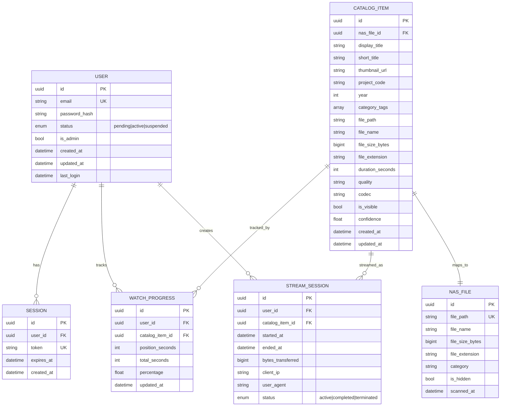
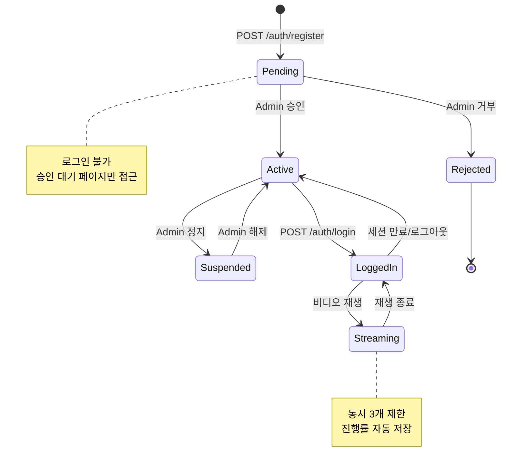
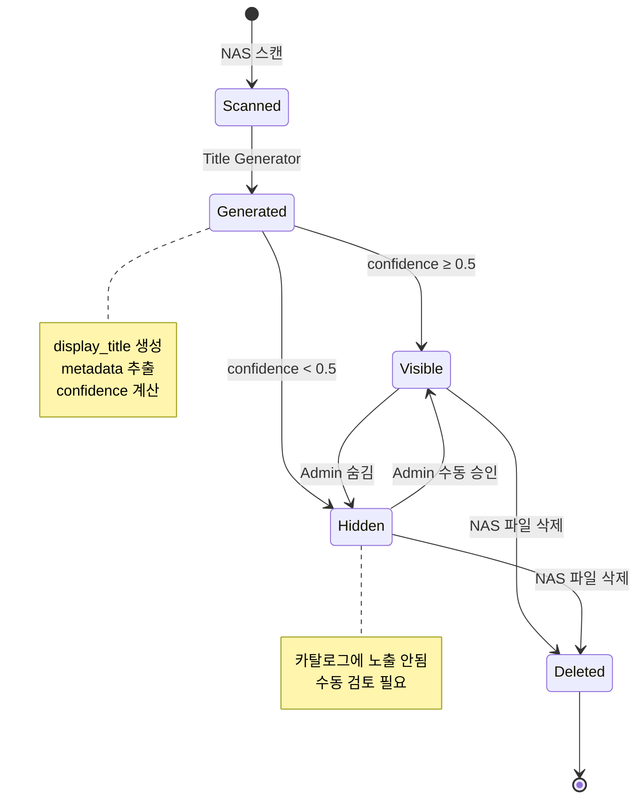
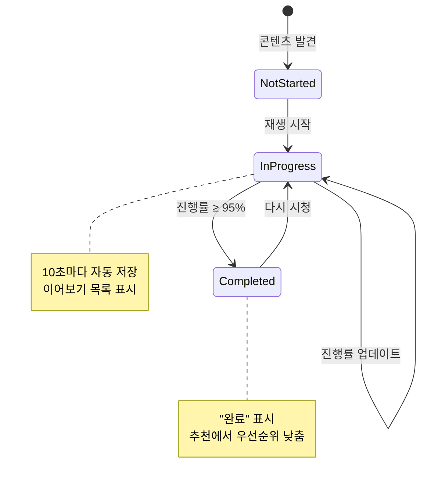
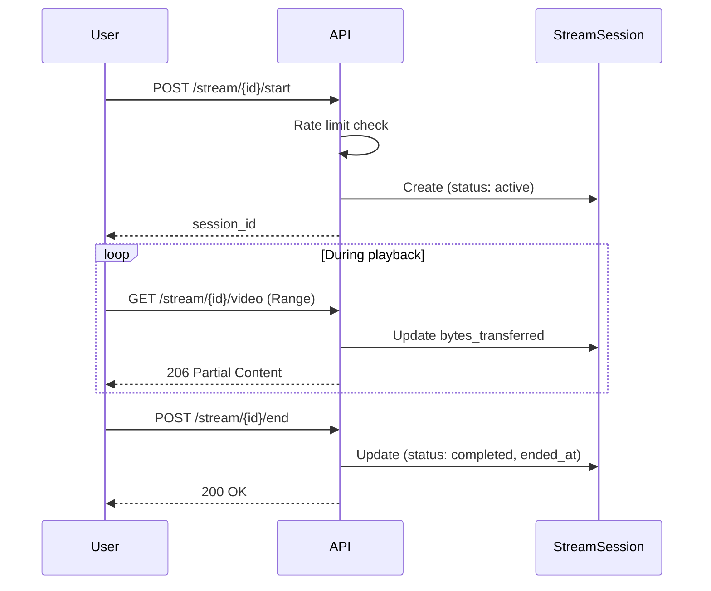

# 04. Data Models

*← [03-api-spec.md](./03-api-spec.md) | [05-user-interface.md](./05-user-interface.md) →*

---

## 1. Entity Relationship Diagram



---

## 2. User Model

### 2.1 Schema

```python
@dataclass
class User:
    id: UUID
    email: str                    # Unique
    password_hash: str            # bcrypt hashed
    status: UserStatus            # pending | active | suspended
    is_admin: bool = False
    created_at: datetime
    updated_at: datetime
    last_login: datetime | None
```

### 2.2 User Status Enum

```python
class UserStatus(str, Enum):
    PENDING = "pending"       # 가입 후 승인 대기
    ACTIVE = "active"         # 정상 활성
    SUSPENDED = "suspended"   # 정지됨
```

### 2.3 User State Machine



---

## 3. CatalogItem Model

### 3.1 Schema

```python
@dataclass
class CatalogItem:
    id: UUID
    nas_file_id: UUID | None      # NASFile FK

    # Display Info
    display_title: str            # Title Generator 생성
    short_title: str              # 축약 제목 (≤50자)
    thumbnail_url: str | None     # 썸네일 경로

    # Classification
    project_code: str             # WSOP, HCL, GGMILLIONS, etc.
    year: int | None              # 연도
    category_tags: list[str]      # [NLHE, Main Event, Final Table, ...]

    # File Info
    file_path: str                # NAS 경로
    file_name: str
    file_size_bytes: int
    file_extension: str

    # Metadata
    duration_seconds: int | None
    quality: str | None           # HD, 1080p, 4K
    codec: str | None             # h264, h265

    # State
    is_visible: bool = True
    confidence: float             # 제목 생성 신뢰도 (0.0 ~ 1.0)

    created_at: datetime
    updated_at: datetime
```

### 3.2 Project Codes

| Code | Full Name | Description |
|------|-----------|-------------|
| `WSOP` | World Series of Poker | 메인 이벤트 |
| `HCL` | Hustler Casino Live | 라이브 캐시 게임 |
| `GGMILLIONS` | GGPoker Millions | GG 토너먼트 |
| `GOG` | Game of Gold | 골드 시리즈 |
| `PAD` | Poker After Dark | 심야 캐시 |
| `MPP` | Mystery Poker Players | 미스터리 시리즈 |
| `OTHER` | Other/Unknown | 분류 불가 |

### 3.3 CatalogItem Lifecycle



---

## 4. NASFile Model

### 4.1 Schema

```python
@dataclass
class NASFileInfo:
    id: UUID
    file_path: str                # Unique, NAS 전체 경로
    file_name: str                # 파일명만
    file_size_bytes: int
    file_extension: str           # mp4, mkv, etc.
    category: str | None          # 폴더 기반 카테고리
    is_hidden: bool = False       # 숨김 파일 여부
    scanned_at: datetime
```

### 4.2 Supported Extensions

| Extension | MIME Type | Support |
|-----------|-----------|---------|
| `.mp4` | video/mp4 | ✅ Full |
| `.mkv` | video/x-matroska | ✅ Full |
| `.avi` | video/x-msvideo | ⚠️ Limited |
| `.mov` | video/quicktime | ⚠️ Limited |
| `.wmv` | video/x-ms-wmv | ⚠️ Limited |

---

## 5. WatchProgress Model

### 5.1 Schema

```python
@dataclass
class WatchProgress:
    id: UUID
    user_id: UUID                 # FK to User
    catalog_item_id: UUID         # FK to CatalogItem
    position_seconds: int         # 현재 위치
    total_seconds: int            # 전체 길이
    percentage: float             # 계산된 진행률
    updated_at: datetime          # 마지막 업데이트
```

### 5.2 Progress Calculation

```python
def calculate_percentage(position: int, total: int) -> float:
    if total <= 0:
        return 0.0
    return min(100.0, (position / total) * 100)
```

### 5.3 Progress States



---

## 6. StreamSession Model

### 6.1 Schema

```python
@dataclass
class StreamSession:
    id: UUID
    user_id: UUID                 # FK to User
    catalog_item_id: UUID         # FK to CatalogItem
    started_at: datetime
    ended_at: datetime | None
    bytes_transferred: int = 0
    client_ip: str | None
    user_agent: str | None
    status: StreamStatus          # active | completed | terminated
```

### 6.2 Stream Status

```python
class StreamStatus(str, Enum):
    ACTIVE = "active"             # 현재 스트리밍 중
    COMPLETED = "completed"       # 정상 종료
    TERMINATED = "terminated"     # 강제 종료 (Admin/Rate limit)
```

### 6.3 Stream Session Flow



---

## 7. Session Model

### 7.1 Schema

```python
@dataclass
class Session:
    id: UUID
    user_id: UUID                 # FK to User
    token: str                    # JWT token (Unique)
    expires_at: datetime
    created_at: datetime
```

### 7.2 Token Structure

```json
{
  "sub": "user-id-uuid",
  "email": "user@example.com",
  "is_admin": false,
  "exp": 1702900800,
  "iat": 1702814400
}
```

---

## 8. Generated Title Model

### 8.1 Schema (Title Generator Output)

```python
@dataclass
class GeneratedTitle:
    display_title: str            # 최종 표시 제목
    short_title: str              # 축약 제목 (≤50자)
    confidence: float             # 파싱 신뢰도 (0.0 ~ 1.0)
    metadata: ParsedMetadata

@dataclass
class ParsedMetadata:
    project_code: str | None
    year: int | None
    event_number: int | None
    event_name: str | None
    episode_number: int | None
    season_number: int | None
    day_number: int | None
    part_number: int | None
    game_type: str | None         # NLHE, PLO, etc.
    buy_in: float | None
    content_type: str | None      # Main Event, Final Table, etc.
    extra_tags: list[str]
```

### 8.2 Confidence Levels

| Range | Level | Description |
|-------|-------|-------------|
| 0.9 - 1.0 | High | 정확한 패턴 매칭 |
| 0.7 - 0.89 | Medium | 부분 매칭 |
| 0.5 - 0.69 | Low | 추측 기반 |
| 0.0 - 0.49 | Very Low | Fallback, 수동 검토 필요 |

---

## 9. Database Indexes

### 9.1 User Table

```sql
CREATE INDEX idx_user_email ON users(email);
CREATE INDEX idx_user_status ON users(status);
```

### 9.2 CatalogItem Table

```sql
CREATE INDEX idx_catalog_project ON catalog_items(project_code);
CREATE INDEX idx_catalog_year ON catalog_items(year);
CREATE INDEX idx_catalog_visible ON catalog_items(is_visible);
CREATE INDEX idx_catalog_created ON catalog_items(created_at DESC);
```

### 9.3 WatchProgress Table

```sql
CREATE UNIQUE INDEX idx_progress_user_item ON watch_progress(user_id, catalog_item_id);
CREATE INDEX idx_progress_updated ON watch_progress(updated_at DESC);
```

### 9.4 StreamSession Table

```sql
CREATE INDEX idx_stream_user ON stream_sessions(user_id);
CREATE INDEX idx_stream_status ON stream_sessions(status);
CREATE INDEX idx_stream_started ON stream_sessions(started_at DESC);
```

---

*← [03-api-spec.md](./03-api-spec.md) | [05-user-interface.md](./05-user-interface.md) →*
