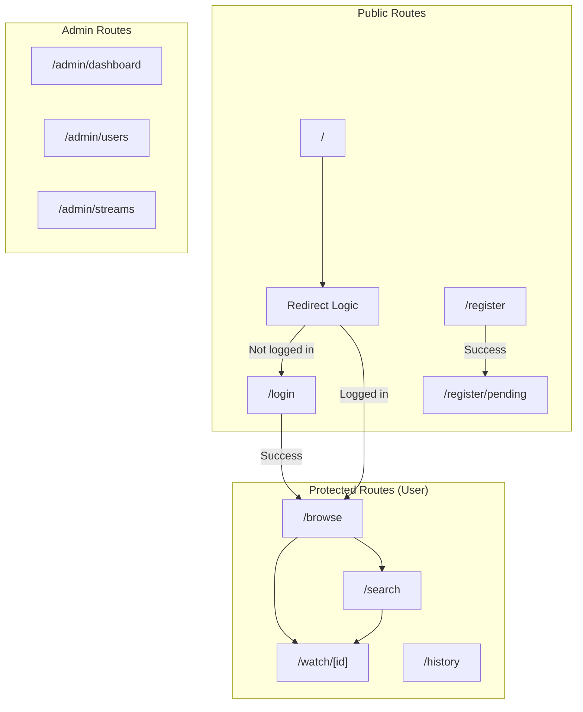
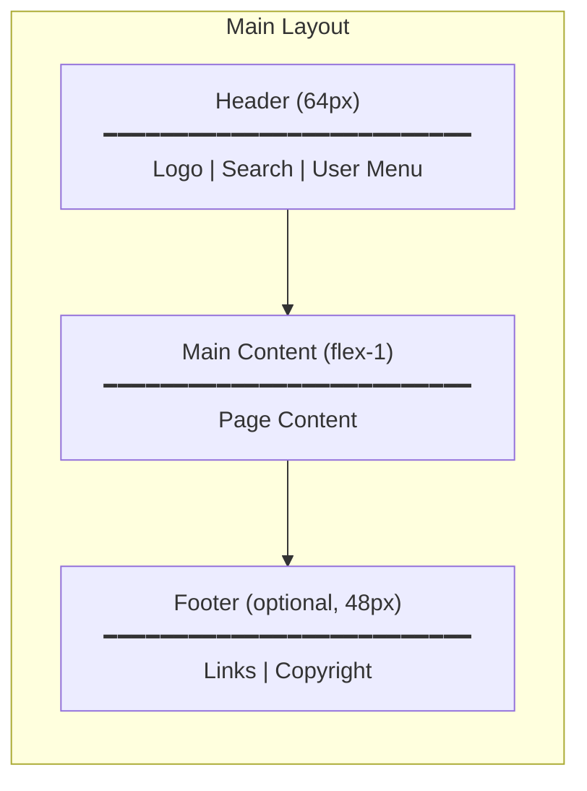
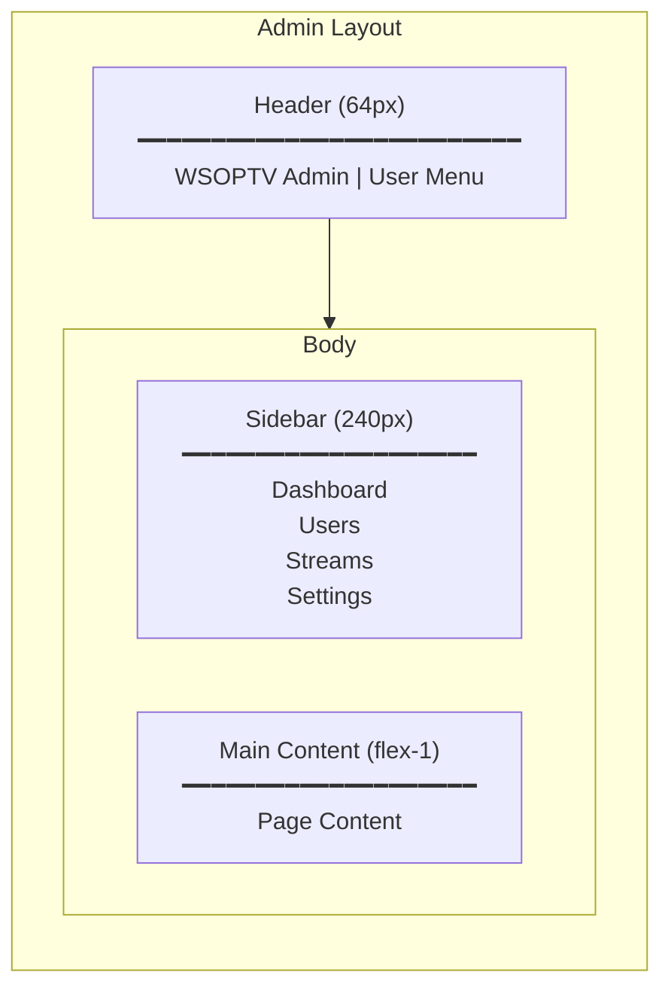
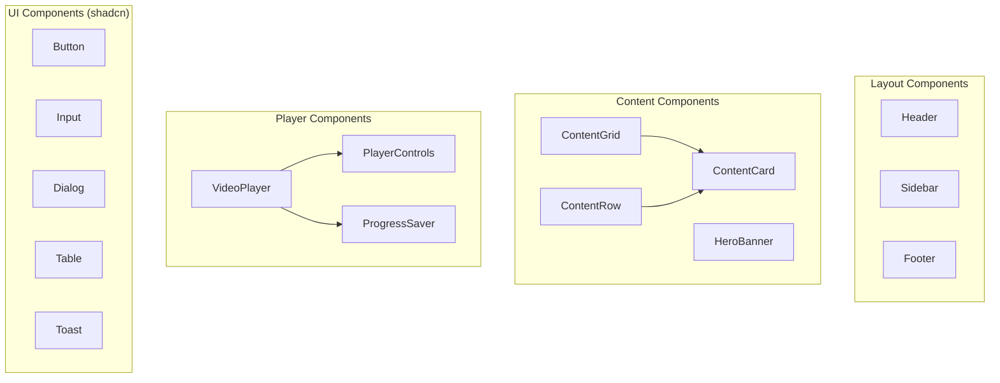
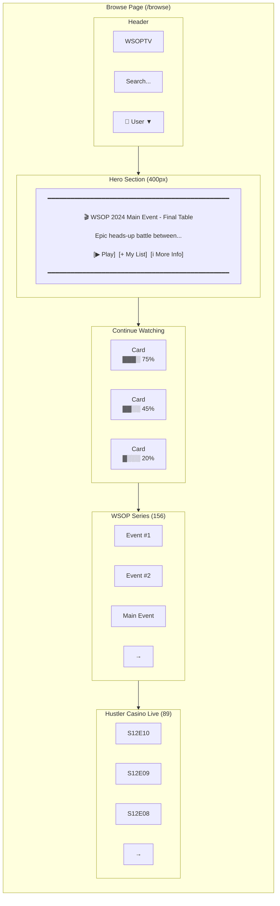
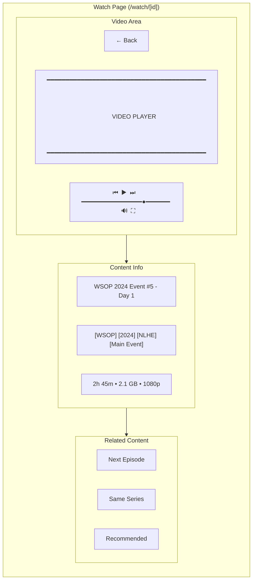
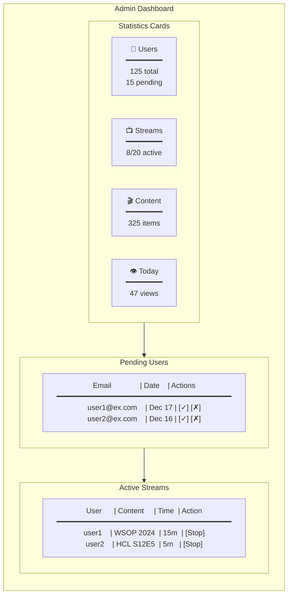
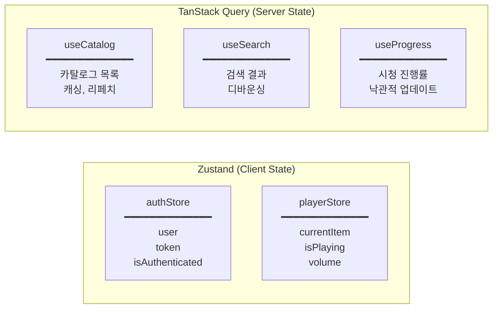
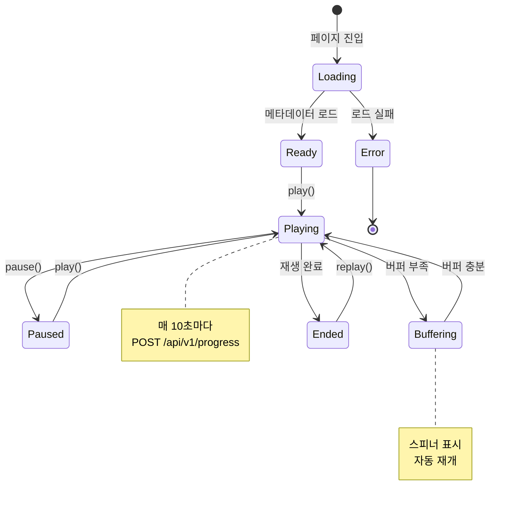

# 05. User Interface

*← [04-data-models.md](./04-data-models.md) | [06-security.md](./06-security.md) →*

---

## 1. Page Structure

### 1.1 Route Map



### 1.2 Page Authentication Matrix

| Route | Auth Required | Role | Redirect |
|-------|--------------|------|----------|
| `/` | - | - | → `/login` or `/browse` |
| `/login` | No | - | → `/browse` if logged in |
| `/register` | No | - | → `/browse` if logged in |
| `/register/pending` | No | - | - |
| `/browse` | Yes | User+ | → `/login` |
| `/search` | Yes | User+ | → `/login` |
| `/watch/[id]` | Yes | User+ | → `/login` |
| `/history` | Yes | User+ | → `/login` |
| `/admin/*` | Yes | Admin | → `/browse` if not admin |

---

## 2. Layout Architecture

### 2.1 Main Layout



### 2.2 Admin Layout



---

## 3. Component Architecture

### 3.1 Component Hierarchy



### 3.2 Directory Structure

```
frontend/src/
├── app/                          # Next.js App Router
│   ├── (auth)/
│   │   ├── login/page.tsx
│   │   ├── register/page.tsx
│   │   └── register/pending/page.tsx
│   ├── (main)/
│   │   ├── browse/page.tsx
│   │   ├── search/page.tsx
│   │   ├── watch/[id]/page.tsx
│   │   └── history/page.tsx
│   ├── admin/
│   │   ├── dashboard/page.tsx
│   │   ├── users/page.tsx
│   │   └── streams/page.tsx
│   ├── layout.tsx
│   └── globals.css
├── components/
│   ├── layout/
│   │   ├── Header.tsx
│   │   ├── Sidebar.tsx
│   │   ├── Footer.tsx
│   │   ├── MainLayout.tsx
│   │   └── AdminLayout.tsx
│   ├── content/
│   │   ├── ContentCard.tsx
│   │   ├── ContentGrid.tsx
│   │   ├── ContentRow.tsx
│   │   ├── HeroBanner.tsx
│   │   └── ContentDetail.tsx
│   ├── player/
│   │   ├── VideoPlayer.tsx
│   │   ├── PlayerControls.tsx
│   │   └── ProgressSaver.tsx
│   └── ui/                       # shadcn/ui
│       ├── button.tsx
│       ├── input.tsx
│       ├── dialog.tsx
│       └── table.tsx
├── lib/
│   ├── api/
│   │   ├── auth.ts
│   │   ├── catalog.ts
│   │   ├── stream.ts
│   │   └── admin.ts
│   ├── hooks/
│   │   ├── useAuth.ts
│   │   ├── useCatalog.ts
│   │   ├── usePlayer.ts
│   │   └── useProgress.ts
│   └── stores/
│       ├── authStore.ts
│       └── playerStore.ts
└── types/
    ├── api.ts
    ├── catalog.ts
    └── user.ts
```

---

## 4. Page Designs

### 4.1 Browse Page



### 4.2 Content Card Component

```
┌─────────────────────────────┐
│ [MP4]                [2.1GB]│  ← File info badges
│                             │
│         [Thumbnail]         │  ← 16:9 ratio
│            ▶                │  ← Play overlay on hover
│                             │
│ ▓▓▓▓▓▓▓▓▓▓░░░░░░ 65%       │  ← Progress bar (if watching)
├─────────────────────────────┤
│ WSOP 2024 Event #5          │  ← display_title (truncated)
│ Day 1                       │
│                             │
│ [NLHE] [Main Event]         │  ← category_tags
│ ⭐ 95%  •  2h 45m           │  ← confidence, duration
└─────────────────────────────┘
```

### 4.3 Watch Page



### 4.4 Admin Dashboard



---

## 5. State Management

### 5.1 Store Architecture



### 5.2 Auth Store

```typescript
interface AuthStore {
  user: User | null;
  token: string | null;
  isAuthenticated: boolean;
  isAdmin: boolean;

  // Actions
  login: (token: string, user: User) => void;
  logout: () => void;
  setUser: (user: User) => void;
}
```

### 5.3 Player Store

```typescript
interface PlayerStore {
  currentItem: CatalogItem | null;
  isPlaying: boolean;
  volume: number;
  currentTime: number;
  duration: number;

  // Actions
  setItem: (item: CatalogItem) => void;
  play: () => void;
  pause: () => void;
  setVolume: (v: number) => void;
  setCurrentTime: (t: number) => void;
}
```

---

## 6. Video Player States



---

## 7. Responsive Design

### 7.1 Breakpoints

| Name | Width | Grid Columns | Usage |
|------|-------|--------------|-------|
| `sm` | < 640px | 1-2 | Mobile |
| `md` | 640px - 1024px | 3-4 | Tablet |
| `lg` | 1024px - 1920px | 5-6 | Desktop |
| `xl` | > 1920px | 6-8 | Large Desktop |

### 7.2 Content Card Grid

```css
/* Responsive grid */
.content-grid {
  display: grid;
  gap: 1rem;
  grid-template-columns: repeat(2, 1fr);   /* Mobile */
}

@media (min-width: 640px) {
  .content-grid {
    grid-template-columns: repeat(3, 1fr); /* Tablet */
  }
}

@media (min-width: 1024px) {
  .content-grid {
    grid-template-columns: repeat(5, 1fr); /* Desktop */
  }
}

@media (min-width: 1920px) {
  .content-grid {
    grid-template-columns: repeat(6, 1fr); /* Large */
  }
}
```

---

## 8. TypeScript Interfaces

### 8.1 CatalogItem

```typescript
interface CatalogItem {
  id: string;
  nas_file_id: string | null;
  display_title: string;
  short_title: string;
  thumbnail_url: string | null;
  project_code: string;
  year: number | null;
  category_tags: string[];
  file_path: string;
  file_name: string;
  file_size_bytes: number;
  file_size_formatted: string;
  file_extension: string;
  duration_seconds: number | null;
  quality: string | null;
  is_visible: boolean;
  confidence: number;
  created_at: string;
  updated_at: string;
}
```

### 8.2 User

```typescript
interface User {
  id: string;
  email: string;
  status: 'pending' | 'active' | 'suspended';
  is_admin: boolean;
  created_at: string;
  last_login: string | null;
}
```

### 8.3 WatchProgress

```typescript
interface WatchProgress {
  content_id: string;
  position_seconds: number;
  total_seconds: number;
  percentage: number;
  last_watched: string;
}
```

---

*← [04-data-models.md](./04-data-models.md) | [06-security.md](./06-security.md) →*
