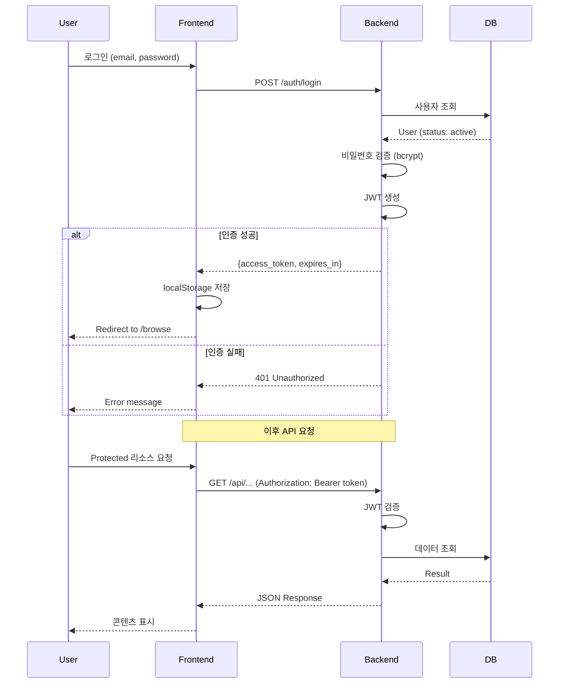
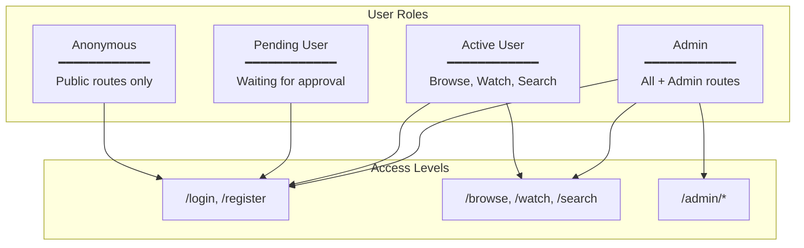
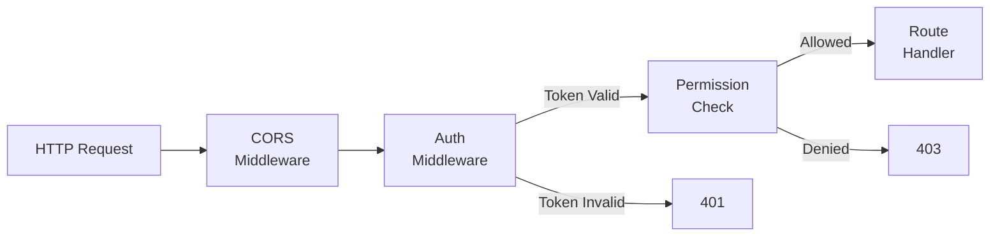
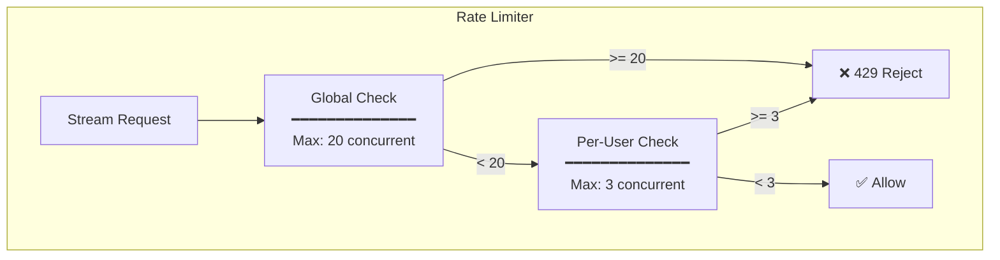
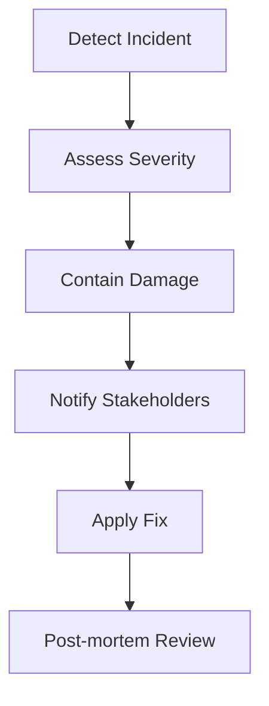

# 06. Security

*← [05-user-interface.md](./05-user-interface.md) | [07-deployment.md](./07-deployment.md) →*

---

## 1. Authentication

### 1.1 JWT Token Flow



### 1.2 Token Structure

```json
{
  "sub": "550e8400-e29b-41d4-a716-446655440000",
  "email": "user@example.com",
  "is_admin": false,
  "status": "active",
  "iat": 1702814400,
  "exp": 1702900800
}
```

### 1.3 Token Configuration

| Parameter | Value | Description |
|-----------|-------|-------------|
| Algorithm | HS256 | HMAC SHA-256 |
| Access Token TTL | 24h | 86400 seconds |
| Refresh Token TTL | 7d | 604800 seconds (Future) |
| Secret Key | ENV | `JWT_SECRET_KEY` |

---

## 2. Authorization

### 2.1 Role-Based Access Control



### 2.2 Route Protection Matrix

| Route Pattern | Anonymous | Pending | Active | Admin |
|---------------|-----------|---------|--------|-------|
| `POST /auth/register` | ✅ | ✅ | ✅ | ✅ |
| `POST /auth/login` | ✅ | ✅ | ✅ | ✅ |
| `GET /api/v1/catalog/*` | ❌ | ❌ | ✅ | ✅ |
| `GET /stream/*` | ❌ | ❌ | ✅ | ✅ |
| `POST /api/v1/progress/*` | ❌ | ❌ | ✅ | ✅ |
| `POST /api/v1/catalog/sync` | ❌ | ❌ | ❌ | ✅ |
| `GET /admin/*` | ❌ | ❌ | ❌ | ✅ |
| `POST /admin/users/*/approve` | ❌ | ❌ | ❌ | ✅ |

### 2.3 Middleware Chain



---

## 3. Password Security

### 3.1 Hashing Configuration

```python
# bcrypt configuration
BCRYPT_ROUNDS = 12  # Work factor

def hash_password(password: str) -> str:
    return bcrypt.hashpw(
        password.encode('utf-8'),
        bcrypt.gensalt(rounds=BCRYPT_ROUNDS)
    ).decode('utf-8')

def verify_password(password: str, hashed: str) -> bool:
    return bcrypt.checkpw(
        password.encode('utf-8'),
        hashed.encode('utf-8')
    )
```

### 3.2 Password Requirements

| Requirement | Rule |
|-------------|------|
| Minimum Length | 8 characters |
| Maximum Length | 128 characters |
| Character Types | Any (unicode supported) |
| Hashing | bcrypt (rounds=12) |

---

## 4. Rate Limiting

### 4.1 Stream Rate Limits



### 4.2 Rate Limit Configuration

| Resource | Limit | Window | Description |
|----------|-------|--------|-------------|
| **Streams (Global)** | 20 concurrent | - | 전체 동시 스트림 |
| **Streams (Per User)** | 3 concurrent | - | 사용자당 동시 스트림 |
| **Login Attempts** | 5 attempts | 5 min | 로그인 시도 제한 |
| **API Requests** | 100 requests | 1 min | 일반 API 요청 |
| **Search** | 30 requests | 1 min | 검색 API |

### 4.3 Rate Limit Response

```json
{
  "detail": {
    "code": "RATE_LIMITED",
    "message": "Maximum concurrent streams (3) reached",
    "retry_after": 0,
    "active_streams": 3,
    "max_streams": 3
  }
}
```

---

## 5. Input Validation

### 5.1 Pydantic Validation

```python
from pydantic import BaseModel, EmailStr, Field, validator

class RegisterRequest(BaseModel):
    email: EmailStr
    password: str = Field(..., min_length=8, max_length=128)

    @validator('password')
    def password_strength(cls, v):
        if not v:
            raise ValueError('Password is required')
        return v

class LoginRequest(BaseModel):
    email: EmailStr
    password: str
```

### 5.2 SQL Injection Prevention

- **SQLAlchemy ORM**: 파라미터화된 쿼리 자동 사용
- **No Raw SQL**: 직접 SQL 문자열 사용 금지
- **Input Sanitization**: Pydantic 모델로 입력 검증

```python
# Good - SQLAlchemy ORM
user = session.query(User).filter(User.email == email).first()

# Bad - Raw SQL (금지)
# cursor.execute(f"SELECT * FROM users WHERE email = '{email}'")
```

### 5.3 XSS Prevention

- **React Escape**: JSX 자동 이스케이프
- **Content-Type**: `application/json` 응답
- **CSP Header**: Content Security Policy (Future)

---

## 6. CORS Configuration

### 6.1 Current Settings

```python
app.add_middleware(
    CORSMiddleware,
    allow_origins=["*"],          # Development only!
    allow_credentials=True,
    allow_methods=["*"],
    allow_headers=["*"],
)
```

### 6.2 Production Settings (Recommended)

```python
app.add_middleware(
    CORSMiddleware,
    allow_origins=[
        "https://wsoptv.local",
        "https://admin.wsoptv.local",
    ],
    allow_credentials=True,
    allow_methods=["GET", "POST", "PUT", "PATCH", "DELETE"],
    allow_headers=["Authorization", "Content-Type"],
)
```

---

## 7. Security Checklist

### 7.1 Authentication & Authorization

| Item | Status | Notes |
|------|--------|-------|
| JWT Token Authentication | ✅ | HS256 |
| Token Expiry | ✅ | 24h |
| Refresh Token | ⏳ | Planned |
| Role-based Access | ✅ | User/Admin |
| Route Protection | ✅ | Middleware |
| Password Hashing | ✅ | bcrypt |

### 7.2 Data Protection

| Item | Status | Notes |
|------|--------|-------|
| SQL Injection Prevention | ✅ | SQLAlchemy ORM |
| XSS Prevention | ⏳ | React + CSP |
| CSRF Protection | ⏳ | Planned |
| Input Validation | ✅ | Pydantic |
| Output Encoding | ✅ | JSON only |

### 7.3 Transport & Infrastructure

| Item | Status | Notes |
|------|--------|-------|
| HTTPS | ⏳ | Production only |
| CORS Policy | ⚠️ | `*` in dev |
| Rate Limiting (Streams) | ✅ | 20 global, 3/user |
| Rate Limiting (API) | ⏳ | Planned |
| Security Headers | ⏳ | Planned |

### 7.4 Logging & Monitoring

| Item | Status | Notes |
|------|--------|-------|
| Auth Event Logging | ⏳ | Planned |
| Failed Login Tracking | ⏳ | Planned |
| Suspicious Activity Alerts | ⏳ | Planned |

---

## 8. Security Headers (Future)

### 8.1 Recommended Headers

```http
# Production Headers
Strict-Transport-Security: max-age=31536000; includeSubDomains
X-Content-Type-Options: nosniff
X-Frame-Options: DENY
X-XSS-Protection: 1; mode=block
Content-Security-Policy: default-src 'self'; script-src 'self' 'unsafe-inline'
Referrer-Policy: strict-origin-when-cross-origin
```

---

## 9. Incident Response

### 9.1 Security Incident Types

| Type | Severity | Response |
|------|----------|----------|
| Failed Login Burst | Medium | Temporary IP block |
| Unauthorized Admin Access | High | Session invalidation |
| Token Leak | Critical | Rotate JWT secret |
| SQL Injection Attempt | High | Log & block |
| Rate Limit Bypass | Medium | Review & patch |

### 9.2 Response Procedure



---

*← [05-user-interface.md](./05-user-interface.md) | [07-deployment.md](./07-deployment.md) →*
