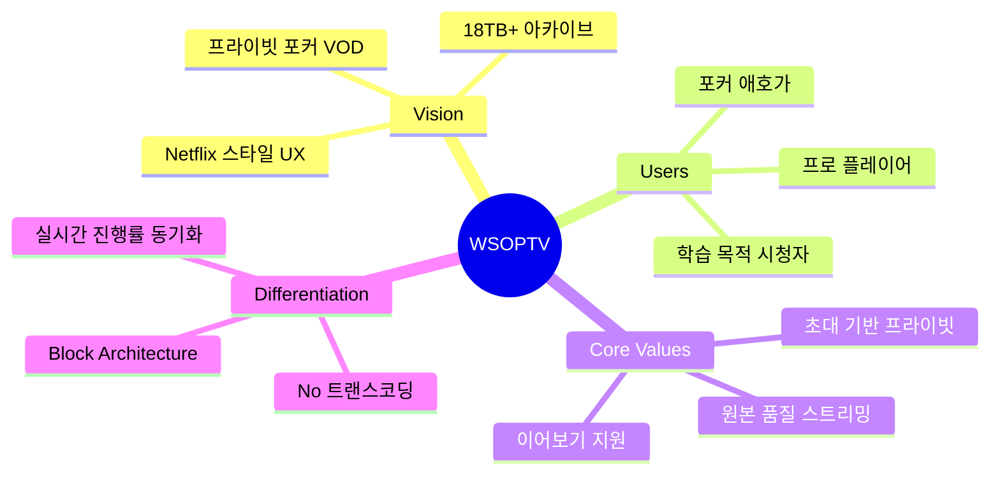
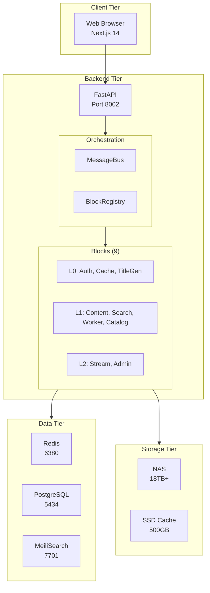
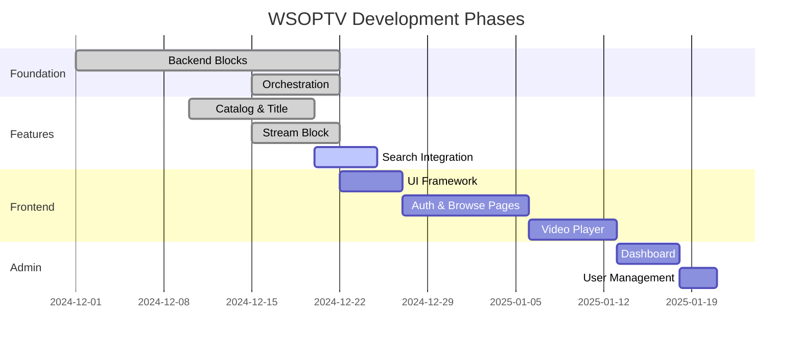

# PRD-0010: WSOPTV Master Architecture

**Version**: 1.0.0 | **Status**: Draft | **Created**: 2025-12-17

> WSOPTV 전체 시스템 아키텍처, 기능, UI/UX를 통합하는 마스터 PRD

---

## 1. Executive Summary

### 1.1 Product Vision



### 1.2 Tech Stack

| Layer | Technology |
|-------|------------|
| **Frontend** | Next.js 14, TypeScript, Tailwind CSS, shadcn/ui |
| **Backend** | FastAPI, Python 3.12, Block Architecture (9 Blocks) |
| **Database** | PostgreSQL 16 (Docker: port 5434) |
| **Cache** | Redis 7 (L1), Local SSD (L2) |
| **Search** | MeiliSearch v1.6 |
| **Storage** | NAS (SMB, `Z:\ARCHIVE` → `/mnt/nas/ARCHIVE`) |

### 1.3 Key Metrics

| Metric | Target | Measurement |
|--------|--------|-------------|
| **User Adoption** | 50+ active users | Weekly Active Users |
| **Content Engagement** | 70% completion rate | Average watch percentage |
| **System Reliability** | 99.5% uptime | Monthly availability |
| **Performance** | < 2s stream start | P95 latency |

---

## 2. Document Structure

이 PRD는 다음 문서들로 구성됩니다:

```
0010-master-architecture/
├── README.md                 # 이 파일 - Executive Summary
├── 01-architecture.md        # 시스템 아키텍처
├── 02-blocks.md              # Block Architecture 상세
├── 03-api-spec.md            # API Specification
├── 04-data-models.md         # Data Models & ER Diagram
├── 05-user-interface.md      # UI/UX Design
├── 06-security.md            # Authentication & Security
├── 07-deployment.md          # Deployment & DevOps
└── diagrams/                 # 다이어그램 에셋
    ├── system-architecture.mmd
    ├── block-dependencies.mmd
    └── data-flow.mmd
```

### 2.1 문서 네비게이션

| 문서 | 내용 | 대상 독자 |
|------|------|----------|
| [01-architecture.md](./01-architecture.md) | 전체 시스템 구조, 네트워크 토폴로지 | 아키텍트, 시니어 개발자 |
| [02-blocks.md](./02-blocks.md) | 9개 Block 상세, 의존성, 통신 패턴 | 백엔드 개발자 |
| [03-api-spec.md](./03-api-spec.md) | REST API 명세, 요청/응답 스키마 | 풀스택 개발자 |
| [04-data-models.md](./04-data-models.md) | DB 스키마, ER 다이어그램, 상태 전이 | DB 관리자, 백엔드 |
| [05-user-interface.md](./05-user-interface.md) | 페이지 구조, 컴포넌트, UI 흐름 | 프론트엔드 개발자 |
| [06-security.md](./06-security.md) | 인증, 권한, 보안 체크리스트 | 보안 담당자 |
| [07-deployment.md](./07-deployment.md) | Docker, 환경설정, 모니터링 | DevOps, 운영 |

---

## 3. System Overview

### 3.1 High-Level Architecture



### 3.2 Core Features

| Feature | Description | Status |
|---------|-------------|--------|
| **회원가입/승인** | 초대 기반, 관리자 승인 필수 | ✅ |
| **카탈로그** | Netflix 스타일 단일 계층 | ✅ |
| **제목 생성** | 파일명 → 표시 제목 자동 변환 | ✅ |
| **스트리밍** | HTTP Range, 원본 품질 | ✅ |
| **이어보기** | 진행률 자동 저장/복원 | ✅ |
| **검색** | MeiliSearch 전문 검색 | 🔄 |
| **관리자** | 대시보드, 사용자/스트림 관리 | ⏳ |

---

## 4. Quick Links

### 4.1 관련 PRD 문서

| 문서 | 설명 |
|------|------|
| [PRD-0002](../0002-prd-flat-catalog-title-generator.md) | Flat Catalog & Title Generator |
| [PRD-0003](../0003-prd-wsoptv-ott-complete.md) | OTT 플랫폼 완전 기획서 |
| [PRD-0007](../0007-prd-wsoptv-complete.md) | 통합 PRD |
| [PRD-0009](../0009-prd-pokergo-ui-workflow-design.md) | PokerGO UI 분석 |

### 4.2 코드베이스

| 경로 | 설명 |
|------|------|
| `src/orchestration/` | MessageBus, BlockRegistry, Contract |
| `src/blocks/` | 9개 Block 구현 |
| `frontend/src/` | Next.js 프론트엔드 |
| `tests/` | pytest 테스트 |

### 4.3 명령어 빠른 참조

```bash
# Backend
pytest tests/test_orchestration.py -v      # 테스트
ruff check src/ tests/                      # 린트
python -m uvicorn src.main:app --port 8002  # 서버 시작

# Frontend
npm run dev                                  # 개발 서버
npm run build                               # 빌드
npm run lint                                # ESLint

# Docker
docker-compose up -d                        # 인프라 시작
```

---

## 5. Roadmap



---

## Document History

| Version | Date | Author | Changes |
|---------|------|--------|---------|
| 1.0.0 | 2025-12-17 | Claude Code | 구조화된 마스터 PRD 초안 |

---

*다음: [01-architecture.md](./01-architecture.md)*
