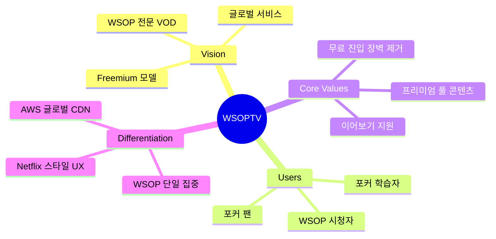
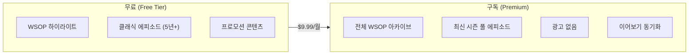
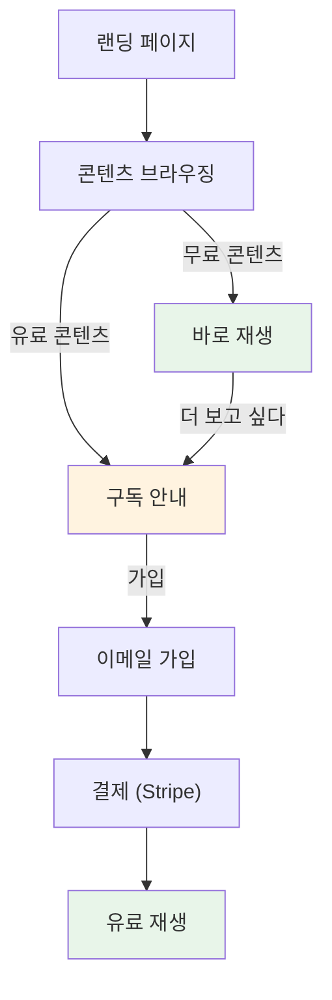
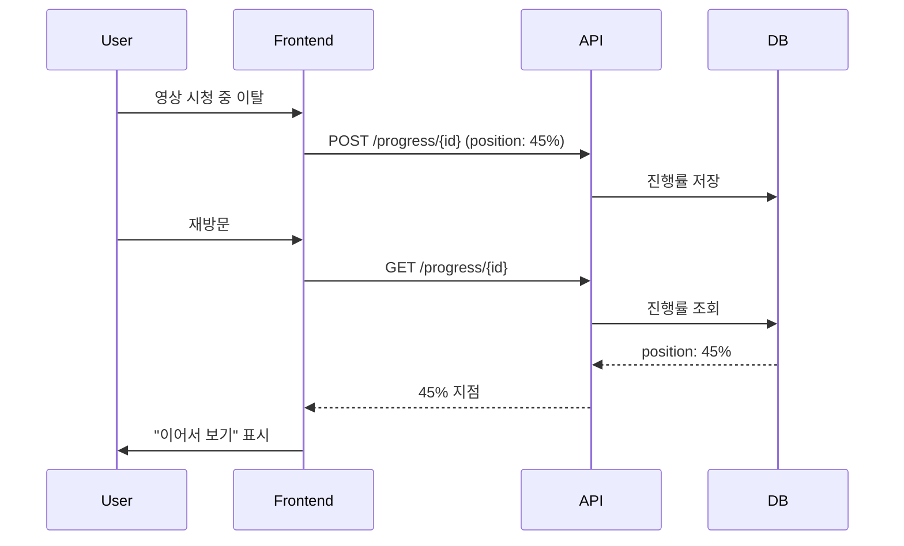
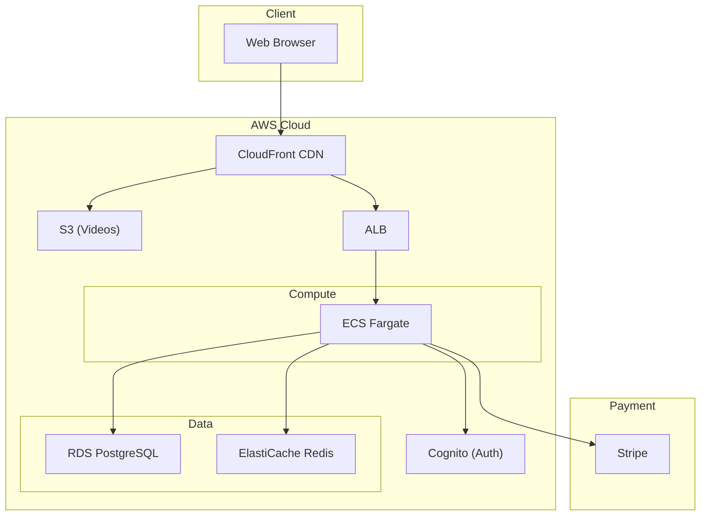

# PRD-0010: WSOPTV Freemium Platform

**Version**: 1.0.0 | **Status**: Active | **Created**: 2025-12-17

> WSOP 전문 VOD 스트리밍 플랫폼 - Freemium 글로벌 서비스

---

## 1. Executive Summary

### 1.1 Product Vision



### 1.2 핵심 변경 사항

| 항목 | 기존 | 신규 |
|------|------|------|
| **가입** | 초대 기반 | 자유 가입 (이메일) |
| **모델** | 프라이빗 | Freemium (무료+구독) |
| **인프라** | NAS (로컬) | AWS (글로벌) |
| **콘텐츠** | 6개 시리즈 | WSOP 단일 |
| **레퍼런스** | - | PokerGO, NBATV |

---

## 2. Business Model

### 2.1 Freemium 구조



### 2.2 콘텐츠 분류

| 구분 | 무료 | 구독 |
|------|------|------|
| **하이라이트** (5-15분) | O | O |
| **클래식** (5년+ 이전) | O | O |
| **최신 시즌** | X | O |
| **풀 에피소드** | X | O |
| **광고** | 있음 | 없음 |

### 2.3 가격

| 플랜 | 가격 | 특징 |
|------|------|------|
| **Free** | $0 | 하이라이트 + 클래식 |
| **Premium** | $9.99/월 | 전체 아카이브 |
| **연간** | $99/년 | 17% 할인 |

---

## 3. User Journey

### 3.1 가입 흐름



### 3.2 콘텐츠 표시

```
┌──────────────────────────┐    ┌──────────────────────────┐
│  [썸네일]                 │    │  [썸네일]                 │
│  ▶                       │    │  ▶ 🔒                    │
├──────────────────────────┤    ├──────────────────────────┤
│  FREE                    │    │  PREMIUM                 │
│  WSOP 2019 Highlight     │    │  WSOP 2024 Main Event    │
│  Episode 1 | 12min       │    │  Full Episode | 2h 30m   │
└──────────────────────────┘    └──────────────────────────┘
      무료 콘텐츠                       유료 콘텐츠
```

---

## 4. Core Features

### 4.1 Feature Matrix

| Feature | Free | Premium | 우선순위 |
|---------|------|---------|----------|
| 콘텐츠 브라우징 | O | O | P0 |
| 하이라이트 재생 | O | O | P0 |
| 풀 에피소드 재생 | X | O | P0 |
| 이어보기 | X | O | P1 |
| 검색 | O | O | P1 |
| 시청 기록 | X | O | P2 |
| 위시리스트 | X | O | P2 |

### 4.2 이어보기 (Continue Watching)



---

## 5. Information Architecture

### 5.1 페이지 구조

```
/                          # 랜딩 (비로그인)
├── /browse                # 콘텐츠 목록 (로그인 후 홈)
│   ├── /browse/free       # 무료 콘텐츠
│   └── /browse/premium    # 프리미엄 콘텐츠
├── /watch/{id}            # 영상 재생
├── /search                # 검색
├── /auth
│   ├── /auth/login        # 로그인
│   ├── /auth/register     # 가입
│   └── /auth/subscribe    # 구독 결제
└── /account
    ├── /account/profile   # 프로필
    ├── /account/history   # 시청 기록
    └── /account/billing   # 결제 관리
```

### 5.2 홈 (Browse) 레이아웃

```
┌─────────────────────────────────────────────────────────┐
│ [WSOPTV 로고]        Browse  Search        [프로필]     │
├─────────────────────────────────────────────────────────┤
│                                                         │
│  ┌─────────────────────────────────────────────────┐   │
│  │              Hero Banner (추천 콘텐츠)           │   │
│  │              ▶ Watch Now                        │   │
│  └─────────────────────────────────────────────────┘   │
│                                                         │
│  Continue Watching (이어보기) - Premium Only            │
│  ┌────┐ ┌────┐ ┌────┐ ┌────┐                          │
│  │▓▓░░│ │▓░░░│ │▓▓▓░│ │▓░░░│  ◀ ▶                    │
│  └────┘ └────┘ └────┘ └────┘                          │
│                                                         │
│  Free Content (무료)                                   │
│  ┌────┐ ┌────┐ ┌────┐ ┌────┐                          │
│  │FREE│ │FREE│ │FREE│ │FREE│  ◀ ▶                    │
│  └────┘ └────┘ └────┘ └────┘                          │
│                                                         │
│  WSOP 2024 (최신 - Premium)                            │
│  ┌────┐ ┌────┐ ┌────┐ ┌────┐                          │
│  │🔒  │ │🔒  │ │🔒  │ │🔒  │  ◀ ▶                    │
│  └────┘ └────┘ └────┘ └────┘                          │
│                                                         │
│  Classic WSOP (클래식 - Free)                          │
│  ┌────┐ ┌────┐ ┌────┐ ┌────┐                          │
│  │FREE│ │FREE│ │FREE│ │FREE│  ◀ ▶                    │
│  └────┘ └────┘ └────┘ └────┘                          │
│                                                         │
└─────────────────────────────────────────────────────────┘
```

---

## 6. Infrastructure (AWS)

### 6.1 Architecture Overview



### 6.2 서비스 구성

| 서비스 | AWS 리소스 | 용도 |
|--------|-----------|------|
| **CDN** | CloudFront | 글로벌 콘텐츠 배포 |
| **스토리지** | S3 | 비디오 파일 |
| **컴퓨팅** | ECS Fargate | API 서버 |
| **DB** | RDS PostgreSQL | 메타데이터 |
| **캐시** | ElastiCache Redis | 세션, 캐시 |
| **인증** | Cognito | 사용자 인증 |
| **검색** | OpenSearch | 콘텐츠 검색 |

### 6.3 비용 예상 (월간)

| 항목 | 예상 비용 |
|------|----------|
| CloudFront (10TB/월) | ~$850 |
| S3 (5TB 저장) | ~$115 |
| ECS Fargate | ~$150 |
| RDS (db.t3.medium) | ~$60 |
| ElastiCache | ~$50 |
| 기타 | ~$75 |
| **합계** | **~$1,300/월** |

---

## 7. Tech Stack

| Layer | Technology |
|-------|------------|
| **Frontend** | Next.js 14, TypeScript, Tailwind CSS |
| **Backend** | FastAPI, Python 3.12 |
| **Database** | PostgreSQL 16 (RDS) |
| **Cache** | Redis (ElastiCache) |
| **Search** | OpenSearch |
| **Auth** | AWS Cognito + JWT |
| **Payment** | Stripe |
| **CDN** | CloudFront |
| **Storage** | S3 |

---

## 8. API Endpoints (핵심)

### 8.1 인증

| Method | Endpoint | 설명 |
|--------|----------|------|
| POST | `/auth/register` | 회원가입 |
| POST | `/auth/login` | 로그인 |
| POST | `/auth/refresh` | 토큰 갱신 |
| GET | `/auth/me` | 내 정보 |

### 8.2 콘텐츠

| Method | Endpoint | 설명 |
|--------|----------|------|
| GET | `/content` | 콘텐츠 목록 |
| GET | `/content/{id}` | 콘텐츠 상세 |
| GET | `/content/free` | 무료 콘텐츠 |
| GET | `/content/premium` | 유료 콘텐츠 |

### 8.3 스트리밍

| Method | Endpoint | 설명 |
|--------|----------|------|
| GET | `/stream/{id}` | 스트리밍 URL (Signed) |
| POST | `/progress/{id}` | 진행률 저장 |
| GET | `/progress` | 이어보기 목록 |

### 8.4 구독

| Method | Endpoint | 설명 |
|--------|----------|------|
| POST | `/subscribe/checkout` | 결제 세션 생성 |
| POST | `/subscribe/webhook` | Stripe 웹훅 |
| GET | `/subscribe/status` | 구독 상태 |

---

## 9. Reference Documents

| 문서 | 용도 |
|------|------|
| [0008 - PokerGO 채널 분석](./0008-prd-pokergo-channel-analysis.md) | 콘텐츠 구조 참고 |
| [0009 - PokerGO UI 워크플로우](./0009-prd-pokergo-ui-workflow-design.md) | UI/UX 참고 |
| [0012 - NBATV 분석](./0012-reference-nbatv-analysis.md) | Freemium 모델 참고 |
| [0001 - Frontend UI](./0001-prd-frontend-ui.md) | UI 컴포넌트 참고 |

---

## 10. Roadmap

### Phase 1: MVP (4주)
- [ ] 인증 (가입/로그인)
- [ ] 콘텐츠 브라우징
- [ ] 비디오 재생 (무료/유료 구분)
- [ ] Stripe 결제 연동

### Phase 2: Core Features (4주)
- [ ] 이어보기
- [ ] 검색
- [ ] 시청 기록

### Phase 3: Enhancement (4주)
- [ ] 위시리스트
- [ ] 추천 시스템
- [ ] 모바일 최적화

---

## Document History

| Version | Date | Changes |
|---------|------|---------|
| 1.0.0 | 2025-12-17 | 신규 Freemium 모델 PRD 생성 |

---

*Last updated: 2025-12-17*
